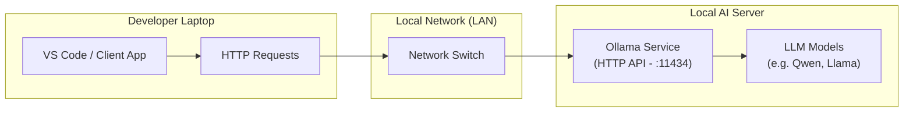
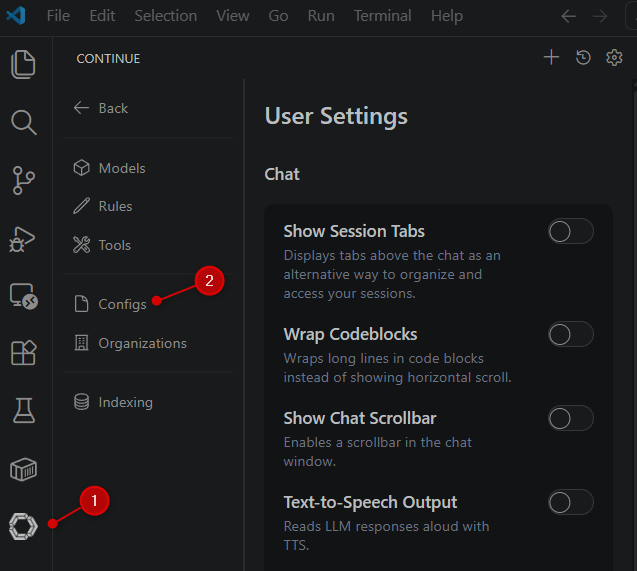
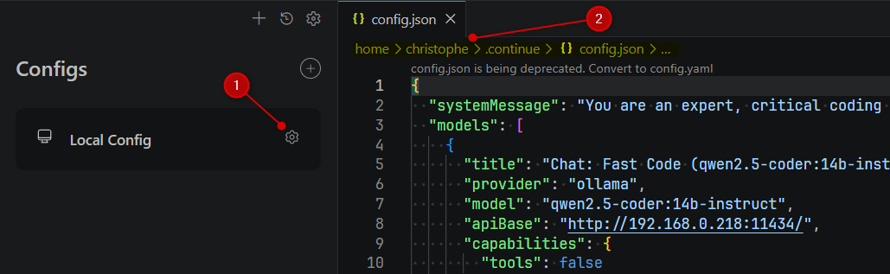
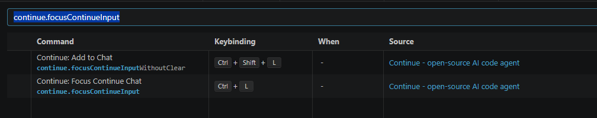

In a previous article, we've installed Ollama, one or more LLMs and a web interface called **Open WebUI**.

We've learned how to play with Ollama locally, but we haven't learned how to access it from another computer.

This is what we're going to do in this article. We'll learn how to access Ollama from another computer on your local network. The idea is thus to use a first computer that will act as a server, and another one to access it.

The *server* will have a lot of RAM and a good graphic card with VRAM. The *client* will just issue http requests so a computer with less resources will be enough.

<!-- truncate -->

In this article, we'll have this architecture. Please refer to my previous article (<Link to="/blog/ollama-installation">Installing Ollama and get local AI</Link>) for the set-up of the **Local AI Server**.

## Using a Local Network

Most probably you'll have a local network (LAN) on your home. You can use it to access Ollama accross your LAN. On my own, I'm using a **D-Link DGS-108** to connect my computers on the same local network. I've bought it years ago and, I see the current price (May 2026) is around ~35 euros.

This switch has a 1000Mbps bandwith with almost no latency. Perfect for our use.

## Getting the IP address to use

Getting the IP address of my master computer is a bit tricky because I'm using WSL2 and Windows 11.

Because my Operating System is Windows 11, in a Powershell session, I've to run `ipconfig | Select-String -Pattern "IPv4"` to get my local IP. On my master computer, I got this: `IPv4 Address. . . . . . . . . . . : 192.168.0.218`.

## The client computer

On my second computer, I'll first check if I can access to my master computer by running `ping 192.168.0.218` and I got this:

<Terminal wrap={true}>
$ Pinging 192.168.0.218 with 32 bytes of data:

Reply from 192.168.0.218: bytes=32 time<1ms TTL=128
Reply from 192.168.0.218: bytes=32 time<1ms TTL=128
Reply from 192.168.0.218: bytes=32 time=1ms TTL=128
Reply from 192.168.0.218: bytes=32 time=1ms TTL=128

Ping statistics for 192.168.0.218:
    Packets: Sent = 4, Received = 4, Lost = 0 (0% loss),

Approximate round trip times in milli-seconds:
    Minimum = 0ms, Maximum = 1ms, Average = 0ms

</Terminal>

This output means that our second computer can access to the master one with almost zero latency (`time<1ms`).

### Running Open WebUI

First make sure Ollama and **Open WebUI** are still running on the master computer. If so, on the client computer, you should be able to open `http://192.168.0.218:4000`. And, because we already have checked the network side, you should now get the login interface of Open WebUI. Once connected, you should be able to see the Ollama interface, the Ollama LLM list and start any discussion in the chat.

### Another checks to make sure the connectivity works

Just before jumping in VSCode and start the installation of an extension, let's make sure our current infrastructure is working.

To get the list of installed LLMs on your master computer, simply run `curl http://192.168.0.218:11434/api/tags` (add `| jq` to the end if you've it).

And if you doubt about what is a `Dockerfile`, just fire this command:

<Terminal wrap={true}>
$ curl -X POST http://192.168.0.218:11434/api/generate \
    -H "Content-Type: application/json" \
    -d '{
        "model": "qwen2.5-coder:1.5b-base",
        "prompt": "What is a Dockerfile? Please explain it practically.",
        "stream": false
        }'

</Terminal>

Note: make sure the LLM `qwen2.5-coder:1.5b-base` model is well present; use another one based on your own list.

## Configure VSCode

As a developer, you will need just one AI extension for your development environment for:

1. **Inline Autocomplete**: Get real-time code suggestions as you type, powered by **FIM** (Fill-In-the-Middle) inference and
2. **Chat Interface**: Engage in direct conversations with the AI assistant for debugging, refactoring, and general Q&A.

### Install the Continue extension

Here, I should admit I got a lot of problems because I'm on Windows 11 and using WSL2 and it seems [Continue](https://marketplace.visualstudio.com/items?itemName=Continue.continue)  didn't work well in this scenario.

Because I'm working with VSCode only on the WSL side, I carefully followed these installation steps:

1. I've opened my WSL terminal and I've started a Ubuntu session,
2. In the terminal, I've started `code .` to open VSCode on my WSL session,
3. I've opened a terminal in VSCode and I've fired `code --install-extension continue.continue --force` to make 100% sure the extension is installed on WSL (not on Windows; it's important!)

Once installed, the Continue icon appears in the left bar in VSCode. Click on it and you'll see a list of available features.

Click on the `Configs` entry then click on the gear icon to get access to the configuration file. As illustrated on the image below, the path is well on WSL so my configuration is fine.

If you want a ready-to-use configuration file, you can use this one:

<Snippet filename="config.yaml" source="./files/config.yaml" defaultOpen={false} />

<AlertBox variant="info" title="config.json is deprecated" >

In some tutorials, you'll still see `config.json` instead of `config.yaml`. JSON is deprecated; use the YAML format. Read the official [config.yaml reference guide](https://docs.continue.dev/reference).

</AlertBox>

<AlertBox variant="important" title="Make sure to use your own IP" />

If everything has correctly be done, you've now a AI auto-completion. Also, make sure autocomplete is enabled; look at the status bar of VSCode; you'll see an icon having the text `✓ Continue (NE)`.

#### Using chat with Continue

Actually, the provided `config.json` for Continue already include two models for chat sessions. You can use them by clicking on the `Chat` entry in the left bar and then select one of the available models.

If you look at the configuration, we've defined a model called `Fast Chat (Qwen 14B)` (for fast reaction) and a smaller one but stronger called `Architect (Qwen 32B)` and that works fine.

If you like them, you can use them as well. If not, feel free to change the configuration file.

In this article, we'll explore a second extension called `Roo Code` which is stronger for chat sessions and have more advanced agent capabilities.

So, if you want to test `Roo Code`, please replace the `Continue` configuration with the content below. It just enable the autocompletion and disable chat sessions. And, optionaly, you can hide the `Continue` icon in your left sidebar to make things cleaner.

<Snippet filename="config.json" source="./files/config_only_FIM.json" defaultOpen={false} />

Also remove the keybindings of Continue: press <kbd>CTRL</kbd>+<kbd>K</kbd> then <kbd>CTRL</kbd>+<kbd>S</kbd> and remove bindings for `continue.focusContinueInput` and `continue.quickFix`.

