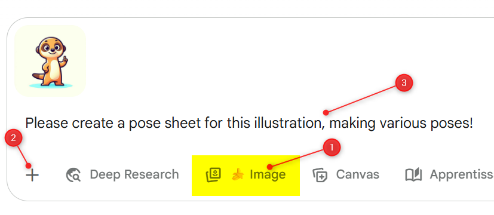
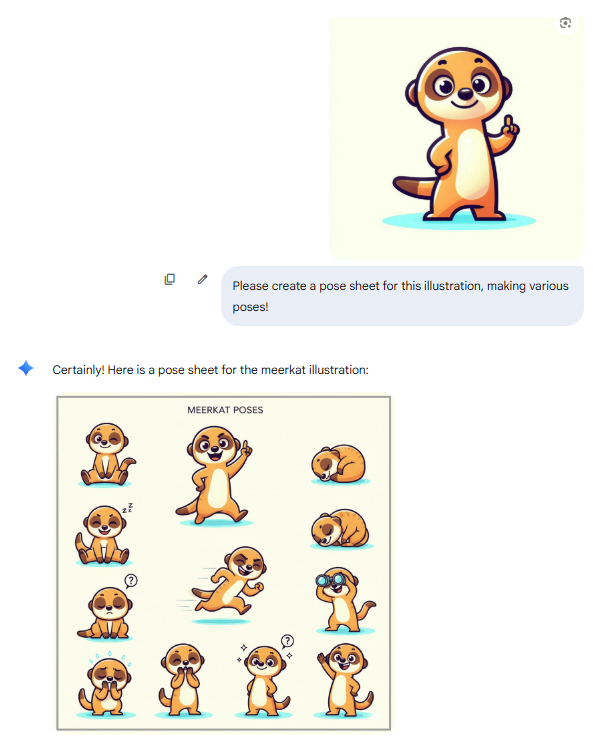

<!-- cspell:ignore clipart-->

Over the last few days, I've been using [Google Gemini](https://gemini.google.com/app) to redo all the images on my blog, and those who know me can count the number of times I've expressed my admiration for this technology. Prodigious, incredible, crazy...

In this article, let's take a look at how I went about generating these images.

<!-- truncate -->

First, and somewhat by chance I must confess, I asked Gemini to generate a clipart-style image of a meerkat.

I got this one:

A few days later, I discovered this GitHub repository: [Awesome-Nano-Banana-images](https://github.com/PicoTrex/Awesome-Nano-Banana-images/blob/main/README_en.md) and just had one idea, try it.

In case [#40](https://github.com/PicoTrex/Awesome-Nano-Banana-images/blob/main/README_en.md#case-40-multiple-character-poses-generationby-tapehead_lab), the prompt was *Please create a pose sheet for this illustration, making various poses!*

I then go to Gemini and proceed as below:

i.e. :

1. I click on the "Image" button (see the banana icon) to tell Gemini I want to create images,
2. I've clicked on the "+" button to upload my meerkat character
3. Then I type a prompt
4. And finally I confirm and run the AI.

