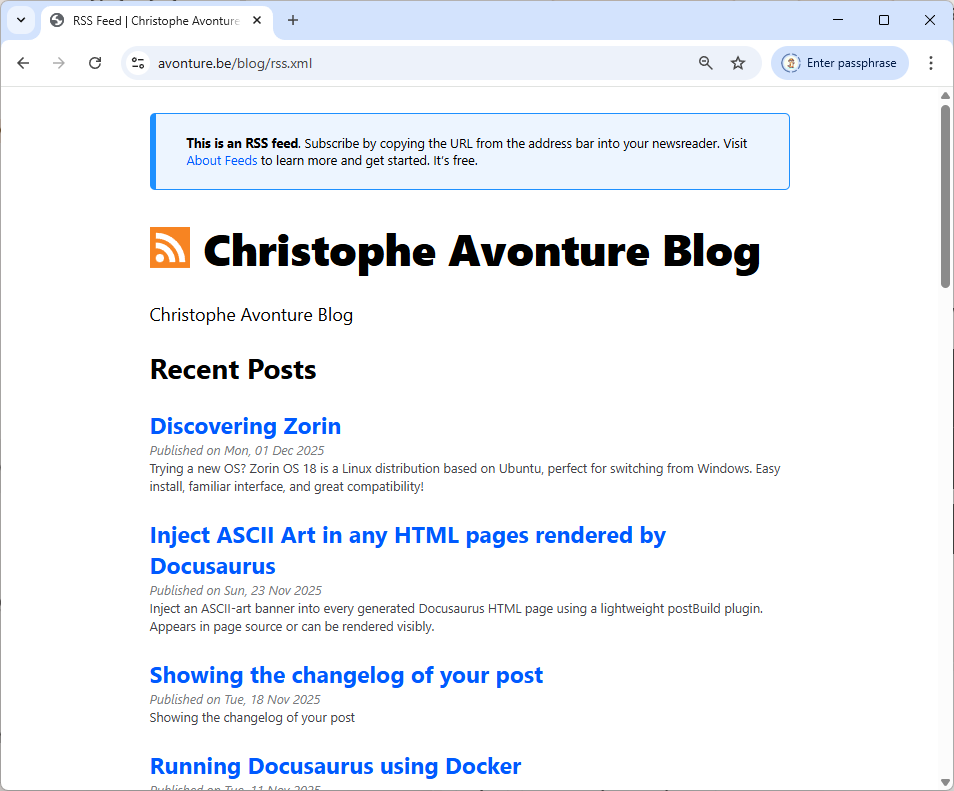
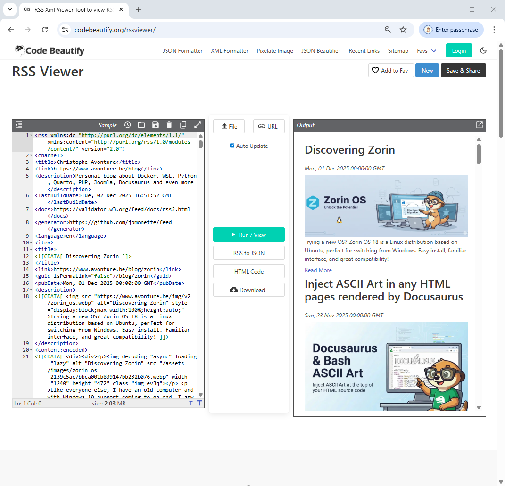
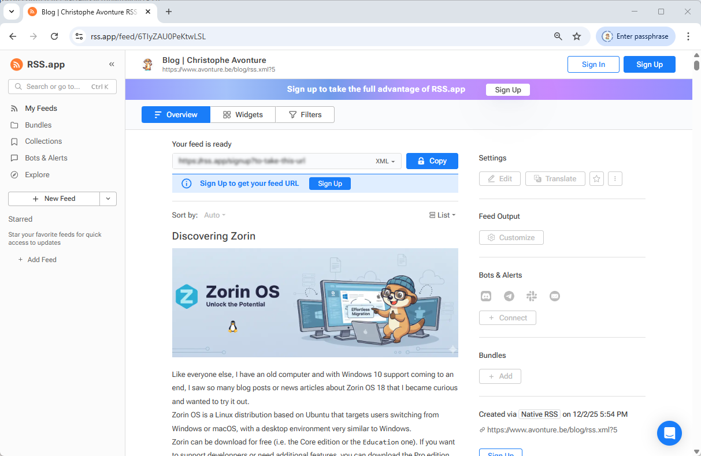

Did you know that you can generate a `blog/rss.xml` file using Docusaurus? You just need to enable it in your `docusaurus.config.js` file.

The `blog/rss.xml` file is generated when `yarn run build` is fired. Docusaurus will then add the last 20 published articles in that file.

The default look&feel, when you reach that page on your site, looks like this:



Did you know we can do much better?

Before going deeper in the code, here is what we'll do.

.



<!-- truncate -->

## Prepare your system

Please start a console and add some dependencies:

<Terminal wrap={true}>
$ yarn add cheerio feed front-matter fs-extra glob
</Terminal>

## Create the plugin

Please create the `plugins/blog-feed-plugin/index.mjs` with the code below

<Snippet filename="/plugins/blog-feed-plugin/index.mjs" source="/plugins/blog-feed-plugin/index.mjs" />

## Update your configuration

Please update your `docusaurus.config.js` and do two things.

1. We need to disable the generation of the feed by Docusaurus then
2. We need to implement our own plugin

See below how to do:

<Snippet filename="docusaurus.config.js" source="./files/docusaurus.config.js" />

## Run the plugin

Once done, just run `yarn run build` in a terminal to generate the static version of your site.

<Terminal wrap={true}>
$ yarn run build
</Terminal>

During this stage, Docusaurus will create the `rss.xml` file too.

If you want to see it on your machine, just run `yarn run serve` to start your Docusaurus static website then go to the `blog/rss.xml` URL and you'll see your XML.

## Why this is better?

Now, your website is delivering a RSS 2.0 content with more visibility to your media (your blog post image is now visible).

RSS agregators have now the full content so they can display the article without have to grab it from your website.

## Configuration options

The plugin can be configured using your `docusaurus.config.js` file.

See below all optional options you've use:

```javascript
const config = {
    // ...
    plugins: [
    [ "./plugins/blog-feed-plugin/index.mjs", {
        maxItems: 20,           // optional
        includeContent: true,   // optional
        includeImages: true,    // optional
        stripSelectors: [       // optional — add any site-specific UI selectors to remove
        ".custom-ads",
        ".share-buttons",
        ".newsletter-signup",
        ],
        ignorePatterns: ["**/_archived/**"], // optional
    }],
    ],
};

export default config;
```

* **maxItems** (number, default: `20`): Limit the number of items in the feed.

* **includeContent** (boolean, default: `true`): Include the cleaned HTML body of each post in the `<content>` field.

* **includeImages** (boolean, default: `true`): Add the post image at the top of the description and include an `<enclosure>` tag with proper MIME type.

* **stripSelectors** (string[], default: merged with defaults): Additional CSS selectors to remove from the article HTML. Critical selectors (`header`, `svg`) are always removed.

* **ignorePatterns** (string[], default: [`"**/_archived/**"`]): Glob patterns for excluding certain blog files.

## Some tools

### Visualization tools

While you're coding the plugin, just use some of these visualization tools to make sure the content is correctly displayed.

* [https://rss.app/feed/](https://rss.app/feed/)
* [https://codebeautify.org/rssviewer/](https://codebeautify.org/rssviewer/)
* [https://rssgizmos.com/rssviewer.html](https://rssgizmos.com/rssviewer.html)

### Validation tools

If you want to make sure your `rss.xml` is valid:

* [https://validator.w3.org/feed/](https://validator.w3.org/feed/)
* [https://www.rssboard.org/rss-validator/](https://www.rssboard.org/rss-validator/)
* [https://ralfvanveen.com/en/tools/rss-feed-checker/](https://ralfvanveen.com/en/tools/rss-feed-checker/)
