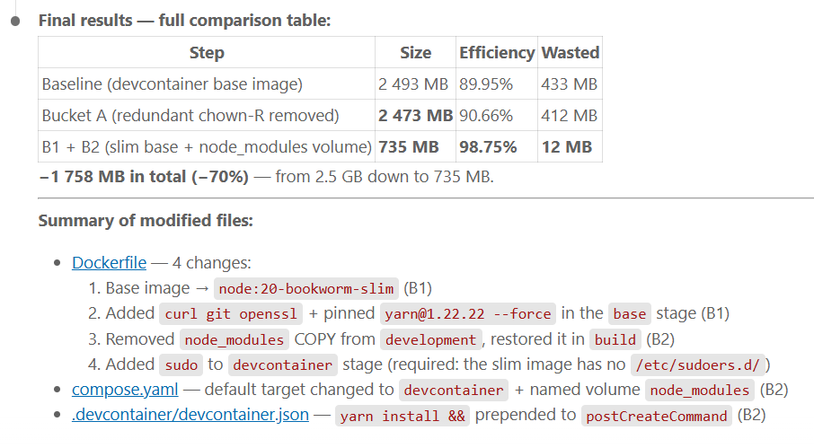

<!-- cspell:ignore wagoodman pyc scikit -->


<TLDR>
`dive` is an open-source terminal tool that renders every layer of a Docker image as an interactive file tree, highlighting exactly which files are wasted — present in one layer but deleted in a later one, yet still baked into the final image. This article walks through a deliberately broken Dockerfile, shows how dive exposes the waste, then fixes it in three incremental steps: cleaning apt caches in the same layer, collapsing multiple `RUN` statements into one, and switching to a multi-stage build that cuts the image by 80%. As a bonus, we push the idea to its logical extreme with `FROM scratch` — an image containing a single binary and nothing else.
</TLDR>

Damn. I just ran `docker images` and there it was: `myapp:latest — 1.19 GB`. A Python web app with five dependencies, and somehow it ballooned to over a gigabyte. Something is deeply wrong with that Dockerfile.

The problem with Docker image bloat is that it's invisible until you look for it. Your containers start, your app runs, everything seems fine — and meanwhile you're shipping 400 MB of apt cache and build tools to production on every single deploy.

That's where <Link to="https://github.com/wagoodman/dive">dive</Link> comes in. It's a terminal-based image inspector that lets you navigate the layers of any Docker image, see exactly what each `RUN`, `COPY`, and `ADD` instruction added or removed, and get a cold hard efficiency score at the bottom of the screen. Think of it as an X-ray machine for your images.

<!-- truncate -->

## What is Dive?

At its core, a Docker image is a stack of read-only layers. Every instruction in your Dockerfile that touches the filesystem creates a new layer. `apt-get install` — new layer. `pip install` — new layer. `COPY` — new layer.

Here's where the trap is: if you install a package in layer 3, then delete its cache in layer 5, the cache data is *still inside the image*. The deletion only marks the files as "opaque" in the upper layer — the bytes from layer 3 are still there, downloaded by every `docker pull`.

`dive` makes this visible. Left panel: the file tree of the selected layer. Right panel: the layer list with sizes. Bottom: your efficiency score and total wasted space.

<AlertBox variant="tip" title="Keyboard shortcuts inside dive">
Press `Tab` to switch between the layer list and the file tree. Use arrow keys to navigate layers. `Space` collapses/expands directories in the tree. Files shown in yellow are modified, in red are deleted — those deleted ones are your wasted bytes.
</AlertBox>

## Running Dive — No Installation Needed

You know me very well now; I like to containerize things. And `dive` has an official Docker image, so there's no reason to install anything on your host:

<Terminal title="user@machine: ~/myapp" wrap={true}>
$ docker run --rm -it \
    -v /var/run/docker.sock:/var/run/docker.sock \
    wagoodman/dive:latest myapp:latest
</Terminal>

The `-v /var/run/docker.sock:/var/run/docker.sock` mount is required: it's how the `dive` container reaches back into your host Docker daemon to inspect images. If you're not comfortable with that — and it's a legitimate concern — refer to the <Link to="/blog/docker-out-of-docker-dood">Docker-out-of-Docker article</Link> for the security context around socket mounting.

If you do prefer a local binary, `dive` is available on Linux, macOS, and Windows:

<Terminal title="user@machine: ~" wrap={true}>
$ wget -q https://github.com/wagoodman/dive/releases/latest/download/dive_linux_amd64.tar.gz \
    -O - | tar xz dive && sudo mv dive /usr/local/bin/
</Terminal>

Either way, the usage is identical: `dive <image-name>`.

## The Patient: A Deliberately Terrible Dockerfile

Let's build something genuinely bad so we have something to analyze. Our app is a tiny Flask API — nothing fancy, just enough to pull in real dependencies:

<Snippet
  filename=".unpublished/docker-dive/files/app.py"
  source=".unpublished/docker-dive/files/app.py"
  defaultOpen={false}
/>

And the Dockerfile — written with zero regard for image size:

<Snippet
  filename="Dockerfile.bad"
  source=".unpublished/docker-dive/files/Dockerfile.bad"
  defaultOpen={true}
/>

Let's build it and see what we're dealing with:

<Terminal title="user@machine: ~/myapp" wrap={true}>
$ docker build -t myapp:bad -f Dockerfile.bad .

[+] Building 142.3s (9/9) FINISHED

$ docker images myapp:bad

REPOSITORY   TAG    IMAGE ID       SIZE
myapp        bad    3f8c1a9e2b71   1.19GB
</Terminal>

1.19 GB. For a five-file Flask app. Let's see exactly why.

## The Diagnosis: What Dive Reveals

<Terminal title="user@machine: ~/myapp" wrap={true}>
$ docker run --rm -it \
    -v /var/run/docker.sock:/var/run/docker.sock \
    wagoodman/dive:latest myapp:bad
</Terminal>

What you'll see in the interactive TUI is something like this in the right panel (the layer list):

```
Cmp   Size  Command
     212 MB  FROM ubuntu:24.04
      38 MB  RUN apt-get update
     368 MB  RUN apt-get install -y curl wget git python3...
     184 MB  RUN pip3 install flask requests numpy pandas...
    0.0 B   RUN mkdir /app
    1.2 KB  COPY app.py /app/
```

The left panel shows the file tree for the selected layer. When you select the `apt-get update` layer, you'll see `/var/lib/apt/lists/` filled with hundreds of megabytes of package index files — and they're *still there* in every subsequent layer.

For a non-interactive, scriptable result, use the CI mode:

<Terminal title="user@machine: ~/myapp" wrap={true} source=".unpublished/docker-dive/files/terminal_dive_bad.txt" />

**61.89% efficiency. 438 MB wasted.** That's brutal, and it's entirely self-inflicted.

<AlertBox variant="coreConcept" title="What does 'wasted bytes' mean exactly?">
Dive counts a file as "wasted" when it exists in a lower layer but is deleted or overwritten in a higher layer. The original bytes from the lower layer are still physically present in the image — they just can't be seen in the running container. Every `docker pull` downloads them anyway.
</AlertBox>

## Fix #1 — Clean Up the apt Mess in the Same Layer

The first and most common mistake: separating `apt-get update` from the cleanup. The rule is simple — **anything you want to disappear must be deleted in the same `RUN` instruction**.

<Snippet
  filename="Dockerfile.v2"
  source=".unpublished/docker-dive/files/Dockerfile.v2"
  defaultOpen={true}
/>

The key change is the addition of `apt-get clean && rm -rf /var/lib/apt/lists/* /tmp/* /var/tmp/*` at the end of the apt install `RUN` block. This runs *inside the same layer*, so the cache files are never committed to the image.

<Terminal title="user@machine: ~/myapp" wrap={true}>
$ docker build -t myapp:v2 -f Dockerfile.v2 .

$ docker images myapp:v2

REPOSITORY   TAG    IMAGE ID       SIZE
myapp        v2     7a4e0f1c9d83   712MB
</Terminal>

712 MB instead of 1.19 GB. Nearly 500 MB gone. Let's confirm the improvement with dive:

<Terminal title="user@machine: ~/myapp" wrap={true} source=".unpublished/docker-dive/files/terminal_dive_v2.txt" />

98.23% efficiency — a massive jump. But we're still at 712 MB for a tiny Flask app. There's more to fix.

## Fix #2 — Fewer Layers, Less Overhead

Look at the `Dockerfile.bad` layer list again. Each separate `RUN` statement creates its own layer. Even if a layer adds "only" a directory or a couple of kilobytes, every layer has metadata overhead — and more importantly, separating installation from cleanup makes it *impossible* to keep them in the same layer.

The solution: collapse related operations into a single `RUN` chain using `&&`:

<Snippet
  filename="Dockerfile.v3"
  source=".unpublished/docker-dive/files/Dockerfile.v3"
  defaultOpen={true}
/>

Beyond the smaller layer count, notice the `find` commands at the end: they delete all `.pyc` compiled files and `__pycache__` directories that pip creates during installation. Those are pure waste in a production image.

<Terminal title="user@machine: ~/myapp" wrap={true}>
$ docker build -t myapp:v3 -f Dockerfile.v3 .

$ docker images myapp

REPOSITORY   TAG    IMAGE ID       SIZE
myapp        bad    3f8c1a9e2b71   1.19GB
myapp        v2     7a4e0f1c9d83    712MB
myapp        v3     2b9d4e7f1c05    689MB
</Terminal>

The gap between v2 and v3 is modest here — about 23 MB. The real value of collapsing `RUN` statements is clarity and correctness: you can no longer accidentally put cleanup in a different layer.

<AlertBox variant="important" title="But 689 MB is still massive for a Flask app">
We still have `build-essential`, `python3-dev`, `libssl-dev`, `pkg-config`, `wget`, and `git` inside the production image. Those are build-time tools — they were needed to compile some pip packages, but they have no business being in the image that runs in production. This is where the single-stage approach hits its ceiling.
</AlertBox>

## Fix #3 — The Multi-stage Build

The core idea of a multi-stage build is simple: use one `FROM` to build, use another `FROM` to run. The builder stage can be as fat as it wants — tools, caches, compilers — because only the final stage gets shipped.

<Snippet
  filename="Dockerfile.multistage"
  source=".unpublished/docker-dive/files/Dockerfile.multistage"
  defaultOpen={true}
/>

What's happening here:

1. `FROM python:3.12 AS builder` — full Python image, used only to install packages
2. `pip install --target ./packages` — installs everything into a local directory (not system-wide)
3. `FROM python:3.12-slim AS production` — the slim base image, about 130 MB
4. `COPY --from=builder /build/packages ./packages` — only the installed packages cross the boundary; no build tools, no pip cache, no apt lists

<Terminal title="user@machine: ~/myapp" wrap={true}>
$ docker build -t myapp:multistage -f Dockerfile.multistage .

$ docker images myapp

REPOSITORY   TAG          IMAGE ID       SIZE
myapp        bad          3f8c1a9e2b71   1.19GB
myapp        v2           7a4e0f1c9d83    712MB
myapp        v3           2b9d4e7f1c05    689MB
myapp        multistage   9c3a1f8e4b22    247MB
</Terminal>

247 MB — an 80% reduction from our starting point. And the dive score:

<Terminal title="user@machine: ~/myapp" wrap={true} source=".unpublished/docker-dive/files/terminal_dive_multistage.txt" />

99.71% efficiency. The remaining 4 KB of "wasted" bytes are background noise — Docker layer metadata that can't be avoided.

<AlertBox variant="tip" title="Pick the right slim base">
`python:3.12-slim` is the sweet spot for most Python apps. `python:3.12-alpine` is even smaller (about 20 MB) but uses `musl libc` instead of `glibc`, which can cause compatibility issues with binary wheels like `numpy` or `pandas`. Test before committing to Alpine for a data-heavy stack.
</AlertBox>

Multi-stage builds are also the right approach for compiled languages. If you're building a Go, Rust, or C app, the builder stage contains the entire compiler toolchain, and only the final binary ends up in the production stage. Which brings us to the bonus section.

## Bonus — FROM scratch: The Absolute Minimum

`FROM scratch` is a special Docker keyword — it's not an image name, it's a signal to the Docker builder that the new image should start completely empty. No shell, no package manager, no libc, no anything. Just the files you explicitly `COPY` into it.

This only works if your application is a self-contained binary with zero external dependencies. Statically compiled Go is the poster child:

<Snippet
  filename="Dockerfile.scratch"
  source=".unpublished/docker-dive/files/Dockerfile.scratch"
  defaultOpen={true}
/>

<Snippet
  filename="main.go"
  source=".unpublished/docker-dive/files/main.go"
  defaultOpen={false}
/>

The `-ldflags '-w -s'` flags strip debug information and the symbol table, shaving a few more MB off the binary.

<Terminal title="user@machine: ~/myserver" wrap={true}>
$ docker build -t myserver:scratch -f Dockerfile.scratch .

$ docker images myserver:scratch

REPOSITORY   TAG       IMAGE ID       SIZE
myserver     scratch   1a2b3c4d5e6f    6.88MB
</Terminal>

6.88 MB. Less than 7 MB for a production HTTP server. And dive?

<Terminal title="user@machine: ~/myserver" wrap={true} source=".unpublished/docker-dive/files/terminal_dive_scratch.txt" />

100.00% efficiency. 0 bytes wasted. There is literally nowhere left to improve.

<AlertBox variant="note" title="FROM scratch isn't always practical">
A scratch image has no shell at all — `docker exec mycontainer sh` will fail. No shell means no shell scripts in your entrypoint, no `ping`, no `curl` for health checks from inside the container. For debugging, consider `gcr.io/distroless/static` instead: it's nearly as small as scratch but includes a handful of POSIX tools and is maintained by Google for security patches.
</AlertBox>

## Dive as a CI Quality Gate

Manually running dive is useful during development, but the real power is in the `--ci` mode — it reads a configuration file and fails with a non-zero exit code if your image doesn't meet the thresholds. Plug this directly into your pipeline.

Create a `.dive-ci.yaml` at the root of your project:

<Snippet
  filename=".dive-ci.yaml"
  source=".unpublished/docker-dive/files/dive-ci-config.yaml"
  defaultOpen={true}
/>

Then add a step in your CI pipeline:

<Terminal title="CI pipeline step" wrap={true}>
$ DIVE_CONFIG=.dive-ci.yaml CI=true docker run --rm \
    -v /var/run/docker.sock:/var/run/docker.sock \
    -v $(pwd)/.dive-ci.yaml:/.dive-ci.yaml \
    -e DIVE_CONFIG=/.dive-ci.yaml \
    wagoodman/dive:latest myapp:latest
</Terminal>

If the image efficiency drops below 95% or wasted bytes exceed 20 MB, the step fails and the deploy never happens. So cool no?

<AlertBox variant="tip" title="What thresholds make sense?">
`lowestEfficiency: 0.95` and `highestWastedBytes: "20mb"` are sensible defaults for a first pass. Adjust `highestWastedBytes` upward if your image legitimately includes large static assets (fonts, models, datasets) that can't be cleanly separated.
</AlertBox>

## Claude Code — Automate the Entire Loop

Everything we've done manually — run dive, read the JSON, spot the wasted layers, decide what to fix, edit the Dockerfile, rebuild, re-run — is a repeatable loop. If you use <Link to="https://claude.ai/code">Claude Code</Link>, you can drive the whole thing with a single slash command:

```text
/docker-dive-optimization
```

It auto-discovers the project's main Dockerfile (or accepts a path or image tag as argument), builds the image, runs dive in JSON mode, and classifies every finding into three buckets — mapping directly to the patterns we've been applying by hand in this article.

**Bucket A — fix now**: Mechanical waste that's unambiguously wrong. `apt-get clean` sitting in a separate `RUN` from the install, `--no-cache` missing from an `apk add`, a cache directory not cleaned in the same layer that created it. Claude applies the Dockerfile edit, rebuilds, and re-runs dive to verify the gain before reporting success.

**Bucket B — propose and wait**: Findings where the right answer requires a judgment call. Switching from `python:3.12` to `python:3.12-slim` in a production stage. Introducing a multi-stage build where there isn't one. Replacing a 300 MB runtime that's only there for a single CLI call with a standalone binary. Claude presents the layer evidence and the trade-off, then waits for your decision before touching anything.

**Bucket C — TODOs**: Everything that needs research before it can be touched. Filed as numbered items in `.todos/` so they don't get lost between sessions.

<AlertBox variant="tip" title="Target any image or Dockerfile">
The command defaults to the project's own Dockerfile, but it accepts a path or an image tag directly:

```text
/docker-dive-optimization myapp:latest
/docker-dive-optimization ./services/api/Dockerfile
```

You can copy the command file into any project's `.claude/commands/` directory — it auto-discovers whether to use `docker compose build` or a plain `docker build`, so no project-specific wiring is needed.
</AlertBox>

The three-bucket split mirrors the judgment calls in this article. Cleaning apt cache in the same layer is Bucket A — no discussion needed, just merge and verify. Switching to a multi-stage build is Bucket B — real trade-offs to review first. Replacing a niche binary you've never audited is Bucket C — research before touching. Same analysis we did manually, automated.

To prove the point: I ran `/docker-dive-optimization` on the very blog you're reading right now. The devcontainer image had ballooned to **2.5 GB**, scored 89.95% efficiency, and carried 433 MB of wasted bytes — mostly inherited from a heavy `mcr.microsoft.com/devcontainers/javascript-node:20-bookworm` base that silently baked in oh-my-zsh, subversion, and a full C/C++ build toolchain nobody had asked for. Bucket A caught a redundant `chown -R` that forced Docker's overlay FS to copy 1 410 files into a useless 21 MB layer. Bucket B flagged the base image and 996 MB of `node_modules` baked into every build.



**From 2.5 GB down to 735 MB — a 70% reduction, efficiency up from 89.95% to 98.75%.** The base image swap from the devcontainer-specific image to `node:20-bookworm-slim` alone saved over a gigabyte. Moving `node_modules` to a named Docker volume at runtime recovered another 996 MB. The whole session — including the rebuild and the dive re-run to verify — took under fifteen minutes.

## Putting It All Together

Here's the progression we went through:

<StepsCard
  variant="remember"
  title="The four-step journey"
  steps={[
    { content: "**Start (Dockerfile.bad) — 1.19 GB, 61% efficiency**: Separate `RUN apt-get update`, no cache cleanup, build tools in the final image." },
    { content: "**v2 — 712 MB, 98% efficiency**: Clean `apt` cache and lists in the same `RUN` instruction that installs them." },
    { content: "**v3 — 689 MB, 98% efficiency**: Collapse all installation steps into one `RUN` chain, delete `.pyc` files." },
    { content: "**Multi-stage — 247 MB, 99.7% efficiency**: Use a separate builder stage; only the installed packages cross into the slim production image." },
    { content: "**Bonus (FROM scratch) — 6.88 MB, 100% efficiency**: Statically compiled binary, no base image at all." },
  ]}
/>

## Conclusion

There's a version of this story where you ship a 1.2 GB image to production because it works — and you never look back. I've been there. The app runs, the team ships, nobody complains. Until you look at your registry storage bill, or your cold-start time on a serverless platform, or the pull time on a CI runner with a fresh cache.

`dive` makes the invisible visible. Once you see 438 MB of wasted bytes labeled in red, you can't unsee it. The fixes aren't exotic — clean up in the same layer, combine your `RUN` statements, use multi-stage builds. These are things every Docker practitioner should know by heart, and now you have a tool that will tell you immediately if you've forgotten one.

For more context on writing production-grade Dockerfiles, <Link to="/blog/docker-prod-devcontainer">One Docker Image for Production and Devcontainers</Link> covers the single-source-of-truth approach where one Dockerfile handles both environments cleanly. And if you're looking for another terminal-first Docker tool, there's a companion article on <Link to="/blog/lazydocker">lazydocker</Link> — a full TUI dashboard for managing your containers and logs without leaving the terminal.
