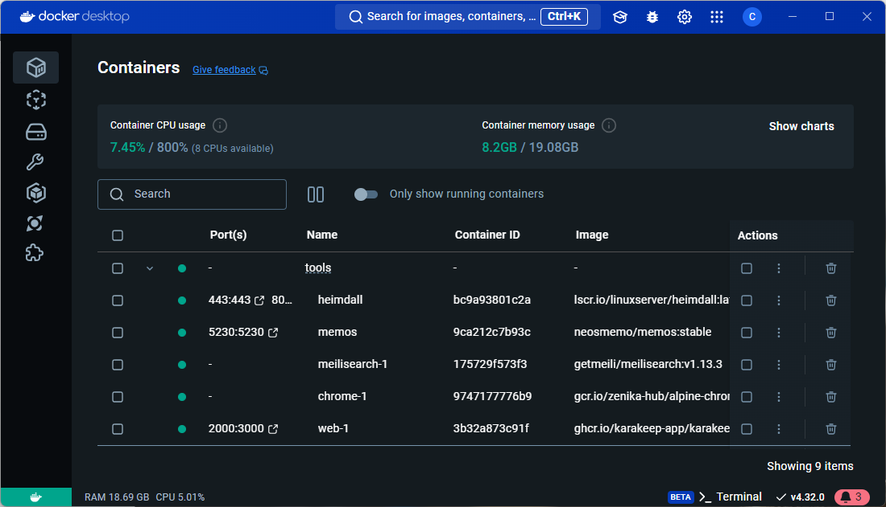

********* D'ABORD ÉCRIRE UN ARTICLE SUR KARAKEEP ET PUBLIER ET KARAKEEP ET MEMOS *********
******* DE CETTE MANIERE JE PEUX FAIRE UN LIEN INTERNE VERS L'ARTICLE DANS LE BLOG *******

<!-- cspell:ignore Karakeep,neosmemo,heimdall -->

On a daily base, I'm running several tools as Docker containers: [Heimdall](blog/2025/02/01/heimdall-dashboard/index.md), Memos and Karakeep. It can be one or more containers buy tools.

I'm working under Windows so I'm using Docker Desktop to get a list of containers and, because I'm working with Docker for my own projects (can be Python, PHP or whatever), I'm facing with the following situation: I've a big list of containers and I would like some order.

Tools like Heimdall, Memos and Karakeep, I'm using them to make my daily work easier and it would be nice if I can group them together,

<!-- truncate -->

See below: I'm grouping tools of different origin under `Tools` so it'



This way, I have a smaller overview of the containers and can quickly sort out my tools and projects.  Also, if the need arises, I can stop all the tools at once. That's handy.

## The name property in the compose.yaml file

The solution is easy to implement: if you've a `compose.yaml` (or `compose.yaml` if using the old name convention), just add a `name: tools` entry in the file, at the top.

For instance:

<Snippets filename="compose.yaml">

```yaml
// highlight-next-line
name: tools

services:
  memos:
    image: neosmemo/memos:stable
    container_name: memos
    init: true
    ports:
      - "5230:5230"
    volumes:
      - ./data:/var/opt/memos
    restart: unless-stopped
```

</Snippets>

And that's all.

Now, by running `docker compose up --build --detach`, you'll see your containers will be grouped in `tools` (only visible in the Docker Desktop Windows software; not using the `docker ps` command).

Do the same for every tools you want, if there is a `compose.yaml` file, just add the `name: tools` top-level entry.

But, if you don't have a YAML file but what is you're using a `docker run` command? There is well a `--name` flag with `docker run` but it's for naming the container (equivalent to the `container_name` entry thus).

So, if you're running `docker run [something]` you'll have to convert the line as a YAML file. All IA can do that. Just copy/paste your full `docker run [something]` command and ask to convert as a `compose.yaml` file.

Easy and really handy.

## Tools can be located in different folders

Just to tell, if can put your files, volumes, ... in different tools, it didn't matters. On my disk, I've a `~/tools` folder with one directory by tools (one for Heimdall, one for Memos, one for Karakeep, ...) and it's not a problem at all.

This let me to store files and volumes properly.
