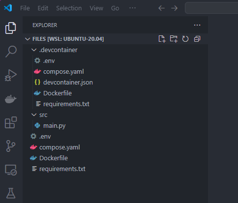
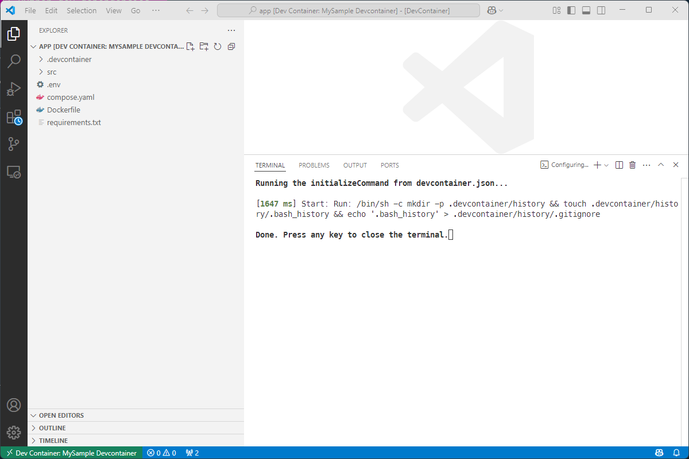
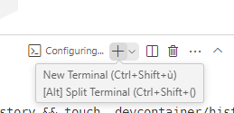
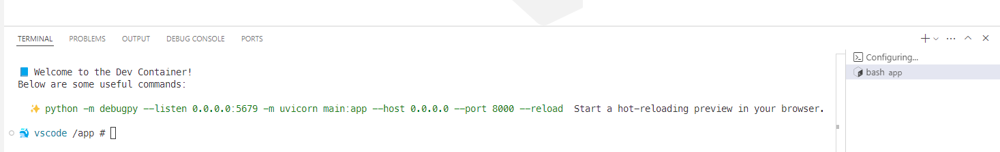
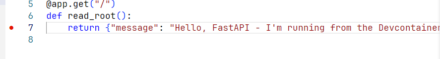

<!-- cspell:ignore groupid,Debugpy -->


This article is the result of intense reflection: how to define a Docker image for deployment in production as cleanly as possible and, while avoiding copy/paste and other repetitions as much as possible, create an image for development in devcontainer.

In other words: I want to create the lightest and most secure image possible for deployment in production, but of course, I want to be able to develop this image in VSCode, and for that, I need my development tools, a specific Linux user, etc.

After multiple attempts, here is what I came up with, which seems to meet this need.

<!-- truncate -->

<StepsCard
  title="The major steps will be:"
  variant="steps"
  steps={[
    'We\'ll create a Docker image for the production in our root folder. W\'ll store there any configuration files required for the production',
    'In a .devcontainer folder, we\'ll override/extend some files for the development using VSCode',
  ]}
/>

## Let's create the production image

Please create a new folder in your temporary folder for our example.

<Terminal wrap={true}>
$ mkdir -p /tmp/docker-prod-devcontainer && cd $_
</Terminal>

Let's create a few files (remember, for the production Docker image):

<Snippet filename="/tmp/docker-prod-devcontainer/.env" source="./files/.env" />

<Snippet filename="/tmp/docker-prod-devcontainer/compose.yaml" source="./files/compose.yaml" />

<Snippet filename="/tmp/docker-prod-devcontainer/Dockerfile" source="./files/Dockerfile" />

<Snippet filename="/tmp/docker-prod-devcontainer/requirements.txt" source="./files/requirements.txt" />

And now, we'll create, for the demo, a FastAPI Python script:

<Snippet filename="/tmp/docker-prod-devcontainer/src/main.py" source="./files/src/main.py" />

So right now, our project looks like this i.e. we've five files.

```bash
docker-prod-devcontainer/
├─ .env
├── Dockerfile
├── compose.yaml
├── requirements.txt
└── src
    └── main.py
```

Using a console, we can run the command below to see if everything is fine i.e. if there are no error and f.i. our `.env` file where we've specified the version to use for Python is well retrieved and used.

<Terminal>
$ docker compose config
</Terminal>

You'll get something like this:

<Snippet filename="console output" source="./logs/prod.log" />

:::info
Look here above on the `user: 1001:1001` line. This tell to Docker to run the container using a non-root user (any IDs can works but don't reuse the one of the `root` user for sure).

This configuration comes from the `compose.yaml` file.
:::

Now, we'll build and create the container by running the command below.

:::caution !!! EXTREMELY IMPORTANT - WE'VE TO BUILD THE IMAGE FIRST !!!
Because our future devcontainer will be derived from the production image, we MUST build it first:

<Terminal>
$ docker compose build
</Terminal>
:::

Now, we can create a container if we want by running the command below:

<Terminal>
$ docker compose up --detach
</Terminal>

Since our demo project is a FastAPI Python application, simply start a browser and go to the `http://localhost:8000` location to see the message from Flask. The output is a JSON one:

<BrowserWindow url="http://localhost:8000" minHeight={300}>
  <div style={{ padding: '1rem' }}>
    <p>\{"message":"Hello, FastAPI - PRODUCTION!"\}</p>
  </div>
</BrowserWindow>

### Checking who is the current user for PROD

Let's run a parametrized command into the container to see who is the current user:

<Terminal wrap={true}>
$ docker compose exec app /bin/sh -c 'echo "Container user ID is $(id -u) and his group ID is $(id -g)"'

Container user ID is 1001 and his group ID is 1001
</Terminal>

Nice! It works. We've created our production Docker image and it works.

## Override or extend and get a devcontainer ready image

Please now create a subfolder called `.devcontainer` with these files:

<Snippet filename="/tmp/docker-prod-devcontainer/.devcontainer/.env" source="./files/.devcontainer/.env" />

<Snippet filename="/tmp/docker-prod-devcontainer/.devcontainer/compose.yaml" source="./files/.devcontainer/compose.yaml" />

<Snippet filename="/tmp/docker-prod-devcontainer/.devcontainer/devcontainer.json" source="./files/.devcontainer/devcontainer.json" />

<Snippet filename="/tmp/docker-prod-devcontainer/.devcontainer/Dockerfile" source="./files/.devcontainer/Dockerfile" />

<Snippet filename="/tmp/docker-prod-devcontainer/.devcontainer/requirements.txt" source="./files/.devcontainer/requirements.txt" />

So now, our project looks like this i.e.:

```bash
docker-prod-devcontainer/
├── .devcontainer
│   ├── .env
│   ├── Dockerfile
│   ├── compose.yaml
│   ├── devcontainer.json
│   └── requirements.txt
├── .env
├── Dockerfile
├── compose.yaml
├── requirements.txt
└── src
    └── main.py
```

Ok, let's check if everything is correctly filled in.

Jump in the `.devcontainer` folder (`cd .devcontainer`) and run this command:

<Terminal>
$ docker compose -f ../compose.yaml -f compose.yaml config
</Terminal>

You'll get something like this:

<Snippet filename="console output" source="./logs/devcontainer.log" />

### We should not build the image ourself right now

We'll never build the devcontainer image ourself (this task is for VSCode) but we'll well do it now; just for tests purposes.

Still located in the `.devcontainer` folder, we can create the image like this:

<Terminal wrap={true}>
$ docker compose -f ../compose.yaml -f compose.yaml build
</Terminal>

Did you get an error? If so, you can more easily read/manage the error right now.

## Opening the container using vscode

We'll open VSCode by going back to the project folder:

<Terminal wrap={true}>
$ cd /tmp/docker-prod-devcontainer && code .
</Terminal>



Press <kbd>CTRL</kbd>+<kbd>SHIFT</kbd>+<kbd>P</kbd> to open the **Command palette** and select the "Dev Containers: Rebuild Without Cache and Reopen in Container" option.

VSCode will close the project and reopen it. It'll take more time (the first time) because he need to create the Docker container first.



If you see the image here above, you're in the container.

Bottom right, you can create a new Terminal:



In this demo project, you can see this message; once:



The idea is thus to provide contextual help to the developer and to tell him, here, how he can start the FastAPI server using hot reload and with Debugpy enabled.

### Let's tests

If we return to the `http://localhost:8000` URL we can still get the JSON answer (so the container is well running).

<BrowserWindow url="http://localhost:8000" minHeight={300}>
  <div style={{ padding: '1rem' }}>
    <p>\{"message":"Hello, FastAPI - PRODUCTION!"\}</p>
  </div>
</BrowserWindow>

But now, in VSCode, if you edit the `src/main.py` script and update the Hello message like below:


You just need to save the change, go back to the browser window and refresh the page:

<BrowserWindow url="http://localhost:8000" minHeight={300}>
  <div style={{ padding: '1rem' }}>
    <p>\{"message":"Hello, FastAPI - I'm running from the Devcontainer!"\}</p>
  </div>
</BrowserWindow>

### Let's debug

In this demo project, we've added the Debugpy dependency.

We just need to add an extra file for VSCode.

<Snippet filename="/tmp/docker-prod-devcontainer/.vscode/launch.json" source="./files/.vscode/launch.json" />

To be sure the extension is correctly working, just close VSCode and open it again. Open the DevContainer again too (now, you can simply choice "Reopen in Devcontainer").

Once in your devcontainer, please open the `src/main.py` file. Click anywhere on the return line (line 7) and press <kbd>F9</kbd> to add a breakpoint.



Press <kbd>F5</kbd> to start the debugger session.

Go back to the browser, refresh the page and VSCode will break on that specific line.
