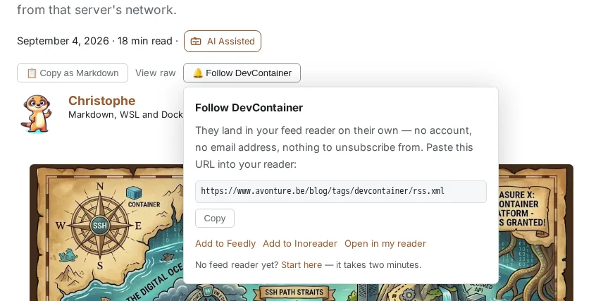
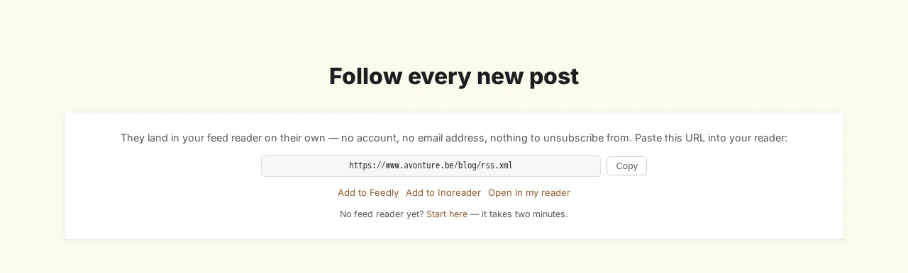
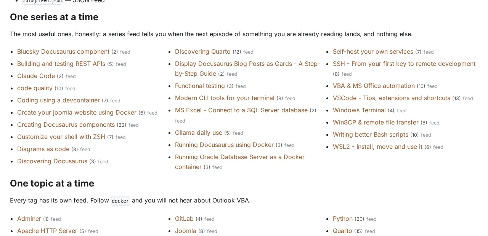

<!-- cspell:ignore Inoreader Feedly NetNewsWire maintag unsubscribe autodiscovery -->


<TLDR>
Docusaurus publishes one RSS feed for your whole blog, and links to it from nowhere a human will look. This guide fixes both halves: a build-time step that writes one feed per tag and per series, and a `<FollowFeed>` React component that offers the right one — in the article header next to "Copy as Markdown", as a section on the homepage, and on a `/follow` page listing every feed you publish. Readers subscribe to *Docker* without receiving your Outlook VBA posts.
</TLDR>

My blog has had a working RSS feed for years. I wrote a plugin for it, gave it full article content, images, author metadata, even an XSLT stylesheet so it renders as a real page when you open it in a browser.

Then I checked how many pages on my site actually linked to it. Zero. The only pointer was a `<link rel="alternate">` in the HTML head — invisible unless you already own a browser extension that hunts for it. And even for the handful of readers who found it, the feed had a second problem: it carried *everything*. Someone who came for Docker also got Quarto, Outlook VBA and my shell aliases.

Here is what I built to fix both: per-topic feeds, and a button that puts the right one in front of the reader.

<!-- truncate -->

<QuickJump
  links={[
    { label: "All files at a glance", to: "#all-files-at-a-glance" },
    { label: "See it working", to: "#what-the-reader-actually-sees" },
  ]}
/>

## What the Reader Actually Sees

An article about dev containers now carries a third button in its header, right next to "Copy as Markdown". It offers the feed for *that article's* main topic — not the whole blog:

<BrowserWindow url="https://www.avonture.be/blog/vscode-remote-ssh-proxyjump-devcontainer">

</BrowserWindow>

The URL in that panel is `/blog/tags/devcontainer/rss.xml` — a real file, written at build time, containing only the posts tagged `devcontainer`. Paste it into any reader and you will hear about dev containers and nothing else.

The same component, in its wider form, closes the homepage after the nine latest posts:

<BrowserWindow url="https://www.avonture.be/">

</BrowserWindow>

## Why It Works

- **The feeds are static files.** No server, no subscriber list, no email address to store, nothing to unsubscribe from. Each one is written into your build output next to the page it belongs to, so `/blog/tags/docker/rss.xml` sits beside `/blog/tags/docker`.
- **Grouping is free.** Your feed plugin already reads every post's front matter and sorts them by date. Splitting that same list by tag costs one pass over an array — no extra file reads, no extra parsing.
- **A topic feed is not a copy of the big one.** It carries descriptions, not full article bodies. That is what keeps seventy-five extra feeds smaller, in total, than a single full-content feed.
- **The visible URL is the primary path, not the buttons.** "Add to Feedly" only helps Feedly users; a URL you can copy works in every reader ever written.
- **One offer per intent.** The article header offers *that post's topic*, a tag page offers *that tag*, the homepage offers *everything*. The same block repeated everywhere becomes wallpaper.

## Building It

You need two things: a build step that writes the feeds, and a component that offers them.

<Prerequisite
  name="A Docusaurus blog that already writes an RSS feed"
  install="See Best Practice - Customizing the Docusaurus RSS Feed"
  check="curl -sI https://your-site/blog/rss.xml | head -1"
/>

This builds directly on the plugin from <Link to="/blog/blog-post-feed">Customizing the Docusaurus RSS Feed for Full Content & Images</Link>. If you are using the stock `feedOptions` instead, you still have a `postBuild` hook to hang this on — you just need your own serializer where the code below expects `renderFeed`.

### Step 1 — Decide which posts belong in which feed

That question is the whole of this module. Two pure functions, one per axis, taking the post list your plugin has already collected and sorted:

<Snippet
  filename="plugins/blog-feed-plugin/topic-feeds.cjs"
  source="plugins/blog-feed-plugin/topic-feeds.cjs"
  defaultOpen={false}
/>

Note the `seen` set in `groupItemsByTag()`. A post's `mainTag` is usually repeated in its `tags` list, and folding both in without dedup silently adds that post to its own tag's feed twice.

<AlertBox variant="caution">
The `createSlug()` this module imports **must** be the one that produces your `/blog/tags/<slug>` and `/series/<slug>` routes — here it comes from the same shared helper both route plugins use. If the two ever disagree, you publish feed URLs that no page on your site can reach, and readers who already subscribed keep polling a 404.
</AlertBox>

### Step 2 — Write them out

In your plugin's `postBuild`, once the site-wide feed is done, walk the groups and serialize each one with the same function you already use:

```javascript title="plugins/blog-feed-plugin/index.js"
const { groupItemsByTag, groupItemsBySeries } = require("./topic-feeds.cjs");

// … after the site-wide feed has been written …

const topicFeeds = [];

for (const group of groupItemsByTag(publishedFeedItems).values()) {
  const meta = tagsData[group.label] || {};
  topicFeeds.push({
    outPath: path.join(outDir, "blog", "tags", group.slug, "rss.xml"),
    channel: {
      title: `${siteConfig.title} — ${meta.label || group.label}`,
      link: absoluteUrl(siteUrl, baseUrl, `blog/tags/${group.slug}`),
    },
    items: group.items,
  });
}

for (const group of groupItemsBySeries(publishedFeedItems).values()) {
  topicFeeds.push({
    // Next to the page it belongs to: the series route is /series/<slug>.
    outPath: path.join(outDir, "series", group.slug, "rss.xml"),
    channel: {
      title: `${siteConfig.title} — ${group.label}`,
      link: absoluteUrl(siteUrl, baseUrl, `series/${group.slug}`),
    },
    items: group.items,
  });
}

await Promise.all(
  topicFeeds.map(async ({ outPath, channel, items }) => {
    await fs.ensureDir(path.dirname(outPath));
    await fs.writeFile(
      outPath,
      // includeContent: false is the whole weight story — see below.
      buildRssXml({ channel, items: items.slice(0, 10), includeContent: false }),
    );
  }),
);
```

Here is that call site in its real surroundings — the options, the site-wide feed it follows, and the serializer both share:

<Snippet
  filename="plugins/blog-feed-plugin/index.js"
  source="plugins/blog-feed-plugin/index.js"
  defaultOpen={false}
/>

### Step 3 — Add the component

`<FollowFeed>` takes the feed's path, a label, and a variant. Everything else — the copy button, the reader links, the popover — is inside.

<Snippet
  filename="src/components/FollowFeed/index.tsx"
  source="src/components/FollowFeed/index.tsx"
  defaultOpen={false}
/>

<Snippet
  filename="src/components/FollowFeed/styles.module.css"
  source="src/components/FollowFeed/styles.module.css"
  defaultOpen={false}
/>

### Step 4 — Put it where readers look

Three placements, three variants:

```jsx title="Anywhere in MDX, a tag page, or the homepage"
{/* The article header, or any tight row: a compact trigger and a popover. */}
<FollowFeed feedUrl="/blog/tags/docker/rss.xml" label="Docker" variant="inline" />

{/* A tag or series page: the full block, aligned with the page container. */}
<FollowFeed feedUrl="/series/my-series/rss.xml" label="the “My series” series" />

{/* The homepage: a centered heading over a centered card, in its own band. */}
<FollowFeed feedUrl="/blog/rss.xml" label="every new post" variant="section" />
```

For the article header, wrap it with whatever else lives on that row. On my blog that means "Copy as Markdown" and "View raw", so the row itself is a component:

<Snippet
  filename="src/components/Blog/ArticleActions/index.tsx"
  source="src/components/Blog/ArticleActions/index.tsx"
  defaultOpen={false}
/>

Then hand it to the swizzled header instead of the single button it used to receive:

```jsx title="src/theme/BlogPostItem/index.js"
const actions = isBlogPostPage ? <ArticleActions metadata={metadata} /> : null;

return <BlogPostItemHeader aiIcon={aiIcon} actions={actions} />;
```

## More Places It Earns Its Keep

**Tag and series pages.** These are where a reader's intent is strongest — they navigated *to a subject*. If you already group posts with a <Link to="/blog/docusaurus-series">custom series component</Link>, its page is the single best place on the whole site for this block: someone reading episode three has an obvious reason to want episode four. The full card belongs there, plus a `<link rel="alternate">` so browser extensions find the feed too — custom routes get no autodiscovery from Docusaurus, so add it yourself:

```jsx title="src/components/Blog/Tags/TagArticlesPage.tsx"
<Head>
  <link
    rel="alternate"
    type="application/rss+xml"
    href={`/blog/tags/${slug}/rss.xml`}
    title={`${label} — RSS feed`}
  />
</Head>
<FollowFeed feedUrl={`/blog/tags/${slug}/rss.xml`} label={label} />
```

**A `/follow` page.** One page listing every feed you publish, built from the same front matter the plugin groups on — so a new tag or series appears without anyone editing it. It gives you a single link for your footer, and somewhere to send the reader who has never used a feed reader:

<BrowserWindow url="https://www.avonture.be/follow">

</BrowserWindow>

**Index pages get a sentence, not a widget.** `/blog/tags` and `/series` *list* subjects; they do not offer one. A line of prose ("Every topic here has its own feed") pointing at `/follow` teaches the concept without a fourth copy of the same card.

## Under the Hood (skip this if you just want to use it)

Three decisions that are not obvious until something breaks.

**Descriptions only, never full content.** My site-wide feed weighs 903 KB for twenty posts, because it embeds each article's full HTML — about 45 KB per entry. Replaying that across seventy-five topic feeds would have added tens of megabytes of duplicated content to the build. Restricted to descriptions, all seventy-five together come to 591 KB — less than one copy of the big feed. A topic feed's job is to announce a post, not to replace it.

**Each feed's `lastBuildDate` must be its own.** Use the date of that feed's newest post, never `new Date()`. A wall-clock value rewrites every file on every build, and your deploy then re-uploads seventy-five unchanged files each time.

**An XSLT stylesheet reference must be an absolute path.** If your feed carries `<?xml-stylesheet href="rss.xsl"?>`, that relative path only resolves for the feed at `/blog/`. A feed one directory deeper looks for `/blog/tags/docker/rss.xsl`, gets a 404, and the reader sees raw XML. Write `/blog/rss.xsl`.

<Details label="Why the popover picks its side at runtime">
The panel hangs off the trigger, and the trigger is in a different place depending on the page: near the left of the content column in an article header, pushed hard right on a blog index. Anchoring it to a fixed edge overflows the viewport in one of those two cases, and a CSS media query cannot tell them apart — the viewport is not what varies.

So the component measures at opening time and picks the side with room. One detail matters: measure against the panel's *effective* width, not its maximum. The CSS clamps it to `100vw - 2rem` on a phone, and comparing against the uncapped `28rem` makes every opening flip to the right edge — which pushes the panel off the *left* of a narrow screen instead.
</Details>

## All Files at a Glance

<ProjectSetup folderName="docusaurus-follow-feed">
  <Guideline>
    Each file keeps the path it has in my own repository, so you can drop them straight
    into yours. `topic-feeds.cjs` goes next to your existing feed plugin; wire its two
    functions into that plugin's `postBuild` as shown in Step 2. Then run `yarn build` —
    the feeds are written by `postBuild`, so they never exist under `yarn start`.
  </Guideline>

  <Snippet
    filename="plugins/blog-feed-plugin/topic-feeds.cjs"
    source="plugins/blog-feed-plugin/topic-feeds.cjs"
  />
  <Snippet
    filename="src/components/FollowFeed/index.tsx"
    source="src/components/FollowFeed/index.tsx"
  />
  <Snippet
    filename="src/components/FollowFeed/styles.module.css"
    source="src/components/FollowFeed/styles.module.css"
  />
  <Snippet
    filename="src/components/Blog/ArticleActions/index.tsx"
    source="src/components/Blog/ArticleActions/index.tsx"
  />
</ProjectSetup>

## Conclusion

The feed was never the missing piece. It had been sitting there for years, complete and correct, linked from nowhere and mixing every subject I write about into one stream. What was missing was a reason for a reader to want it and a place to see it.

Splitting it by tag and by series is a single pass over a list you already have. The component that offers it is one file. Together they turn a URL nobody knew about into an actual offer: *follow this topic, not my whole blog*.

If your feed is still the stock one, start with <Link to="/blog/blog-post-feed">Customizing the Docusaurus RSS Feed for Full Content & Images</Link> — full content and images first, then come back and slice it. And if you want the other button on that same row, <Link to="/blog/docusaurus-copy-as-markdown">Add a "Copy as Markdown" Button to Your Docusaurus Blog</Link> builds it.
