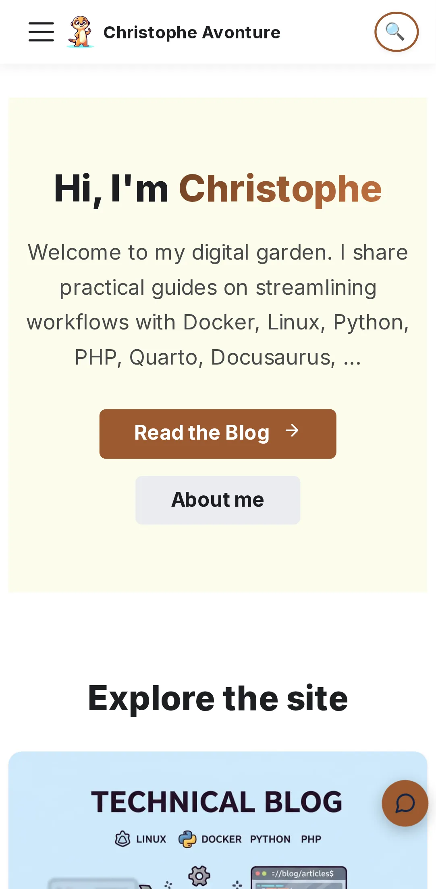

<!-- cspell:ignore ipconfig devcontainer mkcert avonture -->

<TLDR>
Testing a phone-only feature — a shake gesture, a PWA install prompt, anything that needs a real accelerometer or a real home screen — used to feel like it required deploying first, just to see whether it fires. It doesn't: the dev server already started inside this blog's devcontainer (`yarn start --host 0.0.0.0`, HTTPS, port 3000 forwarded via `devcontainer.json`) is reachable from a phone on the same Wi-Fi right now — no plugin, no new dependency, no deploy. Find the computer's LAN IP (`ipconfig` on Windows), visit `https://<that-ip>:3000` from the phone's browser, click through one self-signed-certificate warning, done. Covers why it works, what to do when the phone and the computer aren't on the same network (VS Code's port-forwarding tunnel), and where that certificate warning actually comes from.
</TLDR>

A feature that only makes sense on a phone — a shake gesture, a haptic buzz, an "Add to Home Screen" prompt — is awkward to validate from a laptop. Simulating it is possible, but it proves the code runs, not that the actual feature works on an actual phone. The instinct is to deploy first and check on the real site, which turns "does this work" into a several-minutes round trip for every tiny adjustment.

It doesn't have to be that way: the dev server already running inside this blog's devcontainer has been reachable from a phone on the same Wi-Fi the whole time.

<!-- truncate -->

## Find Your Computer's IP, Then Just Visit It

On the computer running the devcontainer, find its address on the local network:

<Terminal title="Windows Command Prompt" source="./files/ipconfig-output.txt" />

That `192.168.1.42` line is the one that matters — not `127.0.0.1`, and not any `172.x` address a container or WSL might report internally; those only mean something to the machine itself, not to another device on the Wi-Fi.

<Vars ip="192.168.1.42" labels={{ ip: "Your computer's LAN IP" }} />

Then, from the phone — same Wi-Fi network — open that address in a browser, on the same port the dev server already uses:

<BrowserWindow url="https://%%ip=192.168.1.42%%:3000/">
  
</BrowserWindow>

The browser will flag the certificate as untrusted first — expected, and safe to click through here; more on exactly why in [Under the Hood](#under-the-hood-skip-this-if-you-just-want-to-use-it) below. Past that one warning, this is the real dev server: live reload, the actual HTML, and — the reason this was worth figuring out — real sensor and browser APIs that only behave correctly outside a lab simulation.

## Why It Works

- **The dev server already listens on every interface, not just the computer itself.** `docker-entrypoint.sh` starts it as `yarn start --host 0.0.0.0`; without that flag, it would only answer requests originating from inside its own container, invisible to anything else — including the computer's own Wi-Fi adapter.
- **The port is already forwarded, before this trick is ever needed.** `devcontainer.json` declares `forwardPorts: [3000, ...]`, so the chain from the devcontainer, through Docker, out to the computer is already wired — nothing to configure here.
- **HTTPS is deliberate, not incidental.** A growing list of browser APIs — motion sensors, clipboard access, service workers, camera and microphone — refuse to run outside a secure context. A dev server answering over plain HTTP would hide exactly the behavior a real, deployed HTTPS site will have.
- **Same Wi-Fi is the entire requirement.** Nothing is routed through the internet, no router configuration, no account — the phone and the computer just need to be able to see each other on the local subnet. The one common exception is covered next.

## When Your Phone Can't Reach It

Some networks won't allow this: guest Wi-Fi and a fair number of public or corporate networks enable **client isolation**, which deliberately stops devices on the same network from reaching each other, even though both are connected to the same access point. If the phone times out instead of showing a certificate warning, this is the most likely reason — and no amount of double-checking the IP address will fix it.

VS Code's own port forwarding sidesteps the whole question. In the **Ports** panel (already listing 3000, since `devcontainer.json` declares it), right-click the port and change its visibility from *Private* to *Public*. That hands back a forwarding URL reachable from anywhere with the link — the connection itself is terminated with a real, browser-trusted certificate, so there's no warning to click through on the phone this time either. It works across networks, at the cost of a very real trade-off: while a port is Public, anyone holding that link can reach the dev server, not just the phone it was meant for. Switch it back to *Private* — or stop forwarding it entirely — once done testing.

## Under the Hood (skip this if you just want to use it)

**Why the certificate warning shows up at all.** The dev server's HTTPS is self-signed — generated for local development, not issued by a certificate authority a phone's browser already trusts. That's precisely why devices manually recognizing the certificate feels acceptable here but wouldn't for a real site: the connection is genuinely encrypted, it's the *identity* of the server that no outside authority vouches for, which is fine for a computer already known to be the one running the devcontainer.

If clicking through that warning on every test session gets old, a previous article on this blog, [Configure your Docker localhost to use SSL without browser warnings](/blog/docker-localhost-ssl), covers `mkcert` — a tool that generates a locally-trusted certificate authority once, after which every `*.local`-style certificate it issues is trusted automatically, no warning, no manual exception. It targets Apache/Nginx/PHP containers in that article, but the same certificate-authority trick applies to any self-signed dev certificate, including this one.

**The exact reason this reaches the LAN and not only `localhost` depends on the Docker/WSL2 setup**, and is worth naming honestly rather than asserting with more confidence than is warranted: some combination of Docker Desktop's networking mode and VS Code's own port-forwarding behavior is what turns "listening on `0.0.0.0` inside a container" into "answering on the computer's real network interface." Verified working on this exact devcontainer setup ([Windows + WSL2 + Docker Desktop](/blog/vscode-devcontainer)); if it doesn't reach a phone on a setup built differently, the VS Code tunnel above sidesteps the question entirely rather than requiring a networking investigation.

## Conclusion

No deploy, no plugin, no new dependency — a dev server already configured for this (`--host 0.0.0.0`, HTTPS, a forwarded port) turns out to already be reachable from a real phone on the same Wi-Fi, one IP address and one certificate warning away. The certificate warning it costs is a one-time click, not a reason to avoid testing on a real device — a shake gesture, a haptic buzz, or an install prompt only ever really proves itself on one.

<StepsCard
  variant="remember"
  title="The two ways in"
  steps={[
    "**Same Wi-Fi:** `ipconfig` (Windows) for the computer's LAN IPv4 address, then `https://<that-ip>:3000` from the phone — click through the self-signed certificate warning once",
    "**Different network, or client isolation blocking device-to-device traffic:** VS Code's Ports panel → right-click port 3000 → visibility *Public* — a real certificate, reachable from anywhere with the link, switch back to *Private* when done",
    "**Recurring annoyance with the certificate warning:** `mkcert`, covered in [Configure your Docker localhost to use SSL without browser warnings](/blog/docker-localhost-ssl)",
  ]}
/>
