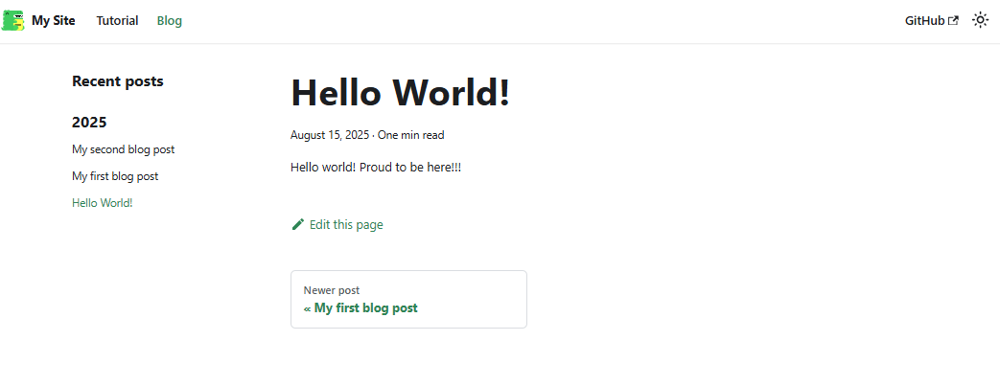
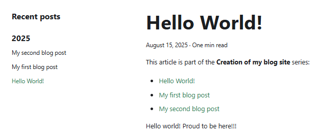

<!-- cspell:ignore reposts,packagist,3lun2qjuxc22r,repost,noopener,noreferrer,docux -->


If you have been using Docusaurus for a long time, you may have noticed that it is not possible to create links between articles as one would like to do for a series.

It would be nice to write a first article, a second, a third one, ... and teach Docusaurus these articles are part of the same series.

It's impossible natively so, let's create our component for this.

:::tip
Hey, did you've already seen this article? Look at the top, you've a "This article is part of the **Creating Docusaurus components** series:"; this is exactly what we'll learn right now.
:::

<!-- truncate -->

## If you don't have a Docusaurus site yet

*or if you want to play in a sandbox site...*

As an illustration for this article, I've created a new Docusaurus sites in seconds by following my previous <Link to="/blog/docusaurus-docker">Running Docusaurus with Docker</Link> article.

## We need something for extracting information from blog posts

If you don't have it yet, please create the `src/components/Blog/utils/posts.js` file. It'll contain a helper function we can reuse for several components.

That helper will scan each Markdown files having the `.md` or `.mdx` extension in the `blog` sub-folder.

For each file, the script will looks at the YAML front matter and exploit some properties; f.i.:

* if the blog post has `draft: true` or `unlisted: true`, the post will be ignored,
* if the blog post has a `slug` will use it. If not, the slug will be generated by code,
* if the blog post has an associated image will use it. If not use a default one
* then the helper will simply return the list of posts and their properties.

Some properties are custom ones like `mainTag` and, for our need right now, the `series` property.

So, just copy/paste the content of the file below and create the `src/components/Blog/utils/posts.js` in your project's structure.

<Snippet filename="src/components/Blog/utils/posts.js">

```js
const posts = require.context("../../../blog", true, /\.mdx?$/);

export function getBlogMetadata() {
  return posts
    .keys()
    .map((key) => {
      const post = posts(key);

      const dir = key.replace(/\/index\.mdx?$/, "").replace(/^\.\//, "");

      let permalink;
      if (post.frontMatter.slug) {
        permalink = post.frontMatter.slug.startsWith("/")
          ? post.frontMatter.slug
          : `/blog/${post.frontMatter.slug.replace(/^\//, "")}`;
      } else {
        permalink = `/blog/${dir}/`;
      }

      let imageUrl = post.frontMatter.image;
      if (imageUrl && imageUrl.startsWith("./")) {
        imageUrl = `/blog/${dir}/${imageUrl.replace("./", "")}`;
      }

      return {
        title: post.frontMatter.title,
        description: post.frontMatter.description,
        image: imageUrl,
        draft: post.frontMatter.draft || false,
        unlisted: post.frontMatter.unlisted || false,
        permalink,
        tags: post.frontMatter.tags || [],
        mainTag: post.frontMatter.mainTag || null,
        authors: post.frontMatter.authors || [],
        date: post.frontMatter.date,
        series: post.frontMatter.series || null,
      };
    })
    .filter(Boolean);
}

```

</Snippet>

## Our SeriesPosts component

Now, we'll create our component. Please create the `src/components/SeriesPosts/index.js` file with the following code:

<Snippet filename="src/components/SeriesPosts/index.js">

```js
import React from "react";
import Link from "@docusaurus/Link";
import { getBlogMetadata } from "@site/src/components/Blog/utils/posts";

import styles from "./styles.module.css";

export default function SeriesPosts({
  series,
  excludePermalink = null,
  highlightCurrent = false,
}) {
  const posts = getBlogMetadata()
    .filter((post) => post.series === series)
    .sort((a, b) => new Date(a.date) - new Date(b.date));

  if (!posts.length) return null;

  return (
    <div className={styles.seriesBlogPost}>
      <p>
        This article is part of the <strong>{series}</strong> series:
      </p>
      <ul>
        {posts.map((post) => {
          const isCurrent = post.permalink === excludePermalink;

          return (
            <li key={post.permalink} style={{ marginBottom: "0.5rem" }}>
              {isCurrent ? (
                <span
                  style={{
                    fontWeight: "bold",
                    opacity: highlightCurrent ? 0.6 : 1,
                  }}
                >
                  {post.title}
                </span>
              ) : (
                <Link to={post.permalink}>{post.title}</Link>
              )}
            </li>
          );
        })}
      </ul>
    </div>
  );
}
```

</Snippet>

As you can see, we'll retrieve the list of blog posts thanks the `getBlogMetaData` helper. We'll mainly apply a filter and make sure the retrieve post has a `series` property and that one is strictly equal to the one of the current article.

And if so, just order post in a chronological order.

```js
const posts = getBlogMetadata()
    .filter((post) => post.series === series)
    .sort((a, b) => new Date(a.date) - new Date(b.date));
```

The rest of the logic will simply to display a bullet list.

And the last file to create is the CSS file:

<Snippet filename="src/components/SeriesPosts/styles.module.css">

```css
.seriesBlogPost {
  margin-bottom: "2rem";
}
```

</Snippet>

## Editing our articles

Now, the easy part, please edit an existing blog post you've and add the `series` key in the YAML front matter; f.i.:

<Snippet filename="index.md">

```markdown
---
title: Hello World!
<!-- highlight-next-line -->
series: Creation of my blog site
---

Hello world! Proud to be here!!!
```

</Snippet>

:::danger Nothing happens? Why? Because we still need to do one thing
As you can see, nothing happens right now:


:::

## Overriding the BlogPostItem template

It's normal because we need to call our newly created component. For sure, we can include the `<SeriesBlogPost>` tag in each article but, uh oh, we're smart people isn't it?

Let's create an override of the BlogPostItem template of Docusaurus.

In a console, please run `yarn docusaurus swizzle @docusaurus/theme-classic BlogPostItem` then select, in that order, `Javascript`, then `Eject` finally `YES`.

A lot of files will be created in your Docusaurus directory's structure, in folder `src/theme/BlogPostItem`. We can safely removed all files except the `src/theme/BlogPostItem/index.js` file that we need to edit.

So, please remove any files/folders under `src/theme/BlogPostItem` except the `index.js` one.

In the code below, the highlighted lines are the ones we need to add.

<Snippet filename="src/theme/BlogPostItem/index.js">

```js
import React from "react";
import clsx from "clsx";
import { useBlogPost } from "@docusaurus/plugin-content-blog/client";
import BlogPostItemContainer from "@theme/BlogPostItem/Container";
import BlogPostItemHeader from "@theme/BlogPostItem/Header";
import BlogPostItemContent from "@theme/BlogPostItem/Content";
import BlogPostItemFooter from "@theme/BlogPostItem/Footer";

// highlight-next-line
import SeriesPosts from '@site/src/components/SeriesPosts/index.js';

// apply a bottom margin in list view
function useContainerClassName() {
  const { isBlogPostPage } = useBlogPost();
  return !isBlogPostPage ? "margin-bottom--xl" : undefined;
}
export default function BlogPostItem({ children, className }) {
  const containerClassName = useContainerClassName();
  // highlight-next-line
  const { metadata, isBlogPostPage } = useBlogPost();

  return (
    <BlogPostItemContainer className={clsx(containerClassName, className)}>
      <BlogPostItemHeader />

      // highlight-start
      {/* Only display our SeriesPosts components on the post page; not the blog view */}
      {isBlogPostPage && (
        <SeriesPosts
          series={metadata.frontMatter.series}
          excludePermalink={metadata.permalink}
          highlightCurrent={true}
        />
      )}
      // highlight-end
      <BlogPostItemContent>{children}</BlogPostItemContent>
      <BlogPostItemFooter />
    </BlogPostItemContainer>
  );
}
```

</Snippet>

Now, because we've just introduced an override, we need to restart our Docusaurus server so changes can be taken into account.

:::info
If you're running Docusaurus locally, just run `npm run start` in your console.
If like me you're running Docusaurus thanks to Docker, just kill the container and run a new one.
:::


Great, the component is now running. We can create our series.

## Add another articles in the same series

Just edit any of your blog post and the only thing you've to do right now is to add the `series` key.

On my demo site, I've three articles, I'll edit both and add the `series: Creation of my blog site` line in the YAML front matter.

And by saving my changes, going back to the browser will well reflect my series:



:::tip
If you want to see the `SeriesBlogPost` component in a live use case, just surf on this site. What you'll see here is exactly what is described in this article.
:::

## Adding a new page to show all series

It'll be cool to have a page on our Docusaurus site to display the list of series no?

It's easy too.

Please create the `src/pages/series.jsx` file with this content:

<Snippet filename="src/pages/series.jsx">

```js
import React from "react";
import Layout from "@theme/Layout";
import { getBlogMetadata } from "@site/src/components/Blog/utils/posts";
import Link from "@docusaurus/Link";

export default function SeriesPage() {
  const posts = getBlogMetadata();
  const seriesMap = {};

  posts.forEach((post) => {
    const seriesName = post.series;
    if (seriesName) {
      if (!seriesMap[seriesName]) {
        seriesMap[seriesName] = [];
      }
      seriesMap[seriesName].push(post);
    }
  });

  const sortedSeriesNames = Object.keys(seriesMap).sort();

  return (
    <Layout title="Article series">
      <div className="container margin-top--lg margin-bottom--lg">
        <h1>All article series</h1>
        {sortedSeriesNames.length > 0 ? (
          <div className="row">
            {sortedSeriesNames.map((seriesName) => {
              const seriesPosts = seriesMap[seriesName];
              const sortedPosts = seriesPosts.sort(
                (a, b) => new Date(a.date) - new Date(b.date)
              );
              const firstPost = sortedPosts[0];
              const description =
                firstPost.description ||
                `${seriesPosts.length} article(s) in this series`;

              return (
                <div key={seriesName} className="col col--4 margin-bottom--lg">
                  <div className="card shadow--md">
                    <div className="card__header">
                      <h3>
                        <Link href={firstPost.permalink}>{seriesName}</Link>
                      </h3>
                    </div>
                    <div className="card__body">
                      <p>{description}</p>
                    </div>
                    <div className="card__footer">
                      <Link
                        className="button button--primary button--block"
                        href={firstPost.permalink}
                      >
                        Read more
                      </Link>
                    </div>
                  </div>
                </div>
              );
            })}
          </div>
        ) : (
          <p>No series of articles found.</p>
        )}
      </div>
    </Layout>
  );
}

```

</Snippet>

Now, simply access to the `/series` page. On my localhost, it's `http://127.0.0.1:3002/series`.

Here is what you can get without any stylization:


On my blog, I've use the [Card component of Docux](https://docusaurus.community/knowledge/component-library/new/Card/). Jump to the [/series](/series) page to see it.

Here is the version used on my blog:

<Snippet filename="src/pages/series.jsx">

```js
import Layout from "@theme/Layout";
import { getBlogMetadata } from "@site/src/components/Blog/utils/posts";
import Link from "@docusaurus/Link";

import Card from "@site/src/components/Card";
import CardImage from '@site/src/components/Card/CardImage';
import CardBody from '@site/src/components/Card/CardBody';

export default function SeriesPage() {
  const posts = getBlogMetadata();
  const seriesMap = {};

  posts.forEach((post) => {
    const seriesName = post.series;
    if (seriesName) {
      if (!seriesMap[seriesName]) {
        seriesMap[seriesName] = [];
      }
      seriesMap[seriesName].push(post);
    }
  });

  const sortedSeriesNames = Object.keys(seriesMap).sort((a, b) =>
    a.localeCompare(b)
  );

  return (
    <Layout title="Article series">
      <div className="container margin-top--lg margin-bottom--lg">
        <h1>All article series</h1>
        {sortedSeriesNames.length > 0 ? (
          <div className="row">
            {sortedSeriesNames.map((seriesName) => {
              const seriesPosts = seriesMap[seriesName];
              const firstPost = seriesPosts[0];
              const image = firstPost.image || "default.jpg"; // fallback image
              const description =
                firstPost.description ||
                `${seriesPosts.length} article(s) in this series`;

              return (
                <div key={seriesName} className="col col--4 margin-bottom--lg">
                  <Link href={firstPost.permalink}>
                    <Card>
                      <CardImage cardImageUrl={`${image}`} />
                      <CardBody
                        className="padding-vert--md text--center"
                        textAlign="center"
                        transform="uppercase"
                      >
                        <h3>{seriesName}</h3>
                        <p>{description}&nbsp;→</p>
                      </CardBody>
                    </Card>
                  </Link>
                </div>
              );
            })}
          </div>
        ) : (
          <p>No series of articles found.</p>
        )}
      </div>
    </Layout>
  );
}

```

</Snippet>
