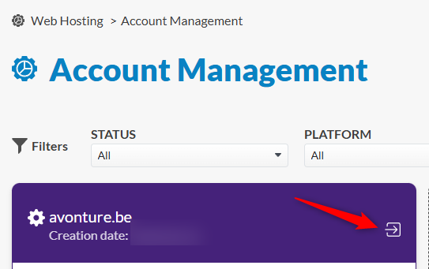
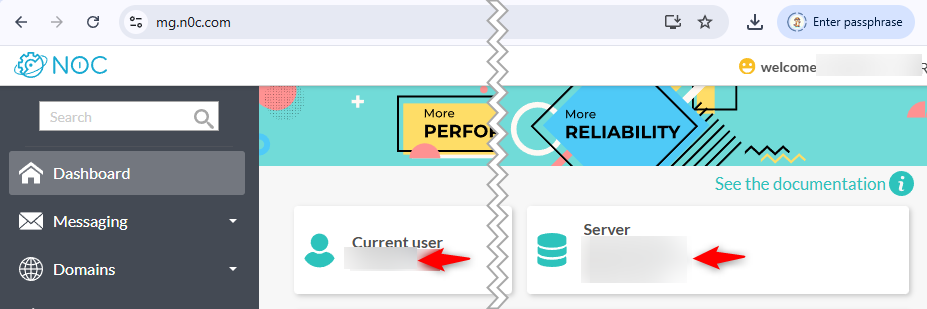
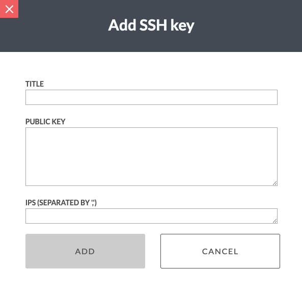

Jump to your [PlanetHoster dashboard](https://my.planethoster.com/v2/hosting-management/overview) and, if needed, click on **Web Hosting --> Account Management** and click on the arrow to open the page:



On the top of [the page](https://mg.n0c.com/), you'll find some three required information:

* The *Current user*: it'll be the user name you've to use,
* Your server name (and his IP) and
* The SSH port to use



The fourth one you should have is the password associated to your user

## Try a SSH connection by hand

In a Linux console, run the following command by replacing placeholders by your own info:

<Terminal wrap={true}>
$ ssh -p <<your_ssh_port>> <<your_user_name>>@<<your_user_name_or_ip>>
the_output
</Terminal>

(f.i. something like `ssh -p 5022 john_doe@123.45.67.89)

You'll be prompted for a password. Please enter yours.

If you get the console, you can type something like `ls -alh` just to check if you see somes files; should be your user root directory:


## Create a SSH key to connect to PlanetHost

On my host, I've to run something like `ssh-keygen -t ed25519 -C "<<your_user_name>>" -f ~/.ssh/id_ed25519_planethoster`. This will create a public key `~/.ssh/id_ed25519_planethoster.pub` for your account (think to replace `<<your_user_name>>` in the ssh-keygen CLI by yours).

Run `cat ~/.ssh/id_ed25519_planethoster.pub` to see the content of your public key. Select its content and press <kbd>CTRL</kbd>+<kbd>C</kbd> to put it in the clipboard.

Ok, now surf to `https://mg.n0c.com/files/ssh` then, in the left sidebar, I should click on `Files` the `SSH keys`.

Click on the `Add` button. You'll get a popup screen. Add a title like *Home computer* and paste your key then finalize by clicking on the `ADD` button at the bottom of the popup.



## Copy your key to the server

Please run `ssh-copy-id -i ~/.ssh/id_ed25519_planethoster -p <<your_ssh_portnumber>> <<your_user_name>>@<<your_server_name>>` to copy your public key to the Planethoster server.

To test, please run `ssh <<your_user_name>>@<<your_server_name>> -p <<your_ssh_portnumber>>`. If no password is required, it means your key has been successfully copied to the server.

## Configure your ssh config file

Run `code ~/.ssh/config` to open your SSH configuration file (if the file didn't exists yet, just create it).

Add the block below to the file (think to update placeholers):

```text
Host planethoster
    HostName <<your_server_name>>
    User <<your_user_name>>
    Port <<your_ssh_portnumber>>
    IdentityFile ~/.ssh/id_ed25519_planethoster.pub
    IdentitiesOnly yes
```

Save and close the file.

## Do a SSH connection

Once your key has been created and the configuration file updated, go back to your terminal, on your host, and run `ssh planethoster`.

If everything was correctly done, you'll jump in your server.


