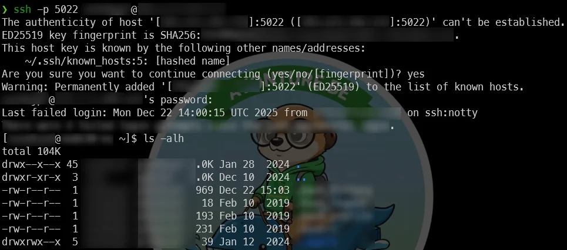
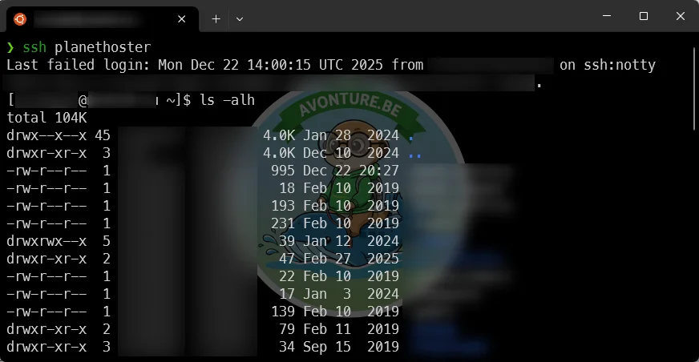

This guide explains how to configure SSH to connect to your PlanetHoster server using a short alias (for example, `ssh planethoster`) so you can SSH without entering a password every time.

You'll learn how to gather the required information, generate an SSH key pair, copy your public key to the server, and set up `~/.ssh/config` for a convenient shortcut.

<!-- truncate -->

## Collect Required Information

You'll need to obtain the following pieces of information:

1. The username for the connection
2. The server name (or its IP address)
3. The port number to use
4. The password associated with the user account.

For the first three items, log in to the [PlanetHoster dashboard](https://my.planethoster.com/v2/hosting-management/overview).

You'll land on the dashboard page. In the left sidebar, navigate to **Web Hosting --> Account Management** and click the arrow to open the page:


At the top of [the page](https://mg.n0c.com/), you'll find the three required pieces of information:

* The *Current user*: the username to use for SSH.
* Your server name (and its IP address).
* The SSH port to use (likely `5022`).


The fourth piece of information to gather is the password associated with your user account.

<StepsCard
  title="For the rest of this article, we'll use these values:"
  variant="steps"
  steps={[
    "User: `john_doe`",
    "Server name: `node30-eu.n0c.com`",
    "Port number: `5022`",
    "Password: `p@ssword`"
  ]}
/>

## Try a Manual SSH Connection

In a Linux console, run the following command:

<Terminal wrap={true}>
$ ssh -p 5022 john_doe@node30-eu.n0c.com
</Terminal>

You'll be prompted for a password; enter your account password.

If you get a shell, run `ls -al` to list files and `pwd` or `whoami` to confirm you are in your home directory:



If the login succeeds, you should normally be in your user's home directory (not the system root).

<AlertBox variant="caution" title="What to do if you get a timeout">
If the `ssh` command takes a long time and then ends with a timeout, it likely means you are using incorrect information, such as the wrong username.

PlanetHoster may detect multiple failed connection attempts, interpret them as a security threat, and block your IP address. If this happens, even with the correct command, you won't be able to connect because your IP will be blacklisted.

In this case, you'll have to wait a certain amount of time. If you're blocked, you can create a support ticket with PlanetHoster to ask for your IP to be unblocked.
</AlertBox>

## Create an SSH Key to Connect to PlanetHoster

In the previous step, we've confirmed that we can connect to the server.

In this section, we'll create an SSH key and copy it to the server. This will allow passwordless authentication for future connections.

### Create an SSH key

On your local machine, run a command like `ssh-keygen -t ed25519 -C "john_doe" -f ~/.ssh/id_ed25519_planethoster` in your terminal. This will create a public key `~/.ssh/id_ed25519_planethoster.pub` for your account.

Optionally, you can run `cat ~/.ssh/id_ed25519_planethoster.pub` to view the content of your public key and copy it to the clipboard ( <kbd>CTRL</kbd>+<kbd>C</kbd> ).

Select its content and press <kbd>CTRL</kbd>+<kbd>C</kbd> to copy it to the clipboard.

<AlertBox variant="info">
The key will look something like `ssh-ed25519 BASE64_STRING john_doe`.
</AlertBox>

### Copy your key to the server

Run `ssh-copy-id -i ~/.ssh/id_ed25519_planethoster -p 5022 john_doe@node30-eu.n0c.com` to copy your public key to the PlanetHoster server.

You'll be prompted to enter your password one last time.

<Terminal wrap={true}>
$ ssh-copy-id -i ~/.ssh/id_ed25519_planethoster -p 5022 john_doe@node30-eu.n0c.com

/usr/bin/ssh-copy-id: INFO: Source of key(s) to be installed: "/home/john_doe/.ssh/id_ed25519_planethoster.pub"
/usr/bin/ssh-copy-id: INFO: attempting to log in with the new key(s), to filter out any that are already installed
/usr/bin/ssh-copy-id: INFO: 1 key(s) remain to be installed -- if you are prompted now it is to install the new keys

john_doe@node30-eu.n0c.com's password:

Number of key(s) added: 1
</Terminal>

Once your public key has been successfully copied to the server, you will be able to connect without providing a password.

Run the command below as a test:

<Terminal wrap={true}>
$ ssh -i ~/.ssh/id_ed25519_planethoster -p 5022 john_doe@node30-eu.n0c.com
</Terminal>

As expected, you'll be immediately connected without a password prompt.

### Simplify the Command with an SSH Config File

The command is quite complex, isn't it? Let's simplify it so we can just use `ssh planethoster`.

To do this, run `vi ~/.ssh/config` (or your preferred editor) to open your SSH configuration file. If the file doesn't exist yet, create it.

Add the block below to the file (remember to update the placeholders):

<Snippet filename="~/.ssh/config" source="./files/config" />

Save and close the file.

Also, make sure to set the correct permissions for your key by running `chmod 0600 ~/.ssh/id_ed25519_planethoster*`. This makes the key files accessible only to you.

<AlertBox variant="note" title="WARNING: UNPROTECTED PRIVATE KEY FILE!">
If you don't set the correct permissions with `chmod`, you will get an error like the one below when you try to connect:

```text
@@@@@@@@@@@@@@@@@@@@@@@@@@@@@@@@@@@@@@@@@@@@@@@@@@@@@@@@@@@
@         WARNING: UNPROTECTED PRIVATE KEY FILE!          @
@@@@@@@@@@@@@@@@@@@@@@@@@@@@@@@@@@@@@@@@@@@@@@@@@@@@@@@@@@@
Permissions 0644 for '/home/john_doe/.ssh/id_ed25519_planethoster' are too open.
```

</AlertBox>

### Establish an Easy SSH Connection

From now on, to start an SSH connection to your host, open a terminal and run `ssh planethoster` (or the alias you defined). If everything is configured correctly, you will be connected without a password prompt.



## Troubleshooting & tips

* If a connection fails, run the SSH client in verbose mode to see debug output: `ssh -vvv -p 5022 john_doe@node30-eu.n0c.com`.
* If you see a `WARNING: UNPROTECTED PRIVATE KEY FILE!` error, check local permissions on your private key and use `chmod 600` as shown earlier.
* On the server, verify that your key exists in `~/.ssh/authorized_keys` and that `~/.ssh` and `authorized_keys` have correct permissions.

## Conclusion

This guide showed how to set up key-based SSH access to a PlanetHoster server and create a simple `ssh planethoster` shortcut.


