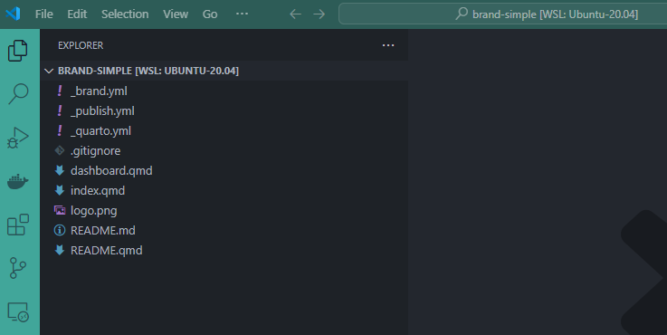
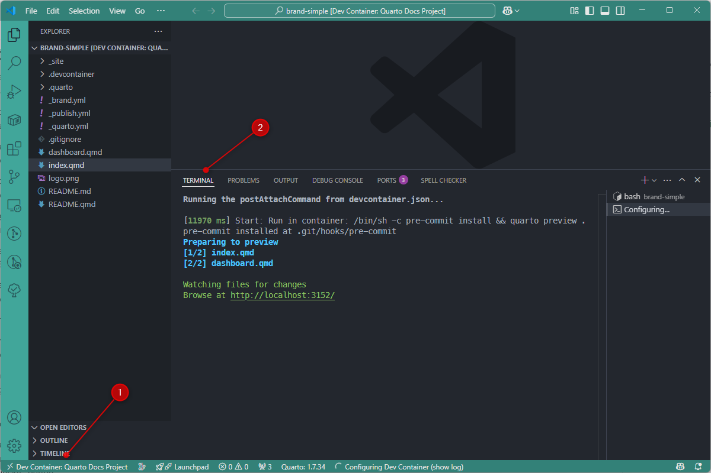
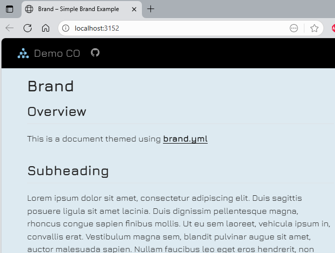
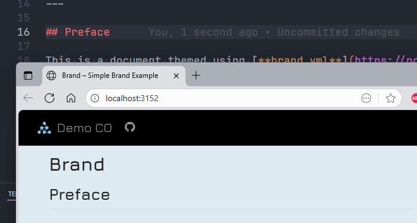
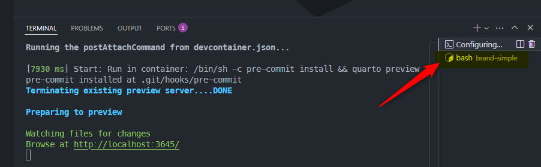
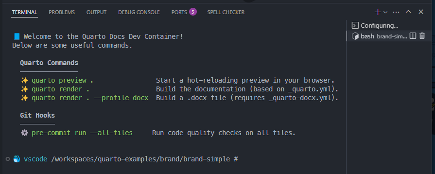

<!-- markdownlint-disable MD046 -->
<!-- cspell:ignore  -->


I love using Quarto and I've plenty of *documentation* projects on my disk. I'm writing user documentation, developer ones and, too, installation guide for almost every project I'm coding.

I quickly came up with the idea of creating a Docker image so that I could develop my documentation in peace, as well as a devcontainer configuration for VSCode.  Now, when I want to write my documentation, in less than a minute, I can create an environment entirely dedicated to writing documentation.

Among other things, I install Quarto, install and configure a number of extensions for VSCode, and launch Quarto in preview mode: as soon as I save a change, Quarto regenerates the documentation on its own.

Let's see how to do this; you'll see, it's so simple.

<!-- truncate -->

## Let's get a simple Quarto project first

For sure, if you've one, just jump in your project. Here, for this blog post, we'll just reuse an existing one.

By running the commands below in a console, you'll retrieve download just the `brand` folder from the `quarto-examples` project:

<Terminal wrap={true}>
$ cd /tmp
git clone --filter=blob:none --sparse https://github.com/quarto-dev/quarto-examples
cd quarto-examples
git sparse-checkout set brand
cd brand/brand-simple
</Terminal>

Run `code .` to open the project in VSCode and you'll get this:



## Adding our .devcontainer files

Please create the `.devcontainer/Dockerfile` file with the content below.

In short, this Dockerfile sets up a Quarto-based development container tailored for documentation projects with Git and pre-commit integration.

<Snippet filename=".devcontainer/Dockerfile">

```dockerfile
# syntax=docker/dockerfile:1.4

# cspell:disable
FROM ghcr.io/quarto-dev/quarto:latest

ARG USERNAME=vscode
ARG USER_UID=1000
ARG USER_GID=1000

# ---------- Stage 1: Install system dependencies ----------
#
# openssh-client: used by git when pushing/pulling using git@ protocol
# python3-pip: needed to be able to install pre-commit-hooks
RUN --mount=type=cache,target=/var/cache/apt \
    --mount=type=cache,target=/var/lib/apt \
    apt-get update && \
    apt-get install -y --no-install-recommends \
    ca-certificates \
    curl \
    git \
    libsecret-1-dev \
    libx11-dev \
    libxkbfile-dev \
    openssh-client \
    python3-pip \
    unzip \
    && rm -rf /var/lib/apt/lists/*

# Upgrade pip to its latest version
RUN pip3 install --no-cache-dir --upgrade pip

# Install pre-commit hook tool
RUN pip3 install --no-cache-dir pre-commit

# ---------- Stage 2: Create the user and setup permissions ------------------

RUN set -eux && \
    USER_UID=${USER_UID:-1000} && \
    USER_GID=${USER_GID:-1000} && \
    groupadd -g "${USER_GID}" "${USERNAME}" && \
    useradd -m -u "${USER_UID}" -g "${USER_GID}" -s /bin/bash "${USERNAME}" && \
    chown -R "${USERNAME}":"${USERNAME}" "/home/${USERNAME}"

# ---------- Stage 3: Finalization -------------------------------------------

USER ${USERNAME}

# Create .ssh directory and set permissions for the non-root user
# This is crucial for the git push to work, as ssh requires strict permissions
RUN set -eux && \
    mkdir -p /home/${USERNAME}/.ssh && \
    chown -R "${USERNAME}":"${USERNAME}" "/home/${USERNAME}/.ssh" && \
    chmod 700 /home/${USERNAME}/.ssh

# Make bash history persistent
RUN mkdir -p /home/${USERNAME}/.bash_history && \
    touch /home/${USERNAME}/.bash_history/.bash_history

# Configure bash to use this file
RUN echo 'export HISTFILE=/home/${USERNAME}/.bash_history/.bash_history' >> "/home/${USERNAME}/.bashrc" && \
    echo 'export HISTSIZE=10000' >> "/home/${USERNAME}/.bashrc" && \
    echo 'export HISTFILESIZE=10000' >> "/home/${USERNAME}/.bashrc" && \
    echo 'shopt -s histappend' >> "/home/${USERNAME}/.bashrc"

# Set up the shell prompt and history for devcontainer
RUN set -eux && \
    echo "PS1='\n\e[0;33m🐳 \e[0;36m\$(whoami)\e[0m \w # '" >> "/home/${USERNAME}/.bashrc"

# When the user will start a new terminal session in the container, he'll see the tips below
RUN set -eux && \
    cat <<EOF >> "/home/${USERNAME}/.bashrc"
echo -e "\n📘 Welcome to the Quarto Docs Dev Container!"
echo -e "Below are some useful commands:"
echo -e ""
echo -e "  \e[1mQuarto Commands\e[0m"
echo -e "  ───────────────"
echo -e "  ✨ \e[32mquarto preview .\e[0m                Start a hot-reloading preview in your browser."
echo -e "  ✨ \e[32mquarto render .\e[0m                 Build the documentation (based on _quarto.yml)."
echo -e "  ✨ \e[32mquarto render . --profile docx\e[0m  Build a .docx file (requires _quarto-docx.yml)."
echo -e ""
echo -e "  \e[1mGit Hooks\e[0m"
echo -e "  ─────────"
echo -e "  ⚙️  \e[32mpre-commit run --all-files\e[0m     Run code quality checks on all files."
echo -e ""
EOF

```

</Snippet>

And create the `.devcontainer/devcontainer.json` file too with the content here after. Here this file will instruct to VSCode how to build his Devcontainer session, which Dockerfile to use and the list of extensions (and configuration items) we wish in our session.

<Snippet filename=".devcontainer/devcontainer.json">

```json
{
    "name": "Quarto Docs Project",
    "build": {
        "dockerfile": "Dockerfile",
        "args": {
            "USER_UID": "${localEnv:UID}",
            "USER_GID": "${localEnv:GID}"
        }
    },
    "remoteUser": "vscode",
    "runArgs": [
        "--mount=type=bind,source=${env:HOME}/.ssh,target=/home/vscode/.ssh,readonly"
    ],
    "containerEnv": {
        "GIT_SSH_COMMAND": "ssh -i /home/vscode/.ssh/id_ed25519 -o 'StrictHostKeyChecking no'"
    },
    "customizations": {
        "vscode": {
            "settings": {
                "[dockerfile]": {
                    "files.eol": "\n",
                    "editor.defaultFormatter": "ms-azuretools.vscode-docker"
                },
                "[json]": {
                    "editor.defaultFormatter": "vscode.json-language-features"
                },
                "[jsonc]": {
                    "editor.defaultFormatter": "vscode.json-language-features",
                    "editor.wordWrap": "wordWrapColumn",
                    "editor.wordWrapColumn": 80,
                    "editor.wrappingIndent": "indent"
                },
                "[markdown]": {
                    "editor.defaultFormatter": "yzhang.markdown-all-in-one",
                    "editor.wordWrap": "wordWrapColumn",
                    "editor.wordWrapColumn": 80,
                    "editor.wrappingIndent": "indent"
                },
                "[yaml]": {
                    "editor.defaultFormatter": "redhat.vscode-yaml"
                },
                "cSpell.language": "en,fr,nl",
                "cSpell.words": [
                    "Quarto",
                    "devcontainer",
                    "frontmatter",
                    "Pandoc",
                    "Gitlens"
                ],
                "editor.formatOnSave": true,
                "editor.guides.bracketPairs": "active",
                "editor.guides.bracketPairsHorizontal": "active",
                "editor.guides.highlightActiveIndentation": true,
                "editor.guides.indentation": true,
                "editor.multiCursorModifier": "ctrlCmd",
                "editor.renderWhitespace": "all",
                "editor.rulers": [
                    120,
                    70
                ],
                "editor.stickyScroll.enabled": true,
                "editor.tabCompletion": "on",
                "editor.tabSize": 4,
                "editor.wordBasedSuggestionsMode": "allDocuments",
                "editor.wordWrapColumn": 120,
                "explorer.compactFolders": false,
                "explorer.confirmDelete": true,
                "explorer.confirmDragAndDrop": true,
                "extensions.autoCheckUpdates": false,
                "files.associations": {
                    "resources/*.json": "jsonc"
                },
                "files.autoSave": "onFocusChange",
                "files.defaultLanguage": "${activeEditorLanguage}",
                "files.eol": "\n",
                "files.exclude": {
                    "**/.DS_Store": true,
                    "**/.cache": true,
                    "**/.git": true,
                    "**/.hg": true,
                    "**/.svn": true,
                    "**/CVS": true,
                    "**/documentation/**/*.html": true,
                    "**/documentation/**/readme_files/**": true,
                    "**/documentation/**/site_libs/**": true
                },
                "files.insertFinalNewline": true,
                "files.trimTrailingWhitespace": true,
                "maptz.regionfolder": {
                    "[dockerfile]": {
                        "foldEnd": "[\\S]*\\#[\\s]*endregion",
                        "foldEndRegex": "[\\S]*\\#[\\s]*endregion[\\s]*(.*)$",
                        "foldStart": "[\\S]*\\#[\\s]*region [NAME]",
                        "foldStartRegex": "[\\S]*\\#[\\s]*region[\\s]*(.*)$"
                    }
                },
                "markdown.extension.toc.levels": "2..6",
                "markdown.extension.tableFormatter.enabled": true,
                "markdownlint.config": {
                    "MD033": false,
                    "MD036": false
                },
                "quarto.preview.renderOnSave": true,
                "telemetry.telemetryLevel": "off",
                "terminal.integrated.profiles.linux": {
                    "bash": {
                        "path": "/bin/bash",
                        "icon": "terminal-bash"
                    }
                },
                "terminal.integrated.defaultProfile.linux": "bash",
                "terminal.integrated.fontFamily": "MesloLGS NF",
                "yaml.schemas": {
                    "https://json.schemastore.org/github-workflow.json": "_quarto.yml"
                }
            },
            "extensions": [
                "DavidAnson.vscode-markdownlint",
                "esbenp.prettier-vscode",
                "gitkraken.gitlens",
                "maptz.regionfolder",
                "mde.select-highlight-minimap",
                "mikestead.dotenv",
                "ms-vscode.makefile-tools",
                "quarto.quarto",
                "redhat.vscode-yaml",
                "sirtori.indenticator",
                "streetsidesoftware.code-spell-checker-dutch",
                "streetsidesoftware.code-spell-checker-french",
                "streetsidesoftware.code-spell-checker",
                "yzhang.markdown-all-in-one"
            ]
        }
    },
    "forwardPorts": [
        8000
    ],
    "postAttachCommand": "pre-commit install && quarto preview ."
}
```

</Snippet>

## Opening our project

Right now, just press <kbd>F1</kbd> (or <kbd>CTRL</kbd>+<kbd>SHIFT</kbd>+<kbd>P</kbd>) and select **Dev containers: Rebuild and Reopen in Container**. If you don't have that command, please make sure to install the  `ms-vscode-remote.remote-containers` from Microsoft.

:::tip
You can install the extension from the console by running `code --install-extension ms-vscode-remote.remote-containers` or by opening this page: [Marketplace - Dev Containers](https://marketplace.visualstudio.com/items?itemName=ms-vscode-remote.remote-containers).
:::

So, once you've fired the **Dev containers: Rebuild and Reopen in Container** command, VSCode will close your current session and open a new one. The very first time, VSCode will have to make some initializations (like building the Docker image and downloading extensions so it'll be slower).

After a few seconds, you'll get a screen like this:



1. See bottom left, you've in the status bar the text "Dev Container: xxx" (followed by the name of our container).
2. In the **Terminal window** (if you don't see it press <kbd>CTRL</kbd>+<kbd>ù</kbd>), you'll see that something was already fired: `quarto preview` has been already triggered and your website is already running.

Just follow the link by pressing <kbd>ALT</kbd> and clicking on the link.



## The documentation is currently being served in preview mode

Let's check if the website will be updated if we change something.

Please edit the `index.qmd` file and change something.  For instance, I'll change the `Overview` chapter title to `Preface`.



As you can see on the image here above, I just need to make a change, save my file and wait less than one second and the website is updated automatically. Nothing to do (I don't need to refresh the page). Easy no?

### What is the origin of this magic?

The secret of this is the `postAttachCommand` key in the `.devcontainer/devcontainer.json` file. If you look at it, you'll see this: `"postAttachCommand": "pre-commit install && quarto preview ."`.

This tells to VSCode to run two commands once the Devcontainer is created: first to install `pre-commit` and then to run `quarto preview .` and this to listen any changes in the project and to render the documentation if something is updated.

## Using the terminal

Go to the **Terminal window** (if you don't see it press <kbd>CTRL</kbd>+<kbd>ù</kbd>).

Look now at the right part: there is a `Configuring...` terminal but too a `bash brand-simple` (the name of our project).



Click on that one to display that, already configured, terminal:



These instructions were configured in our `.devcontainer/Dockerfile` for our easiness.

So, if your objective is to render the final documentation, you can always see *Oh yes, I simply need to run `quarto render .`*

## What's is pre-commit?

[pre-commit](https://pre-commit.com/) is a tool that will run some validation controls to your project before you'll push it to your versioning system (like Github or GitLab).

By adding `pre-commit` in the devcontainer, you'll get the privilege to never again commit files with somes fault like f.i. formatting issues in your Markdown content.

If you like this idea, please create the `.pre-commit-config.yaml` file in your project's root folder (so no in the `.devcontainer` folder but his parent folder).

Just copy/paste the content below:

<Snippet filename=".pre-commit-config.yaml">

```yaml
repos:
  # Universal hooks for clean files
  - repo: https://github.com/pre-commit/pre-commit-hooks
    rev: v6.0.0
    hooks:
      - id: check-added-large-files
      - id: check-case-conflict
      - id: check-json
      - id: check-merge-conflict
      - id: check-yaml
      - id: detect-private-key
      - id: end-of-file-fixer
      - id: trailing-whitespace

  # Markdown linter
  - repo: https://github.com/DavidAnson/markdownlint-cli2
    rev: v0.18.1
    hooks:
      - id: markdownlint-cli2
        args:
          - '--disable'
          - 'MD013' # Disable line length rule, which is often too strict for documentation
```

</Snippet>

Once this file is in place, when you'll fire the `git commit` command from the terminal (<kbd>CTRL</kbd>+<kbd>ù</kbd>), `git` will first run `pre-commit` to run *hooks*. In the `.pre-commit-config.yaml` file above, we've defined two hooks; the first one to make generic checks on files then the ensure there is no linting errors with .md files (just check the official repo for more info).

These hooks are fired everytime you'll commit files (and just on the commited files; not the entire project).

You can, too, force to run hooks without commiting by running `pre-commit run --all-files` in the console.

This command will check all files.

`pre-commit` is really usefull to garantue that you're respecting some quality industry standards.

## Conclusion

With just two files (`.devcontainer/Dockerfile` and `.devcontainer/devcontainer.json`), we've converted a simple project to a Devcontainer where Quarto is preinstalled, extensions installed and configured and some features like the automatic preview is running.

Cool no?
