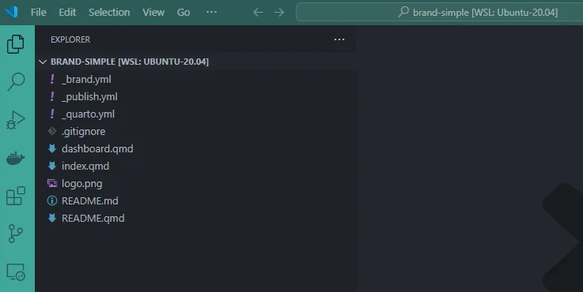
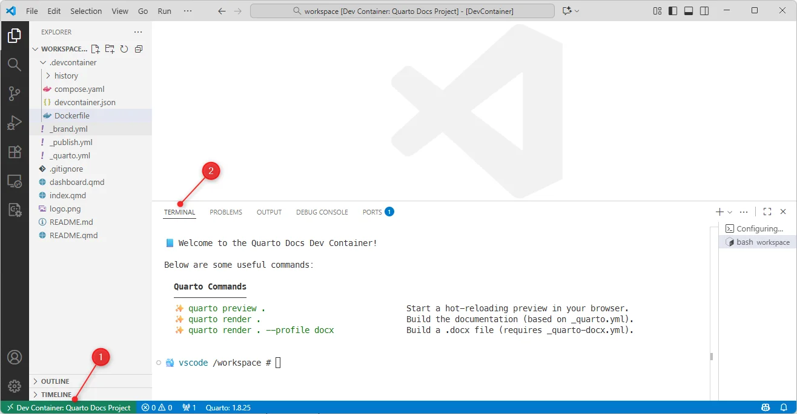
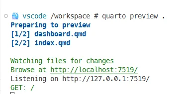
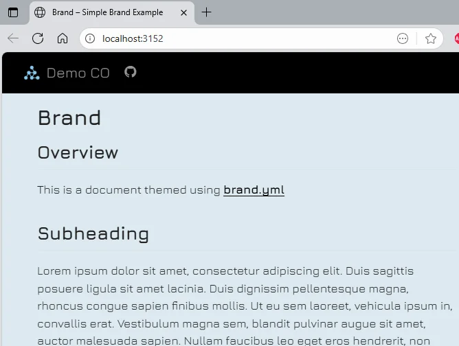
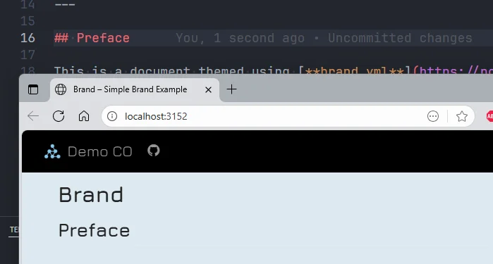
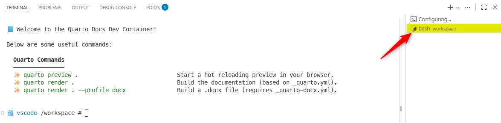

<!-- markdownlint-disable MD046 -->
<!-- cspell:ignore  -->

I love using Quarto and I've plenty of *documentation* projects on my disk. I'm writing user documentation, developer ones and, too, installation guide for almost every project I'm coding.

I quickly came up with the idea of creating a Docker image so that I could develop my documentation in peace, as well as a devcontainer configuration for VSCode.  Now, when I want to write my documentation, in less than a minute, I can create an environment entirely dedicated to writing documentation.

Among other things, I install Quarto, install and configure a number of extensions for VSCode, and launch Quarto in preview mode: as soon as I save a change, Quarto regenerates the documentation on its own.

Let's see how to do this; you'll see, it's so simple.

<!-- truncate -->

## Let's get a simple Quarto project first

For sure, if you've one, just jump in your project. Here, for this blog post, we'll just reuse an existing one.

By running the commands below in a console, you'll retrieve download just the `brand` folder from the `quarto-examples` project:

<Terminal wrap={true}>
$ cd /tmp
git clone --filter=blob:none --sparse https://github.com/quarto-dev/quarto-examples
cd quarto-examples
git sparse-checkout set brand
cd brand/brand-simple
</Terminal>

Run `code .` to open the project in VSCode and you'll get this:

## We'll need to create three files

To get the best performance in terms of Docker image build speed and use of the Docker cache mechanism, we will need to create three files:

The `.devcontainer/compose.yaml` file is necessary to tell VSCode to create our Docker image if it does not already exist, or to reuse it if it does. This file is therefore essential in terms of performance.

The `.devcontainer/Dockerfile` file defines our Docker image: the binaries we need, user configuration, etc.

The `.devcontainer/devcontainer.json` file is used by VSCode to understand and build our working environment.

<Snippet filename=".devcontainer/compose.yaml" source="./files/compose.yaml" />

<Snippet filename=".devcontainer/Dockerfile" source="./files/Dockerfile" />

<Snippet filename=".devcontainer/devcontainer.json" source="./files/devcontainer.json" />

<AlertBox variant="info" title="">
Strictly speaking, we don't need the `.devcontainer/compose.yaml` file but this is the only way to build the Docker image **once** and reuse it across projects.

By opening a Devcontainer, even if the `Dockerfile` is strictly the same across your documentation projects, the context will be different (**project1**, **project2**, ...) and VSCode will rebuild the image for that context. To avoid this, we need to build the image and **give it a name**; this can only be done using a `.devcontainer/compose.yaml` file.

</AlertBox>

## Extra information

### Installation of sudo

During the creation of the Docker image, we also install the `sudo` command and allow our `vscode` user to run `sudo su root` in the devcontainer without to have to fill in a password. The reason here is, sometimes, Quarto will complaints about a missing dependency (like when we are exporting to PDF and there is a missing library). To allow the developer to quickly add the dependency and do some tests without to rebuild the container again and again, `sudo` is installed.

## Build arguments

### Installation of Chromium

If you pay attention to `.devcontainer/compose.yaml` file, you'll see an argument called `INSTALL_CHROMIUM`. Depending on your project, you'll need it or not.

Indeed, under certain circumstances, when rendering your documentation to Word (i.e. by running f.i. `quarto render . --profile docx`), Quarto can ask you to install Chromium. To avoid to do this every-time, simply open the `.devcontainer/devcontainer.json` file, search for `INSTALL_CHROMIUM` and initialize it to `true`.

Note: if you change the `.devcontainer/Dockerfile` code or the `.devcontainer/devcontainer.json` file, you'll need to rebuild the container as explained here below.

<AlertBox variant="info" title="Make sure you need it">
Before installing Chromium, make sure you need it i.e. first render your documentation without and see if Quarto complaints about Chromium. This because Chromium requires a lot of dependencies and it will make your Docker image size much bigger.

</AlertBox>

### Installation of Code Spell Checker

The same way, you've a variable called `INSTALL_CSPELL`. Initialize it to `true` if you want to install the Code-spell check tool (requires Node.js).

### Installation of pre-commit-hooks

The third variable is `INSTALL_PRECOMMIT_HOOKS` and, if your documentation has his own `.git` folder, it'll be a good idea to initialize the variable to `true` so, when committing your changes, a few data quality controls / formatting tools will be applied.

## Opening our project as a Devcontainer

Right now, just press <kbd>F1</kbd> (or <kbd>CTRL</kbd>+<kbd>SHIFT</kbd>+<kbd>P</kbd>) and select **Dev Containers: Rebuild and Reopen in Container**. If you don't have that command, please make sure to install the `ms-vscode-remote.remote-containers` extension from Microsoft.

<AlertBox variant="info" title="The remote container of Microsoft">
You can install the extension from the console by running `code --install-extension ms-vscode-remote.remote-containers` or by opening this page: [Marketplace - Dev Containers](https://marketplace.visualstudio.com/items?itemName=ms-vscode-remote.remote-containers).
</AlertBox>

So, once you've fired the **Dev Containers: Rebuild and Reopen in Container** command, VSCode will close your current session and open a new one. The very first time, VSCode will have to make some initializations (like building the Docker image and downloading extensions so it'll be slower).

After a few seconds, you'll get a screen like this:

1. See bottom left, you've in the status bar the text "Dev Container: xxx" (followed by the name of our container as configured in the `devcontainer.json` file).
2. In the **Terminal window** (if you don't see it press <kbd>CTRL</kbd>+<kbd>ù</kbd>), you'll see a cheatsheet with main commands like `quarto preview .` to run the site with hot reload.

So, still in the Terminal, please type `quarto preview .` then press <kbd>Enter</kbd> as illustrated below:

In theory, your browser will be automatically fired and the site opened. If not, just follow the link by pressing <kbd>ALT</kbd> and clicking on the link.

Crazy easo no?

## What have we done?

At this stage, what have we done?  We retrieved a Quarto website project and made sure to “dockerize” it.

Let's see the `_quarto.yml` file of the project we've just cloned (you'll find more information on the official Quarto site: [Creating a website](https://quarto.org/docs/websites/)):

<Snippet filename="_quarto.yml" source="./files/_quarto.yml" />

We've added three files to the project in a special folder called `.devcontainer`. That folder will tell to VSCode that we would like to use a Docker container when working on that project. The container will be based on a custom Docker image (as coded in `.devcontainer/Dockerfile`). The image will reuse the official Quarto image.

So, without having to install Quarto on our computer, we'll be able to use all features of Quarto.

Finally, we've to *switch to the devcontainer* i.e. just after we've opened VSCode, we've to run a special command to reopen the project as a devcontainer.

That command is, the first time, **Dev Containers: Rebuild and Reopen in Container** but as soon as the custom image has been created once, we can simply use **Dev Containers: Rebuild and reopen container**.

## Writing our documentation

So far, we've already fired `quarto preview .` in a terminal. The documentation was rendered and our website is already displayed (on `http://localhost:7519` or any other port).

Let's check the hot reload feature: please edit the `index.qmd` file you'll retrieve in the root folder and change something.  For instance, change the word `Overview` to `Preface` and save.

As you can see on the image here above, I just need to make a change, save my file and wait less than one second and the website is updated automatically. Nothing to do (I don't need to refresh the page). Easy no?

## Using the terminal

Go to the **Terminal window** (if you don't see it press <kbd>CTRL</kbd>+<kbd>ù</kbd>).

Look now at the right part: there is a `Configuring...` terminal but too a `bash workspace` (the name of our project). If you don't see that one, look just above `Configuring...` and click on the `+` button.

As you can see, you'll see a few *instructions*. These instructions were coded in the final part of the `.devcontainer/Dockerfile` file. They are there just to help the first time user.

So, if your objective is to render the final documentation, you can always see *Oh yes, I simply need to run `quarto render .`*

## What's is pre-commit?

In this project, I've foresee the installation of [pre-commit](https://pre-commit.com/). This is an optional tool that will run some validation controls to your project before you'll push it to your versioning system (like Github or GitLab).

By adding `pre-commit` in the devcontainer, you'll get the privilege to never again commit files with some fault like f.i. formatting issues in your Markdown content.

If you like this idea, please create the `.pre-commit-config.yaml` file in your project's root folder (so no in the `.devcontainer` folder but his parent folder).

Just copy/paste the content below:

<Snippet filename=".pre-commit-config.yaml" source="./files/.pre-commit-config.yaml" />

Once this file is in place, when you'll fire the `git commit` command from the terminal (<kbd>CTRL</kbd>+<kbd>ù</kbd>), `git` will first run `pre-commit` to run *hooks*. In the `.pre-commit-config.yaml` file above, we've defined two hooks; the first one to make generic checks on files then the ensure there is no linting errors with .md files (just check the official repo for more info).

These hooks are fired every time you'll commit files (and just on the committed files; not the entire project).

You can, too, force to run hooks without committing by running `pre-commit run --all-files` in the console.

This command will check all files.

`pre-commit` is a valuable tool for ensuring compliance with established industry quality standards.

## Conclusion

With just three files (`.devcontainer/compose.yaml`, `.devcontainer/Dockerfile` and `.devcontainer/devcontainer.json`), we've converted a simple project to a Devcontainer where Quarto is preinstalled, extensions installed and configured and some features like the automatic preview is running.

Cool no?
