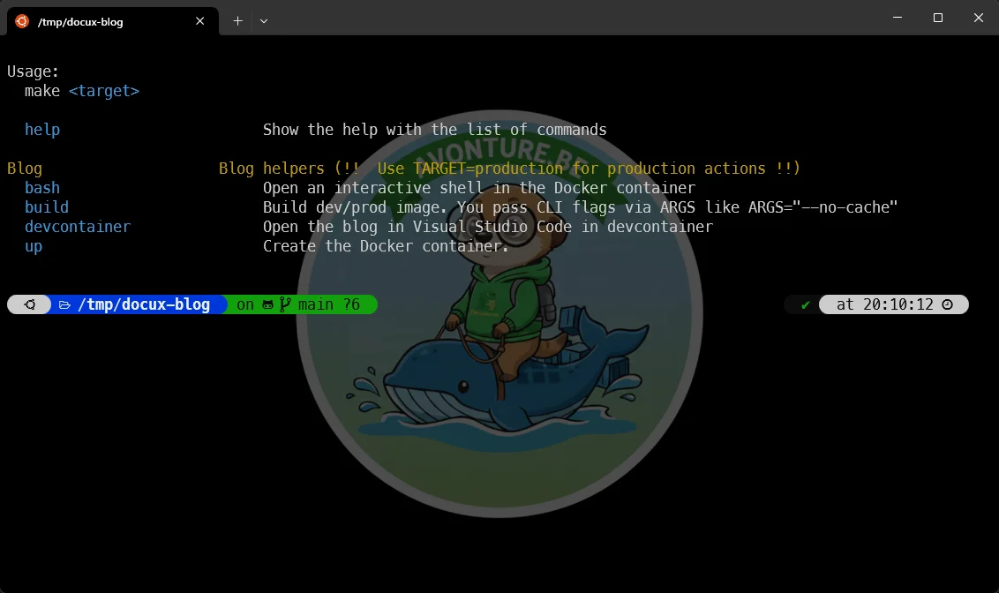
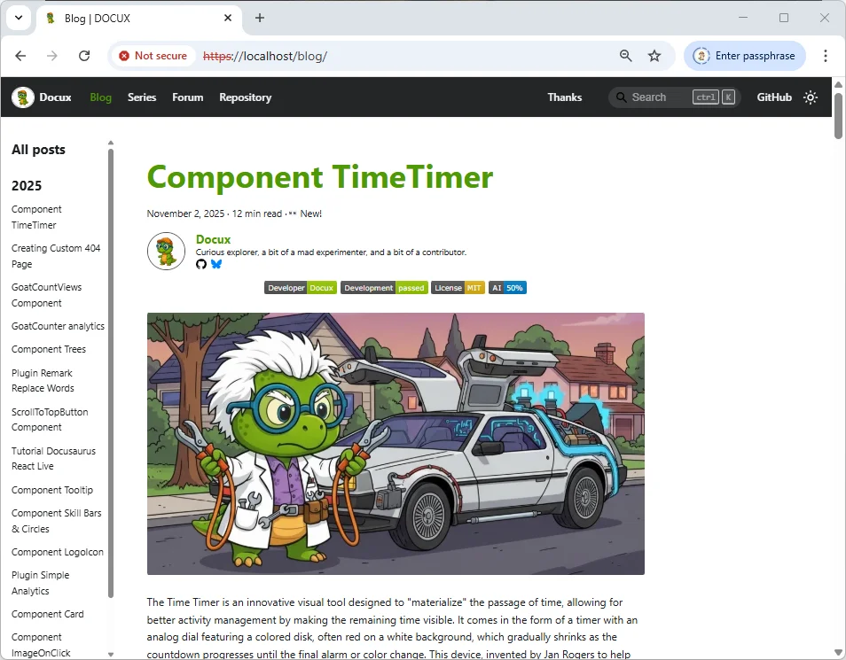
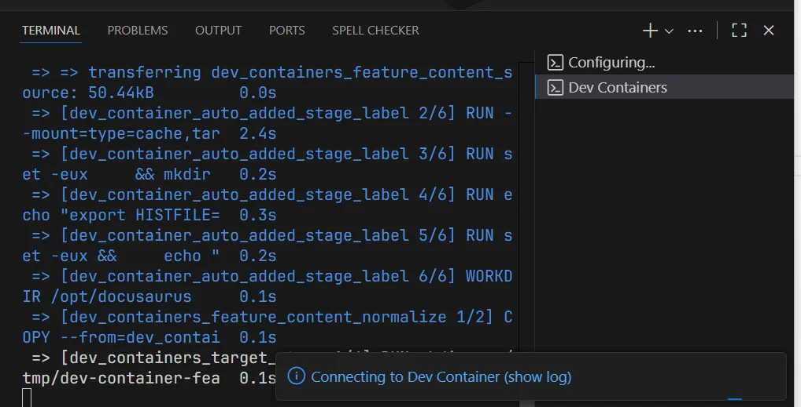
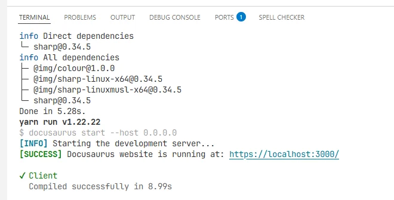
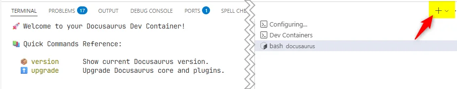

18 months ago, I've written [Encapsulate an entire Docusaurus site in a Docker image](/blog/docker-docusaurus-prod) to explain how I maintain this blog.

It's time to revisit this approach a little, since I recently worked on a more robust approach about production versus development (see [One Docker Image for Production and Devcontainers - The Clean Way](/blog/docker-prod-devcontainer)).

So from now on, I'll run `make build` just once to create my base Docker image and the only thing I've to run is `make devcontainer` to jump in my VSCode editor and *let's VSCode to create my container with everything in place*. I've just need to wait a few seconds before being able to work on my blog.

Let's see this in detail.

<!-- truncate -->

<StepsCard
  title="What we'll learn here:"
  variant="steps"
  steps={[
    "First, we'll retrieve a Docusaurus blog,",
    "Then we'll create a Docker image to run the blog",
    "And finally we'll open VSCode using the *devcontainer* feature.",
  ]}
/>

## Retrieve a Docusaurus blog

If you already have a blog, just skip this chapter.

For learning purposes, we'll use the blog of a friend, [Docux](http://docuxlab.com/).

Please run the command below to get a copy of his blog and jump in it.

<Terminal wrap={true}>
$ git clone git@github.com:Juniors017/docux-blog.git && cd docux-blog
</Terminal>

## Create the Docker base image

Now, if you're not familiar with Docusaurus comes the question: how can I just run the blog on my computer?

Let's create a self-container Docker image.

Please first open VSCode by running `code .`
<Terminal wrap={true}>
$ code .
</Terminal>

VSCode will open the current project and you'll see something like this:

### Let's create a few files

Please create the following files in the root folder of the project:

<Snippet filename=".env" source="./files/.env" />

<Snippet filename="compose.yaml" source="./files/compose.yaml" />

<Snippet filename="Dockerfile" source="./files/Dockerfile" />

<Snippet filename="localhost-key.pem" source="./files/localhost-key.pem" />

<Snippet filename="localhost.pem" source="./files/localhost.pem" />

<Snippet filename="makefile" source="./files/makefile" />

<Snippet filename="nginx.conf" source="./files/nginx.conf" />

### Running make actions

Ok, once you've copied/pasted these files, in a console, you'll be able to run `make` and you'll get a screen like this:

If you get an error, please make sure to first install `make`:

<Terminal wrap={true}>
$ sudo apt-get update && sudo apt-get install make
</Terminal>

Ok, now we've to run two commands:

<Terminal wrap={true}>
$ TARGET=production make build

...

$ TARGET=production make up

...
</Terminal>

And you know what? It's already done: just surf to `https://localhost` and be surprised, the blog is running.

<AlertBox variant="note" title="What have we done?">
By running `TARGET=production make build` we've created a standalone version of the blog running on nginx. We've encapsulated all articles from the blog (as Markdown files) and we've fired all the required commands to generate the static version of the blog. We've *parked* these files in a temporary location.

We've created the final image by using nginx and by copying static files created earlier in the image.

By running `TARGET=production make up` we've created a running instance (called `container`) of that image and we've ask our operating system to access the container on port `443` (the one of the `https` protocol). That's why, if we access to `https://localhost` we've running the website.
</AlertBox>

## Using Devcontainer

That's so great but, ok, it's the production image but right now, I want to open my blog and add a new article, edit existing ones, ... how can I do?

For sure, we can do it in any editor then run `TARGET=production make build && TARGET=production make up` every single time we want to refresh our image.

It can be a solution when you've a small blog but that's not really the way to do.

Just run `make build` (notice, we don't specify `TARGET=production` here) once. It'll be extremely fast since everything was already created before.

Now, run `make devcontainer` to open VSCode and nothing happens right now: it's normal, we need to create additional files.

### Let's create a .devcontainer folder

We'll need to create a new `.devcontainer` folder with a few files:

<Snippet filename=".devcontainer/.env" source="./files/.devcontainer/.env" />

<Snippet filename=".devcontainer/bootstrap.sh" source="./files/.devcontainer/bootstrap.sh" />

<Snippet filename=".devcontainer/bash_helpers.sh" source="./files/.devcontainer/bash_helpers.sh" />

<Snippet filename=".devcontainer/compose.yaml" source="./files/.devcontainer/compose.yaml" />

<Snippet filename=".devcontainer/devcontainer.json" source="./files/.devcontainer/devcontainer.json" />

<Snippet filename=".devcontainer/Dockerfile" source="./files/.devcontainer/Dockerfile" />

Since we've two bash scripts, we need to make them executable. Please run this command in a terminal:

<Terminal wrap={true}>
$ chmod +x .devcontainer/bootstrap.sh .devcontainer/bash_helpers.sh
</Terminal>

Once done, please press <kbd>F1</kbd> to open the **Command Palette** and run **Dev Containers: Rebuild and Reopen in Container**.

<AlertBox variant="note" title="Don't have it?">
If you don't have this command, please make sure to install the VSCode [Dev Container from Microsoft](https://marketplace.visualstudio.com/publishers/Microsoft).

</AlertBox>

Please click and thus run the **Dev Containers: Rebuild and Reopen in Container** action. If you look at the terminal (from inside VSCode), you'll get a lot of messages like the ones below:

At some point in time, you'll see this:

It means that Docusaurus is ready to serve your content.

Please surf to `https://localhost:3000` and tadaaa.

Let's play. Open the `blog` folder and create a new file called `index.md`:

Save it and, oh?, your browser will immediately reflect the change (hot reload is indeed enabled):

### Running the terminal from the devcontainer

Something really cool too is the use of the **Terminal** still inside VSCode.

In case of need, press <kbd>CTRL</kbd>+<kbd>ù</kbd> to open the Terminal and see the `+` button top right in that window. Click on the `+` to create a new one:

Did you see? You get a welcome screen with a few actions you can run. For instance, to upgrade Docusaurus to the latest version, you just need to run `upgrade` and that's all.

Could we make easier than this?

<AlertBox variant="tip" title="From where comes this welcome screen?">
See the `.devcontainer/bash_helpers.sh` file you've previously copied/pasted.

You'll in the Bash script the design of the welcome screen and also a few aliases like `version` to get the version of the installed Docusaurus instance.
</AlertBox>

## What are the advantages of such approach?

There are so numerous... Let's start with this one: on my host, I've just Docker and that's all. I don't need to install `Node` as needed by Docusaurus neither any Linux dependencies.

I can also build my blog as a standalone image. Just look at my `cavo789/blog` Docker image on [https://hub.docker.com/r/cavo789/blog](https://hub.docker.com/r/cavo789/blog). If you want to run it on your own machine, you just need to run `docker pull cavo789/blog && docker run -d -p 443:443 --name blog cavo789/blog` then surf on `https://localhost` and that's all.

Using a Devcontainer like illustrated in this article, you can also fine-tune your environment i.e. tell which extension in VSCode has to be installed and how that extension has to be configured. You can also define the look&feel of the editor (the font, size, color, template, ...).

Since everything is isolated, you can *drop* the container and recreate it without pain.

Someone has to work with you? Devcontainer is then the way-to-go since everyone will have the exact same environment.
