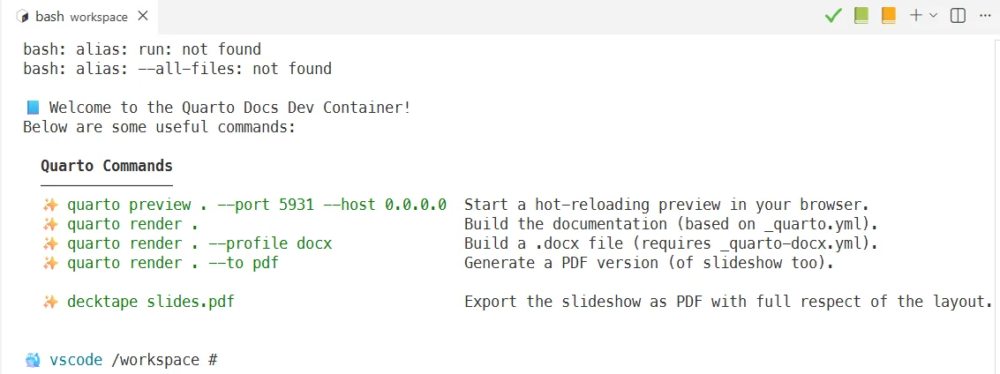
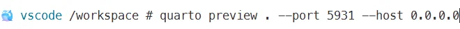

In this post, we'll explore how to write and preview Reveal.js slideshows using Quarto inside a devcontainer.

Best of all — you only need Docker. Nothing else needs to be installed locally

<!-- truncated -->

## We need a Quarto project

### You don't have one yet

As illustration for this post, please download the [demo.zip](./files/demo.zip) file.

Save the file in a new folder on your disk like `/tmp/revealjs` and unzip it. Once done, jump in the newly created folder (`cd /tmp/revealjs/demo`) and start `code .` to open the project in VSCode.

### You have one

If you already have an existing Quarto project, just jump in it and run `code .` to open the project in VSCode.

Then, add the following files to your project root:

<Snippet filename="_quarto.yml" source="./files/_quarto.yml" />

<Snippet filename=".devcontainer/compose.yaml" source="./files/.devcontainer/compose.yaml" />

<Snippet filename=".devcontainer/devcontainer.json" source="./files/.devcontainer/devcontainer.json" />

<Snippet filename=".devcontainer/Dockerfile" source="./files/.devcontainer/Dockerfile" />

<AlertBox variant="note" title="Images below will be based on my project, for sure, some will be different for you.">
</AlertBox>

## Open the Devcontainer

In VSCode, please press <kbd>F1</kbd> to open the **Command Palette** then select **Dev containers: Rebuild and Reopen in Devcontainer**. *If you don't have this command, please make sure to install the VSCode [Dev Container from Microsoft](https://marketplace.visualstudio.com/publishers/Microsoft).*

The container will build (this takes 1–2 minutes the first time).

After the build completes, VS Code displays a welcome screen like this:

By clicking on the `Connecting to Dev Container (show log)` link, you'll get more and be able to follow what is done.

After one or two minutes (this only the first time), you'll obtain a screen like this:

## Preview the slideshow

Please run `quarto preview . --port 5931 --host 0.0.0.0` to create the slideshow and open it in preview mode i.e. you'll be able to update your slideshow in VSCode and changes will be automatically reflected.

Press <kbd>Enter</kbd> to start the preview server. VS Code will ask for permission to open the site in your browser.

After confirmation, you'll get your first slide:

Now, you can navigate using <kbd>space</kbd> or any navigation keys on your keyboard.

## Export a PDF

Just run `decktape slides.pdf` in the Terminal to generate a PDF version.
