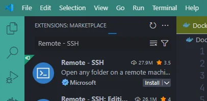
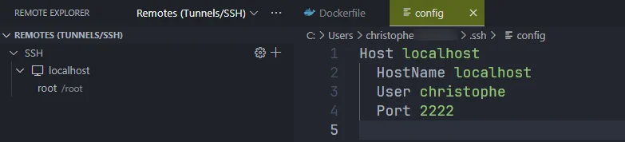
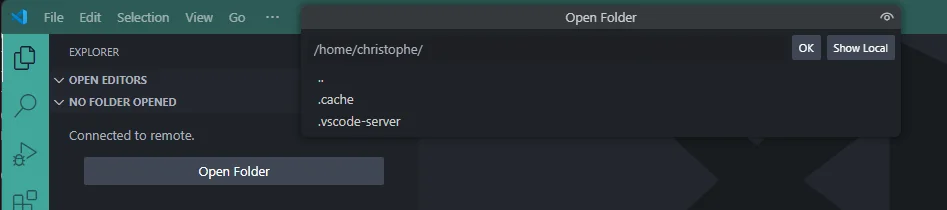
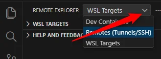

In this article, let's explore how to develop directly on the server using VS Code on my machine while editing files stored on the server, without maintaining a local copy and manual uploads.

My use case was simple: I had to run a Python script on a Linux server that could access an Oracle database, while my development environment (my computer or my Windows VM) could not reach that database due to network restrictions.

Let's dive into SSH Remote Development with VS Code...

<!-- truncate -->

In this article, I suggest to first play locally, using Docker, to see how it works. Then, we'll do the same on a real, production, server.

## To gain experience, let's use Docker on our machine

So, we'll create a Docker container that will act as a Linux server. We'll install a SSH client on it so we can connect to that server (the container) using VSCode.

Please create a temporary folder using `mkdir -p /tmp/remote-ssh && cd $_`. Once in that folder, just run `code .` to start VSCode.

### Create the Docker container that will act as our SSH server

Please create the `Dockerfile` with the content below.

<Snippet filename="Dockerfile" source="./files/Dockerfile" />

Then, we need to build our Docker image and create the container. To build it, run `docker build -t ssh-server .` then create the container with `docker run -d -p 2222:22 --name remote-dev ssh-server`.

<Terminal>
$ docker build -t ssh-server .

$ docker run -d -p 2222:22 --name remote-dev ssh-server
</Terminal>

From now on, we have a container that acts as an SSH server. The image creates a user called `christophe` with the password `p@ssword`.

#### Test our container

In your console, run `ssh christophe@localhost -p 2222` to start an SSH connection and verify the container is correctly configured.

You'll have to accept the authenticity of the host then to fill in the password. When prompted, please fill in `p@ssword` as password.

<Terminal>
$ ssh christophe@localhost -p 2222

The authenticity of host '[localhost]:2222 ([127.0.0.1]:2222)' can't be established.
ECDSA key fingerprint is SHA256:/XRLXCojjc9ykoYiuM0aEhDKu5MyZuUU793NokTqxlI.
Are you sure you want to continue connecting (yes/no/[fingerprint])? yes
Warning: Permanently added '[localhost]:2222' (ECDSA) to the list of known hosts.

christophe@localhost's password:

</Terminal>

Once connected, run commands like `ls -alh`, `hostname`, or `whoami`.

<AlertBox variant="info" title="Type `exit` to quit the terminal and return to your host." />

This small test illustrates that the container is working and that we can connect to it using SSH.

### The Remote - SSH extension

Our objective is: start VSCode and edit files from the server.

To do this, we need to install the [Remote - SSH](https://marketplace.visualstudio.com/items?itemName=ms-vscode-remote.remote-ssh) extension from Microsoft.

Once installed, you'll see a new button on the left called *Remote Explorer*. Click it and, in the new pane, select the `Remote Explorer` dropdown and choose `Remotes (Tunnels/SSH)` (if you don't see it, confirm the extension is installed).

Click on the `+` button to create a new connection:

You're prompted to type the SSH connection string you'll use.

In our example, it'll be `christophe@localhost -p 2222` because:

* The user defined in our `Dockerfile` is called `christophe`,
* Our server is our `localhost` (since it's a Docker container running on our machine) and
* The port number to use is `2222` (the one we've specified in the `docker run` command)

VSCode will then ask which SSH configuration file you want to update.

<AlertBox variant="important" title="Are you on WSL?">
Since I'm working on WSL2, VS Code (running on Windows) does not read my Linux `~/.ssh/config` file. I copied the relevant configuration lines to my Windows `C:\Users\Christophe\.ssh\config` file and copied my SSH keys (public and private) so VS Code can use them.

If you're on Linux, the file to select is `~/.ssh/config`.
</AlertBox>

VS Code will create or update the file and show something like this:

Now, if you click on the **SSH** link in the left pane, you'll see the `remote-dev` server with an arrow button to start the connection:

You'll need to specify the operating system (Linux here).

When prompted, fill in the password to use (it's `p@ssword`).

After a few seconds, you'll be able to open a folder:

Just click on OK to open the home folder of the user.

And now, we can play:

As you can see above, it's possible to create a new file called `hello.sh`, add some commands, then make the script executable and run it from the VS Code terminal.

By running `hostname` we can retrieve the name of the container; not the name of our machine.

<AlertBox variant="note" title="The hostname is the Docker container ID" />

For illustration, exit VS Code, go back to the console and run `ssh christophe@localhost -p 2222`.

We can see our `hello.sh` file:

<AlertBox variant="info" title="What have we just done?">

We created a local Docker container to simulate the ability to launch VSCode on our host and program as if we were connected directly to the server.

Instead of editing our local files, we modified those on the server.

Instead of having to connect to the server via SSH to execute a command, we were able to do so from our editor.

We use our local tools to program... remotely.

</AlertBox>

## Now, just do the same but on a real, production, server

First, we have to configure our system to be able to connect on the production server.

I've recently explain how to create a SSH connection to your hosting server (PlanetHoster in my case); please read my <Link to="/blog/connect-using-ssh-to-your-hosting-server">How to connect to your hosting server using SSH</Link> blog post.

So, if you've followed that article, you should be able to connect to your production server using SSH keys and your `~/.ssh/config` file is correctly configured i.e. you've added an alias like `planethoster` to connect to your server.

<AlertBox variant="important" title="Because I'm working on WSL2">
But, here, something important in my own situation: I'm working on WSL2 so my Linux `~/.ssh/config` file **is not used** by VSCode (running on Windows). I've to copy the configuration to my Windows `C:\Users\Christophe\.ssh\config` file (in my case, I've just opened Notepad and copy the lines I need)

I've to copy my keys (public and private one) from Linux to Windows.

Below the content of my Windows SSH configuration:

<Snippet filename="C:\Users\Christophe\.ssh\config" source="./files/windows_config" />

</AlertBox>

Back to VSCode. Please reopen VSCode and go to the *Remote Explorer* pane. Like below, make sure to click on the `Remote Explorer` dropdown and to select `Remotes (Tunnels/SSH)`.

VSCode will automatically read your `C:\Users\Christophe\.ssh\config` file and will show the list of configured SSH sessions so, in my case, I'll immediately see `planethoster`; nothing to do.

Click on the arrow button to start the connection.

When prompted, select the operating system (Linux here).

You'll also be asked to select the folder to open; just click on OK to open the home folder of the user.

And you're connected!

From now, you're connected to your production server using VSCode and the Remote - SSH extension. If you change some files, you're directly modifying those on the server. No need to upload anything anymore.

<AlertBox variant="warning" title="Work carefully on production">
You're editing files directly on a production server — mistakes can cause downtime or data loss. Prefer SSH key authentication, test changes in a staging environment, and make risky changes during maintenance windows.
</AlertBox>

## Conclusion

This article shows how, thanks to VS Code and the [Remote - SSH](https://marketplace.visualstudio.com/items?itemName=ms-vscode-remote.remote-ssh) extension, you can connect to an SSH server and edit files as if you were on the server.

Commands executed in VS Code's integrated terminal run on the remote host, just like being logged in via SSH.

At the beginning of this article I mentioned I couldn't connect to the database from my computer due to network restrictions. With the Remote - SSH extension, connecting from the editor to the server becomes possible and relatively straightforward.
