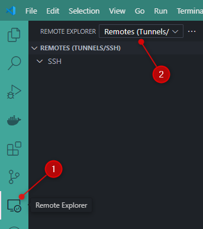

<!-- cspell:ignore ssword -->

At work, I was faced with the following situation: I had to program a complex application in Python to attack an Oracle database. The difficulty lay in network security: I couldn't access the database either from my computer or even from my virtual machine which has a fixed IP (a Windows VM), **but only from the Linux server**.

If I need to run my script, I should then jump on the server (using SSH) and run the script. And it's OK once but what should I do if I need to make changes to my code? I will need to update my code on my machine f.i., push changes to GitLab / GitHub, connect to the server using SSH, do there a git pull to, just be able to run the newer version of my code. And that over and over again. No, really, not possible.

In this article, we'll see how to start VSCode with a *SSH gateway* and therefore ask VSCode to open the filesystem of the server just like if I was on the sever. And it's not just that: from the integrated terminal of VSCode, I'll be able to run a command just like if I was on the server.

Let's deep in the SSH Remote Development using VSCode...

<!-- truncate -->

Like always, let's experiment this on our computer by using Docker. This will let us to see how it will works locally before doing this on a real, production, server.

## Play locally, on our host

So, we'll create a Docker container that will act as a Linux server. We'll install a SSH client on it so we can connect to that server (the container) using VSCode.

Please create a temporary folder using `mkdir -p /tmp/remote-ssh && cd $_`. Once in that folder, just run `code .` to start VSCode.

### Create the Docker container that will act as our SSH server

Please create the `Dockerfile` with the content below.

<Snippet filename="Dockerfile" source="./files/Dockerfile" />

This done, please create the Docker image by running `docker build -t ssh-server .` then, create the container by running `docker run -d -p 2222:22 --name remote-dev ssh-server`.

<Terminal>
$ docker build -t ssh-server .

$ docker run -d -p 2222:22 --name remote-dev ssh-server
</Terminal>

So, now, we've a container that will act as a SSH server. We've defined a user called `christophe` with `p@ssword` for his password.

#### Test our container

In your console, run `ssh christophe@localhost -p 2222` to start a SSH connection, just to make sure your container is correctly configured.

You'll have to accept the authenticity of the host then to fill in the password. When prompted, please fill in `p@ssword` as password.

<Terminal>
$ ssh christophe@localhost -p 2222

The authenticity of host '[localhost]:2222 ([127.0.0.1]:2222)' can't be established.
ECDSA key fingerprint is SHA256:/XRLXCojjc9ykoYiuM0aEhDKu5MyZuUU793NokTqxlI.
Are you sure you want to continue connecting (yes/no/[fingerprint])? yes
Warning: Permanently added '[localhost]:2222' (ECDSA) to the list of known hosts.

christophe@localhost's password:

</Terminal>

Once connected, you can do things like `ls -alh` or asking the name of the machine or the connected user name, and so on.

<Terminal>
christophe@eeb860d446a3:~$ ls -alh

total 20K
drwxr-x--- 2 christophe christophe 4.0K Dec 22 12:43 .
drwxr-xr-x 1 root       root       4.0K Dec 22 12:43 ..
-rw-r--r-- 1 christophe christophe  220 Mar 31  2024 .bash_logout
-rw-r--r-- 1 christophe christophe 3.7K Mar 31  2024 .bashrc
-rw-r--r-- 1 christophe christophe  807 Mar 31  2024 .profile

christophe@eeb860d446a3:~$ hostname
eeb860d446a3
christophe@eeb860d446a3:~$ whoami
christophe

</Terminal>

Type `exit` to quit the terminal and return to your host.

This small test has just illustrate this: our container is working fine and we can connect to it using SSH.

### The Remote - SSH extension

Our objective was to be able to start VSCode and to do "SSH Remote Dev"; let's first install the required [Remote - SSH](https://marketplace.visualstudio.com/items?itemName=ms-vscode-remote.remote-ssh) extension from Microsoft.

Once installed, you'll have a new button at the left called *Remote Explorer*. Click on it and in the new pane, make sure to click on the `Remote Explorer` dropdown and to select `Remotes (Tunnels/SSH)`.

Click on the `+` button to create a new connection:

You're prompted to type the SSH connection string you'll use.

In our example, it'll be `christophe@localhost -p 2222` because:

* The user defined in our `Dockerfile` is called `christophe`,
* Our server is our `localhost` (since it's a Docker container running on our machine) and
* The port number to use is `2222` (the one we've specified in the `docker run` command)

VSCode will then ask which SSH configuration file you want to update. Since I'm using WSL, VSCode is showing a.o.t. my `C:\Users\Christophe\.ssh\config` file; this is the one I'll select.

VSCode will create/update the file for me and will show this:

Now, if I click on the **SSH** link on my left pane, I see my `remote-dev` server. There is also a arrow button to start the connection:

I'll need to specify the operating system, it's Linux here.

When prompted, fill in the password to use (it's `p@ssword`).

After a few seconds, you'll be able to open a folder:

Just click on OK to open the home folder of the user.

And now, we can play:

As you can see here above, it's possible to create a new file called `hello.sh`, add some commands and, in the VSCode terminal, make the script executable and run it.

By running `hostname` we can retrieve the name of the container; not the name of our machine.

<AlertBox variant="note" title="The hostname is the Docker container ID" />

Just for illustration, exit VSCode, go back to the console and run `ssh christophe@localhost -p 2222`.

We can well see our `hello.sh` file:

<AlertBox variant="info" title="What have we just done?">

We created a local Docker container to simulate the ability to launch VSCode on our host and program as if we were connected directly to the server.

Instead of editing our local files, we modified those on the server.

Instead of having to connect to the server via SSH to execute a command, we were able to do so from our editor.

We use our local tools to program... remotely.

</AlertBox>

## Now, just do the same but on a real, production, server

First, we have to configure our system to be able to connect on the production server.

As an example, just read my <Link to="/blog/connect-using-ssh-to-your-hosting-server">How to connect to your hosting server using SSH</Link> blog post.

If you've followed that article, you should be able to connect to your production server using SSH keys and your `~/.ssh/config` file is correctly configured i.e. you've added an alias like `planethoster` to connect to your server.

So, now, just open VSCode, go to the *Remote Explorer* pane, click on the `+` button to add a new connection.

## Conclusion

This article illustrates how, thanks to VSCode and the [Remote - SSH](https://marketplace.visualstudio.com/items?itemName=ms-vscode-remote.remote-ssh) extension, it is possible to connect to a SSH server and edit files *as if* we were connected to the server.

Executing a command in VSCode's built-in terminal works in the same way: it's as if we were on the server.

At the beginning of this article, I mentioned that it was impossible for me to connect to a database from my computer (due to strict network security rules). Thanks to the Remote - SSH extension, this is now perfectly possible and quite easy in fact.
