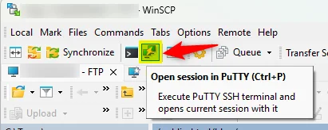
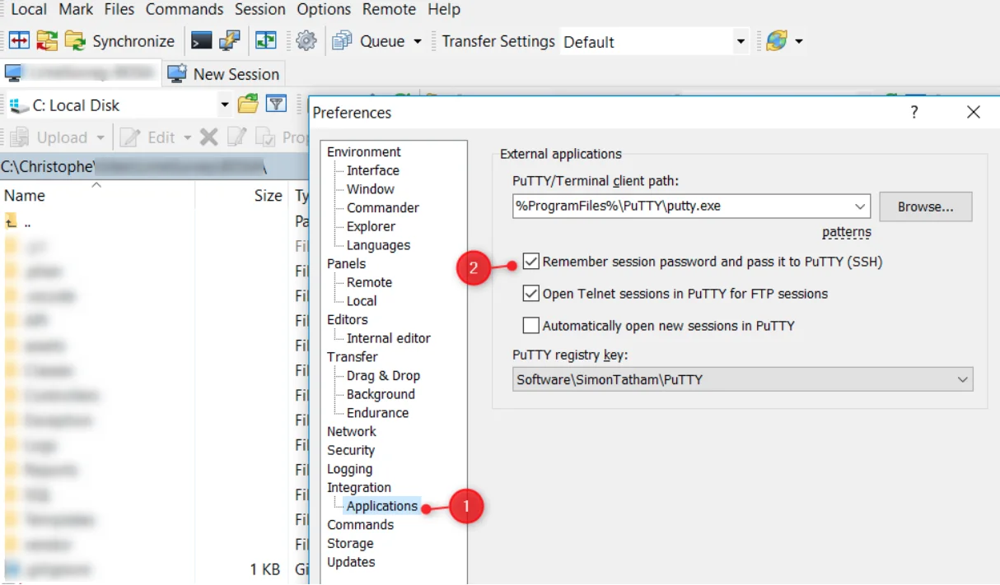
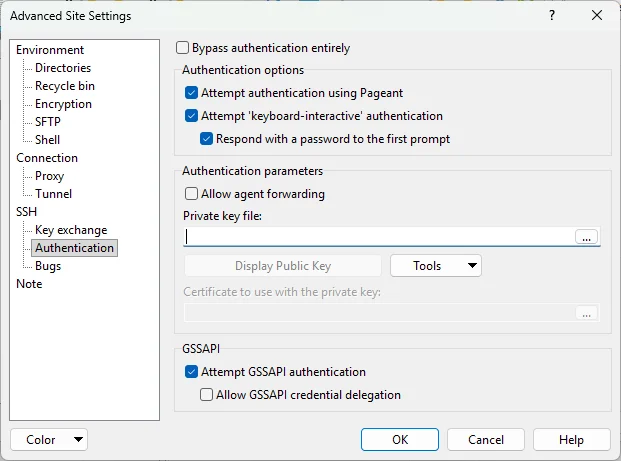

<TLDR>
WinSCP's *Open session in PuTTY* button can hand your session straight to PuTTY without asking for credentials again. Two ways to get there: check *Remember session password and pass it to PuTTY* for a two-click fix, or point the session at an SSH private key so no password is ever stored at all — the safer, recommended route.
</TLDR>

[WinSCP](https://winscp.net/) is a free tool for Windows allowing you to connect to a remote server and start to upload/download files using various protocols like SFTP, FTP, SCP, ... In short, it's an FTP client.

But not just that. Did you ever notice there is an *Open session in PuTTY* button?

This will allow you to start a remote SSH connection on your server, using the same site you've already configured in WinSCP.

The problem: by default, PuTTY asks for your username and password all over again, even though WinSCP just used them a second ago. In this article, we'll fix that two ways — a quick one and a safer one.

*Never set up SSH keys before? <Link to="/blog/linux-ssh-scp">SSH - Launch a terminal on your session without having to authenticate yourself</Link> walks through generating one from scratch.*

<!-- truncate -->

## The quick way: remember the password

Check *Remember session password and pass it to PuTTY*:

Now, starting PuTTY, you won't be prompted for credentials any more. Easy!

Reach that setting from WinSCP's `Options` menu then `Preferences`. In the left menu, click on `Applications` under `Integrations`.

<AlertBox variant="highlyImportant" title="Your password is stored, not hidden">
"Remember" means WinSCP keeps the password in its own configuration — and can be made to display it in plain text on request; see <Link to="/blog/winscp-retrieve-password">WinSCP - Retrieve a stored password</Link> for how easy that is. Only rely on this on a machine you fully control, and protect your saved sites with a WinSCP master password (`Preferences` → `Security` → *Master password*).
</AlertBox>

## The safer way: let WinSCP forward your SSH key

If your session already authenticates with an SSH key instead of a password, WinSCP will forward that key to PuTTY too — so there's no password to remember, hide, or accidentally leak in a log file.

1. In WinSCP, open your site's `Advanced Site Settings`.
2. Go to `SSH` → `Authentication`.
3. Under *Private key file*, browse to your `.ppk` key (PuTTY's own format — convert an OpenSSH key with `PuTTYgen` if needed, or generate one from scratch as shown in the linked article above).

Save the site, connect once to confirm it works, then click *Open session in PuTTY*: it starts with `-i` pointing at that same key file, so no password field ever shows up — not even a checkbox to remember.

<AlertBox variant="tip" title="Key protected by a passphrase?">
PuTTY will still ask for it once per session unless `Pageant` (PuTTY's key agent, installed alongside PuTTY) is running and already holds the key. Add it to your Windows startup folder and load your `.ppk` once at login — after that, both WinSCP and every PuTTY window it opens skip the passphrase too.
</AlertBox>

## Make sure PuTTY is installed

Make sure you've PuTTY installed first. Visit the [official](https://www.putty.org/) site and just download the Windows executable. Save the **putty.exe** executable to, f.i., **C:\Program Files (x86)\PuTTY\putty.exe** (you'll need to create the folder yourself).

<AlertBox variant="tip" title="PuTTY refusing to start after this?">
If PuTTY throws a fatal *No supported authentication methods available* error the next time you launch it, see <Link to="/blog/putty-no-supported-authentication-methods">Fatal error was starting Putty after having saved settings</Link> — a stale registry entry is almost always the cause.
</AlertBox>
