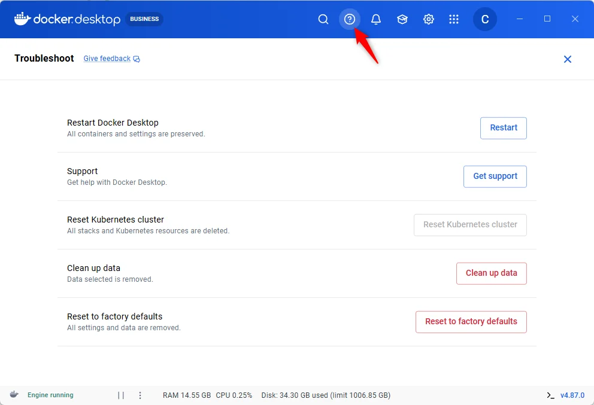
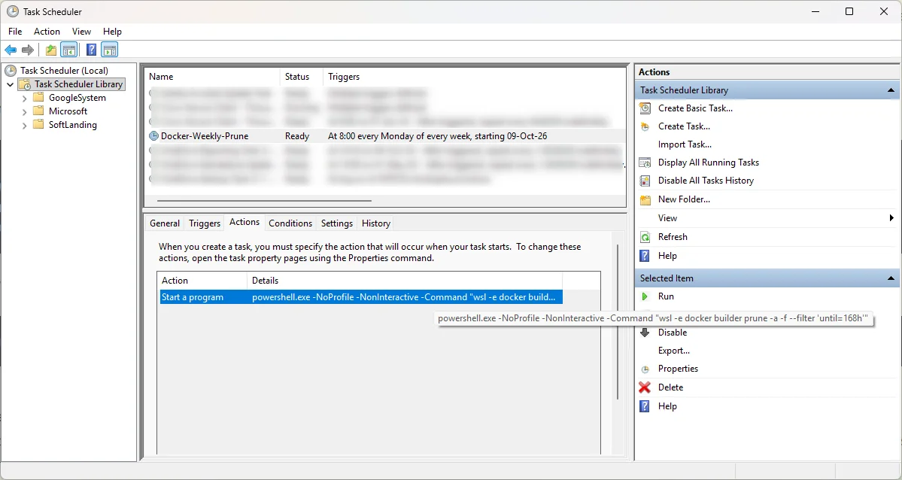

<!-- cspell:ignoreCase VHDX vhdx diskpart sparseVhd wslconfig fsutil compacted reclaimable nsenter fstrim wslexec Lxss BasePath CanonicalGroupLimited -->

<TLDR>
Docker's build cache accumulates inside WSL2's `.vhdx` virtual disk — and that disk only grows, never shrinks on its own. The fix is three steps anyone can run (prune, trim, shutdown), then one compaction step whose method depends on local admin rights. Without admin, Docker Desktop's *Reset to factory defaults* creates a fresh `.vhdx` — no IT ticket needed. With admin, `diskpart` or `Optimize-VHD` compact the existing file in place. Either way, `sparseVhd=true` and a weekly scheduled prune stop the problem from coming back.
</TLDR>

Windows is at 2 GB free. Nothing on Windows itself explains it — no large downloads, no recent installs. The culprit is a file that doesn't appear in Explorer's disk usage: `docker_data.vhdx`, the virtual disk where Docker Desktop stores everything it builds.

`docker system df` reveals the real situation:

<Terminal source="./files/df_before.txt" />

2,842 build cache entries, 180 GB, accumulated silently across months of normal Docker use.

Before doing anything, confirm how large the `.vhdx` file actually is on disk. Open PowerShell and run:

```powershell
Get-ChildItem "$env:LOCALAPPDATA\Docker\wsl\disk\" -Filter "*.vhdx" |
    Select-Object Name, FullName, @{n='SizeGB';e={[math]::Round($_.Length/1GB,2)}}
```

<Terminal source="./files/vhdx_list.txt" />

The `FullName` column gives the exact path you will need in the compaction step. `SizeGB` is the number to watch — 288 GB here, against an actual Docker content of roughly 90–110 GB.

If the `disk\` folder is empty, open Docker Desktop → the gear icon → **Resources → Advanced**: the *Disk image location* field shows the parent folder; the VHDX sits one level deeper, in the `disk` subfolder.


<!-- truncate -->

## After the Fix

Once the cache is pruned and the VHDX compacted, `docker system df` is clean:

<Terminal source="./files/df_after.txt" />

And `docker_data.vhdx`, which was 288 GB in Windows Explorer, is down to its actual content. Explorer reflects the change immediately after the compaction.

## Why Pruning Alone Is Not Enough

Four facts explain the gap between "Docker freed 180 GB" and "Windows still shows 2 GB free":

- **WSL2 stores all Docker data in a single `.vhdx` file.** Images, containers, volumes, build cache — everything lives inside `docker_data.vhdx`. Docker doesn't write to `C:\` directly.
- **The VHDX only grows.** When Docker adds data, the file gets larger. When Docker deletes data, the blocks are marked free *inside* the virtual filesystem, but the `.vhdx` file stays the same physical size.
- **`docker builder prune` frees blocks; it does not compact the disk.** After the prune, 180 GB are available inside the virtual filesystem. Windows still sees the same 288 GB file.
- **`fstrim` is the bridge.** After a prune, the blocks freed inside ext4 are not zeroed — they are just marked unallocated in the filesystem. The `.vhdx` layer has no way to know those blocks are empty until `fstrim` explicitly signals it. Without `fstrim`, the compact step finds nothing to remove and the file does not shrink.

## Step 1 — Clear the Build Cache

Run `docker system df` to confirm the Build Cache row is the main offender, then prune it:

```bash
docker builder prune -a -f
```

<Terminal source="./files/builder_prune.txt" />

The `-a` flag removes all cache entries including ones that could still accelerate a rebuild. The `-f` flag skips the confirmation prompt.

Images and volumes can also accumulate alongside the cache:

- `docker image prune -a` — removes every image not referenced by a running or stopped container.
- `docker container prune` — removes stopped containers. Safe if you use `--rm` by default.
- `docker volume prune` — removes volumes not attached to any container.

<AlertBox variant="warning" title="Volumes hold data you cannot rebuild">
Data inside a named volume cannot be reconstructed from a Dockerfile. If a volume holds a database, uploaded files, or a dev environment's persistent state, `docker volume prune` deletes it permanently. Run `docker volume ls` and confirm each volume before pruning.
</AlertBox>

Run `docker system df` again to confirm the Build Cache row reads `0B` before moving on.

## Step 2 — Tell the VHDX Which Blocks Are Free (fstrim)

Docker knows the blocks are free. The `.vhdx` does not. `fstrim` punches holes in the virtual disk, signalling which blocks are now empty so the compact step can physically remove them:

```powershell
docker run --rm --privileged --pid=host alpine nsenter -t 1 -m -- fstrim -av
```

Run this in PowerShell or Windows Terminal — **not inside WSL**. It starts a container, enters the Docker Desktop VM's root namespace, and runs `fstrim` on all mounted filesystems.

<Terminal source="./files/fstrim.txt" />

<AlertBox variant="tip" title="The trimmed numbers can exceed your disk size — that is normal">
A VHDX has a *virtual* size (what the VM sees, often 1 TB or more) and a *physical* size (the actual file on Windows, here 288 GB). `fstrim -av` scans the entire virtual space and reports discards against that logical volume. The actual space returned to Windows is revealed only after the compact step.
</AlertBox>

## Step 3 — Shut Down Docker and WSL

Save any open work in VSCode, then quit Docker Desktop from the systray (right-click → *Quit Docker Desktop*).

Wait until the Docker Desktop process is completely gone:

```powershell
Get-Process "Docker Desktop" -ErrorAction SilentlyContinue
```

Run this until it returns nothing — empty output means the process has exited. Then check WSL:

```powershell
wsl --list --running
```

If the list is not empty:

```powershell
wsl --shutdown
```

The expected output of `wsl --list --running` afterwards is `There are no running distributions.`

<AlertBox variant="danger" title="Shut down Docker Desktop before wsl --shutdown">
Docker Desktop manages several WSL distributions internally. Calling `wsl --shutdown` while Docker Desktop is still stopping leaves the WSL service in a broken state. The only fix is a full Windows reboot. Always quit Docker Desktop first and wait for `Get-Process "Docker Desktop"` to return nothing.
</AlertBox>

## Compact the VHDX — Choose Your Path

Steps 1–3 are the same for everyone. The compaction step depends on your rights on the machine.

<QuickJump
  title="Your situation"
  links={[
    { label: "I have local admin rights", to: "#compact-admin" },
    { label: "I don't have local admin rights", to: "#compact-non-admin" },
  ]}
/>

I hit this problem on my work laptop where I don't have local admin rights. My IT colleague took remote control and ran the `diskpart` sequence under the admin path. Once he disconnected, I followed the non-admin path to set up the safeguards — so it doesn't repeat.

### I Have Local Admin Rights {#compact-admin}

<AlertBox variant="danger" title="Docker Desktop and WSL must be fully stopped">
Compacting an open VHDX file corrupts it. Verify that `wsl --list --running` returns `There are no running distributions.` and that Docker Desktop is not visible in the systray before running anything below.
</AlertBox>

First check whether the Hyper-V PowerShell module is available on your machine:

```powershell
Get-Module -ListAvailable Hyper-V
```

#### Option A — Optimize-VHD (no diskpart needed)

If the command returned a module entry:

<Terminal>
Optimize-VHD -Path "%%vhdxPath=C:\Users\your-name\AppData\Local\Docker\wsl\disk\docker_data.vhdx%%" -Mode Full
</Terminal>

On some corporate machines `Optimize-VHD` still requires the Hyper-V Administrators group even when the module is present. If it errors with "Access denied", use Option B instead.

#### Option B — diskpart

Open an elevated PowerShell (right-click → *Run as administrator*), then type `diskpart` and run the four commands one at a time:

```powershell
diskpart
```

<Terminal>
select vdisk file="%%vhdxPath=C:\Users\your-name\AppData\Local\Docker\wsl\disk\docker_data.vhdx%%"
attach vdisk readonly
compact vdisk
detach vdisk
exit
</Terminal>

`attach vdisk readonly` opens the file read-only — no data is modified. The `compact` step shows a progress percentage climbing to 100%. Expect anywhere from a few minutes on a fast NVMe to over an hour on a large, slow disk.

Once the compact completes, the `.vhdx` file shrinks and Explorer reflects the reclaimed gigabytes immediately. Start Docker Desktop and everything works exactly as before.

### I Don't Have Local Admin Rights {#compact-non-admin}

Without local admin, neither `diskpart` nor `Optimize-VHD` is available directly. Both paths below start from Docker Desktop's **Troubleshoot** panel (gear icon → Troubleshoot):



If IT can spare five minutes, send your colleague the four `diskpart` commands from the [admin path above](#compact-admin) along with the exact `.vhdx` path from the diagnostic step. The sequence is safe and reversible: `attach vdisk readonly` opens the file read-only, `compact vdisk` removes the empty blocks, `detach vdisk` releases it.

Otherwise, Docker Desktop's *Reset to factory defaults* deletes `docker_data.vhdx` and creates a fresh one. With `sparseVhd=true` already set in `.wslconfig` (see the [Prevention](#prevention) section), the new file will auto-compact as Docker frees space — making this a one-time operation.

<AlertBox variant="danger" title="The factory reset deletes all local Docker data">
Images, containers, and volumes are removed. Everything pulled from a public registry rebuilds with `docker compose up`. Save named volumes holding important data before proceeding.
</AlertBox>

#### Before the reset — save what you cannot rebuild

Named volumes holding important data:

```powershell
docker volume ls
docker run --rm `
  -v <volume-name>:/data `
  -v C:\docker-backup:/backup `
  alpine tar czf /backup/<volume-name>.tar.gz -C /data .
```

Images from public registries and stopped containers do not need saving — they rebuild in minutes from their Dockerfiles. The only exception is an image created with `docker commit` (runtime changes captured without a Dockerfile); if you have one, save it with `docker save <image>:<tag> -o backup.tar` before proceeding.

#### Run the reset

Docker Desktop → the gear icon → **Troubleshoot** → **Reset to factory defaults**.

After the reset, verify the new `.vhdx` is sparse:

```powershell
fsutil sparse queryflag "$env:LOCALAPPDATA\Docker\wsl\disk\docker_data.vhdx"
```

The expected output is `This file is set as sparse`. If it still reads `NOT set as sparse`, `sparseVhd=true` is not applying to Docker Desktop's data disk on your version — Option A (periodic compaction) remains the correct approach.

#### Restore your saved data

```powershell
docker load -i "C:\docker-backup\<image>.tar"
```

```powershell
docker volume create <volume-name>
docker run --rm `
  -v <volume-name>:/data `
  -v C:\docker-backup:/backup `
  alpine tar xzf /backup/<volume-name>.tar.gz -C /data
```

Rebuild everything else with `docker compose up` in each project folder.

## Prevention {#prevention}

The fix works, but without action the `.vhdx` grows back within months. Three layers of defense, from immediate to permanent.

### 1. Enable sparseVhd

Since WSL 1.3.17 (mid-2024), Microsoft added `sparseVhd` to `.wslconfig`:

```ini
[experimental]
sparseVhd=true
```

Edit `C:\Users\<your-name>\.wslconfig` and add these two lines. A sparse VHDX automatically returns freed blocks to Windows as Docker deletes them — no manual compact needed going forward.

This setting only affects newly-created disks. If your existing `docker_data.vhdx` is not already sparse (check with `fsutil sparse queryflag`), it has no effect on it. Leave the setting in `.wslconfig` anyway: after a factory reset or a new WSL distribution, the new disk benefits from it automatically.

### 2. Daily size check in your terminal

Add this function to your `.bashrc` or `.zshrc` — it displays a one-line warning on your first terminal open of the day when the `.vhdx` exceeds 150 GB:

<Snippet filename="vhdx_warn.sh" source="./files/vhdx_warn.sh" />

The date-stamped flag file in `~/.cache/` ensures the check runs at most once per day. Adjust the `150` threshold to match your disk situation.

### 3. Weekly automatic prune via Windows Task Scheduler

Windows Task Scheduler can run `docker builder prune` automatically — a user-level task does not require admin rights. Open PowerShell as your normal user:

```powershell
$action = New-ScheduledTaskAction `
    -Execute "powershell.exe" `
    -Argument '-NoProfile -NonInteractive -Command "wsl -e docker builder prune -a -f --filter ''until=168h''"'
$trigger = New-ScheduledTaskTrigger -Weekly -DaysOfWeek Monday -At "08:00"
Register-ScheduledTask -TaskName "Docker-Weekly-Prune" -Action $action -Trigger $trigger
```

The `--filter "until=168h"` flag keeps cache entries younger than one week, preserving rebuild speed for active projects while removing everything older.

#### Verify and manage the task

Confirm the task was registered:

```powershell
Get-ScheduledTask -TaskName "Docker-Weekly-Prune"
```

Expected output: `State: Ready`. Then inspect the trigger and action:

```powershell
$task = Get-ScheduledTask -TaskName "Docker-Weekly-Prune"
$task.Triggers
$task.Actions
```

Run it immediately to test:

```powershell
Start-ScheduledTask -TaskName "Docker-Weekly-Prune"
```

Wait 10–15 seconds for WSL to start and Docker to respond, then check the result:

```powershell
Get-ScheduledTask -TaskName "Docker-Weekly-Prune" | Get-ScheduledTaskInfo |
    Select-Object LastRunTime, LastTaskResult, NextRunTime
```

`LastTaskResult: 0` means success. The value `267011` (`SCHED_S_TASK_NOT_SCHEDULED`) is the Windows default before a task has ever run — it is not an error.

<AlertBox variant="tip" title="The task may prune nothing on first run">
`--filter "until=168h"` protects everything created or used in the last 7 days. On an active machine where you build regularly, most cache entries fall within that window and the task exits cleanly without removing anything. That is the intended behaviour: it prevents long-term accumulation without breaking incremental rebuilds. `docker system df` shows the reclaimable space for images and volumes separately — those are not touched by this task.
</AlertBox>

To open the task in the graphical Task Scheduler:

```powershell
Start-Process taskschd.msc
```

Click directly on **Task Scheduler Library** in the left panel (not on one of its subfolders — the task lives at the root `\`, not inside GoogleSystem, Microsoft or any corporate subfolder). The centre panel lists all root-level tasks; find *Docker-Weekly-Prune*, right-click → *Properties* to edit the trigger or the command. The *History* tab shows every past execution and its exit code.



*Side note: if the Task Scheduler UI feels like a relic from the Windows NT era — dense, modal, nothing where you expect it — that's because it essentially is. The PowerShell cmdlets above get the job done faster.*

<AlertBox variant="tip" title="taskschd.msc blocked on your machine?">
Some corporate Group Policy configurations restrict access to the Task Scheduler UI. That restriction applies to the MMC snap-in only — it does not affect the task itself, which will still run on schedule. Use the PowerShell cmdlets below to inspect and manage it instead.
</AlertBox>

To change the retention window from 7 days to, say, 14 days:

```powershell
$action = New-ScheduledTaskAction `
    -Execute "powershell.exe" `
    -Argument '-NoProfile -NonInteractive -Command "wsl -e docker builder prune -a -f --filter ''until=336h''"'
Set-ScheduledTask -TaskName "Docker-Weekly-Prune" -Action $action
```

To remove the task entirely:

```powershell
Unregister-ScheduledTask -TaskName "Docker-Weekly-Prune" -Confirm:$false
```

<AlertBox variant="tip" title="Prune does not compact — still check size periodically">
The scheduled prune keeps the cache from accumulating, but it does not compact the `.vhdx`. With `sparseVhd=true` on a new sparse disk, the OS reclaims freed blocks automatically. Without sparse support on the existing disk, run a manual compact once every few months after any large prune.
</AlertBox>

Every Monday morning from now on, the task wakes up, connects to WSL, clears everything older than a week from the build cache, and exits — no manual action required.

Whether `fstrim` is still needed depends on one thing: run `fsutil sparse queryflag "$env:LOCALAPPDATA\Docker\wsl\disk\docker_data.vhdx"` in PowerShell.

- **`This file is set as sparse`** — Windows returns freed blocks to the drive automatically. `fstrim` is never needed again.
- **`NOT set as sparse`** — the freed space stays inside the `.vhdx` but Docker reuses it for future builds. The file does not grow further, Windows stops complaining, and that is a perfectly stable outcome. A manual compact (Steps 2–3 plus compaction) remains an option if you ever want to physically return those gigabytes to Windows, but it is no longer urgent.

## If Something Goes Wrong

### `Wsl/Service/E_UNEXPECTED` — the WSL service is stuck

This error surfaces when `wsl --shutdown` was called while Docker Desktop was still stopping. **The fix is a full Windows reboot.** No WSL command will help at this point. After the reboot, your distribution starts normally.

### Verify your VHDX files after a reboot

Check that the VHDX files are intact before starting Docker Desktop again:

```powershell
Get-ChildItem HKCU:\Software\Microsoft\Windows\CurrentVersion\Lxss |
  ForEach-Object { Get-ItemProperty $_.PSPath } |
  Select-Object DistributionName, BasePath
```

For Docker Desktop's data disk specifically:

<Terminal source="./files/cmd_check_vhdx_size.txt" />

A non-zero file size and a Docker Desktop that starts normally confirm nothing is corrupted.

## Conclusion

Docker build cache accumulates silently and Windows never reclaims the space on its own. Three steps — prune, trim, shutdown — are the same for everyone. The compaction method then depends on a single question: do you have local admin? With admin, `diskpart` or `Optimize-VHD` compact the existing file in place. Without admin, *Reset to factory defaults* in Docker Desktop creates a fresh `.vhdx` — no IT rights needed for the reset itself, only for the one-time compaction if you want to avoid the data loss. Either way, `sparseVhd=true` and a scheduled weekly prune keep the problem from returning.

For a visual overview of what is accumulating before you decide what to prune, <Link to="/blog/lazydocker">lazydocker</Link> shows every container, image and volume at a glance from a single terminal pane. The <Link to="/blog/zsh-docker-functions">ZSH Docker functions</Link> I use daily — `dex`, `dstop`, `dnuke` — make the "what is safe to prune?" question trivial: `dnuke` does a full teardown including volumes for a project you are done with, in one command. And if the disk problem is deeper than cache — the WSL distribution itself needs to move to a larger drive — <Link to="/blog/move-wsl-to-another-location">moving a WSL distribution to another location</Link> covers the export-import path.
