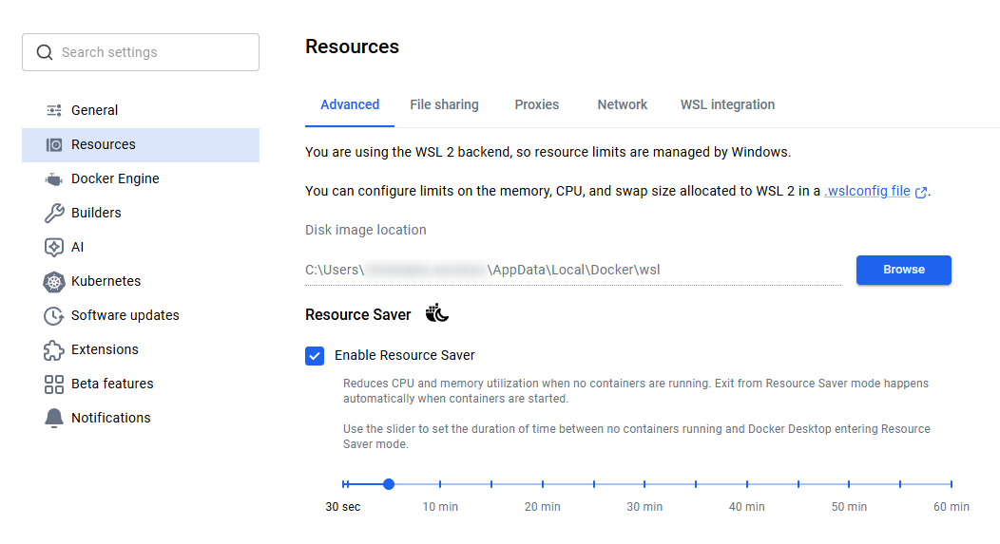

<!-- cspell:ignoreCase VHDX vhdx diskpart sparseVhd wslconfig fsutil compacted reclaimable nsenter fstrim wslexec Lxss BasePath CanonicalGroupLimited -->

<TLDR>
Docker's build cache accumulates inside WSL2's `.vhdx` virtual disk — and that disk only grows, never shrinks on its own. Three steps return the space to Windows: `docker builder prune -a -f` to clear the cache, `fstrim` to punch the freed blocks as empty, and `diskpart compact` (or `Optimize-VHD`) to physically shrink the `.vhdx` file. The `sparseVhd=true` option in `.wslconfig` only helps newly-created disks and has no effect on the existing one.
</TLDR>

Windows is at 2 GB free. Nothing on Windows itself explains it — no large downloads, no recent installs. The culprit is a file that doesn't appear in Explorer's disk usage: `docker_data.vhdx`, the virtual disk where Docker Desktop stores everything it builds.

`docker system df` reveals the real situation:

<Terminal source="./files/df_before.txt" />

2,842 build cache entries, 180 GB, accumulated silently across months of normal Docker use. Clearing the cache in Docker takes thirty seconds. Getting Windows to see the space back takes three more steps — and that's what this article covers.

<!-- truncate -->

## After the Fix

Once the cache is pruned and the VHDX compacted, `docker system df` is clean:

<Terminal source="./files/df_after.txt" />

And `docker_data.vhdx`, which reported 288 GB on disk in Windows Explorer, is down to its actual content — roughly 90–110 GB depending on your images and volumes. Windows Explorer and Disk Cleanup both reflect the change immediately after the compaction.

## Why Pruning Alone Is Not Enough

Four facts explain the gap between "Docker freed 180 GB" and "Windows still shows 2 GB free":

- **WSL2 stores all Docker data in a single `.vhdx` file.** Images, containers, volumes, build cache — everything lives inside `docker_data.vhdx` on your Windows drive. Docker doesn't write to `C:\` directly.
- **The VHDX only grows.** When Docker adds data, the file gets larger. When Docker deletes data, the blocks are marked free *inside* the virtual filesystem, but the `.vhdx` file stays the same physical size — the freed blocks are still there, just unused.
- **`docker builder prune` frees blocks; it does not compact the disk.** After the prune, 180 GB are available inside the virtual filesystem. Windows still sees the same 288 GB file.
- **`fstrim` + compact is the two-step that closes the gap.** `fstrim` signals which blocks are now empty; the compact operation then physically removes those empty blocks from the `.vhdx`.

## Step 1 — Clear the Build Cache

### Identify the waste

```bash
docker system df
```

The **Build Cache** row is almost always the largest item. Each `docker build` run creates intermediate layers — one per `RUN`, `COPY` and `ADD` instruction. Docker keeps them all to speed up future rebuilds. Months of work across dozens of projects accumulates quickly.

### Prune it

```bash
docker builder prune -a -f
```

<Terminal source="./files/builder_prune.txt" />

The `-a` flag removes all cache entries, including ones that could still accelerate a rebuild. The `-f` flag skips the confirmation prompt. Run `docker system df` afterwards to confirm the Build Cache row reads 0B — that's the state shown in [After the Fix](#after-the-fix) above.

### Images and volumes: optional but worth checking

The build cache is usually the largest item, but images and volumes can also accumulate:

- `docker image prune -a` — removes every image not referenced by a running or stopped container. Useful after pulling many base images during a migration or experiment.
- `docker container prune` — removes stopped containers. Safe if you use `--rm` by default.
- `docker volume prune` — removes volumes not attached to any container. **Check first** with `docker volume ls`: named volumes often hold database data or persistent dev environments.

<AlertBox variant="warning" title="Volumes hold data you cannot rebuild">
Unlike cache entries and images, data inside a named volume cannot be reconstructed from a Dockerfile. If a volume holds a database, uploaded files, or a dev environment's persistent state, `docker volume prune` deletes it permanently. Run `docker volume ls` and confirm each volume before pruning.
</AlertBox>

## Step 2 — Trim the Virtual Disk

Docker knows the blocks are free. The `.vhdx` does not. `fstrim` punches holes in the virtual disk, signalling which blocks are now empty so the compact step can physically remove them:

```powershell
docker run --rm --privileged --pid=host alpine nsenter -t 1 -m -- fstrim -av
```

Run this in PowerShell or Windows Terminal — **not inside WSL**. It starts a container, enters the Docker Desktop VM's root namespace, and runs `fstrim` on all mounted filesystems.

<Terminal source="./files/fstrim.txt" />

<AlertBox variant="tip" title="The trimmed numbers can exceed your disk size — that is normal">
A VHDX is a dynamically expanding virtual disk: it has a *virtual* size (what the VM sees, often 1 TB or more) and a *physical* size (the actual file on Windows, here 288 GB). `fstrim -av` scans the entire virtual space — including regions that have never had any physical backing — and reports discards against that logical volume. The reported GiB trimmed can therefore be a multiple of your physical disk size and means nothing about how much Windows will recover. The actual space returned to Windows is revealed only after the compact step in Step 3.
</AlertBox>

Before shutting down, save any open work in VSCode, then quit Docker Desktop from the systray (right-click → *Quit Docker Desktop*). Docker Desktop uses several WSL distributions internally; if you run `wsl --shutdown` while it is still in the process of stopping, the WSL service gets into an inconsistent state and the only fix is a full Windows reboot.

Wait until the Docker Desktop process is completely gone:

```powershell
Get-Process "Docker Desktop" -ErrorAction SilentlyContinue
```

Run this until it returns nothing — empty output means the process has exited. If it keeps appearing, wait a few seconds and try again before moving on.

Check which WSL distributions are currently running:

```powershell
wsl --list --running
```

If the list is not empty, shut everything down:

```powershell
wsl --shutdown
```

Confirm the shutdown was complete before moving on:

```powershell
wsl --list --running
```

The expected output is `There are no running distributions.`

## Step 3 — Compact the VHDX

### Find your VHDX path first

<Var name="vhdxFile">docker_data.vhdx</Var> is the default name for Docker Desktop on recent versions, but it can differ if you changed the disk image location in Docker Desktop Settings → Resources → Advanced. Confirm your actual path before running anything:

```powershell
Get-ChildItem "$env:LOCALAPPDATA\Docker\wsl\disk\" -Filter "*.vhdx" |
    Select-Object Name, FullName, @{n='SizeGB';e={[math]::Round($_.Length/1GB,2)}}
```

The `FullName` column gives you your exact path. Copy it and paste it into the field below — every command in this section will update automatically:

<Vars
  vhdxPath="C:\\Users\\your-name\\AppData\\Local\\Docker\\wsl\\disk\\docker_data.vhdx"
  labels={{ vhdxPath: "Full VHDX path (paste FullName from the command above)" }}
  derive={{ vhdxFile: "basename(vhdxPath)", vhdxDir: "dirname2(vhdxPath)" }}
/>

If the `disk\` folder is empty, open Docker Desktop → the gear icon → Resources → Advanced: the *Disk image location* field shows the **parent folder** (e.g. <Var name="vhdxDir">C:\Users\your-name\AppData\Local\Docker\wsl</Var>). The VHDX is one level deeper, in the `disk` subfolder — <Var name="vhdxFile">docker_data.vhdx</Var> is its default name.

<AlertBox variant="tip" title="No built-in compact button in Docker Desktop">
Docker Desktop's Resources → Advanced page (as of version 4.87.0) shows the disk image location but offers no button to compact or reclaim space. The three-step procedure in this article is the only available path.
</AlertBox>



The `Docker\wsl` folder itself contains two subfolders — only `disk\` is relevant here:

<Terminal source="./files/docker_wsl_folders.txt" />

The `main\` folder holds the Docker Desktop VM distribution (the lightweight Linux kernel Docker Desktop runs on). Leave it untouched — the only file to compact is <Var name="vhdxFile">docker_data.vhdx</Var> inside `disk\`.

<AlertBox variant="danger" title="Docker Desktop and WSL must be fully stopped before compacting">
Compacting an open VHDX file corrupts it. Before running any command in this section, verify that `wsl --list --running` returns `There are no running distributions.` and that Docker Desktop is not visible in the systray. If either is still active, go back to Step 2.
</AlertBox>

Start by checking whether the Hyper-V PowerShell module is available on your machine — it determines which path to take:

```powershell
Get-Module -ListAvailable Hyper-V
```

### Module present — `Optimize-VHD`

If the command returned a module entry, you can compact without admin rights:

<Terminal>
Optimize-VHD -Path "%%vhdxPath=C:\Users\your-name\AppData\Local\Docker\wsl\disk\docker_data.vhdx%%" -Mode Full
</Terminal>

### Module absent — `diskpart` (requires admin)

If the command returned nothing (empty prompt, no output), the Hyper-V management module is not installed and `Optimize-VHD` will not work.

<AlertBox variant="warning" title="Empty output: the module is not installed">
You cannot install the Hyper-V management module without administrator rights. On a managed machine, contact your IT support and ask them to run the `diskpart` sequence below. The commands themselves are straightforward; the compact operation that follows takes anywhere from a few minutes to over an hour depending on the VHDX size and disk speed.
</AlertBox>

Open an elevated PowerShell (right-click → *Run as administrator*), then type `diskpart` and run the four commands one at a time:

```powershell
diskpart
```

<Terminal>
select vdisk file="%%vhdxPath=C:\Users\your-name\AppData\Local\Docker\wsl\disk\docker_data.vhdx%%"
attach vdisk readonly
compact vdisk
detach vdisk
exit
</Terminal>

The `compact` step shows a progress percentage climbing to 100%. The duration depends on the VHDX size and disk speed — expect anywhere from a few minutes on a fast NVMe to over an hour on a large, slow disk.

Once the compact completes — via either route — the `.vhdx` file shrinks on Windows and Explorer reflects the reclaimed gigabytes immediately. Start Docker Desktop again and everything works exactly as before.

## Under the Hood (skip this if the three steps worked)

### Why `sparseVhd=true` Doesn't Help the Existing Disk

Since WSL 1.3.17 (mid-2024), Microsoft added `sparseVhd` to `.wslconfig`:

```ini
[experimental]
sparseVhd=true
```

A sparse VHDX automatically returns freed blocks to Windows as Docker deletes them — no manual compact needed. You can verify whether the existing disk has this property:

<Terminal>
fsutil sparse queryflag "%%vhdxPath=C:\Users\your-name\AppData\Local\Docker\wsl\disk\docker_data.vhdx%%"
</Terminal>

If the output is `This file is NOT set as sparse`, the disk was created before the feature existed and the automatic reclaim will never trigger for it. The three-step procedure above remains the correct approach for this disk.

<AlertBox variant="tip" title="Leave sparseVhd=true in .wslconfig anyway">
It has no effect on the existing disk, but any new distribution or virtual disk created after enabling it will benefit from automatic reclaim. There is no downside to keeping it.
</AlertBox>

There is also a `wsl --manage` path to convert an existing disk to sparse, but it currently requires the `--allow-unsafe` flag precisely because the operation can corrupt data on a non-empty disk. The conservative approach — repeated compaction after each large prune — is safer and fully reversible.

### How Often Should You Run This?

There is no automatic trigger. A practical cadence: run `docker system df` before any large `docker pull` on a machine where disk space is tight, and compact after any prune that frees more than a few gigabytes. Build cache alone grows at roughly 1–5 GB per active project per week depending on how often you rebuild.

Once the `.wslconfig` `sparseVhd` option matures enough to safely convert existing disks, the whole procedure becomes unnecessary — Docker frees space, the OS reclaims it, done. Until then, this is the reliable path.

## If Something Goes Wrong

### `Wsl/Service/E_UNEXPECTED` — the WSL service is stuck

This error surfaces when `wsl --shutdown` was called while Docker Desktop was still stopping. Docker Desktop manages several WSL distributions internally, and interrupting that shutdown leaves the WSL service in a broken state where neither WSL nor Docker Desktop can restart cleanly.

**The fix is a full Windows reboot.** No WSL command will help at this point — `wsl --shutdown` blocks waiting for Docker Desktop to finish, which it cannot do. After the reboot, `wsl -d Ubuntu-24.04` (or your distribution name) will start normally.

### Verify your VHDX files after a crash

After the reboot, check that the VHDX files are still intact before starting Docker Desktop again. First, list all WSL distributions and their disk paths from the registry:

```powershell
Get-ChildItem HKCU:\Software\Microsoft\Windows\CurrentVersion\Lxss |
  ForEach-Object { Get-ItemProperty $_.PSPath } |
  Select-Object DistributionName, BasePath
```

This shows the base folder for each WSL distribution — look for the `ext4.vhdx` inside each `BasePath`. For Ubuntu-24.04 the path follows this pattern:

```powershell
Get-Item "$env:LOCALAPPDATA\Packages\CanonicalGroupLimited.Ubuntu24.04LTS_*\LocalState\ext4.vhdx" |
  Select-Object Name, @{n='SizeGB';e={[math]::Round($_.Length/1GB,2)}}
```

For Docker Desktop's data disk specifically, the path is the one identified in Step 3:

<Terminal source="./files/cmd_check_vhdx_size.txt" />

A non-zero file size and a Docker Desktop that starts normally are the two signals that nothing is corrupted. If both hold, you are back to a clean state.

## Making This the Last Time

The three-step procedure works, but without action it repeats every few months. Two paths forward, depending on how much time you want to invest once.

### Path A — Periodic maintenance (no migration)

Run `docker system df` before any large `docker pull` and compact after any prune that frees more than a few gigabytes. For a machine with `sparseVhd=true` that still shows `This file is NOT set as sparse`, this is the only option short of a full reset.

### Path B — Migrate to a sparse VHDX (one-time, automatic afterwards)

`docker_data.vhdx` is a virtual disk managed directly by Docker Desktop — not a standard WSL distribution. The only supported way to replace it with a sparse-capable file is a **Docker Desktop factory reset**, which creates a fresh VHDX. With `sparseVhd=true` already set in `.wslconfig`, the new file should benefit from automatic reclaim.

The cost: Docker Desktop loses all images, containers and volumes. Everything pulled from a public registry rebuilds with `docker compose up`. What needs saving beforehand is narrower than it looks.

#### Step 1 — Save what you cannot rebuild

Custom-built images (anything not on Docker Hub or a registry):

```powershell
docker image ls
docker save <image>:<tag> -o "C:\docker-backup\<image>.tar"
```

Named volumes holding important data (databases, uploaded files):

```powershell
docker volume ls
docker run --rm `
  -v <volume-name>:/data `
  -v C:\docker-backup:/backup `
  alpine tar czf /backup/<volume-name>.tar.gz -C /data .
```

Images pulled from public registries and stopped containers do not need saving — they rebuild in minutes.

#### Step 2 — Factory reset Docker Desktop

Docker Desktop → the gear icon → **Troubleshoot** → **Clean / Reset Docker data**. This removes all images, containers and volumes and deletes `docker_data.vhdx`.

<AlertBox variant="danger" title="This is irreversible">
The factory reset destroys all local Docker data immediately. Run Step 1 first and verify the backup files exist before clicking Reset.
</AlertBox>

After the reset, Docker Desktop creates a new `docker_data.vhdx`. Verify it is sparse before proceeding:

```powershell
fsutil sparse queryflag "$env:LOCALAPPDATA\Docker\wsl\disk\docker_data.vhdx"
```

The expected output is `This file is set as sparse`. If it still reads `NOT set as sparse`, `sparseVhd=true` is not applying to Docker Desktop's data disk on your version — Path A (periodic maintenance) remains the correct approach.

#### Step 3 — Restore your saved data

Load saved images:

```powershell
docker load -i "C:\docker-backup\<image>.tar"
```

Restore named volumes:

```powershell
docker volume create <volume-name>
docker run --rm `
  -v <volume-name>:/data `
  -v C:\docker-backup:/backup `
  alpine tar xzf /backup/<volume-name>.tar.gz -C /data
```

Rebuild everything else with `docker compose up` in each project — it re-pulls base images and rebuilds your own layers from the Dockerfiles already on your filesystem.

## Conclusion

A full Docker build environment accumulates tens of gigabytes of cache that Windows cannot see, cannot clean, and that Disk Cleanup cannot touch. Two commands fix the Docker side — `docker builder prune -a -f` and `fstrim -av` — and one more physically returns the space to the drive. The whole sequence runs in under twenty minutes on any machine, with `Optimize-VHD` as the fallback when `diskpart` is blocked by admin restrictions.

For a visual overview of what is accumulating before you decide what to prune, <Link to="/blog/lazydocker">lazydocker</Link> shows every container, image and volume at a glance from a single terminal pane. The <Link to="/blog/zsh-docker-functions">ZSH Docker functions</Link> I use daily — `dex`, `dstop`, `dnuke` — make the "what is safe to prune?" question trivial: `dnuke` does a full teardown including volumes for a project you are done with, in one command. And if the disk problem is deeper than cache — the WSL distribution itself needs to move to a larger drive — <Link to="/blog/move-wsl-to-another-location">moving a WSL distribution to another location</Link> covers the export-import path.
