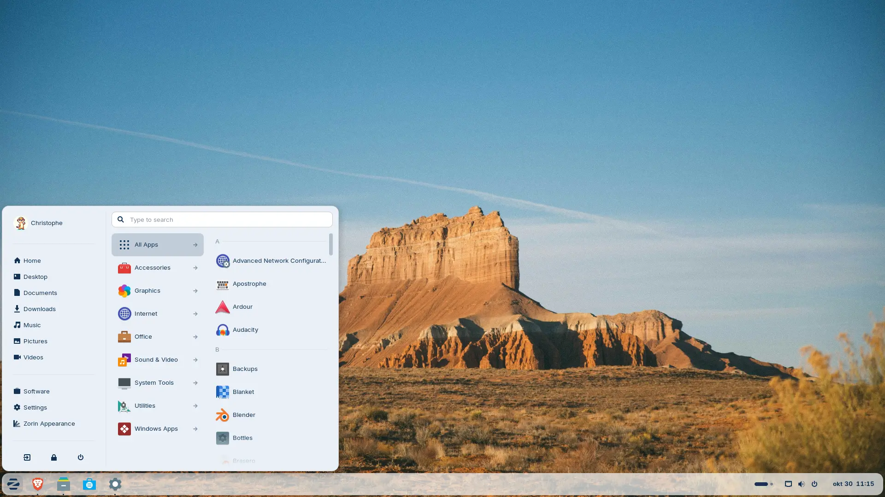

Like everyone else, I've an old computer and with Windows 10 support coming to an end, I saw so many blog posts or news articles about [Zorin 18](https://zorin.com/) that I became curious and wanted to try it out.

Zorin OS is a Linux distribution based on Ubuntu that targets users switching from Windows or macOS, with a desktop environment very similar to Windows.

<!-- truncate -->

Zorin can be [download](https://zorin.com/os/download/) for free (i.e. the Core edition or the `Education` one). If you want to support developpers or need additional features, you can download the Pro edition (less than 50€ incl. sales tax end of 2025).

You'll have to download a `.iso` file and a software called `balenaEtcher` in order to flash a USB drive. Everything is perfectly described on the [how to install Zorin OS page](https://help.zorin.com/docs/getting-started/install-zorin-os/).

Once my USB drive ready, I just put it in my old PC, start the PC, press <kbd>F12</kbd> in my case to enter in the BIOS and change the boot sequence: the PC has to start on the USB drive this time; not the hard disk.

Save and exit the BIOS and, indeed, the installation screen is now displayed. As mentioned in the how to guide, I've to select the `Try or Install Zorin OS` option and wait a few until Zorin is doing some checks.

The PC will reboot and you'll get the Zorin welcome screen. Select the language for your OS; your keyboard configuration, normal or minimal installation, ... and proceed the installation.

So far, it's no more difficult than using a Windows installer and not different too: we need to wait  until everything is installed.

Windows users will appreciate Zorin OS's graphical interface because very similar to Windows, with menus and taskbars, with a file manager.

Zorin offers direct Microsoft OneDrive integration.

You'll also be able to install some Windows application directly on Zorin thanks `WINE` (*open-source compatibility layer that allows Windows applications and games to run on Linux.*).

The installer is well done, click, click, click and reboot.

The system was immediately operational i.e. no problem at all with my graphic card and my internet connection was operational.

Zorin comes with a lot of preinstalled software like Libre-Office

<AlertBox variant="caution" title="Re-format USB flash drive">
Now that Zorin has been installed, you can reformat your USB drive to be able to reuse it... but please notice if you format it using Xorin (Linus thus) your USB stick won't work anymore under Windows.

If you already have formatted your stick using Xorin, you'll have to start the `diskpart` utility in a DOS console.

* Plug in your USB drive.
* Press <kbd>Win</kbd>+<kbd>R</kbd>, type `diskpart`, and hit <kbd>Enter</kbd>.
* In the Diskpart window, execute these commands:
  * `list disk` to show the list of disk you've,
  * `select disk X` (replace `X` with your USB’s number). Don't select disk `0`, it's your hard drive. Most probably your USB stick will be disk `1` but check more than once! before pressing <kbd>Enter</kbd>,
  * `clean` to remove everything on the stick,
  * `create partition primary` to create a primary partition,
  * `format fs=ntfs quick` to format the stick using NTFS file system,
  * `assign` to assign a drive letter to the stick
  * finally run `exit` to quick the diskpart utility.

Now, the stick will be recognize again by Windows.
</AlertBox>

To get more information about Zorin and his latest version: [Zorin OS 18 Has Arrived](https://blog.zorin.com/2025/10/14/zorin-os-18-has-arrived/).
