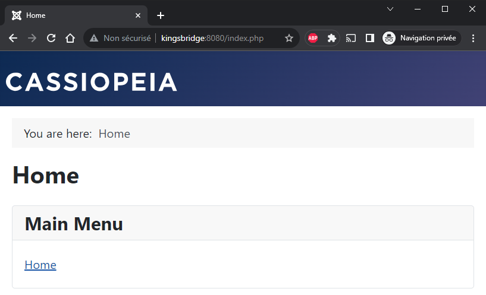
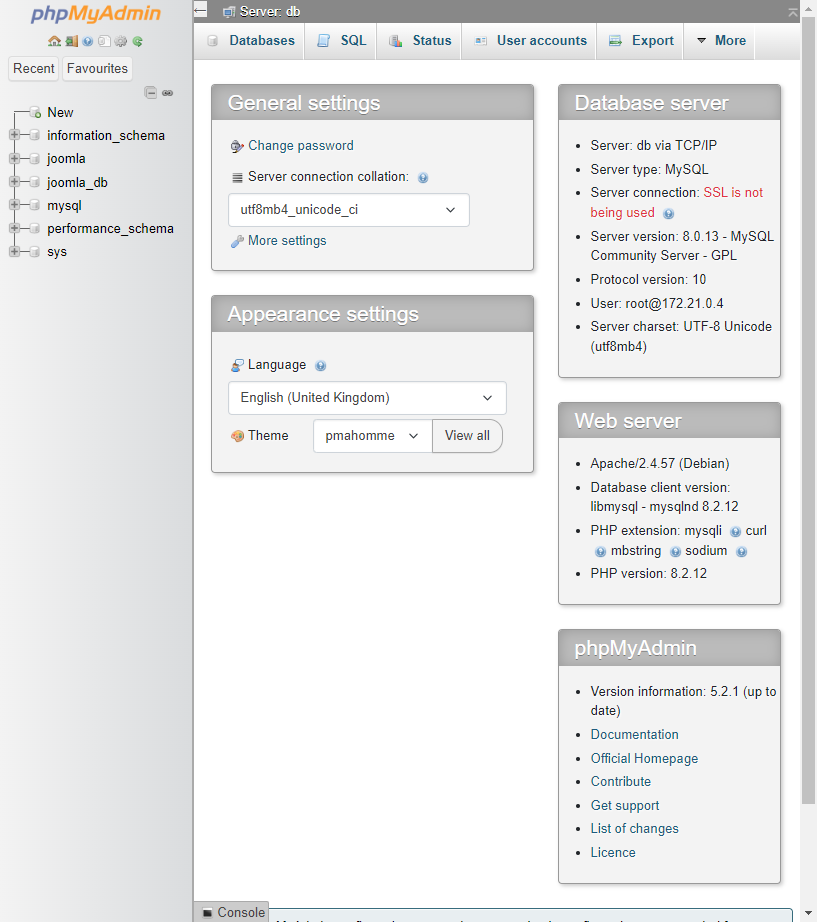

# Create your own Joomla website using Docker

In this article, we will learn how to use Docker to install Joomla and start a new website **in seconds** *(do not want to wait? jump to the [Final docker-compose.yml](#final-docker-composeyml) chapter)*.

I will use a Linux console *(I am running WSL on my Windows computer and I have chosen Ubuntu for my distribution)* but since Docker can be also used on Windows, you can perfectly run, exactly, the same commands in a MS DOS / Powershell console.

If you do not have Docker yet, please consult my "[Install Docker and play with PHP](/blog/install-docker)" article to get more information's about Docker and a quite easy introduction guide.

**We will assume in this article that you have Docker, and you are working under Linux or using WSL.**

## Before starting

As you know, to be able to run a CMS like Joomla we need three things + 1:

1. We need a webserver like **Apache** or **nginx**,
2. We need a database service like **MySQL** or **PostgreSQL** or any other supported databases and
3. We need **PHP**.

And, of course, we need **Joomla**.

In term of Docker: we need three services. 

## Docker compose

When you need more than one service (Apache should be able to communicate with PHP and PHP should be able to request data from MySQL), you need to configure a special file called `docker-compose.yml`. That file should be placed in the root of the project and will defines the list of services required and how they will collaborate together.

You will find an example of the `docker-compose.yml` file on the Joomla image description page: [https://hub.docker.com/_/joomla](https://hub.docker.com/_/joomla) *search for `docker-compose` on this page.*

:::info The Docker Joomla image is built on PHP and Apache
It is for sure too technical right now but if you click on the 
[https://github.com/joomla-docker/docker-joomla/blob/8cac4ff7ae88b9274870a95f5e22ea3c32f01fd7/5.0/php8.1/apache/Dockerfile#L8](https://github.com/joomla-docker/docker-joomla/blob/8cac4ff7ae88b9274870a95f5e22ea3c32f01fd7/5.0/php8.1/apache/Dockerfile#L8) link, you can see that the Docker image for Joomla 5.0.0 is built on a `php:8.1-apache` image. This means that using this image, you will get PHP, Apache and Joomla, altogether in a single image.
:::

## Download images

Please create on your disk, let us say in the `/tmp/joomla` folder a file called `docker-compose.yml` with this content (you can retrieve that file on [https://hub.docker.com/_/joomla](https://hub.docker.com/_/joomla)):

```yaml
version: '3.8'

services:
  joomla:
    image: joomla
    restart: always
    links:
      - joomladb:mysql
    ports:
      - 8080:80
    environment:
      JOOMLA_DB_HOST: joomladb
      JOOMLA_DB_PASSWORD: example

  joomladb:
    image: mysql:8.0.13
    restart: always
    environment:
      MYSQL_ROOT_PASSWORD: example
```

To make things as clear as possible, here is my temporary folder content:

```bash
❯ pwd
/tmp/joomla

❯ ls -alh
Permissions Size User       Group      Date Modified    Name
drwxr-xr-x     - christophe christophe 2023-11-04 09:32  .
drwxrwxrwt     - christophe christophe 2023-11-04 09:32 ..
.rw-r--r--   325 christophe christophe 2023-11-04 09:32 docker-compose.yml
```

So, I just have one file, and this is our newly, created, `docker-compose.yml` file.

Now, if needed, please start a Linux console, and go to your joomla folder (i.e., `cd /tmp/joomla`). From there, run the command below:

```bash
docker compose up --detach
```

:::tip `docker compose up --detach`
That command is one of the most important to know. It ask Docker to proceed the `docker-compose.yml` file and run services. **In short: run your website and make it up and running**.
:::

Docker will start downloading `joomla` and `joomladb`, the two services mentioned in the `docker-compose.yml` file. 

```yaml
services:
// highlight-next-line
  joomla:
    [...]
// highlight-next-line
  joomladb:
    [...]
```

You will obtain something like this, please wait until everything is downloaded.

```bash
❯ docker compose up --detach
[+] Running 16/35
 ⠹ joomladb 12 layers [⠀⠀⠀⠀⠀⠀⠀⠀⠀⠀⠀⠀]    0B/0B  Pulling  19.3s
   ⠧ 177e7ef0df69 Waiting   15.8s
   ⠧ cac25352c4c8 Waiting   15.8s
   ⠧ 8585afabb40a Waiting   15.8s
   [...]
 ⠹ joomla 21 layers [⣿⣿⣦⣿⣿⣿⣿⣿⣿⣿⣿⣿⣿⣦⣿⣿⣿⣿⣀⠀⠀] 94.59MB/155.9MB Pulling  19.3s
   ✔ 578acb154839 Pull complete  11.3s
   ✔ c053f6f43c12 Pull complete  11.9s
   ⠋ 65cebbf4d847 Downloading [==============>         ]  68.41MB/104.4MB  16.1s
   ✔ 34045bc93960 Download complete  1.0s
   [...]
```

At the end, once downloaded, the console will show something like this:

```bash
❯ docker compose up --detach
[+] Running 35/35
 ✔ joomladb 12 layers [⣿⣿⣿⣿⣿⣿⣿⣿⣿⣿⣿⣿]  0B/0B   Pulled  84.9s
   ✔ 177e7ef0df69 Pull complete  26.9s
   ✔ cac25352c4c8 Pull complete  27.5s
   ✔ 8585afabb40a Pull complete  28.2s
   [...]
 ✔ joomla 21 layers [⣿⣿⣿⣿⣿⣿⣿⣿⣿⣿⣿⣿⣿⣿⣿⣿⣿⣿⣿⣿⣿] 0B/0B  Pulled  146.4s
   ✔ 578acb154839 Pull complete   11.3s
   ✔ c053f6f43c12 Pull complete   11.9s
   ✔ 65cebbf4d847 Pull complete   31.2s
   [...]
[+] Running 3/3
 ✔ Network joomla_default       Created  0.3s
 ✔ Container joomla-joomladb-1  Started  52.9s
 ✔ Container joomla-joomla-1    Started  38.8s
```

So, the two images have been downloaded and then,

1. a `joomla_default` network is created,
2. the `joomla-joomladb-1` container is created (this is our database server) and
3. the `joomla-joomla-1` container is created too (this is our Joomla service).

### Why joomla-joomlaxxx names?

We did not give our project a name, we just created a `docker-compose.yml` file in our `/tmp/joomla` folder. So, Docker has named our project using the folder name (`joomla`) concatenated to service name (refers to the `docker-compose.yml` file, we have two services, one called `joomladb` and one called `joomla` That is why...

Let us introduce a minor change, we will give a name to our Docker project: edit the `docker-compose.yml` file and add a line with `name: xxxx` where `xxxx` is the name of your choice; for instance:

```yaml
version: '3.8'
// highlight-next-line
name: kingsbridge
services:
  [...]
```

## Docker images

If you are curious, you can run the `docker image list` command to get the list of Docker images already downloaded on your machine.

```bash
❯ docker image list
REPOSITORY   TAG       IMAGE ID       CREATED       SIZE
joomla       latest    882b2151d890   2 days ago    663MB
mysql        8.0.13    102816b1ee7d   4 years ago   486MB
```

Ok, so, Docker has downloaded Joomla (in its *latest* version) and MySQL (version 8.0.13).

:::info What about Joomla 5.0 i.e., force a specific version?
By default, when we do not specify any version number (*which is in fact not recommended*), Docker will download the version known as the `latest` one. `latest`, here, is what Docker call a *tag*. 

```yaml
version: '3.8'

services:
  joomla:
    // highlight-next-line
    image: joomla
[...]
```

To retrieve the list of all tags, please navigate to [https://hub.docker.com/_/joomla/tags](https://hub.docker.com/_/joomla/tags).

At the time of writing this article, Joomla *latest* correspond to Joomla version 4.4.0. So, what about to force to use Joomla 5.0. By surfing on the [tags](https://hub.docker.com/_/joomla/tags) page, you can retrieve in the list of tags this one: *5.0.0-php8.2-apache*. So just replace `image: joomla` with `image: joomla:5.0.0-php8.2-apache` in `docker-compose.yml` and it is done. You are forcing a specific version.

```yaml
version: '3.8'

services:
  joomla:
    // highlight-next-line
    image: joomla:5.0.0-php8.2-apache
[...]
```
:::

## Docker containers

We are almost done. Please run `docker container list` to get the list of containers created by Docker:

```bash
❯ docker container list
CONTAINER ID   IMAGE          COMMAND                  CREATED          STATUS          PORTS                    NAMES
0798f8f25d2b   joomla         "/entrypoint.sh apac…"   8 minutes ago    Up 5 minutes    0.0.0.0:8080->80/tcp     kingsbridge-joomla-1
7b7fcd3809b0   mysql:8.0.13   "docker-entrypoint.s…"   8 minutes ago    Up 7 minutes    3306/tcp, 33060/tcp      kingsbridge-joomladb-1
```

We have two running containers (our two services). Pay attention to the `PORTS` column: our `joomla` container is listening on the port `8080` and our `mysql` container is listening on port `3306`.

Hey, port `8080`, does that mean anything to you? That is a port for a web page, isn't it? 

Let us try by starting your favorite browser and navigating to `http://localhost:8080` and... Wow!


:::info Just incredible; no?
Wow, doesn't that sound crazy? With a single command (`docker compose up --detach`), you have downloaded everything you need to get Joomla running on your machine.
:::

Let us rewind for a few seconds: to run Joomla, we knew we needed three things + 1; a webserver, a database server, PHP and, of course, we need Joomla. **And here, just by running one command, hop, all the magic happens.** And nothing to configure too!

## Install Joomla

Back to `http://localhost:8080` and we will continue the installation.

On the first screen, just select your preferred language and the enter a name for your Joomla site:


When Joomla will ask for your admin credentials, just fill in the value of your choice:


But, for the database configuration, here you need to be strict:

* The database type should be `MySQLi` (since we are using MySQL),
* The name of the host should be `joomladb` (the name we have chosen for the database service),
* The username should be `root` (default value) and
* The password for that user should be `example`

:::important Why these values?
These values can be retrieved inside the `docker-compose.yml` file. If you have named your database service something other than `joomladb`, then please use the name you have chosen.
:::


```yaml
version: '3.8'

services:
  [...]
  // highlight-next-line
  joomladb:
    [...]
    environment:
      // highlight-next-line
      MYSQL_ROOT_PASSWORD: example
```


And, after a few seconds, tadaaa...


The administrator page:


And the administrator dashboard:


Congratulations, you have successfully installed a fresh Joomla website using Docker!

## Everything is done in RAM

Let us leave a few minutes the browser and go back to our Linux console.

In the previous chapter we have installed Joomla so we should have Joomla on our computer, right?

Let us verify:

```bash
❯ pwd
/tmp/joomla

❯ ls -alh
Permissions Size User       Group      Date Modified    Name
drwxr-xr-x     - christophe christophe 2023-11-04 09:32  .
drwxrwxrwt     - christophe christophe 2023-11-04 09:32 ..
.rw-r--r--   325 christophe christophe 2023-11-04 09:32 docker-compose.yml
```

Oh? Nothing... **Nothing has been downloaded in our folder.** We do not have Joomla on our computer. How is this possible?

We will discuss this later but yes, by default with Docker, everything happens in memory, nothing on disk. If you cannot wait, please read my "[Share data between your running Docker container and your computer](/blog/docker-volume)" article to better understand why and how.

## Play with containers

Still on our console, type again `docker container list`:

```bash
❯ docker container list
CONTAINER ID   IMAGE          COMMAND                  CREATED          STATUS          PORTS                    NAMES
0798f8f25d2b   joomla         "/entrypoint.sh apac…"   8 minutes ago    Up 5 minutes    0.0.0.0:8080->80/tcp     kingsbridge-joomla-1
7b7fcd3809b0   mysql:8.0.13   "docker-entrypoint.s…"   8 minutes ago    Up 7 minutes    3306/tcp, 33060/tcp      kingsbridge-joomladb-1
```

Pay attention this time to the last column, called `NAMES`.

We have thus two containers, one named `kingsbridge-joomla-1` and one name `kingsbridge-joomladb-1`.

We will stop them by running `docker compose down`:

```bash
❯ docker compose down
[+] Running 3/3
 ✔ Container kingsbridge-joomla-1    Removed 2.6s
 ✔ Container kingsbridge-joomladb-1  Removed 4.2s
 ✔ Network kingsbridge_default       Removed
```

If you go back to `http://localhost:8080` with your browser and refresh the page; the site did not exist anymore.

Run `docker compose up --detach` again, surf to the site again, refresh the page and the site is, oh? not yet responding. Wait a few... a few more... and after a certain period, the site will be there. Why?

Docker must (re)start two services, the Joomla one and the database server. Initialization of both services may take a few seconds, and the database service must be up and running so that Joomla can continue its own initialization.

You can see this by running `docker compose logs --follow` (press <kbd>CTRL</kbd>+<kbd>C</kbd> to quit).

Once Joomla will be ready, you will get the installation wizard of Joomla... just like the first time. So, by running `docker compose down` you have lost everything.

:::danger
As mentioned earlier, everything is done in RAM. By stopping a Docker container, you will lose everything not saved on your computer. It is great for playing/learning but not what you expect when you are developing a real site. 
:::

## Synchronize with your computer

We will now require that Docker store files/folders on your computer.

We wish two things:

1. We want the entire website to be saved on our hard disk and
2. the same for the database.

To do this, please edit the `docker-compose.yml` file and add the highlighted lines below:

```yaml
version: '3.8'

services:
  joomla:
    image: joomla
    restart: always
    links:
      - joomladb:mysql
    ports:
      - 8080:80
    environment:
      JOOMLA_DB_HOST: joomladb
      JOOMLA_DB_PASSWORD: example
    // highlight-next-line
    user: 1000:1000
    // highlight-next-line
    volumes:
    // highlight-next-line
      - ./site_joomla:/var/www/html

  joomladb:
    image: mysql:8.0.13
    restart: always
    environment:
      MYSQL_ROOT_PASSWORD: example
    // highlight-next-line
    user: 1000:1000
    // highlight-next-line
    volumes:
    // highlight-next-line
      - ./db:/var/lib/mysql
```

The `/var/www/html` folder of the Joomla service should be synchronized with the `site_joomla` subfolder on our computer. This is for the Joomla website.

And the `/var/lib/mysql` folder of the MySQL service should be synchronized with our local `db` subfolder.

:::important
Make sure to, first, create these two directories on your computer so folder's permissions will be correct!

```bash
❯ mkdir site_joomla db
```
:::


The two lines `user: 1000:1000` are really important and inform Docker to reuse our local credentials (the one used on our computer).

:::important
If you do not do this, files and folders created by Docker will be owned by the `root` user on our computer and not by us (in my case, by the user called `christophe`).
:::

Just check our folder's content:

```bash
❯ pwd
/tmp/joomla

❯ ls -alh
Permissions Size User       Group      Date Modified    Name
drwxr-xr-x     - christophe christophe 2023-11-04 20:13  .
drwxrwxrwt     - christophe christophe 2023-11-04 20:13 ..
drwxr-xr-x     - christophe christophe 2023-11-04 20:13 db
drwxr-xr-x     - christophe christophe 2023-11-04 20:13 site_joomla
.rw-r--r--   478 christophe christophe 2023-11-04 20:13 docker-compose.yml
```

Run Docker again but first, make sure the previous containers are removed (not only stopped): `docker compose kill`.

```bash
❯ docker compose kill
[+] Killing 2/2
 ✔ Container kingsbridge-joomladb-1  Killed   2.1s
 ✔ Container kingsbridge-joomla-1    Killed   1.5s
 ```

Run `docker compose up --detach` again.

```bash
❯ docker compose up --detach
[+] Running 3/3
 ✔ Network kingsbridge_default       Created    0.3s
 ✔ Container kingsbridge-joomladb-1  Started    3.3s
 ✔ Container kingsbridge-joomla-1    Started
```

And you can, already, run `ls` again to see that, yes, our local `site_joomla` and `db` folders are populated now. This is the result of the `volumes` entry we have added in your `docker-compose.yml` file.

```bash
❯ pwd
/tmp/joomla

❯ ls -alh site_joomla
Permissions Size User       Group      Date Modified    Name
drwxr-xr-x     - christophe christophe 2023-11-04 20:20 .
drwxr-xr-x     - christophe christophe 2023-11-04 20:16 ..
drwxr-xr-x     - christophe christophe 2023-10-14 14:42 administrator
drwxr-xr-x     - christophe christophe 2023-10-14 14:42 api
drwxr-xr-x     - christophe christophe 2023-10-14 14:42 cache
drwxr-xr-x     - christophe christophe 2023-10-14 14:42 cli
drwxr-xr-x     - christophe christophe 2023-10-14 14:42 components
drwxr-xr-x     - christophe christophe 2023-10-14 14:42 images
drwxr-xr-x     - christophe christophe 2023-10-14 14:42 includes
drwxr-xr-x     - christophe christophe 2023-10-14 14:42 installation
drwxr-xr-x     - christophe christophe 2023-10-14 14:42 language
drwxr-xr-x     - christophe christophe 2023-10-14 14:42 layouts
drwxr-xr-x     - christophe christophe 2023-10-14 14:43 libraries
drwxr-xr-x     - christophe christophe 2023-10-14 14:43 media
drwxr-xr-x     - christophe christophe 2023-10-14 14:42 modules
drwxr-xr-x     - christophe christophe 2023-10-14 14:42 plugins
drwxr-xr-x     - christophe christophe 2023-10-14 14:42 templates
drwxr-xr-x     - christophe christophe 2023-10-14 14:42 tmp
.rw-r--r--  6.9k christophe christophe 2023-11-04 20:20 .htaccess
.rw-r--r--  6.9k christophe christophe 2023-10-14 14:42 htaccess.txt
.rw-r--r--  1.1k christophe christophe 2023-10-14 14:42 index.php
.rw-r--r--   18k christophe christophe 2023-10-14 14:42 LICENSE.txt
.rw-r--r--  4.9k christophe christophe 2023-10-14 14:42 README.txt
.rw-r--r--   764 christophe christophe 2023-10-14 14:42 robots.txt.dist
.rw-r--r--  3.0k christophe christophe 2023-10-14 14:42 web.config.txt

❯ ls -alh db
Permissions Size User       Group      Date Modified    Name
drwxr-x---     - christophe christophe 2023-11-04 20:20 #innodb_temp
drwxr-xr-x     - christophe christophe 2023-11-04 20:21 .
drwxr-xr-x     - christophe christophe 2023-11-04 20:16 ..
drwxr-x---     - christophe christophe 2023-11-04 20:21 mysql
drwxr-x---     - christophe christophe 2023-11-04 20:21 performance_schema
drwxr-x---     - christophe christophe 2023-11-04 20:21 sys
.rw-r-----    56 christophe christophe 2023-11-04 20:21 auto.cnf
.rw-------  1.7k christophe christophe 2023-11-04 20:21 ca-key.pem
.rw-r--r--  1.1k christophe christophe 2023-11-04 20:21 ca.pem
.rw-r--r--  1.1k christophe christophe 2023-11-04 20:21 client-cert.pem
.rw-------  1.7k christophe christophe 2023-11-04 20:21 client-key.pem
.rw-r-----   50M christophe christophe 2023-11-04 20:21 ib_logfile0
.rw-r-----   50M christophe christophe 2023-11-04 20:20 ib_logfile1
.rw-r-----   13M christophe christophe 2023-11-04 20:21 ibdata1
.rw-r-----   13M christophe christophe 2023-11-04 20:20 ibtmp1
.rw-r-----   24M christophe christophe 2023-11-04 20:21 mysql.ibd
.rw-------  1.7k christophe christophe 2023-11-04 20:21 private_key.pem
.rw-r--r--   452 christophe christophe 2023-11-04 20:21 public_key.pem
.rw-r--r--  1.1k christophe christophe 2023-11-04 20:21 server-cert.pem
.rw-------  1.7k christophe christophe 2023-11-04 20:21 server-key.pem
.rw-r-----   10M christophe christophe 2023-11-04 20:21 undo_001
.rw-r-----   10M christophe christophe 2023-11-04 20:21 undo_002
```

Back to your browser and continue the installation of Joomla like we did in the previous chapter.

When the installation wizard has finished successfully, return to your Linux console and check if you can see the `configuration.php` file now.

```bash
❯ pwd
/tmp/joomla

❯ ls site_joomla/configuration.php

Permissions Size User       Group      Date Modified    Name
.rw-r--r--  2.0k christophe christophe 2023-11-04 20:29 configuration.php

❯ head -n 10 configuration.php
<?php
class JConfig {
        public $offline = false;
        public $offline_message = 'This site is down for maintenance.<br>Please check back again soon.';
        public $display_offline_message = 1;
        public $offline_image = '';
        public $sitename = 'Kingsbridge';
        public $editor = 'tinymce';
        public $captcha = '0';
        public $list_limit = 20;
```

Yes! This time we have stored our Joomla website on our computer.

For the exercise, we can kill our containers by running `docker compose kill` and run `docker compose up --detach` again to start our containers again and, this time, we will retrieve our Joomla site as we just leave it. Nothing is lost now. 

And since files/folders are now on your computer you can do everything you want with your website like committing it on a GitHub repository f.i.

## Start a CLI command

When working with a Joomla website, sometimes you need to run some PHP command like `php joomla.php`.

To be able to do this, you will need to start an *interactive shell session* in the Joomla container.

Did you remember the name of our Joomla service? If no, just open the `docker-compose.yml` file again.

```yaml
services:
// highlight-next-line
  joomla:
    [...]
```

The name of our Joomla service is `joomla` (and `joomladb` is the name of our MySQL service).

Now we know everything we need: to run an interactive shell session in the Joomla container, just run `docker compose exec joomla /bin/sh` to *jump* into the Joomla container (*and `docker compose exec joomladb /bin/sh` for the MySQL container*). 

Let us rewind for a few seconds because it is quite complicated to understand.

On our computer, in your Linux console, if you type `pwd` to get the current folder, you will see `/tmp/joomla` because it is the directory we have used in the tutorial.

Then, we jump in the Joomla Docker container by running `docker compose exec joomla /bin/sh` and, you can see it, we do not have any longer a prompt starting with `>` but with `$` but that is not the only difference. If now, we run `pwd` again, we are no more located in our `/tmp/joomla` folder but in `/var/www/html`.

It can drive you mad but ... when entering in the Docker container, you are *no more* on your computer, you are virtually in another computer, the container. In that *computer*, the current folder is thus `/var/www/html`. By typing `exit`, you will leave the container, go back to your computer and back in the `/tmp/joomla` folder.

```bash
❯ pwd
/tmp/joomla
❯ docker compose exec joomla /bin/sh
$ pwd
/var/www/html
$ exit
❯ pwd
/tmp/joomla
```

Something else to try:

```bash
❯ php --version
command not found: php
❯ docker compose exec joomla /bin/sh
$ php --version
PHP 8.1.25 (cli) (built: Nov  1 2023 06:20:35) (NTS)
$ exit
```

So, on my computer (and probably on yours), by typing `php --version`, I got an error. That is correct. I do not have PHP on my computer. *I work every day with PHP since years and I don't have it on my machine.* 😄

Then I jump in the Joomla container and type the same command again and, yes, inside the Docker container of Joomla, yes, PHP is installed and here, it is the version 8.1.25.

## Using alias

Docker will always start your project on your localhost and on a given port like `http://127.0.0.1:8080`.

Instead of using the IP address, it would be much nicer to use an alias like `http://kingsbridge:8080`.

For this, on Windows, edit the file `c:\Windows\System32\Drivers\etc\hosts` and add the `kingsbridge` line as below illustrated:

```text
127.0.0.1 localhost
// highlight-next-line
127.0.0.1 kingsbridge
```

Save the file. Now you can surf to `http://kingsbridge:8080`



:::note
When creating an alias in the host file, some people prefer to use the `.local` suffix like in `127.0.0.1 kingsbridge.local` to make clear it is a localhost site. If you prefer this, so the URL will be `http://kingsbridge.local:8080`
:::

## Using another port

Imagine you have another project, no more the `Kingsbrige` one. Can you have more than one project running at the same time? Yes! of course.

You just need to make sure to use another, unused, port.

Consider the `Shiring` project `docker-compose.yml` file

```yaml
version: '3.8'

// highlight-next-line
name: shiring

services:
  joomla:
    image: joomla
    ports:
      // highlight-next-line
      - 8081:80

  [...]
```

We will use the port `8081` for that project and, in our host file, we will add `127.0.0.1 shiring`.

So, now and at the same time, we can access to `http://kingsbridge:8080` and to `http://shiring:8081` without conflicts since we have used a separate port number.

Kingsbrige can be a Joomla 4.4 website while Shiring will be on Joomla 5.0 without any conflict.

:::tip
Using another port is not mandatory. You can have several websites on the same port as `8080`. But, in that case, we will not be able to use these websites at the same time. You can start the first one and when trying to start the second one, Docker will say *port already in use*. This is not a problem; you can just run `docker compose stop` for the first one so free the port and start the second one.
:::

:::note
In this article, I am using port `8080` because Joomla has use it in his default `docker-compose.yml` file. You are not forced to use that one, you can perfectly use `80` and not `8080`. In my daily work, I am using ports `80`, `81`, `82`, `83`, ... varying the second figures for my projects.
:::

## Using phpmyadmin

Alongside Joomla and MySQL, it would be useful to have access to the database of our Joomla website. Can we use f.i. *phpmyadmin* or *Adminer*  or *pgadmin* (for PostgreSQL) or ... ?

The answer is, yes, of course.

For the three mentioned above, there are official Docker images. For phpmyadmin, here it is: [https://hub.docker.com/_/phpmyadmin](https://hub.docker.com/_/phpmyadmin)

To use it, just run this command: `docker run --name phpmyadmin -d --link joomladb:db --network kingsbridge_default -p 8089:80 phpmyadmin`.

We will run the phpmyadmin (aka PMA) Docker image and

* `--name phpmyadmin` allow us to give it a friendly name (optional)
* `-d` is like `--detach`: the container should stay in up and running
* `--link joomladb:db`: phpmyadmin should access to our Joomla database service. Remember the name in our `docker-compose.yml` file,
* `--network kingsbridge_default`: our database server is accessible on the `kingsbridge_default` network and
* `-p 8089:80` tells Docker that we wish to access the web interface of PMA on port `8089`

:::tip
If you have forgot the name of the network used by our containers, run `docker compose up --detach` again and you will see it. Otherwise run `docker network list` to get the list of networks.

```bash
❯ docker network list
NETWORK ID     NAME                  DRIVER    SCOPE
ddb1c1606b76   bridge                bridge    local
336cd6fec416   host                  host      local
16d351a0e393   kingsbridge_default   bridge    local
d8cdc43a7272   none                  null      local
```
:::


Did you remember your MySQL credentials? It was `root` / `example`.



## Extra information

### Final docker-compose.yml

In the introduction of this article, I have said *we will learn how to use Docker to install Joomla and start a new website **in seconds***.

This is how:

1. On your computer, create a folder for your new project (f.i. `mkdir ~/projects/my_new_project && cd ~/projects/my_new_project`)
2. In that folder, create a `docker-compose.yml` file with this content:

  ```yaml
  version: '3.8'

  name: yourprojectname

  services:
    joomla:
      image: joomla:5.0.0-php8.2-apache
      restart: always
      links:
        - joomladb:mysql
      ports:
        - 8080:80
      environment:
        JOOMLA_DB_HOST: joomladb
        JOOMLA_DB_PASSWORD: example
      user: 1000:1000
      volumes:
        - ./site_joomla:/var/www/html

    joomladb:
      image: mysql:8.0.13
      restart: always
      environment:
        MYSQL_ROOT_PASSWORD: example
      user: 1000:1000
      volumes:
        - ./db:/var/lib/mysql
  ```
3. Create our two subfolders: `mkdir db site_joomla`
4. Run `docker compose up --detach` to start Docker and create your containers
5. Wait a few seconds and your new site is up.

:::important
Make sure, for each project, to update the `name:` line and if you plan to be able to run your Joomla sites concurrently, make sure to update the port number for Joomla and chose a new one every time (can be `80`, `81`, `82` and so one).
:::

### The container will be restarted by Windows

If you shut down your computer, if one or more containers are still running, Docker will run them again on the next startup.

This means that the next time you start your computer, your website will still be accessible, and you will not have to run a single command. It is so easy!

### Working with Windows

Imagine you are in your console (f.i. run `cd /tmp/joomla` in the Linux console) and you wish to open the site with Visual Studio Code, already installed on your Windows machine.

It is easy: just run `code .` to open the current folder so your project within vscode.

Another use case, you wish to start the Windows Explorer program and navigate in your project's structure. Here too, it is possible, just run `explorer.exe .` to open it and load the current directory. See my "[Open your Linux folder in Windows Explorer](/blog/wsl-windows-explorer)" article to read more about this feature.

### Make it easy

:::note Only for Linux
This chapter only concern Linux since Windows did not support the GNU make command.
:::

In this blog article, we have seen a lot of docker commands.

By alphabetical order:

* `docker compose down`,
* `docker compose exec joomla /bin/sh`,
* `docker compose kill`,
* `docker compose logs --follow`,
* `docker compose up --detach`,
* `docker container list`,
* `docker image list`,
* `docker network list` and
* `docker run --name phpmyadmin -d --link joomladb:db --network kingsbridge_default -p 8089:80 phpmyadmin`

It is not easy to remember them all, so why not simplify things?

We will use `GNU make` for this. 

First run `which make` in your Linux console to check if `make` is installed. If so, you will get f.i. `/usr/bin/make` as result. If you got `make not found`, please run `sudo apt-get update && sudo apt-get -y install make` to install it.

This done, we will create a new file called `makefile` in our directory. We will use `code makefile` to start Visual Studio code and create the `makefile` in our directory.

```bash
❯ pwd
/tmp/joomla

❯ code makefile
```

Now copy/paste this content in your `makefile`:

```makefile
bash:
  @printf "\e[1;033m%s\e[0m\n\n" "Start an interactive shell in the Joomla Docker container; type exit to quit"
	docker compose exec joomla /bin/sh

code:
  code .

down:
  docker compose down

explorer:
  explorer.exe .

kill:
  docker compose kill

logs:
  docker compose logs --follow

up:
  docker compose up --detach

phpmyadmin:
  @printf "\e[1;033m%s\e[0m\n\n" "User is root and password is example. Please open http://127.0.0.1:8089 to open phpmyadmin."
  docker run --name phpmyadmin -d --link joomladb:db --network kingsbridge_default -p 8089:80 phpmyadmin
```

Save and close vscode.

:::danger
The indentation in makefile **SHOULD BE** made using tabs and not spaces, this is crucial. So please make sure, if your file did not work, you know what to do.
:::

Now, instead of running f.i. `docker compose up --detach` for running your Joomla site, just run `make up`. Instead of running `docker run --name phpmyadmin -d --link joomladb:db --network kingsbridge_default -p 8089:80 phpmyadmin` to start phpmyadmin, just run `make phpmyadmin`.

:::tip Use printf to echo valuable information
By typing `make phpmyadmin`, it would be nice to see, on the console, the credentials to use and a small tip like this:

```bash
❯ make phpmyadmin
User is root and password is example. Please open http://127.0.0.1:8089 to open phpmyadmin.

docker run --name phpmyadmin -d --link joomladb:db --network kingsbridge_default -p 8089:80 phpmyadmin
a0c37edd9f8c139556f1f0a6b028ec5102362f16233efbc05f56d184edfb83c9
```

To do this, just use the `printf` function like illustrated above.
:::

Please read my [Makefile - Tutorial and Tips & Tricks](https://github.com/cavo789/makefile_tips) GitHub repository if you wish to learn more about Make.

Feel free to add your own make instructions; can be multiline.