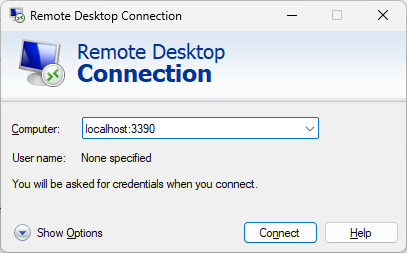
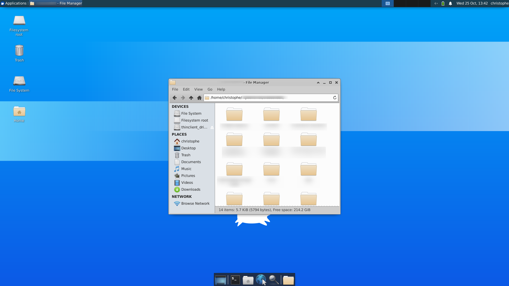
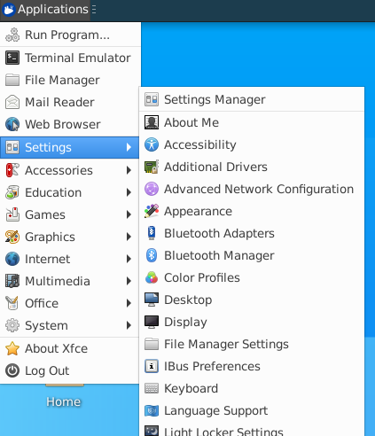
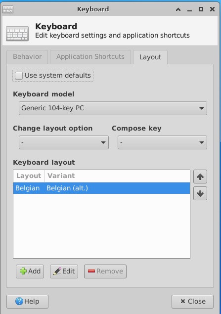

# Opening a RDP connection to the Linux local instance


> [https://www.nextofwindows.com/how-to-enable-wsl2-ubuntu-gui-and-use-rdp-to-remote](https://www.nextofwindows.com/how-to-enable-wsl2-ubuntu-gui-and-use-rdp-to-remote)
> [https://medium.com/@riley.kao/wsl2-ubuntu20-04-gui-remote-desktop-connection-rdp-2bbd21d2fa71](https://medium.com/@riley.kao/wsl2-ubuntu20-04-gui-remote-desktop-connection-rdp-2bbd21d2fa71)

When WSLg is enabled, it's possible to access to the graphical user interface of your Linux distribution (in my case, it's Ubuntu).

If you don't have `xrdp` yet, you can install it by running:

```bash
sudo apt update && sudo apt -y upgrade
sudo apt-get install -y xrdp
```

<!-- truncate -->

Also think to change the port number to `3390` by running the command below and some minor changes. *It seems to be required since, using the default 3389 port number, you will get the 'already in use' error with mstsc.*:

```bash
sudo cp /etc/xrdp/xrdp.ini /etc/xrdp/xrdp.ini.bak
sudo sed -i 's/3389/3390/g' /etc/xrdp/xrdp.ini
sudo sed -i 's/max_bpp=32/#max_bpp=32\nmax_bpp=128/g' /etc/xrdp/xrdp.ini
sudo sed -i 's/xserverbpp=24/#xserverbpp=24\nxserverbpp=128/g' /etc/xrdp/xrdp.ini
```

(see [https://www.nextofwindows.com/how-to-enable-wsl2-ubuntu-gui-and-use-rdp-to-remote](https://www.nextofwindows.com/how-to-enable-wsl2-ubuntu-gui-and-use-rdp-to-remote) for more in-depth information)

When done, run `sudo service xrdp start` to start the service. You will get the `* Starting Remote Desktop Protocol server` notification in the console.

Back to your Windows environment and start `mstsc.exe` and set the computer name to `localhost:3390` (or the port number you are using).



:::important
The connection is only possible when `xrdp` is started. So, if it didn't work, you know what to do (you can also run `sudo service xrdp status` to get detailed information's).
:::


Use your local Linux user and make a connection.



## Get the desktop environment

By default, you will just get a bash console and not the desktop as illustrated on the image here above.

If you wish the desktop and all features; please run `sudo apt-get install -y xubuntu-desktop xfce4 xfce4-goodies`. You will be prompted to make a choice between `gdm3` or `lightdm`; select the first one to get all the features.

Also run `sudo nano /etc/xrdp/startwm.sh` to edit the file.

1. Comment the two last lines:

    ```text
    # test -x /etc/X11/Xsession && exec /etc/X11/Xsession
    # exec /bin/sh /etc/X11/Xsession
    ```

2. Add these two last lines:

    ```text
    # xce4
    startxfce4
    ```

Finally enable `dBus`:

```bash
sudo systemctl enable dbus
sudo /etc/init.d/dbus start
sudo /etc/init.d/xrdp start

# check xrdp status (optional)
sudo /etc/init.d/xrdp statusgst
```

Run `sudo service xrdp restart` to restart the Remote Desktop Protocol Server and start `mstsc.exe` again. Now, you should have the full desktop.

:::tip
When you don't need RDP anymore, free some resources by running `sudo service xrdp stop` in your Linux console.
:::

### Set your keyboard

By default, the keyboard is set to `QWERTY` so go to `Applications` -> `Settings` -> `Keyboard`.



In the third tab, retrieve your own keyboard setting. If you are using the keyboard `Français - Belgique` in Windows, you should set your keyboard to `Belgian (alt.)` in Ubuntu.


