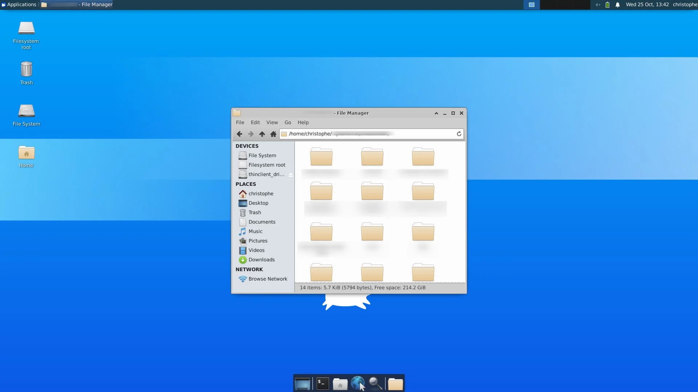
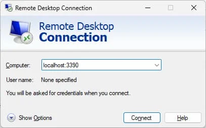
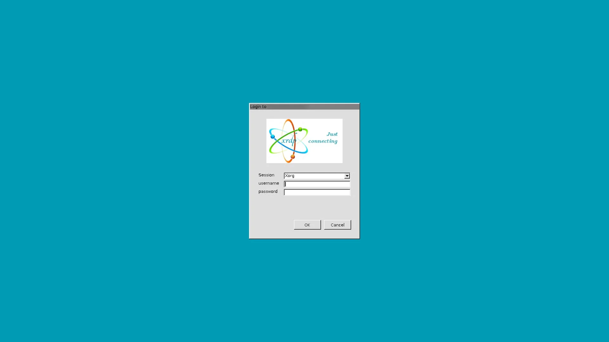
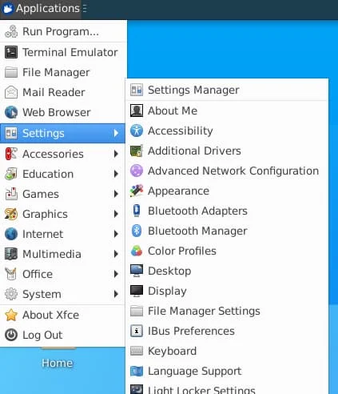
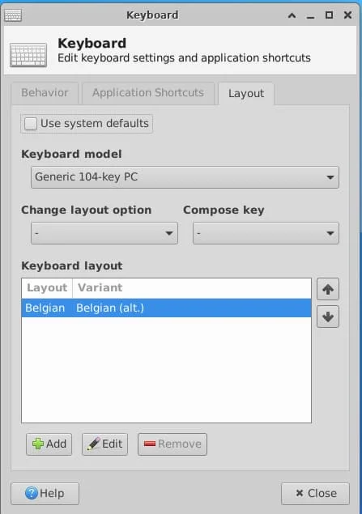

> [https://www.nextofwindows.com/how-to-enable-wsl2-ubuntu-gui-and-use-rdp-to-remote](https://www.nextofwindows.com/how-to-enable-wsl2-ubuntu-gui-and-use-rdp-to-remote)
> [https://medium.com/@riley.kao/wsl2-ubuntu20-04-gui-remote-desktop-connection-rdp-2bbd21d2fa71](https://medium.com/@riley.kao/wsl2-ubuntu20-04-gui-remote-desktop-connection-rdp-2bbd21d2fa71)

<TLDR>
This article shows how to RDP into a WSL2 Ubuntu instance: installing and starting `xrdp` (on a non-default port like 3390 to avoid conflicts), connecting from Windows via `mstsc.exe`, and installing a full Xfce desktop environment (`xubuntu-desktop`) with `startwm.sh` reconfigured to launch it, so the RDP session shows a full graphical desktop instead of just a console.
</TLDR>

When WSLg is enabled, it's possible to access the graphical user interface of your Linux distribution (in my case, it's Ubuntu).

*This gives you the **whole desktop** of your WSL instance, and not just a window here and there. The Docker equivalent, if you'd rather not touch your WSL instance, is <Link to="/blog/docker-lubuntu">starting a full lubuntu desktop in Docker</Link>.*

<!-- truncate -->

## What an RDP session into WSL actually looks like

By default, a WSL instance gives you a bash console. Here is the same instance, in a Windows RDP window, with a complete Xfce desktop:



Four commands and one configuration file below, and this is what you get.

## Get xrdp running

If you don't have `xrdp` yet, you can install it by running:

<Terminal typewriter>
$ sudo apt update && sudo apt -y upgrade
...
$ sudo apt-get install -y xrdp
...
</Terminal>

Also consider changing the port number to `3390` by running the command below and making a few minor changes. *This seems to be required because, when using the default 3389 port number, you get the 'already in use' error with mstsc.*

<Terminal typewriter source="./files/terminal-2.txt" />

(see [https://www.nextofwindows.com/how-to-enable-wsl2-ubuntu-gui-and-use-rdp-to-remote](https://www.nextofwindows.com/how-to-enable-wsl2-ubuntu-gui-and-use-rdp-to-remote) for more in-depth information)

Once done, run `sudo service xrdp start` to start the service. You will see the `* Starting Remote Desktop Protocol server` notification in the console.

## Connect from Windows

Go back to your Windows environment and start `mstsc.exe` and set the computer name to `localhost:3390` (or the port number you are using).



<AlertBox variant="caution">
The connection is only possible when `xrdp` is started. So, if it does not work, you know what to do (you can also run `sudo service xrdp status` to get detailed information).

</AlertBox>



Use your local Linux user and connect.

## Get the desktop environment

At this point, you're connected, but you will just get a bash console and not the desktop illustrated at the top of this article.

If you wish the desktop and all its features, please run `sudo apt-get install -y xubuntu-desktop xfce4 xfce4-goodies`. You will be prompted to make a choice between `gdm3` or `lightdm`; select the first one to get all features.

Also run `sudo nano /etc/xrdp/startwm.sh` to edit the file.

1. Comment out the last two lines:

    <Snippet filename="/etc/xrdp/startwm.sh">

    ```bash
    # test -x /etc/X11/Xsession && exec /etc/X11/Xsession
    # exec /bin/sh /etc/X11/Xsession
    ```

    </Snippet>

2. Add these last two lines:

    <Snippet filename="/etc/xrdp/startwm.sh">

    ```bash
    # xfce4
    startxfce4
    ```

    </Snippet>

Finally enable `dbus`:

<Terminal typewriter source="./files/terminal-1.txt" />

Run `sudo service xrdp restart` to restart the Remote Desktop Protocol Server and start `mstsc.exe` again. Now, you should have the full desktop.

<AlertBox variant="info">
When you don't need RDP anymore, free up some resources by running `sudo service xrdp stop` in your Linux console.

</AlertBox>

### Set your keyboard

By default, the keyboard is set to `QWERTY` so go to `Applications` → `Settings` → `Keyboard`.



In the third tab, find your own keyboard setting. If you are using the `Français - Belgique` on Windows, you should set your keyboard to `Belgian (alt.)` on Ubuntu.



## Conclusion

WSLg alone gives you isolated Linux windows floating on your Windows desktop; with `xrdp` and Xfce you get the entire desktop instead, taskbar and settings panel included, in a single RDP window you can minimize like any other.

If a whole desktop is more than you need: <Link to="/blog/docker-run-linux-gui">running a single graphical application from a container</Link> is lighter, and if you only want to reach your Linux files, <Link to="/blog/wsl-windows-explorer">Open your Linux folder in Windows Explorer</Link> is all it takes.
