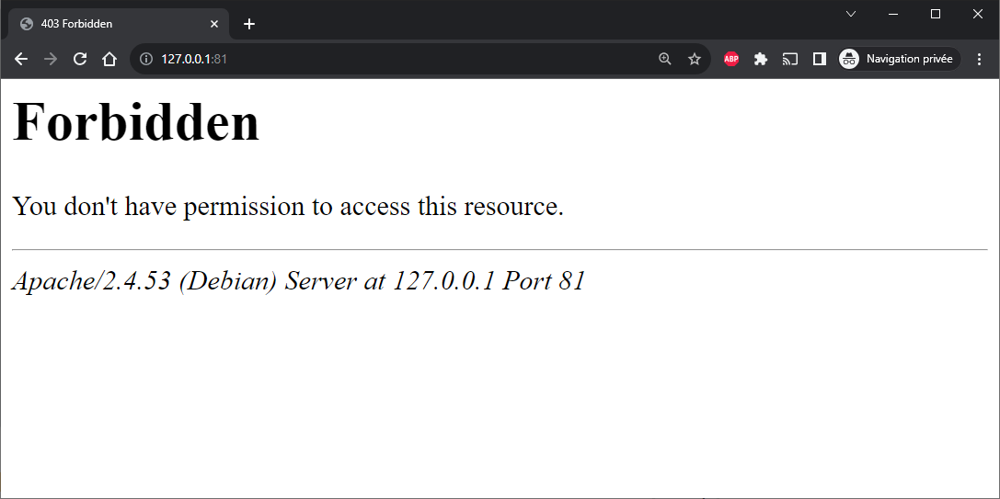
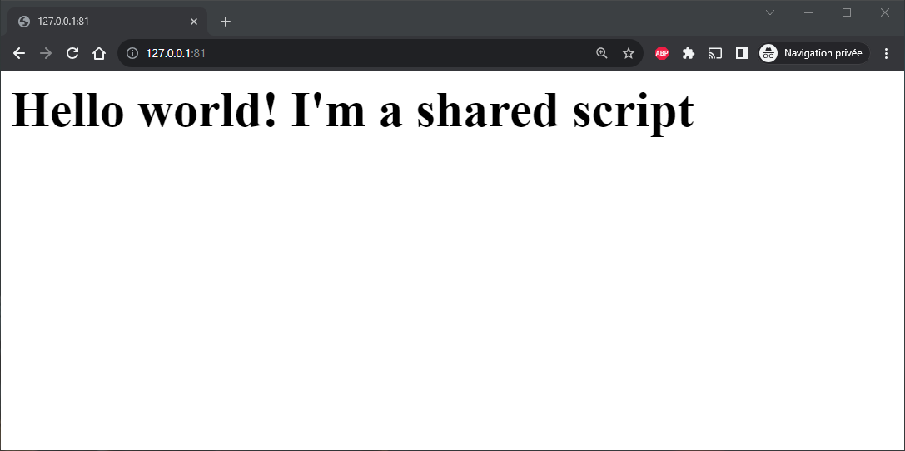

> If you don't have Docker yet, please consult my [Install Docker and play with PHP](/blog/install-docker) post first.

When running Docker without specifying a volume, everything done during the execution of Docker is done in memory. In other words: if the PHP script you run from Docker creates folders or files, these will never be created on your disk. They will be created exclusively in memory.

<!-- truncate -->

:::note
Imagine you wish to play with a malware php script. Running the script *on* your computer is really dangerous since you do not know what the virus will do; where he will create files, ... But, if you are running the virus script in a Docker container with **no attached volume** (which is the default) nothing will be modified on your computer. Everything stay in memory (RAM). By removing the Docker container, everything will be removed. Nice!
:::

For this post, let u's create a temporary folder in your `/tmp` folder: start a Linux console and run `mkdir /tmp/docker-volume && cd /tmp/docker-volume`.

Let run the command below to start the PHP 8.1.5 + Apache image:

```bash
docker run --detach --name step_1_2 -p 81:80 -v $(pwd):/var/www/html php:8.1.5-apache
```

:::info
If you're using Windows (MS DOS), replace `$(pwd)` with `%CD%` in the instruction above.
:::

The important part here is: `-v $(pwd):/var/www/html`. We are telling to Docker that the current folder (`$(pwd)` or `${PWD}` in Linux notation) will be shared with the `/var/www/html` folder of the running Docker container.

Go to `http://127.0.0.1:81/` to see if Apache is running and yes, it is.



As you probably know, Apache is displaying by default the content of the `/var/www/html` folder. And, in our Docker container, we do not have an `index.php` file in our container so ... yeah, we got the **Forbidden** page.

Explanation of the new arguments used in our `docker run --detach --name step_1_2 -p 81:80 -v $(pwd):/var/www/html php:8.1.5-apache` command

* `--name step_1_2` : for clarity, we use another name,
* `-p 81:80` : this time, we'll use port `81` on our computer and map it to port `80` on the container,
* `-v $(pwd):/var/www/html`: the `-v` instruction is used to define a volume. Here, we'll synchronize the container's `/var/www/html` folder with `$(pwd)`, which corresponds to the current folder on our computer.

Now, just create an `index.php` in your, local, `/tmp/docker-volume` folder. Yes, on your disk, not in the container.

So, if you have Visual Studio Code on your machine, in the Linux console, run this: `cd /tmp/docker-volume && code index.php`. This will start vscode and you will be able to create the script.

Write anything valid like for instance:

<Snippets filename="index.php">

```php
<?php

echo "<h1>Hello world! I'm a shared script</h1>";
```

</Snippets>

Save the file and just return to your browser. Refresh the page `http://127.0.0.1:81/`



Using the `-v` command line argument, you have synchronize a local folder with a folder inside the running Docker container. Each changes done in the local folder but also in the Docker container (**bi-directional**) will be reflected immediately.

If the running PHP script will create a new file in the `/var/www/html` folder, that file will be immediately created / updated on your disk.

:::important
Files or folders created in the Docker container will be owned by the current user used in the container; most often user `root`. These files/folders will, then, be created / updated by the `root` user too on your disk.
:::

To make sure files/folders created in the container will be owned by you and not `root`, change the command line like this:

```bash
docker run --detach --name step_1_2 -p 81:80 -v $(pwd):/var/www/html -u ${UID}:${GID} php:8.1.5-apache
```

The new flag `-u ${UID}:${GID}` will reuse your current user id and your current group id and pass these two information to Docker. Now, the current user in the Docker container won't be `root` anymore but a user having your local uid/gid. So, now, files/folders created in the Docker container will be owned, on your disk, by you.
