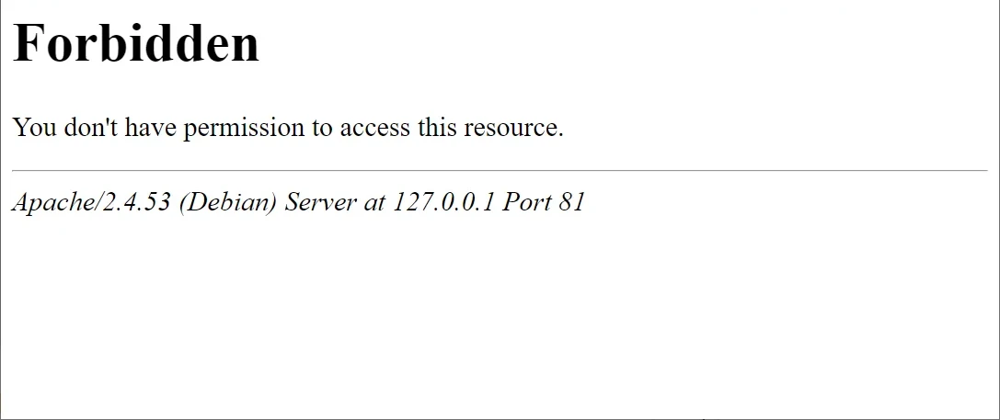

<TLDR>
This article explains Docker volumes: without `-v`, everything a container writes stays only in its own memory and disappears when the container is removed (useful for safely running untrusted scripts); adding `-v $(pwd):/var/www/html` bi-directionally syncs a host folder with a container folder, and adding `-u ${UID}:${GID}` ensures files created inside the container are owned by you instead of `root`.
</TLDR>

> If you don't have Docker yet, please consult my <Link to="/blog/install-docker">Install Docker and play with PHP</Link> post first.

When running Docker without specifying a volume, everything that is done during the execution of Docker is done in memory. In other words: if the PHP script you run from Docker creates folders or files, they will not be created on your disk. They will be created exclusively in memory.

<!-- truncate -->

## What `-v` does for you

Start a PHP + Apache container, sharing your current folder with the folder Apache serves:

<Terminal typewriter>
$ docker run --detach --name step_1_2 -p 81:80 -v $(pwd):/var/www/html php:8.3-apache
</Terminal>

Now create an `index.php` file in that folder. On your disk, in your editor, not in the container:

<Snippet filename="index.php" source="./files/index.php" />

Surf to `http://127.0.0.1:81/` and the container is already serving it:

<BrowserWindow url="http://127.0.0.1:81/">
  
</BrowserWindow>

No copy, no rebuild, no `docker cp`. You saved a file and the container saw it.

## Why it works

- Without `-v`, everything a container writes lives in memory only: remove the container and it's gone. That's the default, and it's a feature (see *Under the hood* below).
- With `-v`, the sharing is **bi-directional**: your editor writes a file, the container sees it; the PHP script writes a file in `/var/www/html`, it appears on your disk.
- The `-u` flag decides *who owns* the files the container creates on your disk. Forget it and you'll get files owned by `root` in your own project.

## Doing it yourself

For this post, let us create a temporary folder in your `/tmp` folder: start a Linux console and run `mkdir /tmp/docker-volume && cd /tmp/docker-volume`, then run the `docker run` command shown above.

<AlertBox variant="info">
If you're using Windows (MS DOS), replace `$(pwd)` with `%CD%` in the instruction above.

</AlertBox>

Explanation of the arguments used in that command:

- `--name step_1_2` : for clarity, we use another name,
- `-p 81:80` : this time, we'll use port `81` on our computer and map it to port `80` on the container,
- `-v $(pwd):/var/www/html`: the `-v` instruction is used to define a volume. Here, we'll synchronize the container's `/var/www/html` folder with `$(pwd)` (or `${PWD}` in Linux notation), which corresponds to the current folder on our computer.

To create the `index.php` file, if you have Visual Studio Code on your machine, in the Linux console, run this: `cd /tmp/docker-volume && code index.php`. This will start vscode and you will be able to create the script.

## The same container, before the file existed

If you surf to `http://127.0.0.1:81/` *before* creating `index.php`, you get this instead:

<BrowserWindow url="http://127.0.0.1:81/">
  
</BrowserWindow>

As you probably know, Apache displays by default the content of the `/var/www/html` folder. And, at that point, we do not have an `index.php` file in our container so we got the **Forbidden** page. Same container, same command; the only thing that changed between this screenshot and the previous one is a file you saved on your own disk.

*What we've used here is a **bind mount**: a folder of yours, mounted in the container. Docker also offers *managed* volumes, which it stores itself somewhere outside your project; <Link to="/blog/docker-volumes">Using volumes with Docker, use cases</Link> compares both and explains when to prefer one over the other.*

## Under the hood (skip this if you just want to use it)

<AlertBox variant="note">
Imagine you wish to play with a malicious PHP script. Running the script *on* your computer is really dangerous since you do not know what the virus will do; where it will create files. But, if you are running the virus script in a Docker container with **no attached volume** (which is the default) nothing on your computer will be modified. Everything stays in memory (RAM). By removing the Docker container, everything will be removed. This is a great security feature.

</AlertBox>

Now, the ownership question:

<AlertBox variant="caution">
Files or folders created in the Docker container will be owned by the current user used in the container; which is most often the `root` user. These files/folders will, then, be created / updated by the `root` user on your disk as well.

</AlertBox>

To make sure files/folders created in the container will be owned by you and not `root`, change the command line like this:

<Terminal typewriter>
{`$ docker run --detach --name step_1_2 -p 81:80 -v $(pwd):/var/www/html -u \${UID}:\${GID} php:8.3-apache`}
</Terminal>

The new flag `-u ${UID}:${GID}` will reuse your current user id and your current group id and pass this information to Docker. Now, the current user in the Docker container will not be `root` anymore but a user having your local uid/gid. So, files/folders created in the Docker container will be owned, on your disk, by you.

## Conclusion

One flag, `-v host_folder:container_folder`, and your editor becomes the container's editor. The two things worth remembering three months from now: the sync goes both ways, and `-u ${UID}:${GID}` is what keeps `root` from taking ownership of your files.

A bind mount is only one of the two kinds of volume Docker offers. When the data belongs to the container rather than to you (a database, a cache), a managed volume is the right tool: <Link to="/blog/docker-volumes">Using volumes with Docker, use cases</Link> walks through the three strategies.
