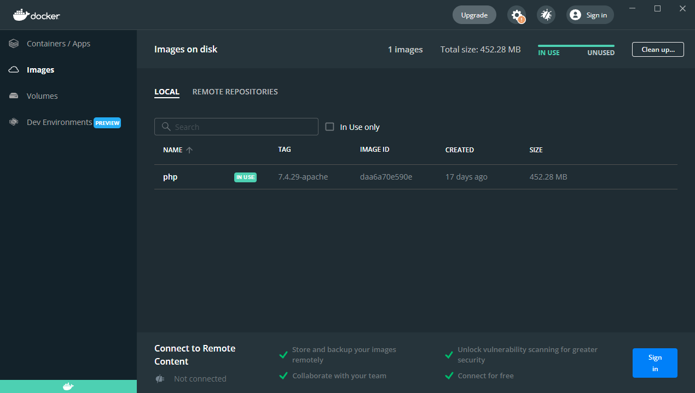
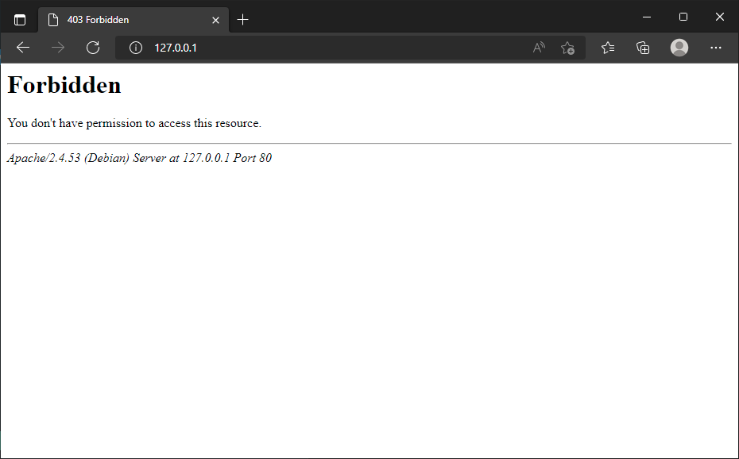
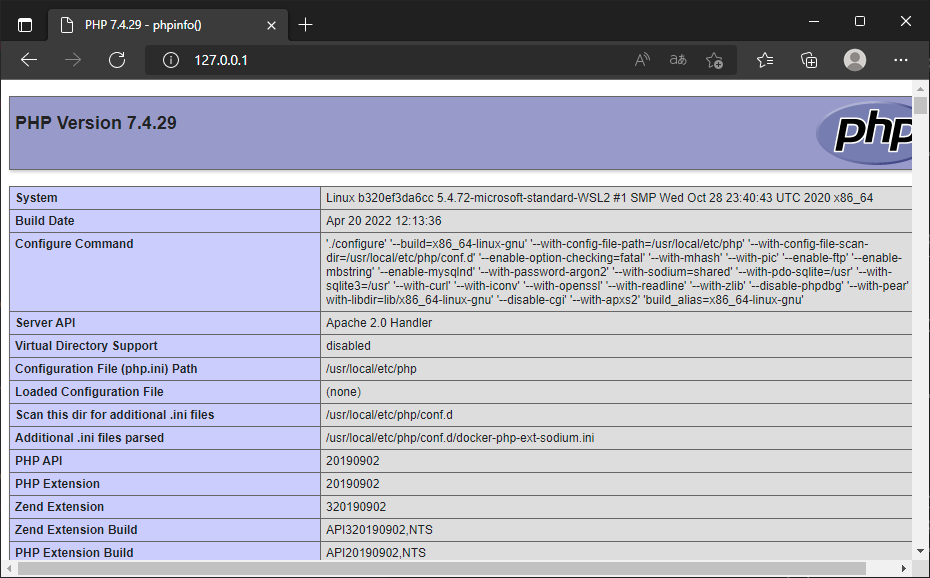
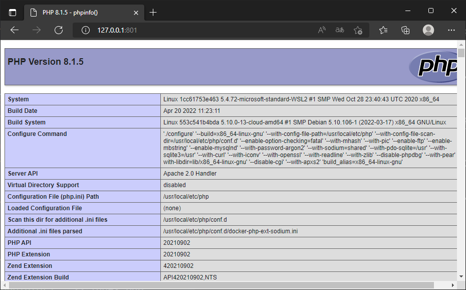

<!-- cspell:ignore wamp -->

Docker can be installed free of charge for personal or small-scale use: [https://www.docker.com/products/personal/](https://www.docker.com/products/docker-desktop/).

You can install it on Linux, Mac or Windows.

The easiest way, under Windows, is to use [Docker Desktop](https://www.docker.com/products/docker-desktop/).

<!-- truncate -->

## Why Docker images

Thanks to Docker, you no longer need to install PHP or Apache to run a website. You just need to use one, two or more, existing, images.

Images are most of time just *plug&play*: once downloaded, they are ready to use. You will probably add some configuration items but, most of time, it's even not needed.

On [Docker Hub](https://hub.docker.com) you'll find a huge number of "images" that can be used to run software such as PHP, PHP+Apache, MySQL and many, many more.

All these images are totally free; they can be public or private. You can create your own images and store them on [Docker Hub](https://hub.docker.com) free of charge.

In this blog post, we will be using the PHP images available at [https://hub.docker.com/_/php](https://hub.docker.com/_/php)

## Real use case: PHP and Apache

We will run a simple PHP script to show how ... not to ... install PHP and Apache. Not to install sounds crazy but yeah, it is the idea. Using the *old fashion* way, without Docker, before running a web page locally, we need to first install a web server (Apache f.i.) and the PHP interpreter. It is boring.

:::tip
But since Docker has a public image for running PHP and Apache (a single image for both services), it becomes ultra-simple
:::

So, in our discovery step, we will also change the PHP version from `7.4` to `8.1` with just a few ... keystrokes. Have you ever tried to change your PHP version if you are using EasyPhp, wamp or another software program: it's a real pain! With Docker, it is so easy.

:::note
In this chapter, as we discover Docker, we will use different port numbers each time to access our local site. We will see later how to reuse the same port number.
:::

:::info
The commands we will use in this step will be the same whether you are running Linux, Mac or Windows.
:::

Let's begin. Start a new console (DOS, Powershell or Linux) and run the instruction below.

Docker will, the very first time, download PHP `7.4.29` (including Apache) and, once downloaded, start the image:

<Terminal>
$ docker run --detach --name step_1_1a -p 80:80 php:7.4.29-apache
</Terminal>

:::tip
On subsequent runs, the PHP image is already present, so it is no longer downloaded.
:::

We can see that the PHP image is now present in Docker Desktop.

We also get the information on the command line: `docker image list`.

We can also see that an application (a `container` in Docker terms) is also running.

The command line to run is: `docker container list`

Explanation of the arguments used in our `docker run --detach --name step_1_1a -p 80:80 php:7.4.29-apache` command

* `--detach`: by default, `docker run` executes the container and closes it as soon as the job is finished. If the image were a virus scanner, `docker run` would run a scan and close the container when the scan is complete. Here, we want to keep our site "listening",
* `--name step_1_1a`: just for simplicity's sake, let's give our container a name. This is a recommended practice for clearly identifying containers,
* `-p 80:80`: our PHP+Apache image runs on port `80`, so we want to map this "internal" port to port `80` on our computer. This allows us to access the web site.
* `php:7.4.29-apache`: the name of the used image. We ask php+apache, version 7.4.29.

Let's try to access the local site: `http://127.0.0.1:80`.

It works in the means that *something is listening and has respond*, but doesn't display anything, since we haven't set anything up yet.

:::info
The site is functional, Apache is ready, but there's no index.php file; let's add one.
:::

### Creating our PHP script

With the instruction below, we can launch a Linux console and display the contents of the image *as if* it were a folder on our hard disk:

<Terminal>
$ docker exec -it step_1_1a /bin/bash
</Terminal>

Once in the console, let's quickly create an `index.php` file and exit the console; we will not need it again.

<Terminal>
$ echo "\<\?php" > index.php
$ echo "phpinfo();" >> index.php
$ exit
</Terminal>

Back to our browser and... Bingo! Our first Docker instance running a PHP script!

Let us go back to the instruction we used before:

<Terminal>
$ docker run --detach --name step_1_1a -p 80:80 php:7.4.29-apache
</Terminal>

This shows that we are targeting PHP version 7.4.29. By going to the page
[https://hub.docker.com/_/php?tab=tags](https://hub.docker.com/_/php?tab=tags) and searching for `-apache` images, you'll find versions such as `php:8.1.1-apache` or `php:8.1.5-apache`.

Let's change `7.4.29` to `8.1.5` and, for the example, use another port (we will use `801` this time).

<Terminal>
$ docker run --detach --name step_1_1b -p 801:80 php:8.1.5-apache
</Terminal>

<Terminal>
$ docker exec -it step_1_1b /bin/bash
</Terminal>

<Terminal>
$ echo "\<\?php" > index.php
$ echo "phpinfo();" >> index.php
$ exit
</Terminal>

**No headaches and zero conflicts!!!** We have installed a new version of PHP in seconds.

:::tip
This is just crazy in fact. Think of the benefits: you are developing a PHP script and want to check whether it works with different versions of PHP. It's child's play.
:::

<StepsCard
  title="At the end of this chapter, we've just learned:"
  variant="remember"
  steps={[
    "how to use Docker,",
    "define the PHP version we want to use,",
    "how to name our containers,",
    "define different ports for different containers."
  ]}
/>

Now let's move up a gear and synchronize the files on our hard disk with the container.
