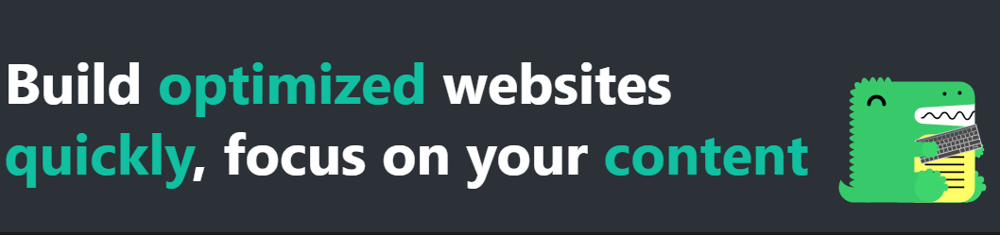
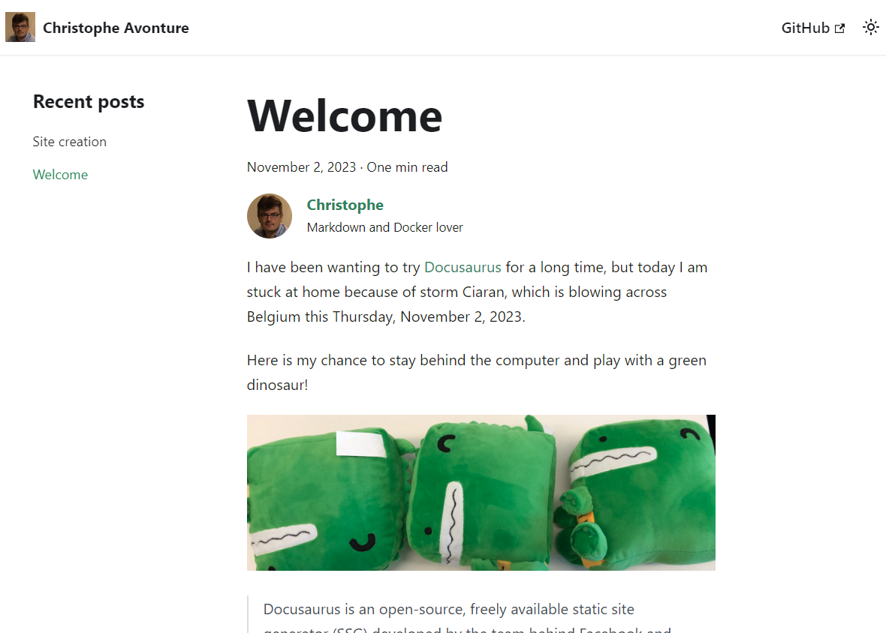

> [Docusaurus.io](https://docusaurus.io/)



* *Updated 2023-11-03, search engine, prism and sitemap added.*
* *Updated 2023-11-05, adding giscus.*
* *Updated 2023-12-21, adding [giscus.json](https://github.com/giscus/giscus/blob/main/ADVANCED-USAGE.md#origins) to allow comments to be displayed only on the blog.*

Here are the steps I followed to create this blog.

<!-- truncate -->

## Using Docusaurus

Since I really like the simplicity of Docker, I will not install NodeJs on my machine but use the official Docker image

```bash
docker run --rm --name blog --user $UID:$GID -it -v ${PWD}/:/project -w /project node /bin/bash
```

The instruction here above will download NodeJs (the latest version) on my machine if not yet present and create a running instance (called a *container* of it). The flag `--user $UID:$GID` is used to start the container using the same credentials than my local one (i.e., reuse my local Unix `christophe` user so files/folders created in the container will be owned by my local user).

The `-v ${PWD}/:/project` command line argument will share my current folder on my computer with the container i.e., the `/project` folder in the container will be my current folder on my computer.

And finally, I run an interactive shell since I have mentioned `/bin/bash` as entry point.

Now that I have a prompt in the container, I will create my blog using Docusaurus (as explained in the [official documentation](https://docusaurus.io/docs/installation)).

```bash
npx create-docusaurus@latest blog classic --javascript
```

After a long time, the blog folder is created and I can take a look on his content:

```bash
❯ tree -d -L 1
.
├── blog
├── docs
├── node_modules
├── src
└── static
```

The installation step is now finished, I will exit the container and return to my computer, to do this, from the Docker console, I just type `exit`.

## Run the website

Back to my computer, I will now go inside my `blog` folder (`cd blog`) and run the Docker command again but this time with the `-p 3000:3000` extra parameter. This parameter will expose the port `3000` from the container with my machine so I can see the website by surfing to `http://localhost:3000`.

Instead of running an interactive shell session I prefer to run `/bin/bash -c "npx docusaurus start"` to run Docusaurus watcher and serve my files:

```bash
cd blog
docker run --rm -it --name blog --user $UID:$GID -v ${PWD}/:/project -w /project -p 3000:3000 node /bin/bash -c "npx docusaurus start --host 0.0.0.0"
```

After a few seconds, the container is ready to use and I surf to my site by going to `http://localhost:3000`.



:::important
It is really crucial to use the `--host 0.0.0.0` flag when calling `npx docusaurus start`. This will allow external access to the website. If missing, surfing to `http://localhost:3000` (or running `curl http://127.0.0.1:3000`) will display an error `Empty reply from server`.
:::

## Some settings

By default (using the standard installation), Docusaurus will create a skeleton of website having two main entries: a blog and a tutorial.

For keeping things manageable, I will only keep the blog and remove the tutorial part. For this, I have followed this official article: [https://docusaurus.io/docs/blog#blog-only-mode](https://docusaurus.io/docs/blog#blog-only-mode).

Now, I can remove the `/docs` folder from my `blog` directory:

```bash
❯ tree -d -L 1
.
├── blog
├── node_modules
├── src
└── static
```

I will also make some changes to files like `docusaurus.config.js` or `blog/authors.yml` to fit my needs.

### File docusaurus.config.js

By setting `hideOnScroll` to `true`, the navigation bar will be hidden when the user will scroll down but will be displayed back as soon as he scroll up. Idea is to give more place on the screen for the content.

<Snippet filename="docusaurus.config.js">

```js
export default {
  themeConfig: {
    navbar: {
        // auto-hide the navbar when the user will scroll down, show again when scroll up
        hideOnScroll: true,
    },
  },
};
```

</Snippet>

Define the default image for social media:

<Snippet filename="docusaurus.config.js">

```js
export default {
  themeConfig: {
    // Default image when sharing a post on social media
    image: 'img/social-card.jpg',
  },
};
```

</Snippet>

## Make my first article

With my preferred editor ([vscode](https://code.visualstudio.com/)) I open my blog website (I just type `code .` in my Linux console to open my `blog` project).

Now, in the `/blog` directory, I create a new folder called `2023-11-02-site-creation` and there I create the `index.md` file.

:::note
When my blog post only contains text and no images or linked files, I can just create a `.md` file like `/blog/2023-11-02-this-is-a-test.md`. The creation of a folder is thus not mandatory at all.
:::

In the previous chapter, npx was executed using the `docker run --rm -it --name blog --user $UID:$GID -v ${PWD}/:/project -w /project -p 3000:3000 node /bin/bash -c "npx docusaurus start --host 0.0.0.0"` command so, every changes done to the blog will be immediately synchronized with Docker i.e., I just need to save my article and npx will reload my site; very easy and convenient.

### Using some layouts

Docusaurus support some Markdown special tags called *admonition* (see [https://docusaurus.io/docs/markdown-features/admonitions](https://docusaurus.io/docs/markdown-features/admonitions)).

For instance, to display a paragraph as a tip, like below, just use the following syntax:

```text
:::tip
Some **content** with _Markdown_ `syntax`.
:::
```

:::tip
Some **content** with *Markdown* `syntax`.
:::

To get the entire list of supported features, read [Markdown Features](https://docusaurus.io/docs/markdown-features).

### Adding plugins

#### Search engine

> [https://github.com/cmfcmf/docusaurus-search-local](https://github.com/cmfcmf/docusaurus-search-local)

The search engine feature has been added by following this blog article: [https://yoandev.co/une-documentation-avec-docusaurus-et-gitlab-pages/#bonus--ajoutons-un-moteur-de-recherche](https://yoandev.co/une-documentation-avec-docusaurus-et-gitlab-pages/#bonus--ajoutons-un-moteur-de-recherche)

Added by running `yarn add @cmfcmf/docusaurus-search-local` in the Docker container (opened using `make bash`).

#### Support for PHP and bash in prism

> [https://www.npmjs.com/package/@docusaurus/theme-classic](https://www.npmjs.com/package/@docusaurus/theme-classic)

Added by running `yarn swizzle @docusaurus/theme-classic prism-include-languages` in the Docker container (opened using `make bash`). Read more at [Supported Languages](https://docusaurus.io/docs/markdown-features/code-blocks#supported-languages).

#### Sitemap generator

> [https://docusaurus.io/docs/api/plugins/@docusaurus/plugin-sitemap](https://docusaurus.io/docs/api/plugins/@docusaurus/plugin-sitemap)

Added by running `yarn add @docusaurus/plugin-sitemap` in the Docker container (opened using `make bash`).

When added, I have also manually created the `static/robots.txt` file to with this content:

<Snippet filename="static/robots.txt">

```text
User-Agent: *
Sitemap: https://www.avonture.be/sitemap.xml
Disallow: /*index.xml$
Disallow: /index.json
Disallow: /search/index.json
```

</Snippet>

#### Image plugins

> [https://docusaurus.io/docs/api/plugins/@docusaurus/plugin-ideal-image](https://docusaurus.io/docs/api/plugins/@docusaurus/plugin-ideal-image)

Added by running `yarn add @docusaurus/plugin-ideal-image` in the Docker container (opened using `make bash`). Read more at [Supported Languages](https://docusaurus.io/docs/markdown-features/code-blocks#supported-languages).

> [https://www.npmjs.com/package/docusaurus-plugin-image-zoom](https://www.npmjs.com/package/docusaurus-plugin-image-zoom)

Added by running `yarn add docusaurus-plugin-image-zoom` in the Docker container (opened using `make bash`).

#### Adding a comment area

> [How to add Giscus comments to Docusaurus](https://dev.to/m19v/how-to-add-giscus-comments-to-docusaurus-439h)

Adding Giscus to allow comments and feedback.

## Push to Github

On Github.com, I have created a new repository called `blog` ([https://github.com/cavo789/blog](https://github.com/cavo789/blog)). This done, back to my console and I run a few git commands:

```bash
git init
git add .
git commit -m "Initial commit"
git remote add origin git@github.com:cavo789/blog
git push -u origin master
```

This done, I have thus pushed my files to Github as foresee by Docusaurus i.e., for instance, the `/node_modules` is not part of my repo; which is fine since we will create that folder later by running some npx command on the web server where the site will be hosted.

## Build static version of the blog

In order to build static pages, I run `docker run --rm -it --user $UID:$GID -v ${PWD}/:/project -w /project node /bin/bash -c "yarn build"`.

This will create/update the `/build` folder with a fresh version of the site.

Next step is to start my FTP client (which is [WinSCP](https://winscp.net/eng/download.php)) and copy my local `/blog/build` folder to my remote website.

## Adding withcabin for GPDR compliant stats

By adding the lines below to the `docusaurus.config.js` as child node of `const config`, I'm injecting a script into the body part. This will then allow GPDR compliant stats on [https://withcabin.com/](https://withcabin.com/).

<Snippet filename="docusaurus.config.js">

```javascript
scripts: [
  {
    src: 'https://scripts.withcabin.com/hello.js',
    async: true,
    defer: true,
  },
],
```

</Snippet>

Note: the script is only injected to pages after a `yarn build` i.e. when the static site is rendered; not during a `yarn watch`.
