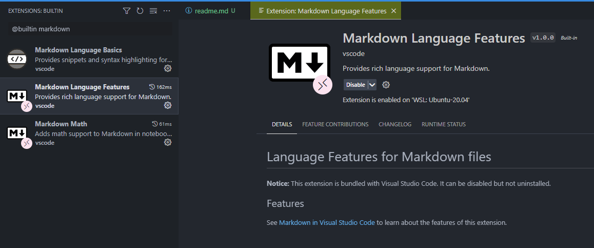

> [https://github.com/microsoft/vscode/issues/107130](https://github.com/microsoft/vscode/issues/107130)

In case code folding is not working in markdown mode like illustrated below, make sure the `@builtin Markdown Language Features` addon is enabled.

<!-- truncate -->

