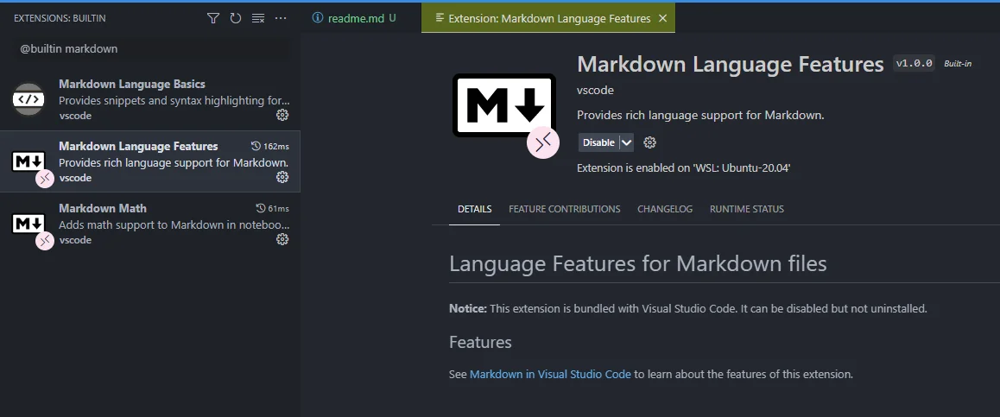

<TLDR>
This article fixes a case where code folding doesn't work in VSCode's Markdown editor: make sure the built-in `@builtin Markdown Language Features` extension is enabled.
</TLDR>

> [https://github.com/microsoft/vscode/issues/107130](https://github.com/microsoft/vscode/issues/107130)

In case code folding is not working in markdown mode as illustrated below, make sure the `@builtin Markdown Language Features` addon is enabled. *That same built-in extension powers <Link to="/blog/vscode-sticky-scroll">sticky scroll</Link> in Markdown files, which stops working for the same reason.*

<!-- truncate -->

Once folding works again, you may want more control over *what* gets folded: <Link to="/blog/vscode-regions">Working with regions in VSCode</Link> shows how to define your own foldable blocks, even in file types VSCode doesn't support natively.
