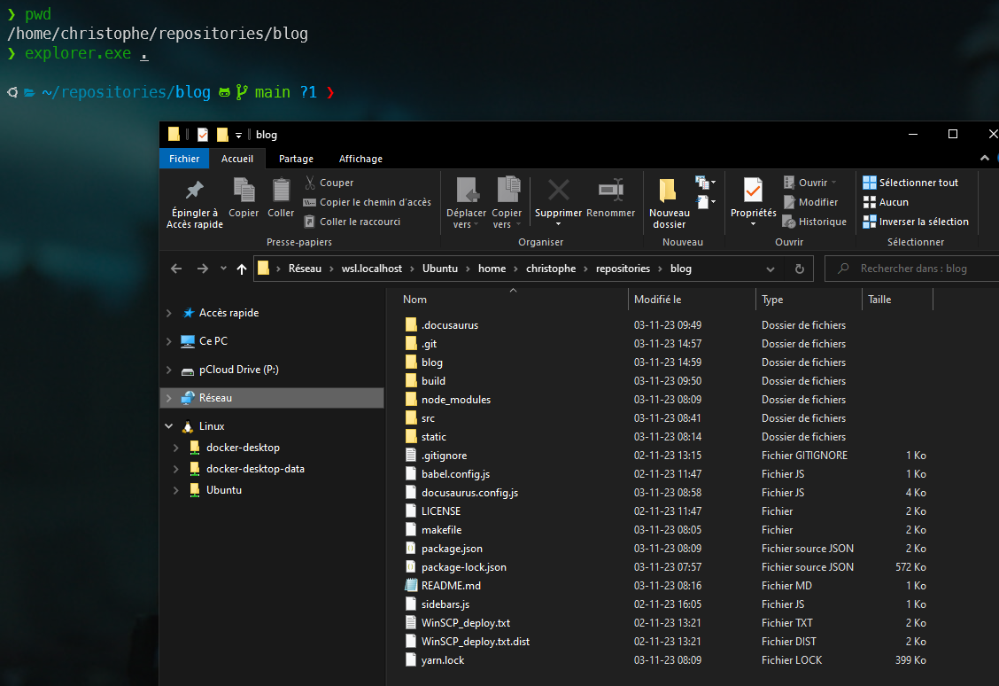
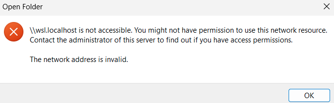

<!-- cspell:ignore cbfsconnect -->

Did you know it is possible to use the Windows Explorer program and navigate on your Linux filesystem?

An easy way to open your current folder in Windows Explorer is to call the `explorer.exe` binary.

So, f.i., in your Linux console, open any existing folder like `cd ~/repositories/blog` and then, just run `explorer.exe .`.

<!-- truncate -->

So, yes!, it's possible to call any Windows program (like the calculator (`calc.exe`)) by typing his name followed by `.exe`. If the program is in the `PATH` then it will be started.

The final `.` means *current folder* so `explorer.exe .` will open the current folder in Windows Explorer.

It sounds crazy, no? Windows will then *convert* the Linux `/home/christophe/repositories/blog` folder to `\\wsl.localhost\Ubuntu\home\christophe\repositories\blog` (Windows style) and open it. That address is called an UNC (UNC stands for *Uniform Naming Convention*).

Now, I can use Windows explorer to manage files / folders like I did since decades on Windows.

:::info Windows 11
If you are running on Windows 11, the UNC is `\\wsl$\`, no more `\\wsl.localhost\`.
:::

## WSL localhost is not accessible

> [https://github.com/microsoft/WSL/discussions/7742#discussioncomment-6069601](https://github.com/microsoft/WSL/discussions/7742#discussioncomment-6069601).

It can happen, on your Windows 10 computer, that the folder won't be opened and you'll get the error: /*\\wsl.localhost is not accessible. You might not have permission to use this network resource. Contact the administrator of this server to find out if you have access permissions.*.

**It is not a permission problem** but something to modify in your Windows registry.

In Windows, click on `Start - Run` and run `regedit`, the Windows registry editor.

Search for the key `KEY_LOCAL_MACHINE\SYSTEM\CurrentControlSet\Control\NetworkProvider\Order`, edit the `ProviderOrder` key and add the `P9NP` value to the list. Do the same for `KEY_LOCAL_MACHINE\SYSTEM\CurrentControlSet\Control\NetworkProvider\HwOrder`.

When done, please reboot your computer.

:::note
If it still didn't work, remove `cbfsconnect2017` from the list and try again.
:::
