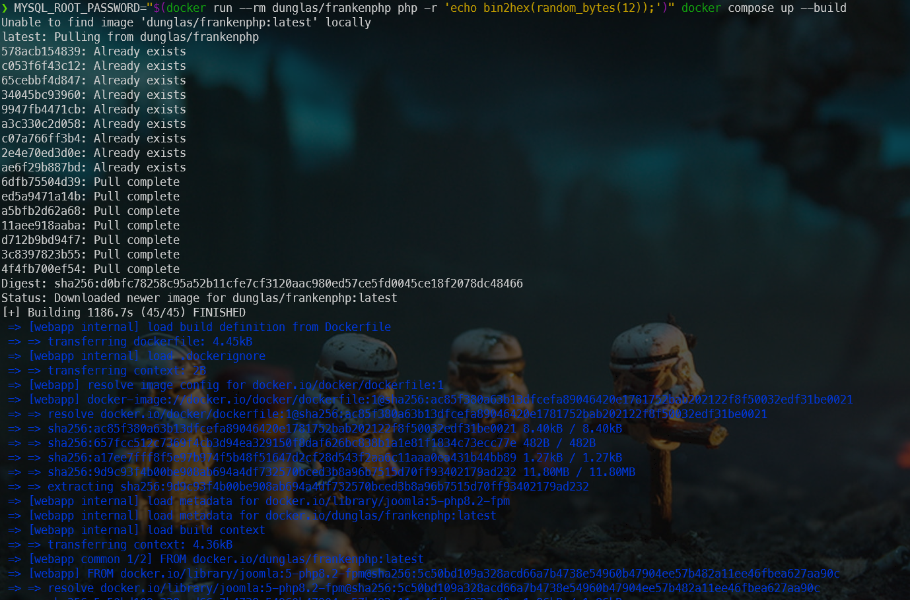
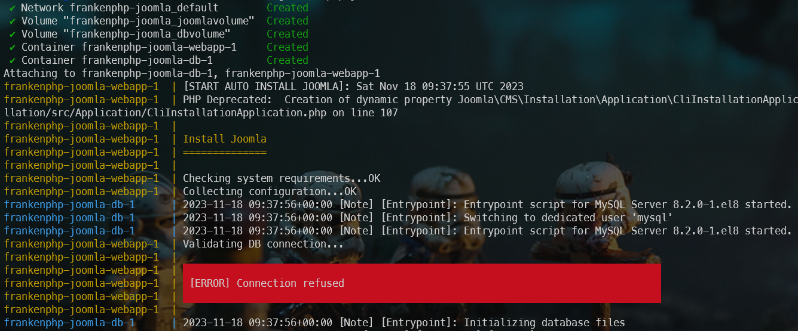
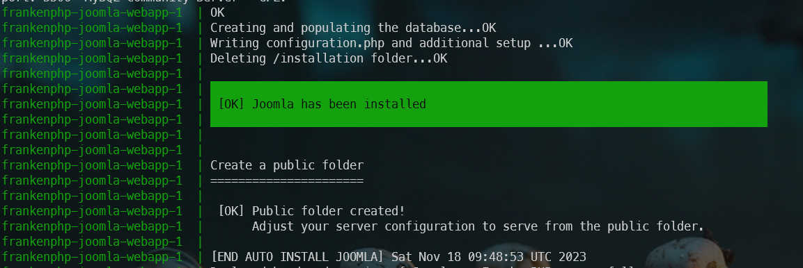
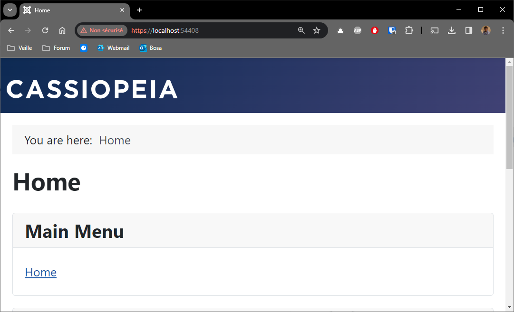

# FrankenPHP, a modern application server for PHP

 

Based on [their documentation](https://speakerdeck.com/dunglas/the-php-revolution-is-underway-frankenphp-1-dot-0-beta), [FrankenPHP](https://frankenphp.dev/) is 3.5 faster than PHP FPM.

It is still fairly young for use on production sites, but because it's so promising, it's certainly worth playing with when developing locally.

[Alexandre Elisé](https://github.com/alexandreelise) has written a script to use FrankenPHP with Joomla. You can find the source here: [https://github.com/alexandreelise/frankenphp-joomla](https://github.com/alexandreelise/frankenphp-joomla).

<!-- truncate -->

I invite you to play with it on your development machine (unless you have your own servers; you certainly won't be able to use FrankenPHP at your hosting company).

Here is how to do:

* go back, for instance, in your `/tmp/joomla` folder
* open your browser and surf to [https://github.com/alexandreelise/frankenphp-joomla],
* follow instructions given by Alexandre in his `Getting Started` readme file.

The building of image(s) and the creation of containers will take a while (10 minutes and even more) so just be patient. *Building the image is an one-time action, the next time, Docker just has to create containers.*

So the building has taken ages and, then, you'll start to get logs messages:

You should wait here too, a lot, until the database connection is ready. The fact is Joomla will try to connect to MySQL while the MySQL container is not ready to handle connections. You'll then see a lot of `[ERROR] Connection refused`. Stay patient and after a while, you'll get this:

:::caution OUPS, it's terribly slow to build
To be honest, before being able to see my Joomla localhost homepage, I've waited more than 25 minutes (the first time). I would never have waited so long if I hadn't had to finish this chapter.
:::

When everything has been successfully done, just run surf to `https://localhost:9999` to get your Joomla site running on FrankenPHP. 

:::note FrankenPHP is using SSL and thus https
Please note that FrankenPHP is delivering your site using `https`. The way Alexandre has built his script, the port number is not fixed. To determine which port to use, start a new Linux console and run `docker container list` to get the list of running containers. You'll see the port to use to access to your FrankenPHP site in the `PORTS` column. Also displayed in your `Docker Desktop` Windows application, go then to the list of containers to get the port.
:::

You'll perhaps not see a major increase in speed on your machine since you're the only visitor but it's nice to think that you're surfing so fast ... locally ;).
