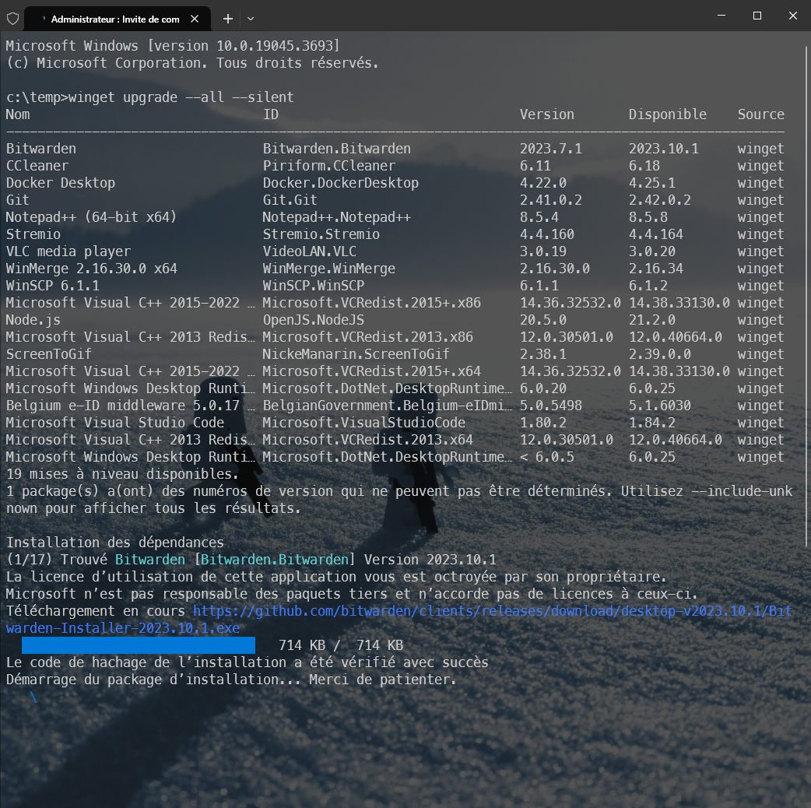

# Update all out-of-date Windows programs in batch

> [Use the winget tool to install and manage applications](https://learn.microsoft.com/en-us/windows/package-manager/winget/)

If you're working under Linux or WSL, you know very well the `sudo apt-get update && sudo apt-get upgrade` instruction to ask the operating system to upgrade programs present on your disk with newer version.

Under Windows, since a few years (starting with Windows 10), there is such command too: it's `winget`.

By running `winget upgrade --all --silent` in a DOS (or Powershell) console started with admin rights, you'll start a process that will scan (in a second) your computer, detect which programs are installed on it and check if a newer version exists (and known by winget).

Then, because we've added the `--all --silent` flags, we just allow winget to process to the updates without asking confirmation. Let the computer do his work during a few minutes and... tadaaa... you've fresh and updated versions of your software *(the ones supported by winget)*.

Winget has detected that 17 software should be upgraded and, one by one, will download and install newer versions.

Easy no?

:::tip
[Marc Dechèvre](https://www.woluweb.be/) tells me that `winget upgrade --all --silent` command found 29 updates to make on his machine and that adding the `--include-unknown` flag found 15 more. 
:::