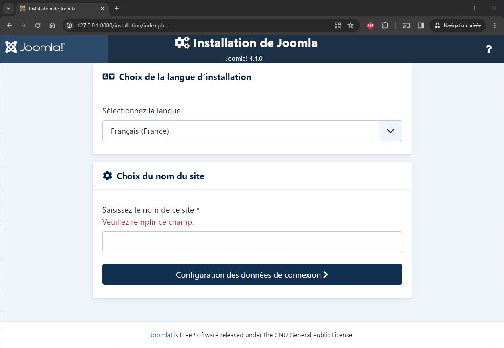
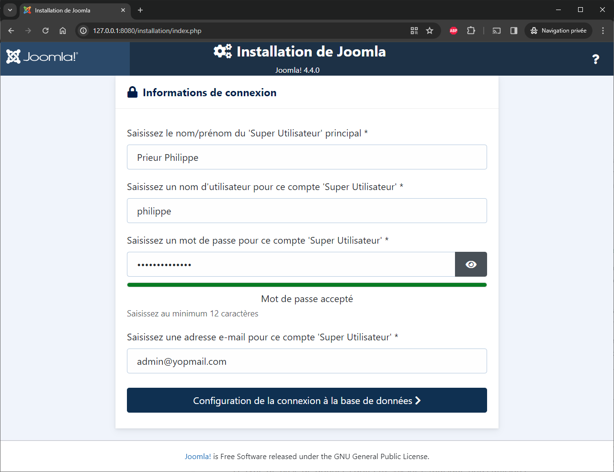
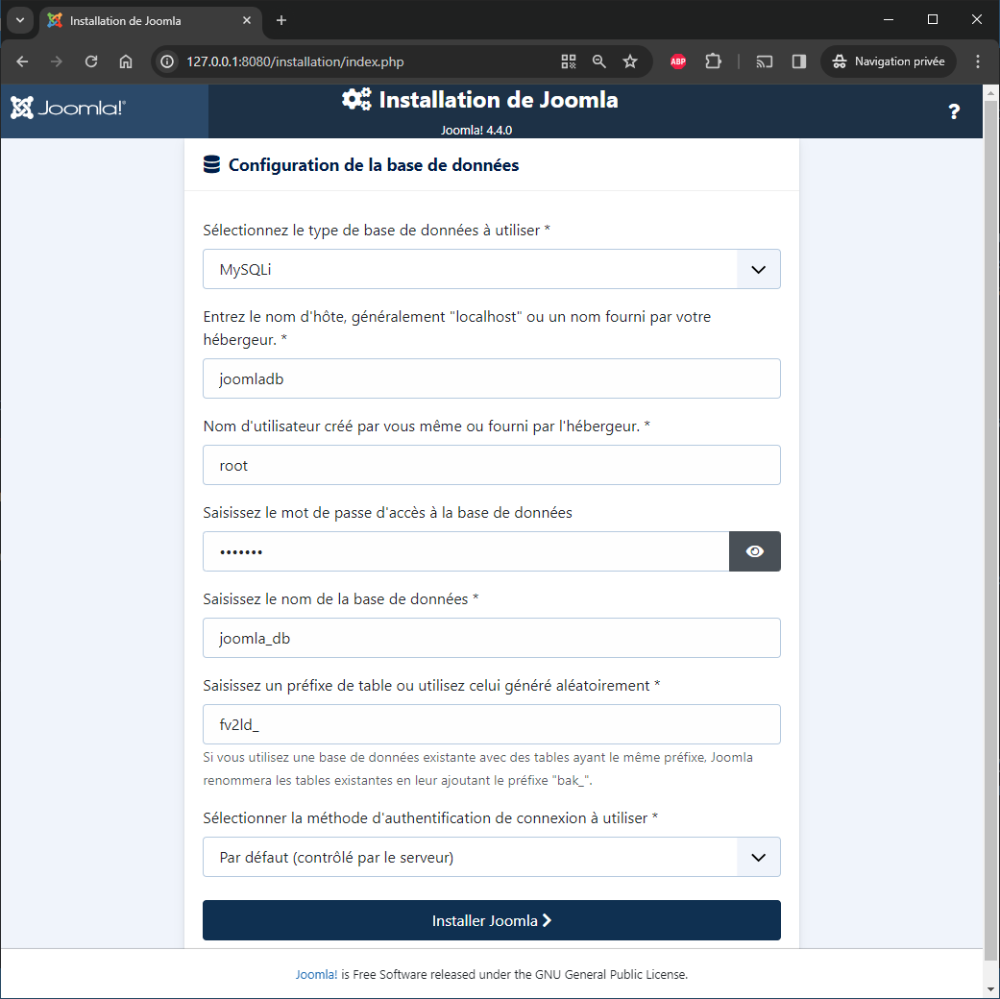
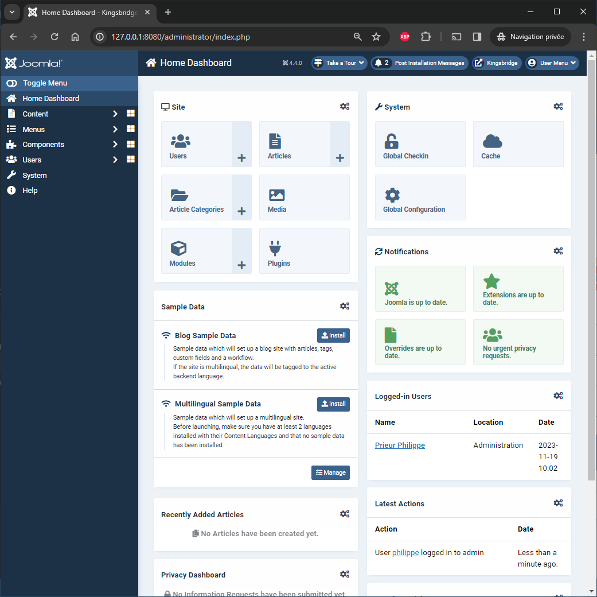
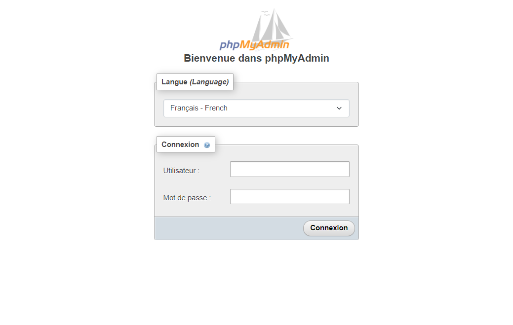
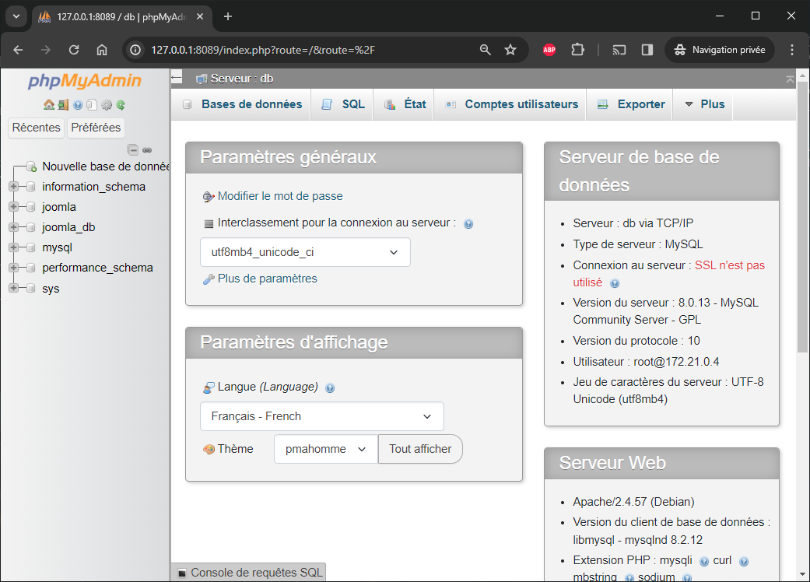
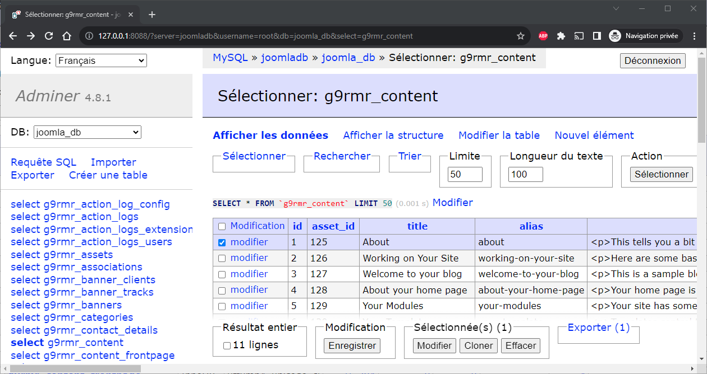

# Créer votre site web Joomla en utilisant Docker


Dans cet article, nous allons apprendre à utiliser Docker pour installer Joomla en localhost et démarrer un nouveau site web **en quelques secondes** *(vous ne voulez pas attendre ? Passez au chapitre [Final docker-compose.yml](#final-docker-composeyml))*.

Je vais utiliser une console Linux *(je fais tourner WSL sur mon ordinateur Windows et j'ai choisi Ubuntu pour ma distribution)* mais comme Docker peut aussi être utilisé sur Windows, vous pouvez parfaitement exécuter, exactement, les mêmes commandes dans une console MS-DOS / Powershell.

<!-- truncate -->

Si vous n'avez pas encore Docker, veuillez consulter mon article "[Install Docker and play with PHP (🇬🇧)](https://www.avonture.be/blog/install-docker)" pour obtenir plus d'informations sur Docker et un guide d'introduction facile.

**Nous supposerons dans cet article que vous avez Docker et que vous travaillez sous Linux ou que vous utilisez WSL.**

## Avant de commencer

Comme vous le savez, pour pouvoir faire fonctionner un CMS comme Joomla, nous avons besoin de trois choses + 1 :

1. Nous avons besoin d'un serveur web comme **Apache** ou **nginx**,
2. Nous avons besoin d'un service de bases de données comme **MySQL**, **MariaDB** ou **PostgreSQL** ou toute autre base de données supportée et
3. Nous avons besoin de **PHP**.

Et, bien sûr, nous avons besoin de **Joomla**.

Dans le vocabulaire de Docker, nous avons besoin de trois services.

## Docker compose

Lorsque vous avez besoin de plusieurs services (Apache doit pouvoir communiquer avec PHP et PHP doit pouvoir demander des données à MySQL), vous devez configurer un fichier spécial appelé `docker-compose.yml`. Ce fichier doit être placé à la racine du projet et définira la liste des services requis et la manière dont ils collaboreront.

Vous trouverez un exemple du fichier `docker-compose.yml` sur la page de description de l'image Joomla : [https://hub.docker.com/_/joomla](https://hub.docker.com/_/joomla) *recherchez `docker-compose` sur cette page.*

:::info L'image Docker Joomla est basée sur PHP et Apache
C'est certainement trop technique pour l'instant, mais si vous cliquez sur le lien suivant
[https://github.com/joomla-docker/docker-joomla/blob/8cac4ff7ae88b9274870a95f5e22ea3c32f01fd7/5.0/php8.1/apache/Dockerfile#L8](https://github.com/joomla-docker/docker-joomla/blob/8cac4ff7ae88b9274870a95f5e22ea3c32f01fd7/5.0/php8.1/apache/Dockerfile#L8), vous pouvez voir que l'image Docker pour Joomla 5.0.0 est construite sur une image `php:8.1-apache`. Cela signifie qu'en utilisant cette image, vous obtiendrez PHP, Apache et Joomla dans une seule image.
:::

## Téléchargement des images

Veuillez créer sur votre disque, disons dans le dossier `/tmp/joomla` un fichier appelé `docker-compose.yml` avec ce contenu (vous pouvez récupérer ce fichier sur [https://hub.docker.com/_/joomla](https://hub.docker.com/_/joomla)) :

```yaml
version: '3.9'

services:
  joomla:
    image: joomla
    restart: always
    ports:
      - 8080:80
    environment:
      - JOOMLA_DB_HOST=joomladb
      - JOOMLA_DB_PASSWORD=example

  joomladb:
    image: mysql:8.0.13
    restart: always
    environment:
      - MYSQL_ROOT_PASSWORD=example
```

:::tip Vous souhaitez MariaDB et non MySQL?
Rien de plus simple ! Dans le fichier `docker-compose.yml`, remplacez la ligne `image: mysql:8.0.13` par `image: mariadb:11.1.2` et sauvez votre modification. Voilà, c'est fait. Difficile n'est-ce pas ?
:::

Pour que les choses soient aussi claires que possible, voici le contenu de mon dossier temporaire :

```bash
❯ pwd
/tmp/joomla

❯ ls -alh
Permissions Size User       Group      Date Modified    Name
drwxr-xr-x     - christophe christophe 2023-11-04 09:32  .
drwxrwxrwt     - christophe christophe 2023-11-04 09:32 ..
.rw-r--r--   325 christophe christophe 2023-11-04 09:32 docker-compose.yml
```

Donc, je n'ai qu'un seul fichier et c'est le fichier `docker-compose.yml` nouvellement créé.

Maintenant, si nécessaire, démarrez une console Linux, et allez dans votre dossier joomla (i.e. `cd /tmp/joomla`). De là, exécutez la commande ci-dessous :

```bash
docker compose up --detach
```

:::tip `docker compose up --detach`
Cette commande est l'une des plus importantes à connaître. Elle demande à Docker de traiter le fichier `docker-compose.yml` et d'exécuter les services. **En bref : démarrer votre site web**.
:::

Docker va commencer à télécharger `joomla` et `joomladb`, les deux services mentionnés dans le fichier `docker-compose.yml`.

```yaml
services:
// highlight-next-line
  joomla:
    [...]
// highlight-next-line
  joomladb:
    [...]
```

Vous obtiendrez quelque chose comme ceci, veuillez patienter jusqu'à ce que tout soit téléchargé.

```bash
❯ docker compose up --detach
[+] Running 16/35
 ⠹ joomladb 12 layers [⠀⠀⠀⠀⠀⠀⠀⠀⠀⠀⠀⠀]    0B/0B  Pulling  19.3s
   ⠧ 177e7ef0df69 Waiting   15.8s
   ⠧ cac25352c4c8 Waiting   15.8s
   ⠧ 8585afabb40a Waiting   15.8s
   [...]
 ⠹ joomla 21 layers [⣿⣿⣦⣿⣿⣿⣿⣿⣿⣿⣿⣿⣿⣦⣿⣿⣿⣿⣀⠀⠀] 94.59MB/155.9MB Pulling  19.3s
   ✔ 578acb154839 Pull complete  11.3s
   ✔ c053f6f43c12 Pull complete  11.9s
   ⠋ 65cebbf4d847 Downloading [==============>         ]  68.41MB/104.4MB  16.1s
   ✔ 34045bc93960 Download complete  1.0s
   [...]
```

À la fin, une fois les images téléchargées, la console affichera quelque chose comme ceci :

```bash
❯ docker compose up --detach
[+] Running 35/35
 ✔ joomladb 12 layers [⣿⣿⣿⣿⣿⣿⣿⣿⣿⣿⣿⣿]  0B/0B   Pulled  84.9s
   ✔ 177e7ef0df69 Pull complete  26.9s
   ✔ cac25352c4c8 Pull complete  27.5s
   ✔ 8585afabb40a Pull complete  28.2s
   [...]
 ✔ joomla 21 layers [⣿⣿⣿⣿⣿⣿⣿⣿⣿⣿⣿⣿⣿⣿⣿⣿⣿⣿⣿⣿⣿] 0B/0B  Pulled  146.4s
   ✔ 578acb154839 Pull complete   11.3s
   ✔ c053f6f43c12 Pull complete   11.9s
   ✔ 65cebbf4d847 Pull complete   31.2s
   [...]
[+] Running 3/3
 ✔ Network joomla_default       Created  0.3s
 ✔ Container joomla-joomladb-1  Started  52.9s
 ✔ Container joomla-joomla-1    Started  38.8s
```

Les deux images ont donc été téléchargées,

1. un réseau `joomla_default` est créé,
2. le conteneur `joomla-joomladb-1` est créé (c'est votre serveur de base de données) et
3. le conteneur `joomla-joomla-1` est également créé (c'est votre service Joomla).

A ce stade, votre site est déjà en cours d'installation. Rendez-vous sur l'URL http://127.0.0.1:8080 pour le consulter (soyez certain d'être en `http` et non `https`). 

:::note Pas encore prêt
Il se peut que vous obteniez une page d'erreur `ERR_EMPTY_RESPONSE`; c'est parce que p.ex. MySQL n'est pas encore totalement chargé et que Joomla doit l'attendre afin de pouvoir afficher sa page d'installation. Dans ce cas de figure, veuillez encore attendre un peu ... ou lire la suite de cet article.
:::

### Pourquoi les noms joomla-joomlaxxx ?

Nous n'avons pas donné de nom à votre projet, nous avons juste créé un fichier `docker-compose.yml` dans votre dossier `/tmp/joomla`. Donc, Docker a nommé votre projet en utilisant le nom du dossier (`joomla`) concaténé au nom du service (en se référant au fichier `docker-compose.yml`, nous avons deux services, un appelé `joomladb` et un appelé `joomla`). Voici pourquoi...

Introduisons un changement mineur, optionnel, nous allons donner un nom à votre projet Docker et à vos conteneurs : éditez le fichier `docker-compose.yml` et ajoutez une ligne avec `name: xxxx` où `xxxx` est le nom de votre choix. Faites la même chose mais en utilisant `container_name` cette fois pour les deux services ; par exemple :

```yaml
version: '3.9'
// highlight-next-line
name: kingsbridge
services:
  joomla:
    // highlight-next-line
    container_name: kingsbridge-app
    [...]

  joomladb:
    // highlight-next-line
    container_name: kingsbridge-db
    [...]
```

Nous ne redémarrerons pas tout de suite vos conteneurs Docker. Pour l'instant, le nom `kingsbridge` ne sera pas pris en compte. Pour cela, il faudrait lancer `docker compose down` suivi de `docker compose up --detach` mais attendons encore un peu avant de le faire.

## Les images Docker

Si vous êtes curieux, vous pouvez lancer la commande `docker image list` pour obtenir la liste des images Docker déjà téléchargées sur votre machine.

```bash
❯ docker image list
REPOSITORY   TAG       IMAGE ID       CREATED       SIZE
joomla       latest    882b2151d890   2 days ago    663MB
mysql        8.0.13    102816b1ee7d   4 years ago   486MB
```

On voit que Docker a bien téléchargé Joomla (dans sa version dite *latest*) et MySQL (version 8.0.13).

:::info Qu'en est-il de Joomla 5.0, c'est-à-dire forcer une version précise ?
Par défaut, lorsque nous ne spécifions pas de numéro de version (*ce qui n'est pas recommandé*), Docker téléchargera la version dite `latest`. `latest`, ici est ce que Docker appelle un *tag*.
:::

```yaml
version: '3.9'

services:
  joomla:
    // highlight-next-line
    image: joomla
[...]
```

Pour récupérer la liste de tous les tags, veuillez vous rendre sur [https://hub.docker.com/_/joomla/tags](https://hub.docker.com/_/joomla/tags).

Lors de la rédaction de cet article, Joomla *latest* correspond à Joomla version 4.4.0. Alors, que faire pour forcer l'utilisation de Joomla 5.0. En surfant sur la page [tags](https://hub.docker.com/_/joomla/tags), vous pouvez retrouver dans la liste des tags celui-ci : *5.0.0-php8.2-apache*. Il suffit donc de remplacer `image: joomla` par `image: joomla:5.0.0-php8.2-apache` dans le fichier `docker-compose.yml` et le tour est joué. Vous forcez une version.

```yaml
version: '3.9'

services:
  joomla:
    // highlight-next-line
    image: joomla:5.0.0-php8.2-apache
[...]
```
:::

## Les conteneurs Docker

Nous avons presque terminé. Veuillez lancer `docker container list` pour obtenir la liste des conteneurs créés par Docker :

```bash
❯ docker container list
CONTAINER ID   IMAGE          COMMAND                  CREATED          STATUS          PORTS                    NAMES
0798f8f25d2b   joomla         "/entrypoint.sh apac…"   8 minutes ago    Up 5 minutes    0.0.0.0:8080->80/tcp     joomla-joomla-1
7b7fcd3809b0   mysql:8.0.13   "docker-entrypoint.s…"   8 minutes ago    Up 7 minutes    3306/tcp, 33060/tcp      joomla-joomladb-1
```

Nous avons deux conteneurs en cours d'exécution (vos deux services). Portez votre attention à la colonne `PORTS` : votre conteneur `joomla` écoute sur le port `8080` et votre conteneur `mysql` écoute sur le port `3306`.

Hey!, le port `8080`, ça vous dit quelque chose non ? C'est un port pour une page web, n'est-ce pas ?

Essayons en démarrant votre navigateur préféré et en navigant vers `http://localhost:8080` (*ou `http://127.0.0.1:8080`, c'est strictement la même chose*) et... Wow !



:::info Incroyable, non ?
Wow, est-ce que cela ne vous semble pas dingue ça ? Avec une seule commande (`docker compose up --detach`), vous avez téléchargé tout ce dont vous avez besoin pour faire tourner Joomla sur votre machine.
:::

Revenons en arrière quelques secondes : pour faire fonctionner Joomla, nous savions que nous avions besoin de trois choses + 1 ; un serveur web, un serveur de bases de données, PHP et, bien sûr, nous avons besoin de Joomla. **Et là, juste en lançant une commande, hop, toute la magie opère.** Et rien à configurer non plus !

## Installer Joomla

Retournez sur la page `http://localhost:8080` et nous continuerons l'installation.

Sur le premier écran, sélectionnez votre langue préférée et entrez un nom pour votre site Joomla :


Lorsque Joomla vous demandera vos identifiants d'administrateur, il vous suffira de saisir la valeur de votre choix :



Mais, pour la configuration de la base de données, vous devez être strict :

* Le type de base de données doit être `MySQLi` (puisque nous utilisons MySQL),
* Le nom de l'hôte doit être `joomladb` (le nom que nous avons choisi pour le service de bases de données),
* Le nom d'utilisateur doit être `root` (valeur par défaut) et
* Le mot de passe de cet utilisateur doit être `example`

:::important Pourquoi ces valeurs ?
Ces valeurs peuvent être récupérées dans le fichier `docker-compose.yml`. Si vous avez nommé votre service de bases de données autrement que `joomladb`, veuillez utiliser le nom que vous avez choisi.
:::

```yaml
version: '3.9'

services:
  [...]
  // highlight-next-line
  joomladb:
    [...]
    environment:
      // highlight-next-line
      - MYSQL_ROOT_PASSWORD=example
```



Et, après quelques secondes, tadaaa...


La page de l'administrateur :


Et le tableau de bord de l'administrateur :



**Félicitations, vous avez réussi à installer un nouveau site web Joomla en utilisant Docker !**

## Tout se fait en mémoire vive (RAM)

Laissons de côté quelques minutes le navigateur et retournons à votre console Linux.

Dans le chapitre précédent, nous avons installé Joomla donc nous devrions avoir Joomla sur votre ordinateur, n'est-ce pas ?

Vérifions en retournant dans notre console Linux :

```bash
❯ pwd
/tmp/joomla

❯ ls -alh
Permissions Size User       Group      Date Modified    Name
drwxr-xr-x     - christophe christophe 2023-11-04 09:32  .
drwxrwxrwt     - christophe christophe 2023-11-04 09:32 ..
.rw-r--r--   325 christophe christophe 2023-11-04 09:32 docker-compose.yml
```

Oh ? Rien... **Rien n'a été téléchargé dans votre dossier.** Vous n'avez pas Joomla sur votre ordinateur. Comment est-ce possible ?

Nous en parlerons plus tard mais oui, par défaut avec Docker, tout se passe en mémoire, rien sur le disque. Si vous ne pouvez pas attendre, lisez mon article "[Share data between your running Docker container and your computer (🇬🇧)](https://www.avonture.be/blog/docker-volume)" pour mieux comprendre pourquoi et comment.

## Jouer avec les conteneurs

Toujours sur votre console, tapez à nouveau `docker container list` :

```bash
❯ docker container list
CONTAINER ID   IMAGE          COMMAND                  CREATED          STATUS          PORTS                    NAMES
0798f8f25d2b   joomla         "/entrypoint.sh apac…"   8 minutes ago    Up 5 minutes    0.0.0.0:8080->80/tcp     joomla-joomla-1
7b7fcd3809b0   mysql:8.0.13   "docker-entrypoint.s…"   8 minutes ago    Up 7 minutes    3306/tcp, 33060/tcp      joomla-joomladb-1
```

Faites attention cette fois à la dernière colonne, appelée `NAMES`.

Nous avons donc deux conteneurs, l'un nommé `joomla-joomla-1` et l'autre `joomla-joomladb-1`.

Nous allons les arrêter en lançant `docker compose down` :

```bash
❯ docker compose down
[+] Running 3/3
 ✔ Container joomla-joomla-1    Removed 2.6s
 ✔ Container joomla-joomladb-1  Removed 4.2s
 ✔ Network joomla       Removed
```

Si vous retournez sur `http://localhost:8080` avec votre navigateur et que vous rafraîchissez la page, le site n'existe plus.

Lancez à nouveau `docker compose up --detach`, surfez à nouveau sur le site, rafraîchissez la page et le site ne répond pas encore. Attendez un peu... encore un peu... et après un certain temps, le site sera là. Pourquoi ?

Docker doit (re)démarrer deux services, celui de Joomla et le serveur de base de données. L'initialisation des deux services peut prendre quelques secondes et le service de bases de données doit être opérationnel pour que Joomla puisse continuer son initialisation.  

Vous pouvez le voir en exécutant `docker compose logs --follow` (appuyez sur <kbd>CTRL</kbd>+<kbd>C</kbd> pour arrêter d'écouter les logs).

Une fois que Joomla sera prêt, vous obtiendrez l'assistant d'installation de Joomla... comme la première fois. Donc, en lançant `docker compose down` vous avez perdu votre travail.

:::danger
Comme mentionné plus haut, tout se passe en mémoire vive. En arrêtant un conteneur Docker, vous perdrez tout ce qui n'est pas sauvegardé sur votre ordinateur. C'est très bien pour jouer/apprendre mais ce n'est pas ce à quoi on s'attend quand on développe un vrai site.
:::

:::info
Rappelez-vous le changement que nous avons fait plus tôt. Nous avons ajouté le nom `kingsbridge` comme nom de projet dans votre fichier `docker-compose.yml` et nous avons nommé les deux conteneurs. Vous pouvez voir qu'après avoir relancé `docker compose up`, cette fois ce n'est plus `joomla-joomlaxxxx` mais `kingsbridge-app` et `kingsbridge-db`. Ceci parce que les modifications apportées au fichier yaml ne sont traitées qu'après une commande `down / up`. Si vous modifiez le fichier yaml, vous devez redémarrer les conteneurs Docker.
:::

## Synchroniser avec votre ordinateur

Nous allons maintenant demander à Docker de stocker des fichiers/dossiers sur votre ordinateur.

Nous souhaitons deux choses :

1. Nous voulons que l'ensemble du site web soit sauvegardé sur votre disque dur et
2. nous voulons que la base de données soit également sauvée sur le disque dur.

Pour ce faire, veuillez éditer le fichier `docker-compose.yml` et ajouter les lignes surlignées ci-dessous :

```yaml
version: '3.9'

name: kingsbridge

services:
  joomla:
    image: joomla
    restart: always
    ports:
      - 8080:80
    environment:
      - JOOMLA_DB_HOST=joomladb
      - JOOMLA_DB_PASSWORD=example
    // highlight-next-line
    user: 1000:1000
    // highlight-next-line
    volumes:
      // highlight-next-line
      - ./site_joomla:/var/www/html

  joomladb:
    image: mysql:8.0.13
    restart: always
    environment:
      - MYSQL_ROOT_PASSWORD=example
    // highlight-next-line
    user: 1000:1000
    // highlight-next-line
    volumes:
      // highlight-next-line
      - ./db:/var/lib/mysql
```

Le dossier `/var/www/html` du service Joomla doit être synchronisé avec le sous-dossier `site_joomla` de votre ordinateur. Il s'agit du site web de Joomla.

Et le dossier `/var/lib/mysql` du service MySQL doit être synchronisé avec votre sous-dossier local `db`.

:::important Veuillez d'abord créez les répertoires
Assurez-vous d'abord de créer ces deux répertoires sur votre ordinateur pour que les permissions des dossiers soient correctes !

```bash
❯ mkdir site_joomla db
```
:::

Les deux lignes `user: 1000:1000` sont très importantes et indiquent à Docker de réutiliser vos informations d'identification locales (celles utilisées sur votre ordinateur).

:::caution Attention
Si vous ne faites pas cela, les fichiers et dossiers créés par Docker appartiendront à l'utilisateur `root` de votre ordinateur et non pas à nous (dans mon cas, à l'utilisateur appelé `christophe`).
:::

Vérifiez simplement le contenu de votre dossier :

```bash
❯ pwd
/tmp/joomla

❯ ls -alh
Permissions Size User       Group      Date Modified    Name
drwxr-xr-x     - christophe christophe 2023-11-04 20:13  .
drwxrwxrwt     - christophe christophe 2023-11-04 20:13 ..
drwxr-xr-x     - christophe christophe 2023-11-04 20:13 db
drwxr-xr-x     - christophe christophe 2023-11-04 20:13 site_joomla
.rw-r--r--   478 christophe christophe 2023-11-04 20:13 docker-compose.yml
```

Lancez à nouveau Docker, mais assurez-vous d'abord que les conteneurs précédents sont supprimés (et pas seulement arrêtés) : `docker compose kill`.

```bash
❯ docker compose kill
[+] Killing 2/2
 ✔ Container kingsbridge-db   Killed   2.1s
 ✔ Container kingsbridge-app  Killed   1.5s
 ```

Exécutez une fois encore `docker compose up --detach`.

```bash
❯ docker compose up --detach
[+] Running 3/3
 ✔ Network kingsbridge_default       Created    0.3s
 ✔ Container kingsbridge-db   Started    3.3s
 ✔ Container kingsbridge-app  Started
```

Et vous pouvez déjà lancer `ls` à nouveau pour voir que, oui, vos dossiers locaux `site_joomla` et `db` sont maintenant remplis. C'est le résultat de l'entrée `volumes` que nous avons ajoutée dans votre fichier `docker-compose.yml`.

```bash
❯ pwd
/tmp/joomla

❯ ls -alh site_joomla
Permissions Size User       Group      Date Modified    Name
drwxr-xr-x     - christophe christophe 2023-11-04 20:20 .
drwxr-xr-x     - christophe christophe 2023-11-04 20:16 ..
drwxr-xr-x     - christophe christophe 2023-10-14 14:42 administrator
drwxr-xr-x     - christophe christophe 2023-10-14 14:42 api
drwxr-xr-x     - christophe christophe 2023-10-14 14:42 cache
drwxr-xr-x     - christophe christophe 2023-10-14 14:42 cli
drwxr-xr-x     - christophe christophe 2023-10-14 14:42 components
drwxr-xr-x     - christophe christophe 2023-10-14 14:42 images
drwxr-xr-x     - christophe christophe 2023-10-14 14:42 includes
drwxr-xr-x     - christophe christophe 2023-10-14 14:42 installation
drwxr-xr-x     - christophe christophe 2023-10-14 14:42 language
drwxr-xr-x     - christophe christophe 2023-10-14 14:42 layouts
drwxr-xr-x     - christophe christophe 2023-10-14 14:43 libraries
drwxr-xr-x     - christophe christophe 2023-10-14 14:43 media
drwxr-xr-x     - christophe christophe 2023-10-14 14:42 modules
drwxr-xr-x     - christophe christophe 2023-10-14 14:42 plugins
drwxr-xr-x     - christophe christophe 2023-10-14 14:42 templates
drwxr-xr-x     - christophe christophe 2023-10-14 14:42 tmp
.rw-r--r--  6.9k christophe christophe 2023-11-04 20:20 .htaccess
.rw-r--r--  6.9k christophe christophe 2023-10-14 14:42 htaccess.txt
.rw-r--r--  1.1k christophe christophe 2023-10-14 14:42 index.php
.rw-r--r--   18k christophe christophe 2023-10-14 14:42 LICENSE.txt
.rw-r--r--  4.9k christophe christophe 2023-10-14 14:42 README.txt
.rw-r--r--   764 christophe christophe 2023-10-14 14:42 robots.txt.dist
.rw-r--r--  3.0k christophe christophe 2023-10-14 14:42 web.config.txt

❯ ls -alh db
Permissions Size User       Group      Date Modified    Name
drwxr-x---     - christophe christophe 2023-11-04 20:20 #innodb_temp
drwxr-xr-x     - christophe christophe 2023-11-04 20:21 .
drwxr-xr-x     - christophe christophe 2023-11-04 20:16 ..
drwxr-x---     - christophe christophe 2023-11-04 20:21 mysql
drwxr-x---     - christophe christophe 2023-11-04 20:21 performance_schema
drwxr-x---     - christophe christophe 2023-11-04 20:21 sys
.rw-r-----    56 christophe christophe 2023-11-04 20:21 auto.cnf
.rw-------  1.7k christophe christophe 2023-11-04 20:21 ca-key.pem
.rw-r--r--  1.1k christophe christophe 2023-11-04 20:21 ca.pem
.rw-r--r--  1.1k christophe christophe 2023-11-04 20:21 client-cert.pem
.rw-------  1.7k christophe christophe 2023-11-04 20:21 client-key.pem
.rw-r-----   50M christophe christophe 2023-11-04 20:21 ib_logfile0
.rw-r-----   50M christophe christophe 2023-11-04 20:20 ib_logfile1
.rw-r-----   13M christophe christophe 2023-11-04 20:21 ibdata1
.rw-r-----   13M christophe christophe 2023-11-04 20:20 ibtmp1
.rw-r-----   24M christophe christophe 2023-11-04 20:21 mysql.ibd
.rw-------  1.7k christophe christophe 2023-11-04 20:21 private_key.pem
.rw-r--r--   452 christophe christophe 2023-11-04 20:21 public_key.pem
.rw-r--r--  1.1k christophe christophe 2023-11-04 20:21 server-cert.pem
.rw-------  1.7k christophe christophe 2023-11-04 20:21 server-key.pem
.rw-r-----   10M christophe christophe 2023-11-04 20:21 undo_001
.rw-r-----   10M christophe christophe 2023-11-04 20:21 undo_002
```

Retournez dans votre navigateur et continuez l'installation de Joomla comme nous l'avons fait dans le chapitre précédent.

Lorsque l'assistant d'installation s'est terminé avec succès, retournez à votre console Linux et vérifiez si vous pouvez voir le fichier `configuration.php` maintenant.

```bash
❯ pwd
/tmp/joomla

❯ ls site_joomla/configuration.php

Permissions Size User       Group      Date Modified    Name
.rw-r--r--  2.0k christophe christophe 2023-11-04 20:29 configuration.php

❯ head -n 10 site_joomla/configuration.php
<?php
class JConfig {
        public $offline = false;
        public $offline_message = 'Ce site est en maintenance.<br>Merci de revenir ultérieurement.';
        public $display_offline_message = 1;
        public $offline_image = '';
        public $sitename = 'Kingsbridge';
        public $editor = 'tinymce';
        public $captcha = '0';
        public $list_limit = 20;
```

Oui ! Cette fois-ci, nous avons stocké votre site web Joomla sur votre ordinateur.

Pour l'exercice, nous pouvons tuer vos conteneurs en exécutant `docker compose kill` et exécuter `docker compose up --detach` à nouveau pour redémarrer vos conteneurs et, cette fois, nous récupérerons votre site Joomla comme nous venons de le laisser. Rien n'est perdu maintenant.

Et puisque les fichiers/dossiers sont maintenant sur votre ordinateur, vous pouvez faire tout ce que vous voulez avec votre site web comme le sauver dans un dépôt GitHub par exemple.

:::tip La synchronisation a un coût
Lors de l'utilisation d'un ou plusieurs volumes, Docker doit constamment vérifier si les fichiers/dossiers sur votre ordinateur sont synchronisés avec les conteneurs. Cela a un coût en termes de performances. De même, si Docker doit écrire dans un fichier (ou dans votre base de données Joomla), si cela se fait uniquement en mémoire, ce sera plus rapide que si vous deviez également écrire la base de données sur votre disque. Cependant, la différence de vitesse est insignifiante dans des circonstances normales. Si vous êtes un développeur et que vous écrivez des centaines, voire des milliers d'enregistrements, vous observerez une différence notable.
:::

## Lancer une commande CLI

Lorsque vous travaillez sur un site Joomla, vous avez parfois besoin de lancer une commande PHP comme `php joomla.php`.

Pour pouvoir le faire, vous devrez démarrer une *session shell interactive* dans le conteneur Joomla.

Vous êtes-vous souvenu du nom de votre service Joomla ? Si non, ouvrez simplement le fichier `docker-compose.yml` à nouveau.

```yaml
services:
  // highlight-next-line
  joomla:
    [...]
```

Le nom de votre service Joomla est `joomla` (et `joomladb` est le nom de votre service base de données).

Maintenant nous savons tout ce dont nous avons besoin : pour lancer une session shell interactive dans le conteneur Joomla, il suffit de lancer `docker compose exec joomla /bin/sh` pour *sauter* dans le conteneur Joomla (*et `docker compose exec joomladb /bin/sh` pour le conteneur base de données*).

Revenons en arrière quelques secondes une fois encore, car c'est probablement compliqué à comprendre.

Sur votre ordinateur, dans votre console Linux, si vous tapez `pwd` pour obtenir le dossier courant, vous verrez `/tmp/joomla` puisque c'est le répertoire que nous avons utilisé dans le tutoriel.

Ensuite, nous sautons dans le conteneur Docker de Joomla en lançant `docker compose exec joomla /bin/sh` et, vous pouvez le voir, nous n'avons plus de prompt commençant par `>` mais par `$` mais ce n'est pas la seule différence. Si maintenant, nous lançons `pwd` à nouveau, nous ne sommes plus dans votre dossier `/tmp/joomla` mais dans `/var/www/html`.

Cela peut vous rendre fou mais ... lorsque vous entrez dans le conteneur Docker, vous n'êtes *plus* sur votre ordinateur, vous êtes virtuellement dans un autre ordinateur, le conteneur. Dans cet *ordinateur*, le dossier courant est donc `/var/www/html`. En tapant `exit`, vous quitterez le conteneur, retournerez sur votre ordinateur et dans le dossier `/tmp/joomla`.

```bash
❯ pwd
/tmp/joomla
❯ docker compose exec joomla /bin/sh
$ pwd
/var/www/html
$ exit
❯ pwd
/tmp/joomla
```

Quelque chose d'autre à essayer:

```bash
❯ php --version
command not found: php
❯ docker compose exec joomla /bin/sh
$ php --version
PHP 8.1.25 (cli) (built: Nov  1 2023 06:20:35) (NTS)
$ exit
```

Donc, sur mon ordinateur (et probablement sur le vôtre), en tapant `php --version`, j'ai obtenu une erreur. C'est exact. Je n'ai pas PHP sur mon ordinateur. *Je travaille quotidiennement avec PHP depuis des années et je ne l'ai pas sur mon ordinateur*. 😄

Ensuite, je saute dans le conteneur Joomla et tape à nouveau la même commande et, oui, à l'intérieur du conteneur Docker de Joomla, oui, PHP est installé et ici, c'est la version 8.1.25.

## Utilisation d'un alias

Docker démarrera toujours votre projet sur votre localhost et sur un port comme `http://127.0.0.1:8080`.

Au lieu d'utiliser l'adresse IP, il serait beaucoup plus agréable d'utiliser un alias comme `http://kingsbridge:8080`.

Pour cela, sous Windows, éditez le fichier `C:\Windows\System32\Drivers\etc\hosts` et ajoutez la ligne `kingsbridge` comme illustré ci-dessous :

```text
127.0.0.1 localhost
// highlight-next-line
127.0.0.1 kingsbridge
```

Enregistrez le fichier. Vous pouvez maintenant surfer sur `http://kingsbridge:8080`


:::note
Lorsque l'on crée un alias dans le fichier hôte, certaines personnes préfèrent utiliser le suffixe `.local` comme dans `127.0.0.1 kingsbridge.local` pour préciser qu'il s'agit d'un site localhost. Si vous préférez cela, alors l'URL sera `http://kingsbridge.local:8080`
:::

## Utiliser un autre port

Imaginez que vous ayez un autre projet, différent de `Kingsbrige`. Pouvez-vous avoir plusieurs projets Docker simultanément ? Oui, bien sûr.

Vous devez juste vous assurer d'utiliser un autre port, non utilisé.

Considérons le fichier `docker-compose.yml` du projet `Shiring`.

```yaml
version: '3.9'

// highlight-next-line
name: shiring

services:
  joomla:
    image: joomla
    ports:
      // highlight-next-line
      - 8081:80
  [...]
```

Nous utiliserons le port `8081` pour ce projet et, dans votre fichier hôte, nous ajouterons `127.0.0.1 shiring`.

Ainsi, maintenant et en même temps, nous pouvons accéder à `http://kingsbridge:8080` et à `http://shiring:8081` sans conflit puisque nous avons utilisé un numéro de port séparé.

Kingsbridge peut être un site Joomla 4.4 / PHP 7.4 alors que Shiring est sur Joomla 5.0 / PHP 8.2 sans aucun conflit. **Et ça, c'est juste bluffant de simplicité si vous repensez à la manière dont vous travailliez avant Docker.**

:::tip
L'utilisation d'un autre port n'est pas obligatoire. Vous pouvez avoir plusieurs sites web sur le même port que `8080`. Mais, dans ce cas, nous ne pourrons pas utiliser ces sites en même temps. Vous pouvez démarrer le premier et lorsque vous essayez de démarrer le second, Docker dira *port already in use*. Ce n'est pas un problème ; vous pouvez simplement lancer `docker compose stop` pour le premier afin de libérer le port avant de démarrer le second.
:::

:::note
Dans cet article, j'utilise le port `8080` parce que Joomla l'a utilisé dans son fichier `docker-compose.yml` par défaut. Vous n'êtes pas obligé d'utiliser ce port, vous pouvez parfaitement utiliser `80` et pas `8080`. Dans mon travail quotidien, j'utilise les ports `80`, `81`, `82`, `83`, ... en variant les seconds chiffres pour mes projets.
:::

## Utilisation de phpmyadmin

En plus de Joomla et de MySQL, il serait utile d'avoir accès à la base de données de votre site Joomla. Pouvons-nous utiliser par exemple *phpmyadmin*, *Adminer* ou *pgadmin* (pour PostgreSQL) ou ... ?

La réponse est oui, bien sûr.

Pour les trois mentionnés ci-dessus, il existe des images Docker officielles. Pour phpmyadmin, la voici : [https://hub.docker.com/_/phpmyadmin](https://hub.docker.com/_/phpmyadmin)

Pour l'utiliser, il suffit de lancer cette commande : `docker run --name phpmyadmin -d --link joomladb:db --network kingsbridge_default -p 8089:80 phpmyadmin`.

Nous allons lancer l'image Docker de phpmyadmin (aka PMA) et

* `--name phpmyadmin` nous permet de lui donner un nom sympathique (optionnel)
* `-d` est comme `--detach` : le conteneur doit rester actif
* `--link joomladb:db` : phpmyadmin doit accéder à votre service de bases de données Joomla. Souvenez-vous du nom dans votre fichier `docker-compose.yml`,
* `--network kingsbridge_default` : votre serveur de base de données est accessible sur le réseau `kingsbridge_default` et
* `-p 8089:80` indique à Docker que nous souhaitons accéder à l'interface web de PMA sur le port `8089`

:::tip
Si vous avez oublié le nom du réseau utilisé par vos conteneurs, exécutez `docker compose up --detach` à nouveau et vous le verrez. Sinon, lancez `docker network list` pour obtenir la liste des réseaux.

```bash
❯ docker network list
NETWORK ID NAME DRIVER SCOPE
ddb1c1606b76 bridge bridge local
336cd6fec416 host host local
16d351a0e393 kingsbridge_default bridge local
d8cdc43a7272 none null local
```
:::

Pour ouvrir phpmyadmin, démarrez votre navigateur et naviguez jusqu'à `http://127.0.0.1:8089`.



Vous souvenez-vous de vos identifiants MySQL ? Il s'agit de `root` / `example`.



## Utilisation d'Adminer

Si vous préférez [Adminer](https://hub.docker.com/_/adminer/), voici la commande à exécuter :

```bash
docker run -d --rm --name adminer --link joomladb:db --network kingsbridge_default -p 8088:8080 adminer
```

Et voici l'URL configurée à utiliser pour Adminer : `http://127.0.0.1:8088?server=joomladb&username=root&db=joomla_db`.  (`joomla_db` est le nom de la base de données que nous avons créée plus tôt dans le chapitre [Installer Joomla](#install-joomla)).



## Avez-vous préféré PostgreSQL ou MariaDB ?

Jusqu'à présent, nous avons choisi d'utiliser MySQL comme gestionnaire de base de données. Notre fichier `docker-compose.yml` est celui, légèrement modifié, que l'on peut trouver sur [https://hub.docker.com/_/joomla](https://hub.docker.com/_/joomla).

Pourriez-vous opter pour autre chose que MySQL ? Bien sûr, tant que Joomla supporte ce système (voir [https://manual.joomla.org/docs/next/get-started/technical-requirements/](https://manual.joomla.org/docs/next/get-started/technical-requirements/)).

Il suffit de remplacer le service `joomladb`, de ne plus utiliser `mysql` mais celui que l'on souhaite.

### Utilisation de PostgreSQL

Essayons PostgreSQL... Nous remplacerons `mysql`. L'image Docker officielle de PostgreSQL peut être récupérée sur [https://hub.docker.com/_/postgres](https://hub.docker.com/_/postgres).  La documentation nous indique quelle `image` nous devons utiliser et comment définir les variables comme le mot de passe par défaut (`POSTGRES_PASSWORD`). 

Nous devons également modifier quelques variables :

* L'utilisateur par défaut de la base de données doit être spécifié et ce sera p.ex. `postgres`,
* Nous devons également définir le nom de la base de données dans les deux services ; nous nommerons notre base de données `joomla_db` et
* Nous devons informer Joomla que nous utiliserons PostgreSQL, nous devons donc définir `JOOMLA_DB_TYPE` à `pgsql` (qui peut être `mysql` ou `pgsql`).

:::note
Cette information a été récupérée à partir de ces Pull requests : [https://github.com/joomla-docker/docker-joomla/pull/156](https://github.com/joomla-docker/docker-joomla/pull/156).
:::

Notre `docker-compose.yml` deviendra :

```yaml
version: '3.9'

name: kingsbridge

services:
  joomla:
    image: joomla
    container_name: kingsbridge-app
    restart: always
    ports:
      - 8080:80
    environment:
      - JOOMLA_DB_HOST=joomladb
      // highlight-next-line      
      - JOOMLA_DB_USER=postgres
      - JOOMLA_DB_PASSWORD=example
      // highlight-next-line      
      - JOOMLA_DB_NAME=joomla_db
      // highlight-next-line      
      - JOOMLA_DB_TYPE=pgsql
    depends_on:
      - joomladb

  joomladb:
    // highlight-next-line      
    image: postgres:16.0-alpine
    container_name: kingsbridge-db
    restart: always
    environment:
      // highlight-next-line
      - POSTGRES_DB=joomla_db
      // highlight-next-line      
      - POSTGRES_USER=postgres
      // highlight-next-line
      - POSTGRES_PASSWORD=example      
```

Maintenant, lors de la configuration de Joomla, assurez-vous de choisir `PostgreSQL (PDO)` pour le type de base de données et remplissez l'assistant de base de données avec les valeurs correctes.

:::note Utilisez des images alpines dans la mesure du possible
Pour la première fois dans ce tutoriel, nous utilisons une image `alpine` (`postgres:16.0-alpine` ici). Ces images sont plus légères que l'image *non* alpine. Elles contiennent le strict nécessaire pour faire fonctionner le service, alors qu'une image *traditionnelle* contient des outils additionnels, des binaires, ... dont vous pourriez avoir besoin mais que vous n'êtes pas certain d'utiliser.
:::

### Utilisation de MariaDB

Si vous envisagez d'utiliser MariaDB, voici l'image officielle de Docker : [https://hub.docker.com/_/mariadb](https://hub.docker.com/_/mariadb).

```yaml
version: '3.9'

name: kingsbridge

services:
  joomla:
    image: joomla
    container_name: kingsbridge-app
    restart: always
    ports:
      - 8080:80
    environment:
      - JOOMLA_DB_HOST=joomladb
      - JOOMLA_DB_PASSWORD=example
    depends_on:
      - joomladb

  joomladb:
    // highlight-next-line      
    image: mariadb:11.1.2
    container_name: kingsbridge-db
    restart: always
    environment:
      - MYSQL_ROOT_PASSWORD=example
```

Pour MariaDB, veuillez sélectionner `MySQLi` pendant l'assistant d'installation.

## Informations supplémentaires

### Le conteneur sera redémarré par Windows

Si vous éteignez votre ordinateur et qu'un ou plusieurs conteneurs sont encore en cours d'exécution, Docker les exécutera à nouveau lors du prochain démarrage.

Cela signifie que la prochaine fois que vous démarrerez votre ordinateur, votre site web sera toujours accessible et vous ne devrez pas exécuter une seule commande. C'est si simple !

### Travailler avec Windows

Imaginez que vous êtes dans votre console (par exemple, lancez `cd /tmp/joomla` dans la console Linux) et que vous souhaitez ouvrir le site avec Visual Studio Code, déjà installé sur votre machine Windows.

C'est facile : il suffit de lancer `code .` pour ouvrir le dossier courant donc votre projet dans vscode.

Autre cas d'utilisation, vous souhaitez lancer le programme Windows Explorer et naviguer dans la structure de votre projet. Là aussi, c'est possible, il suffit de lancer `explorer.exe .` pour l'ouvrir et charger le répertoire courant. Voir mon article "[Open your Linux folder in Windows Explorer (🇬🇧)](https://www.avonture.be/blog/wsl-windows-explorer)" pour en savoir plus sur cette fonctionnalité.

### Faciliter l'emploi des commandes

:::note Uniquement pour Linux / WSL (pas pour DOS/PowerShell)
Ce chapitre ne concerne que Linux / WSL car la console DOS/PowerShell ne supporte pas la commande GNU make.
:::

Dans cet article de blog, nous avons vu beaucoup de commandes docker.

Par ordre alphabétique :

* `docker compose down`,
* `docker compose exec joomla /bin/sh`,
* `docker compose kill`,
* `docker compose logs --follow`,
* `docker compose up --detach`,
* `docker container list`,
* `docker image list`,
* `docker network list`,
* `docker run -d --rm --name adminer --link joomladb:db --network kingsbridge_default -p 8088:8080 adminer` and
* `docker run -d --rm --name phpmyadmin --link joomladb:db --network kingsbridge_default -p 8089:80 phpmyadmin`

Il n'est pas facile de se les rappeler toutes, alors pourquoi ne pas simplifier les choses ?

Nous allons utiliser `GNU make` pour cela.

Tout d'abord, lancez `which make` dans votre console Linux pour vérifier si `make` est installé. Si c'est le cas, vous obtiendrez par exemple `/usr/bin/make` comme résultat. Si vous obtenez `make not found`, lancez `sudo apt-get update && sudo apt-get -y install make` pour l'installer.

Ceci fait, nous allons créer un nouveau fichier appelé `makefile` dans votre répertoire. Nous utiliserons `code makefile` pour lancer Visual Studio code et créer le `makefile` dans votre répertoire.

```bash
❯ pwd
/tmp/joomla

❯ code makefile
```

:::tip Ce fichier est propre à chaque projet et non global
Le fichier `makefile`, étant créé dans le dossier de votre projet, peut contenir des instructions pour ce project spécifique. Vous pourriez avoir un fichier `makefile` pour chaque projet.
:::

Maintenant, copiez/collez ce contenu dans votre `makefile` :

```makefile
adminer:
  @printf "\e[1;033m%s\e[0m\n\n" "User is root and password is example. Please open http://127.0.0.1:8088?server=joomladb&username=root&db=joomla_db to open Adminer."
  @printf "\e[1;033m%s\e[0m\n\n" "Starting adminer. If the browser didn't open automatically, please surf to http://127.0.0.1:8088?server=joomladb&username=root&db=joomla_db to open adminer."
  docker run -d --rm --name adminer --link joomladb:db --network kingsbridge_default -p 8088:8080 adminer
  -sensible-browser http://localhost:8088 &

bash:
  @printf "\e[1;033m%s\e[0m\n\n" "Start an interactive shell in the Joomla Docker container; type exit to quit"
  docker compose exec joomla /bin/sh

code:
  code .

down:
  docker compose down

explorer:
  explorer.exe .

kill:
  docker compose kill

logs:
  docker compose logs --follow

start:
  @printf "\e[1;033m%s\e[0m\n\n" "Starting your website. If the browser didn't open automatically, please surf to http://127.0.0.1:8080 to open your site."
  -sensible-browser http://localhost:8080 &

up:
  docker compose up --detach

phpmyadmin:
  @printf "\e[1;033m%s\e[0m\n\n" "User is root and password is example. Please open http://127.0.0.1:8089 to open phpmyadmin."
  @printf "\e[1;033m%s\e[0m\n\n" "Starting phpmyadmin. If the browser didn't open automatically, please surf to http://127.0.0.1:8089 to open phpmyadmin."
  docker run --name phpmyadmin -d --link joomladb:db --network kingsbridge_default -p 8089:80 phpmyadmin
  -sensible-browser http://localhost:8089 &
```

Assurez-vous que l'indentation utilise des tabulations et non des espaces.

Sauvegardez et fermez le vscode.

:::warning Assurez-vous que les valeurs sont correctes
Le `makefile` ci-dessus contient des valeurs codées en dur comme `joomla_db` pour le nom de la base de données. Assurez-vous que ces valeurs sont toujours correctes lorsque vous réutiliserez ce fichier pour d'autres projets.
:::

:::danger
L'indentation dans le fichier `makefile` **DOIT ÊTRE** faite en utilisant des tabulations et non des espaces, c'est crucial. Si votre fichier ne fonctionne pas, assurez-vous de savoir quoi faire.
:::

Maintenant, au lieu de lancer par exemple `docker compose up --detach` pour lancer votre site Joomla, lancez simplement `make up`. Au lieu de lancer `docker run --name phpmyadmin -d --link joomladb:db --network kingsbridge_default -p 8089:80 phpmyadmin` pour démarrer phpmyadmin, lancez simplement `make phpmyadmin`. Pour lancer le navigateur et surfer sur votre site, ce sera `make start`.

:::tip Utiliser printf pour afficher des informations utiles
En tapant `make phpmyadmin`, il serait agréable de voir, sur la console, les identifiants à utiliser et une petite astuce comme celle-ci :

```bash
❯ make phpmyadmin
User is root and password is example. Please open http://127.0.0.1:8089 to open phpmyadmin.

docker run --name phpmyadmin -d --link joomladb:db --network kingsbridge_default -p 8089:80 phpmyadmin
a0c37edd9f8c139556f1f0a6b028ec5102362f16233efbc05f56d184edfb83c9
```

Pour ce faire, il suffit d'utiliser la fonction `printf` comme illustré ci-dessus.
:::

Veuillez lire mon dépôt GitHub [Makefile - Tutorial and Tips & Tricks](https://github.com/cavo789/makefile_tips) si vous souhaitez en savoir plus sur Make.

N'hésitez pas à ajouter vos propres instructions Makefile ; elles peuvent être multilignes.

### Final docker-compose.yml

Dans l'introduction de cet article, j'avais dit *nous allons apprendre à utiliser Docker pour installer Joomla et démarrer un nouveau site web **en quelques secondes***.

Voici comment :

1. Sur votre ordinateur, créez un dossier pour votre nouveau projet (p.ex. `mkdir ~/projets/mon_nouveau_projet && cd $_`)
2. Dans ce dossier, créez un fichier `docker-compose.yml` avec ce contenu :

  ```yaml
  version: '3.9'

  name: yourprojectname

  services:
    joomla:
      image: joomla:5.0.0-php8.2-apache
      container_name: kingsbridge-app
      restart: always
      ports:
        - 8080:80
      environment:
        - JOOMLA_DB_HOST=joomladb
        - JOOMLA_DB_PASSWORD=example
      user: 1000:1000
      volumes:
        - ./site_joomla:/var/www/html
      depends_on:
        - joomladb

    joomladb:
      image: mysql:8.0.13
      container_name: kingsbridge-db
      restart: always
      environment:
        - MYSQL_ROOT_PASSWORD=example
      user: 1000:1000
      volumes:
        - ./db:/var/lib/mysql
  ```
3. Créez vos deux sous-dossiers : `mkdir db site_joomla`
4. Lancez `docker compose up --detach` pour démarrer Docker et créer vos conteneurs.
5. Attendez quelques secondes et votre nouveau site sera en place.

:::important
Assurez-vous, pour chaque projet, de mettre à jour la ligne `name:` et si vous prévoyez de pouvoir exécuter vos sites Joomla simultanément, assurez-vous de mettre à jour le numéro de port pour Joomla et choisissez-en un nouveau à chaque fois (cela peut être `80`, `81`, `82` et ainsi de suite).
:::

## FrankenPHP au lieu d'Apache

Un nouveau joueur entre en jeu : [FrankenPHP](https://frankenphp.dev/). Il s'agit d'un nouveau serveur d'application qui peut être utilisé à la place d'Apache ou de nginx. 

D'après leur documentation, il est 3,5 fois plus rapide que PHP FPM. Si vous voulez apprendre à faire tourner Joomla sur FrankenPHP, lisez cet article : [FrankenPHP, a modern application server for PHP (🇬🇧)](/blog/frankenphp-docker-joomla). Nous découvrirons le travail d'[Alexandre Elisé](https://github.com/alexandreelise/frankenphp-joomla) sur ce sujet.
