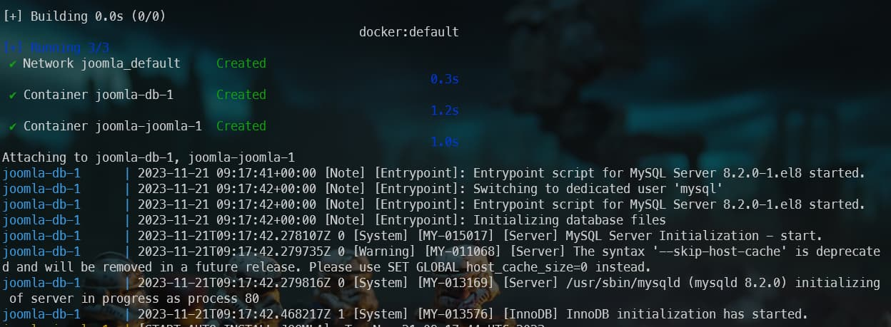
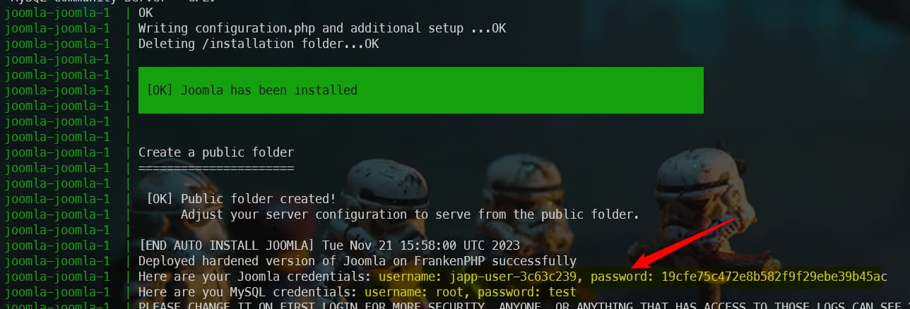
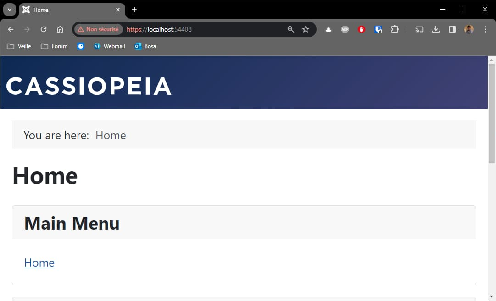

<UpdateAt
  title="Recent Changes"
  updates={[
    { date: "2023-11-21", content: "Docker image available on hub.docker.com" },
  ]}
/>

<!-- markdownlint-disable MD036 -->

Based on [their documentation](https://speakerdeck.com/dunglas/the-php-revolution-is-underway-frankenphp-1-dot-0-beta), [FrankenPHP](https://frankenphp.dev/) is 3.5 faster than PHP FPM.

It is still fairly young for use on production sites, but because it's so promising, it's certainly worth playing with when developing locally.

[Alexandre Elisé](https://github.com/alexandreelise) has written a script to use FrankenPHP with Joomla. You can find the source here: [https://github.com/alexandreelise/frankenphp-joomla](https://github.com/alexandreelise/frankenphp-joomla).

<!-- truncate -->

I invite you to play with it on your development machine (unless you have your own servers; you certainly won't be able to use FrankenPHP at your hosting company).

Here is how to do:

* go back, for instance, in your `/tmp/joomla` folder
* open your browser and surf to [https://github.com/alexandreelise/frankenphp-joomla],
* follow instructions given by Alexandre in his `Getting Started` readme file.

:::tip Don't build the image yourself
My suggestion is to replace the `compose.yaml` file with the one below. Like this, you'll reuse the image publicly made available by Alexandre and don't need to build it yourself (much faster):

<Snippet filename="compose.yaml">

```yaml
services:

  joomla:
    image: alexandreelise/frankenphp-joomla:hardened-mysql-0.1.1
    restart: always
    ports:
      - 80:80
      - 443:443
    environment:
      - MYSQL_ROOT_PASSWORD=test
      - JOOMLA_DB_HOST=db
      - JOOMLA_DB_USER=exampleuser
      - JOOMLA_DB_PASSWORD=examplepass
      - JOOMLA_DB_NAME=exampledb
    volumes:
      - joomla:/app/public
    depends_on:
      - db

  db:
    image: mysql:8.2
    environment:
      - MYSQL_DATABASE=exampledb
      - MYSQL_USER=exampleuser
      - MYSQL_PASSWORD=examplepass
      - MYSQL_ROOT_PASSWORD=test
    volumes:
      - db:/var/lib/mysql

volumes:
  joomla:
  db:
```

</Snippet>

:::

By running `docker compose pull`, Docker will download the two images; the one with FrankenPHP and Joomla and, the second, the one for MySQL. Depending on the speed of your Internet connection, this will take a few tens of seconds; only the first time.

Then, you just need to create containers based on the images by running `docker compose up`. You'll start the get logs messages on the console *(because, here, you've not used the `--detach` flag for the illustration)*:



:::caution Please wait until MySQL is ready
You have now to wait **a few minutes** before the database connection is ready. You will have the feeling the installation fails due to a lot of `[ERROR] Connection refused` lines but just wait.
:::

The fact is Joomla will try to connect to MySQL while the MySQL container is not ready to handle connections. You'll then see a lot of `[ERROR] Connection refused`. Stay patient and after a while, you'll get this:



:::note Logs can be different in your version
Depending on the version of the used Docker images, scripts and version of Joomla, the logs statements can differs in time.
:::

When everything has been successfully done, just run surf to `https://localhost:443` to get your Joomla site running on FrankenPHP. To get access to your administrator page, surf to `https://localhost:443/administrator`. Credentials to use can be retrieved in the logs as showed by the red arrow on the image here above. You can retrieve them too using this command: `docker compose logs | grep -i "Here are your Joomla credentials:"`.

:::note FrankenPHP is using SSL and thus https
Please note that FrankenPHP is delivering your site using `https`. The way Alexandre has built his script, the port number is not fixed. To determine which port to use, start a new Linux console and run `docker container list` to get the list of running containers. You'll see the port to use to access to your FrankenPHP site in the `PORTS` column. Also displayed in your `Docker Desktop` Windows application, go then to the list of containers to get the port.
:::



You'll perhaps not see a major increase in speed on your machine since you're the only visitor but it's nice to think that you're surfing so fast ... locally ;).

:::caution Ouch, it's terribly slow to run
To be honest, before being able to see my Joomla localhost homepage, I've wait more than 15 minutes (the first time). I would never have wait so long if I hadn't had to finish this chapter.
:::
