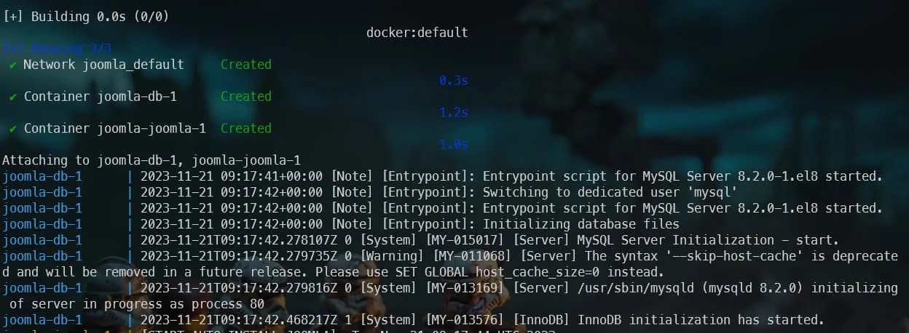
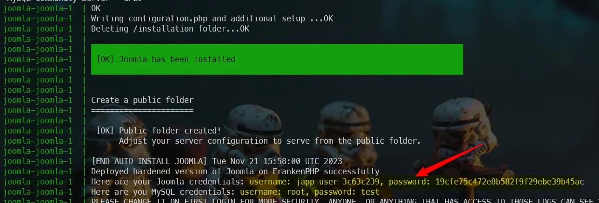

<!-- markdownlint-disable MD036 -->

Based on [their documentation](https://speakerdeck.com/dunglas/the-php-revolution-is-underway-frankenphp-1-dot-0-beta), [FrankenPHP](https://frankenphp.dev/) is 3.5 times faster than PHP FPM.

It is still fairly young for use on production sites, but because it's so promising, it's certainly worth playing with when developing locally.

[Alexandre Elisé](https://github.com/alexandreelise) has written a script to use FrankenPHP with Joomla. You can find the source here: [https://github.com/alexandreelise/frankenphp-joomla](https://github.com/alexandreelise/frankenphp-joomla).

<!-- truncate -->

I invite you to play with it on your development machine (unless you have your own servers; you certainly won't be able to use FrankenPHP at your hosting company).

Here's how to do it:

* go, for instance, in your `/tmp/joomla` folder
* open your browser and surf to [https://github.com/alexandreelise/frankenphp-joomla],
* follow the instructions given by Alexandre in his `Getting Started` readme file.

<AlertBox variant="info" title="Don't build the image yourself">
My suggestion is to replace the `compose.yaml` file with the one below. This way, you'll reuse the image publicly made available by Alexandre and do not need to build it yourself (much faster):

<Snippet filename="compose.yaml" source="./files/compose.yaml" />

</AlertBox>

By running `docker compose pull`, Docker will download the two images; the one with FrankenPHP and Joomla and the one for MySQL. Depending on the speed of your Internet connection, this will take a few seconds; only the first time.

Then, you just need to create containers based on the images by running `docker compose up`. You'll start getting logs messages on the console *(because, here, you have not used the `--detach` flag for the illustration)*:

<AlertBox variant="highlyImportant" title="Please wait until MySQL is ready">
You now have to wait **a few minutes** before the database connection is ready. You will have the feeling that the installation fails due to a lot of `[ERROR] Connection refused` lines but just wait.
</AlertBox>

The reason is that Joomla will try to connect to MySQL while the MySQL container is not ready to handle connections. You will then see a lot of `[ERROR] Connection refused`. Stay patient and after a while, you will get this:

<AlertBox variant="note" title="Logs can be different in your version">
Depending on the version of the used Docker images, scripts and version of Joomla, the logs statements can differ in time.

</AlertBox>

When everything has been successfully done, just browse to `https://localhost:443` to get your Joomla site running on FrankenPHP. To get access to your administrator page, browse to `https://localhost:443/administrator`. Credentials to use can be retrieved in the logs as shown by the red arrow on the image above. You can retrieve them also using this command: `docker compose logs | grep -i "Here are your Joomla credentials:"`.

<AlertBox variant="note" title="FrankenPHP is using SSL and thus https">
Please note that FrankenPHP is delivering your site using `https`. The way Alexandre has built his script, the port number is not fixed. To determine which port to use, start a new Linux console and run `docker container list` to get the list of running containers. You'll see the port to use to access your FrankenPHP site in the `PORTS` column. Also displayed in your `Docker Desktop` Windows application, then go to the list of containers to get the port.

</AlertBox>

You will perhaps not see a major increase in speed on your machine since you are the only visitor but it is nice to think that you are surfing so fast locally.

<AlertBox variant="highlyImportant" title="Ouch, it's terribly slow to run">
To be honest, before being able to see my Joomla localhost homepage, I waited more than 15 minutes (the first time). I would never have waited so long if I hadn't had to finish this chapter.
</AlertBox>
