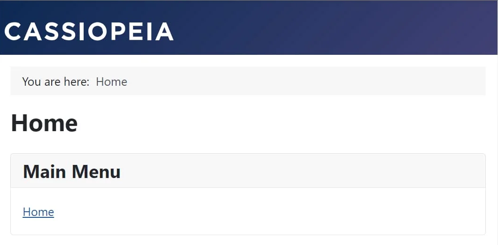
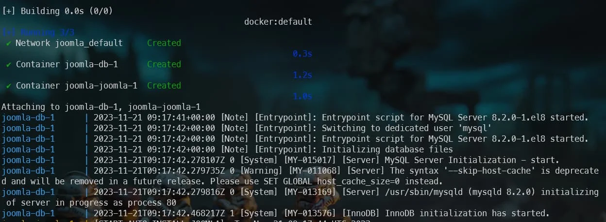
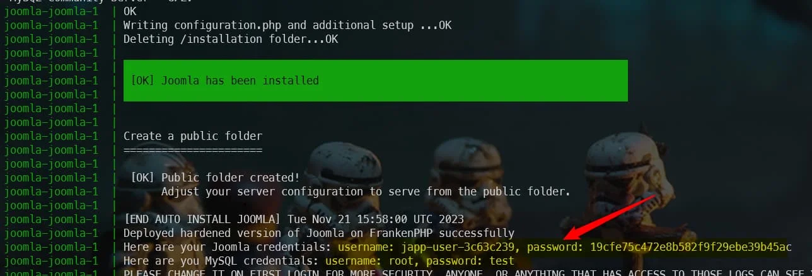

<!-- markdownlint-disable MD036 -->

<TLDR>
This article tries out FrankenPHP, a modern PHP application server claimed to be up to 3.5x faster than PHP-FPM, by running a ready-made Joomla setup (by Alexandre Elisé) via `docker compose pull && docker compose up`. It walks through the slow first-run MySQL connection warmup and accessing the resulting HTTPS Joomla site on a dynamically assigned port.
</TLDR>

Based on [their documentation](https://speakerdeck.com/dunglas/the-php-revolution-is-underway-frankenphp-1-dot-0-beta), [FrankenPHP](https://frankenphp.dev/) is 3.5 times faster than PHP FPM. It has reached a stable release since, and it's certainly worth playing with when developing locally.

So, what does a real site look like on it? Let's run a full Joomla installation and find out.

<!-- truncate -->

## What FrankenPHP gives you

A complete Joomla site, in https, served by FrankenPHP, started with two commands:

You will perhaps not see a major increase in speed on your machine since you are the only visitor, but it is nice to think that you are surfing so fast locally.

Now the honest part of the deal, before you start:

<AlertBox variant="highlyImportant" title="Ouch, it's terribly slow to run">
To be honest, before being able to see my Joomla localhost homepage, I waited more than 15 minutes (the first time). I would never have waited so long if I hadn't had to finish this chapter.
</AlertBox>

## Why it works

- FrankenPHP is a modern PHP application server built on top of the Caddy web server: one process serves PHP *and* handles https, instead of the classic *"web server talks to PHP-FPM"* pair.
- Because it keeps the PHP runtime alive between requests, its authors measure it up to 3.5 times faster than PHP-FPM.
- You don't have to assemble any of this: [Alexandre Elisé](https://github.com/alexandreelise) publishes a ready-made FrankenPHP + Joomla image, so the whole setup is a `compose.yaml` file and a `docker compose up`.

## Getting it running

I invite you to play with it on your development machine (unless you have your own servers; you certainly won't be able to use FrankenPHP at your hosting company).

Go, for instance, in your `/tmp/joomla` folder and create the `compose.yaml` file below. The source of the project is [https://github.com/alexandreelise/frankenphp-joomla](https://github.com/alexandreelise/frankenphp-joomla) and Alexandre's `Getting Started` readme file covers the other ways of running it.

<AlertBox variant="info" title="Don't build the image yourself">
My suggestion is to replace the `compose.yaml` file with the one below. This way, you'll reuse the image publicly made available by Alexandre and do not need to build it yourself (much faster):

<Snippet filename="compose.yaml" source="./files/compose.yaml" />

</AlertBox>

By running `docker compose pull`, Docker will download the two images; the one with FrankenPHP and Joomla and the one for MySQL. Depending on the speed of your Internet connection, this will take a few seconds; only the first time.

Then, you just need to create containers based on the images by running `docker compose up`.

## What happens during those long minutes

You'll start getting logs messages on the console *(because, here, you have not used the `--detach` flag for the illustration)*:

<AlertBox variant="highlyImportant" title="Please wait until MySQL is ready">
You now have to wait **a few minutes** before the database connection is ready. You will have the feeling that the installation fails due to a lot of `[ERROR] Connection refused` lines but just wait.
</AlertBox>

The reason is that Joomla will try to connect to MySQL while the MySQL container is not ready to handle connections. You will then see a lot of `[ERROR] Connection refused`. Stay patient and after a while, you will get this:

<AlertBox variant="note" title="Logs can be different in your version">
Depending on the version of the used Docker images, scripts and version of Joomla, the logs statements can differ in time.

</AlertBox>

When everything has been successfully done, just browse to `https://localhost:443` to get your Joomla site running on FrankenPHP. To get access to your administrator page, browse to `https://localhost:443/administrator`. Credentials to use can be retrieved in the logs as shown by the red arrow on the image above. You can retrieve them also using this command: `docker compose logs | grep -i "Here are your Joomla credentials:"`.

<AlertBox variant="note" title="FrankenPHP is using SSL and thus https">
Please note that FrankenPHP is delivering your site using `https`. The way Alexandre has built his script, the port number is not fixed. To determine which port to use, start a new Linux console and run `docker container list` to get the list of running containers. You'll see the port to use to access your FrankenPHP site in the `PORTS` column. This is also displayed in the `Docker Desktop` Windows application; go to the list of containers to get the port.

</AlertBox>

## Under the hood (skip this if you just want to use it)

Those `Connection refused` lines are not a FrankenPHP problem: they're the classic *"my container is started, therefore my service is ready"* mistake. A container that has started is not a database that accepts connections, and nothing in `docker compose up` tells the difference.

*This is exactly the problem healthchecks are made for; <Link to="/blog/docker-healthy">Get health information from your running containers</Link> shows how to know whether a container is really ready, and not just started.*

## Conclusion

For a local development machine, FrankenPHP is worth the detour: one image, https out of the box, and a PHP runtime that stays warm between requests. The price to pay is a first start that takes a good quarter of an hour; after that, `docker compose up` is instantaneous.

If you'd rather have a Joomla site running right now with the classic Apache + PHP-FPM stack, <Link to="/blog/docker-joomla-right-to-the-point">Start Joomla with Docker in just a few clicks</Link> gets you there in a couple of minutes.
