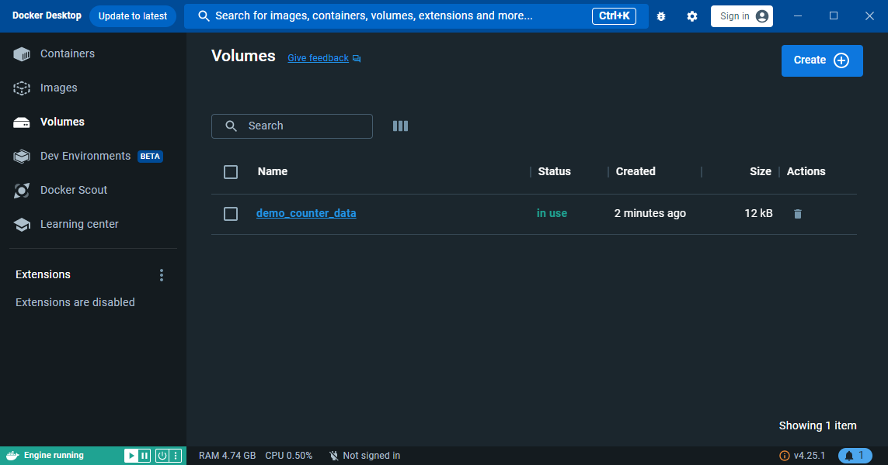
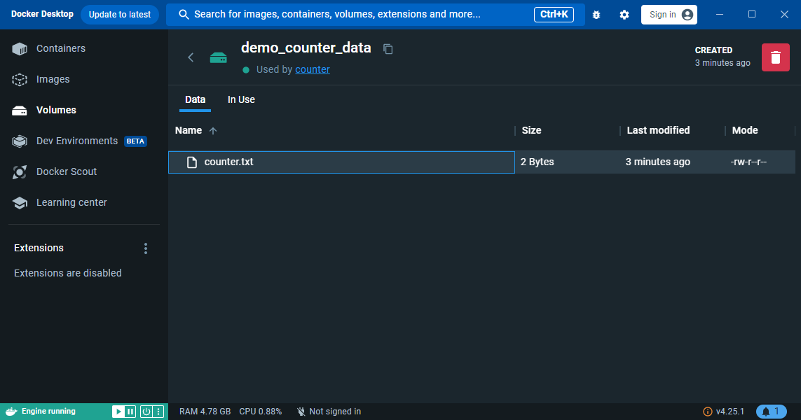
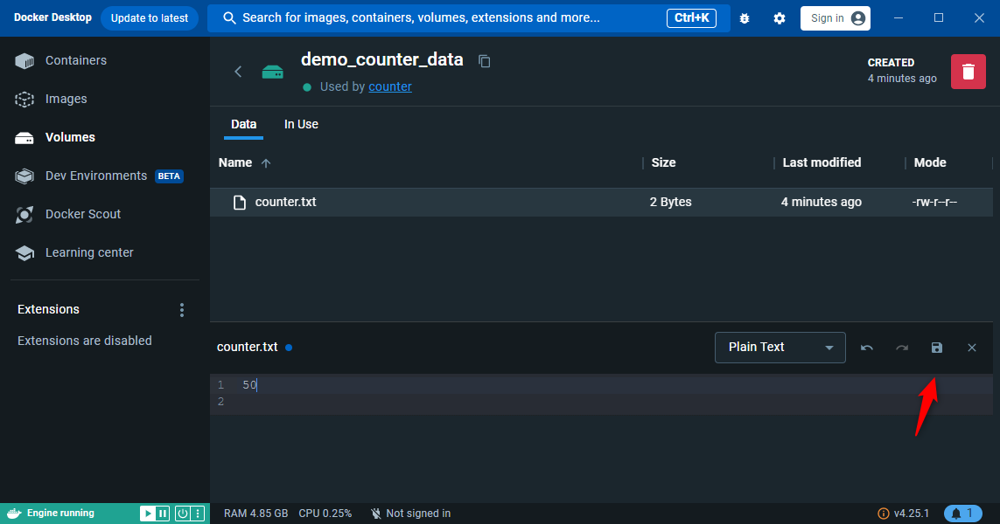
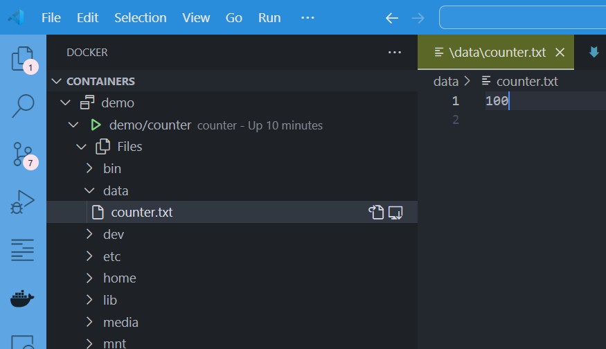

When working with a Docker container, data can be persistent or not. Imagine you're creating a localhost website with Joomla, WordPress or any other tool (Laravel, Symfony, etc.).

You've perfectly created the various Docker files needed to run the local site, you've run the command `docker compose up --detach` to start the containers and now you're busy installing the site.  After a few moments, your local site is up and you can start developing its functionalities.

By default, if you haven't taken any precautions, the moment you stop the container (`docker compose down`), you'll kill your site, i.e. by default, having not taken care to save your data (your site, your database), everything will be lost and reset the next time you run `docker compose up --detach`. Well... Maybe that was your wish (something totally ephemeral); maybe not;

<!-- truncate -->

To illustrate the notion of persistence, we're going to work with a Docker image that we'll create with our own little hands, and which will never be anything more than an execution counter. Each time the container is executed, you'll see "You have executed this script 1 time", and this number will increase with each execution.

## Creation of our Docker image

For the illustration, please start a Linux shell and run `mkdir -p /tmp/counter && cd $_`.

Now that you're in a temporary folder on your disk, please create a new file called `Dockerfile` with this content:

<Snippet filename="Dockerfile">

```docker
FROM alpine:3.14

COPY counter.sh counter.sh

RUN chmod +x counter.sh

ENTRYPOINT ["tail", "-f", "/dev/null"]
```

</Snippet>

Please, too, create a file called `counter.sh` with this content:

<Snippet filename="counter.sh">

```bash
#!/usr/bin/env sh

if [[ ! -f /data/counter.txt ]]; then
    mkdir -p /data
    echo "Creating /data/counter.txt ..."
    echo "0" > /data/counter.txt
fi

counter=$((`cat /data/counter.txt`+1))

echo "You have executed this script ${counter} times."

echo "${counter}" > /data/counter.txt
```

</Snippet>

Now, just create the Docker image by running `docker build -t demo/counter .`.

<Terminal>
$ docker image list
REPOSITORY     TAG       IMAGE ID       CREATED          SIZE
demo/counter   latest    89505911ec33   21 minutes ago   5.61MB
</Terminal>

:::tip Can't be smaller
As you can see, our image is really small. This is the advantage using the alpine Docker image.
:::

## Using our image

Now, it's time to create our `compose.yaml` file with this content:

<Snippet filename="compose.yaml">

```yaml
name: demo

services:

  counter:
    build: .
    container_name: counter
    image: demo/counter
```

</Snippet>

We'll run our container by running `docker compose up --detach`:

<Terminal>
$ docker compose up --detach

[+] Building 0.0s (0/0)                    docker:default
[+] Running 3/3
 ✔ Network demo_default  Created           0.2s
 ✔ Volume "demo_data"    Created           0.1s
 ✔ Container counter     Started
</Terminal>

We can verify our container is running using `docker container list` (simplified output):

<Terminal>
$ docker container list

CONTAINER ID   IMAGE          STATUS          NAMES
6296459f7827   demo/counter   Up 30 seconds   counter
</Terminal>

### Calling our container for the first time

`docker compose exec counter /counter.sh` is the command to use to execute our script and we'll call it multiple times:

<Terminal>
$ docker compose exec counter /counter.sh
You have executed this script 1 times.

$ docker compose exec counter /counter.sh
You have executed this script 2 times.

$ docker compose exec counter /counter.sh
You have executed this script 3 times.

$ docker compose exec counter /counter.sh
You have executed this script 4 times.

$ docker compose exec counter /counter.sh
You have executed this script 5 times.

</Terminal>

Ok so we have validated that our counter is working fine.

What about if we stop the container and start it again by running `docker compose down ; docker compose up --detach`.

Running our counter again:

<Terminal>
$ docker compose exec counter /counter.sh
You have executed this script 1 times.
</Terminal>

:::caution We've lost our data
As you can see, we've lost our counter. By stopping and starting the container, our data has been lost. And that's perfectly normal, because that's the intrinsic concept of a Docker container: it's ephemeral. **A container should be disposable; by restarting it, the container is reset.**
:::

## Introducing the notion of volume

There are two types of volumes, the ones **managed by Docker** and, on the other side, **mounted volumes**.

### Volumes managed by Docker

Update the `compose.yaml` file like this:

<Snippet filename="compose.yaml">

```yaml
name: demo

services:

  counter:
    build: .
    container_name: counter
    image: demo/counter
    // highlight-next-line
    volumes:
      // highlight-next-line
      - counter_data:/data

// highlight-next-line
volumes:
  // highlight-next-line
  counter_data:
```

</Snippet>

As you can see, we're using a `volumes` (always plural form) and we're saying that the `/data` folder inside the container should be mapped to a volume called `counter_data`. At the bottom of the `compose.yaml` file, we are just declaring our volume.

We'll start our container again: `docker compose down ; docker compose up --detach`.

But now, we should have a Docker volume called `counter_data`; let's check:

<Terminal>
$ docker volume list
DRIVER    VOLUME NAME
local     demo_counter_data
</Terminal>

Yes, we've it.

Let's try again some calls then stop/restart and a few calls then:

<Terminal>
$ docker compose exec counter /counter.sh
Creating /data/counter.txt ...
You have executed this script 1 times.

$ docker compose exec counter /counter.sh
You have executed this script 2 times.

$ docker compose exec counter /counter.sh
You have executed this script 3 times.

$ docker compose exec counter /counter.sh
You have executed this script 4 times.

$ docker compose exec counter /counter.sh
You have executed this script 5 times.

$ docker compose exec counter /counter.sh
You have executed this script 6 times.

$ docker compose down ; docker compose up --detach
[+] Running 2/2
 ✔ Container counter     Removed    11.1s
 ✔ Network demo_default  Removed     0.5s
[+] Building 0.0s (0/0)    docker:default
[+] Running 2/2
 ✔ Network demo_default  Created     0.2s
 ✔ Container counter     Started     0.7s

$ docker compose exec counter /counter.sh
You have executed this script 7 times.
$ docker compose exec counter /counter.sh
You have executed this script 8 times.
$ docker compose exec counter /counter.sh
You have executed this script 9 times.
$ docker compose exec counter /counter.sh
You have executed this script 10 times.
</Terminal>

:::tip So, our counter was well persistent this time
As you can see, by running `down` followed by `up`, we have kept the value of our counter. This value is saved in a file which is now stored in a Docker volume. As long as we don't delete the volume, our value will be preserved.
:::

You can remove the volume by running `docker volume rm demo_counter_data` but:

<Terminal>
$ docker volume rm demo_counter_data
Error response from daemon: remove demo_counter_data: volume is in use - [b976c92eed6ed4e54f6ec75d652b8977bbbd86392e604216dd61d0c446e1fc0c]
</Terminal>

Indeed, you can't remove a volume if there is still, at least, one container who use it so, you should run `docker compose down && docker volume rm demo_counter_data` or, simpler, `docker compose down --volumes`. The `--volumes` flag says to remove any volume declared in the `compose.yaml` file.

#### Location of the volumes

Volumes are stored *somewhere* on the disk by Docker, you don't need to take care about this.

<StepsCard
  title=""
  variant="remember"
  steps={[
    "Keep in mind that files are not saved in your folder<br>Let's check this"
  ]}
/>

<Terminal>
$ cd /tmp/counter

$ ls -alh
total 28K
drwxr-xr-x  2 christophe christophe 4.0K Nov 22 09:40 .
drwxrwxrwt 28 root       root        12K Nov 22 09:35 ..
-rw-r--r--  1 christophe christophe  109 Nov 22 09:36 Dockerfile
-rw-r--r--  1 christophe christophe  287 Nov 22 10:00 counter.sh
-rw-r--r--  1 christophe christophe  190 Nov 22 10:09 compose.yaml
</Terminal>

:::info Files are not stored in our project
As you can see, we've only our files, not the counter. Files stored in a volume managed by Docker aren't stored in our project's directory.
:::

:::info Location
In fact, volumes are stored in `\\wsl$\docker-desktop-data\data\docker\volumes` if you're running WSL but it's really a bad idea to access files directly from there. Let Docker do the job for you.
:::

#### Accessing files in the volume

#### Using Docker Desktop

One of the easiest ways to access the files contained in a volume is to use the Docker Desktop graphical interface.



By clicking of the volume name (`demo_counter_data` here)



By double-clicking on the filename, you'll start a basic text editor where you can, if you want, update the counter and save the change.



A new call to our counter shows that we have hacked the number:

<Terminal>
$ docker compose exec counter /counter.sh
You have executed this script 51 times.
</Terminal>

#### Using vscode

But you can, too, use Visual Studio Code to access files.

First, if needed, install the Docker extension:

* Press <kbd>CTRL</kbd>+<kbd>SHIFT</kbd>+<kbd>X</kbd> to display the `Extensions` window of vscode,
* Search for the `Docker` extension of Microsoft (make sure to search for `ms-azuretools.vscode-docker`),
* and Install the extension

Now, in the left pane, you'll see a new button for Docker. Click on it.

In the new window, you'll get the list of containers, the list of images and other things.

Deploy the list of containers, click on `demo/counter` (our container) and display the list of files.

Open the `data` root folder and right-click on `counter.txt`, our counter file and select `Open`.

Now, you can edit that file from vscode, make changes and save them.



<Terminal>
$ docker compose exec counter /counter.sh
You have executed this script 101 times.
</Terminal>

Yes, accessing files using vscode works too.

### Mounted volumes

A mounted volume is synchronized with your hard disk. Instead of letting Docker manage everything for you, you'll decide where files should be stored.

Let's make a few cleaning right now, please run `docker compose down --volumes` to kill the volume used in the previous chapter and kill the docker container.

Update the `compose.yaml` file like this:

<Snippet filename="compose.yaml">

```yaml
name: demo

services:

  counter:
    build: .
    container_name: counter
    image: demo/counter
    // highlight-next-line
    volumes:
      // highlight-next-line
      - ./data:/data
```

</Snippet>

The syntax now is, just a few, different: we don't have a `volumes` entry at the bottom of the file but we've used a relative notation like `./data:/data`.  So, the `./data` local folder (on your hard disk) has to be synchronized with the `/data` folder of the container.

By running `docker compose up --detach && docker compose exec counter /counter.sh` we'll run our counter and expect to see `You have executed this script 1 times.` but you'll probably get an error:

<Terminal>
$ docker compose exec counter /counter.sh
Creating /data/counter.txt ...

/counter.sh: line 6: can't create /data/counter.txt: nonexistent directory
cat: can't open '/data/counter.txt': No such file or directory
You have executed this script 1 times.

/counter.sh: line 13: can't create /data/counter.txt: nonexistent directory
</Terminal>

We need to create our local `data` folder:

<Terminal>
$ mkdir data

$ ls -alh
total 32K
drwxr-xr-x  3 christophe christophe 4.0K Nov 22 10:54 .
drwxrwxrwt 28 root       root        12K Nov 22 09:35 ..
-rw-r--r--  1 christophe christophe  109 Nov 22 09:36 Dockerfile
-rw-r--r--  1 christophe christophe  287 Nov 22 10:00 counter.sh
drwxr-xr-x  2 christophe christophe 4.0K Nov 22 10:54 data
-rw-r--r--  1 christophe christophe  149 Nov 22 10:48 compose.yaml
</Terminal>

Now that we've our data folder, try again:

<Terminal>
$ docker compose up --detach && docker compose exec counter /counter.sh

[+] Building 0.0s (0/0)        docker:default
[+] Running 2/2
 ✔ Network demo_default  Created         0.2s
 ✔ Container counter     Started         0.8s
Creating /data/counter.txt ...
You have executed this script 1 times.
</Terminal>

This time, the `counter.txt` file is present in our directory:

<Terminal>
$ ls -alh data

total 12K
drwxr-xr-x 2 christophe christophe 4.0K Nov 22 10:56 .
drwxr-xr-x 3 christophe christophe 4.0K Nov 22 10:54 ..
-rw-r--r-- 1 root       root          2 Nov 22 10:56 counter.txt
</Terminal>

:::caution Ouch, the file is owned by `root` not me
Uh oh! The file is owned by the root user and not me (i.e. user `christophe` in my case). That's annoying since I can't edit it or remove it without using `sudo`.
:::

The file is owned by `root` because the current user; used inside the container, is the `root` user. We need to inform Docker that he has to use ours.

To do this, we'll update once more our `compose.yaml` file:

<Snippet filename="compose.yaml">

```yaml
name: demo

services:

  counter:
    build: .
    container_name: counter
    image: demo/counter
    // highlight-next-line
    user: 1000:1000
    volumes:
      - ./data:/data
```

</Snippet>

:::tip Why 1000:1000?
We need to pass to Docker our current user id and group id so Docker will be able to create files/folders using our user. To get your current user id and group id, just run `echo "$(id -u):$(id -g)"` in the console and, you'll see, the first created user (after the installation of Linux) is, always, user id 1000, group id 1000. Most probably you.
:::

Let's try again but, first remove the incorrect file: `sudo rm -f data/counter.txt`

Then run `docker compose down && docker compose up --detach && docker compose exec counter /counter.sh`

Now, the file will be yours:

<Terminal>
$ ls -alh data
total 12K
drwxr-xr-x 2 christophe christophe 4.0K Nov 22 10:56 .
drwxr-xr-x 3 christophe christophe 4.0K Nov 22 10:54 ..
-rw-r--r-- 1 christophe christophe    2 Nov 22 10:56 counter.txt
</Terminal>

## Conclusion

<StepsCard
  title="We've seen three ways of playing with data:"
  variant="remember"
  steps={[
    "We don't care about data,",
    "We rely on Docker to manage the volume for us and",
    "We really value our data and want it to be part of our project."
  ]}
/>

Depending on your needs, you can opt for one of three solutions.

You want to *play* with a Docker container, test it, learn from it... You don't want to keep any traces on your hard disk. The first solution is perfect here i.e. don't matter about volumes.

You want to test but also keep the data somewhere without *polluting* your hard disk. You're working on something temporary, so you may want to keep the data, but you can't be sure. The second solution will suit you best i.e. self managed volumes.

On the contrary, your work is important and you don't want to lose anything. Your data must be saved on your hard disk. The third solution will be the one you use i.e. mounted volumes.
