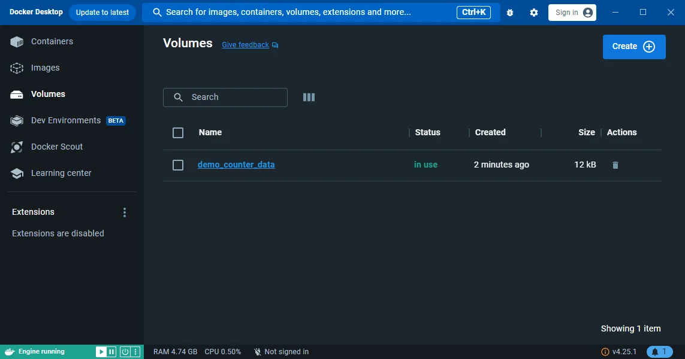
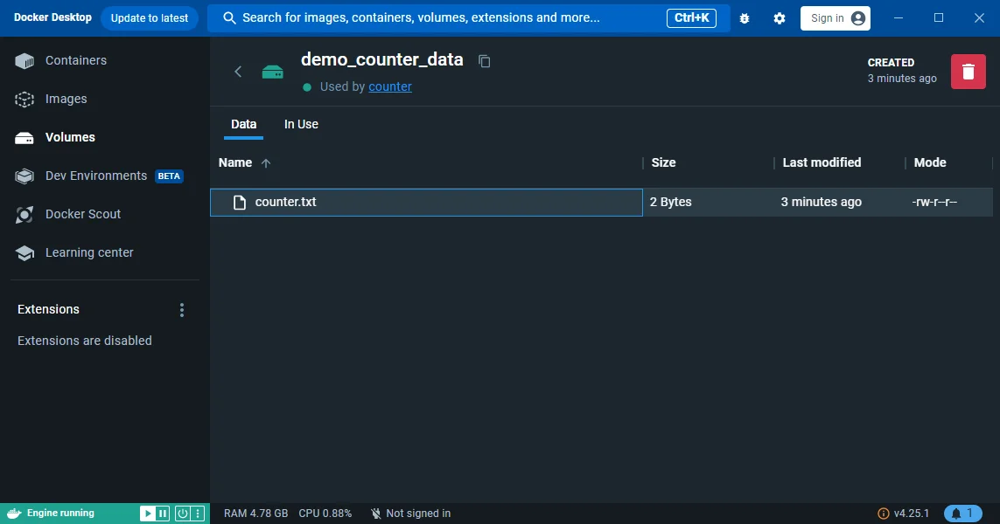
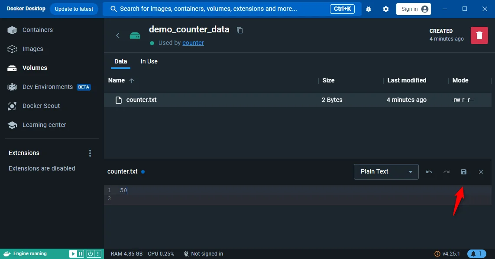
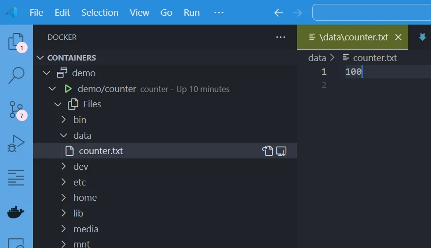

<TLDR>
This article demonstrates Docker data persistence using a simple execution-counter container: no volume means data resets on every restart; a Docker-managed volume (declared in `compose.yaml`) persists data across restarts but stores files outside your project (accessible via Docker Desktop or the VSCode Docker extension); and a mounted/bind volume (`./data:/data`) syncs data straight into your project folder on disk — with a note on using `user: 1000:1000` to avoid `root`-owned files.
</TLDR>

When working with a Docker container, data can be persistent or not. Imagine you're creating a localhost website with <Link to="/blog/docker-joomla-right-to-the-point">Joomla</Link>, <Link to="/blog/docker-wordpress">WordPress</Link> or any other tool (Laravel, Symfony, etc.).

You've perfectly created the various Docker files needed to run the local site, you've run the command `docker compose up --detach` to start the containers and now you're busy installing the site.  After a few moments, your local site is up and you can start developing its functionalities.

By default, if you haven't taken any precautions, the moment you stop the container (`docker compose down`), you'll kill your site, i.e., having not taken care to save your data (your site, your database), everything will be lost and reset the next time you run `docker compose up --detach`. Well... Maybe that was your wish (something totally ephemeral); maybe not.

<!-- truncate -->

This article focuses on the different kinds of volumes and when to reach for each; if you just want to get files in and out of a running container, <Link to="/blog/docker-volume">Share data between your running Docker container and your computer</Link> covers that narrower case.

## What a volume changes

To illustrate the notion of persistence, we're going to work with a Docker image that does one single thing: count how many times it has been executed. Let's call it five times:

<Terminal typewriter source="./files/terminal-8.txt" />

Now stop and start the container by running `docker compose down ; docker compose up --detach`, then call the counter again:

<Terminal typewriter>
$ docker compose exec counter /counter.sh
You have executed this script 1 times.
</Terminal>

<AlertBox variant="caution" title="We've lost our data">
As you can see, we've lost our counter. By stopping and starting the container, our data has been lost. And that's perfectly normal, because that's the intrinsic concept of a Docker container: it's ephemeral. **A container should be disposable; by restarting it, the container is reset.**

</AlertBox>

Now exactly the same scenario, after adding three lines to `compose.yaml` to declare a volume:

<Terminal typewriter source="./files/terminal-7.txt" />

Same `down`, same `up`, and the counter picks up at 7 where it stopped at 6. That's the whole subject of this article.

## Why it works

There are three strategies, and choosing between them is the real decision:

- **No volume at all** (the default): everything the container writes lives and dies with it. Perfect for a container you're just playing with.
- **A volume managed by Docker**: the data survives `down`/`up`, but Docker stores it *somewhere* outside your project, and it's Docker's job to know where.
- **A mounted volume** (bind mount): you decide, the data lands in a folder of your project, on your disk, visible in your editor.

The demo below walks through the three of them with the same counter.

## Setting up the demo

For the illustration, please start a Linux shell and run `mkdir -p /tmp/counter && cd $_`.

Now that you're in a temporary folder on your disk, please create a new file called `Dockerfile` with this content:

<Snippet filename="Dockerfile" source="./files/Dockerfile" defaultOpen={false} />

Please, too, create a file called `counter.sh` with this content:

<Snippet filename="counter.sh" source="./files/counter.sh" defaultOpen={false} />

Now, just create the Docker image by running `docker build -t demo/counter .`.

<Terminal typewriter>
$ docker image list
REPOSITORY     TAG       IMAGE ID       CREATED          SIZE
demo/counter   latest    89505911ec33   21 minutes ago   5.61MB
</Terminal>

<AlertBox variant="info" title="Can't be smaller">
As you can see, our image is really small. This is the advantage using the alpine Docker image.

</AlertBox>

Then create the `compose.yaml` file. This is the first strategy: no volume at all, hence the counter reset you saw above.

<Snippet filename="compose.yaml" source="./files/compose.yaml" defaultOpen={false} />

We'll run our container by running `docker compose up --detach`:

<Terminal typewriter source="./files/terminal-9.txt" />

We can verify our container is running using `docker container list` (simplified output):

<Terminal typewriter>
$ docker container list

CONTAINER ID   IMAGE          STATUS          NAMES
6296459f7827   demo/counter   Up 30 seconds   counter
</Terminal>

`docker compose exec counter /counter.sh` is the command used above to execute our script.

## Volumes managed by Docker

Update the `compose.yaml` file like this:

<Snippet filename="compose.yaml" source="./files/compose.volumes.yaml" />

As you can see, we're using a `volumes` (always plural form) and we're saying that the `/data` folder inside the container should be mapped to a volume called `counter_data`. At the bottom of the `compose.yaml` file, we are just declaring our volume. These are the three lines that produced the persistent counter shown at the top of this article.

We'll start our container again: `docker compose down ; docker compose up --detach`.

But now, we should have a Docker volume called `counter_data`; let's check:

<Terminal typewriter>
$ docker volume list
DRIVER    VOLUME NAME
local     demo_counter_data
</Terminal>

Yes, there it is.

<AlertBox variant="info" title="So, our counter was well persistent this time">
As you can see, by running `down` followed by `up`, we have kept the value of our counter. This value is saved in a file which is now stored in a Docker volume. As long as we don't delete the volume, our value will be preserved.

</AlertBox>

You can remove the volume by running `docker volume rm demo_counter_data` but:

<Terminal typewriter>
$ docker volume rm demo_counter_data
Error response from daemon: remove demo_counter_data: volume is in use - [b976c92eed6ed4e54f6ec75d652b8977bbbd86392e604216dd61d0c446e1fc0c]
</Terminal>

Indeed, you can't remove a volume if there is still at least one container using it, so you should run `docker compose down && docker volume rm demo_counter_data` or, simpler, `docker compose down --volumes`. The `--volumes` flag says to remove any volume declared in the `compose.yaml` file.

## Mounted volumes

A mounted volume is synchronized with your hard disk. Instead of letting Docker manage everything for you, you'll decide where files should be stored.

Let's do some cleanup right now; please run `docker compose down --volumes` to kill the volume used in the previous chapter and kill the docker container.

Update the `compose.yaml` file like this:

<Snippet filename="compose.yaml" source="./files/compose.mounted_volumes.yaml" />

The syntax now is just slightly different: we don't have a `volumes` entry at the bottom of the file but we've used a relative notation like `./data:/data`.  So, the `./data` local folder (on your hard disk) has to be synchronized with the `/data` folder of the container.

By running `docker compose up --detach && docker compose exec counter /counter.sh` we'll run our counter and expect to see `You have executed this script 1 times.` but you'll probably get an error:

<Terminal typewriter source="./files/terminal-5.txt" />

We need to create our local `data` folder:

<Terminal typewriter source="./files/terminal-4.txt" />

Now that we've our data folder, try again:

<Terminal typewriter source="./files/terminal-3.txt" />

This time, the `counter.txt` file is present in our directory:

<Terminal typewriter source="./files/terminal-2.txt" />

<AlertBox variant="caution" title="Ouch, the file is owned by `root` not me">
Uh oh! The file is owned by the root user and not me (i.e. user `christophe` in my case). That's annoying since I can't edit it or remove it without using `sudo`.

</AlertBox>

That last one is a one-line fix, described in the next section.

## Under the Hood (skip this if you just want to use it)

### Getting your own files back from a mounted volume

The file is owned by `root` because the current user; used inside the container, is the `root` user. We need to inform Docker that he has to use ours.

To do this, we'll update once more our `compose.yaml` file:

<Snippet filename="compose.yaml" source="./files/compose.mounted_volumes_permissions.yaml" />

<AlertBox variant="info" title="Why 1000:1000?">
We need to pass to Docker our current user id and group id so Docker will be able to create files/folders using our user. To get your current user id and group id, just run `echo "$(id -u):$(id -g)"` in the console and, you'll see, the first created user (after the installation of Linux) is, always, user id 1000, group id 1000. Most probably you.

</AlertBox>

Let's try again but, first remove the incorrect file: `sudo rm -f data/counter.txt`

Then run `docker compose down && docker compose up --detach && docker compose exec counter /counter.sh`

Now, the file will be yours:

<Terminal typewriter source="./files/terminal-1.txt" />

### Location of the volumes managed by Docker

Volumes are stored *somewhere* on the disk by Docker, you don't need to take care about this. And, above all, they are not saved in your project folder; let's check this:

<Terminal typewriter source="./files/terminal-6.txt" />

<AlertBox variant="info" title="Files are not stored in our project">
As you can see, we've only our files, not the counter. Files stored in a volume managed by Docker aren't stored in our project's directory.

</AlertBox>

<AlertBox variant="info" title="Location">
In fact, volumes are stored in `\\wsl$\docker-desktop-data\data\docker\volumes` if you're running WSL but it's really a bad idea to access files directly from there. Let Docker do the job for you.

</AlertBox>

### Accessing files in the volume using Docker Desktop

One of the easiest ways to access the files contained in a volume is to use the Docker Desktop graphical interface.

By clicking on the volume name (`demo_counter_data` here), you'll see the list of files it contains.

By double-clicking on the filename, you'll start a basic text editor where you can, if you want, update the counter and save the change.

A new call to our counter shows that we have hacked the number:

<Terminal typewriter>
$ docker compose exec counter /counter.sh
You have executed this script 51 times.
</Terminal>

### Accessing files in the volume using vscode

But you can, too, use Visual Studio Code to access files.

First, if needed, install the Docker extension:

- Press <kbd>CTRL</kbd>+<kbd>SHIFT</kbd>+<kbd>X</kbd> to display the `Extensions` window of vscode,
- Search for the `Docker` extension of Microsoft (make sure to search for `ms-azuretools.vscode-docker`),
- and Install the extension

Now, in the left pane, you'll see a new button for Docker. Click on it.

In the new window, you'll get the list of containers, the list of images and other things.

Expand the list of containers, click on `demo/counter` (our container) and display the list of files.

Open the `data` root folder and right-click on `counter.txt`, our counter file, and select `Open`.

Now, you can edit that file from vscode, make changes and save them.

<Terminal typewriter>
$ docker compose exec counter /counter.sh
You have executed this script 101 times.
</Terminal>

Yes, accessing files using vscode works too.

## Conclusion

Depending on your needs, you can opt for one of three solutions.

You want to *play* with a Docker container, test it, learn from it... You don't want to keep any traces on your hard disk. The first solution is perfect here i.e. don't matter about volumes.

You want to test but also keep the data somewhere without *polluting* your hard disk. You're working on something temporary, so you may want to keep the data, but you can't be sure. The second solution will suit you best i.e. self managed volumes.

On the contrary, your work is important and you don't want to lose anything. Your data must be saved on your hard disk. The third solution will be the one you use i.e. mounted volumes.

The question to ask yourself is never *"do I need a volume?"* but *"who owns this data: the container, Docker, or me?"*. And when the answer is *me*, don't forget the `user: 1000:1000` line, or you'll be typing `sudo` on your own files. To go further with bind mounts and the `-v` flag on a plain `docker run`, see <Link to="/blog/docker-volume">Share data between your running Docker container and your computer</Link>.
