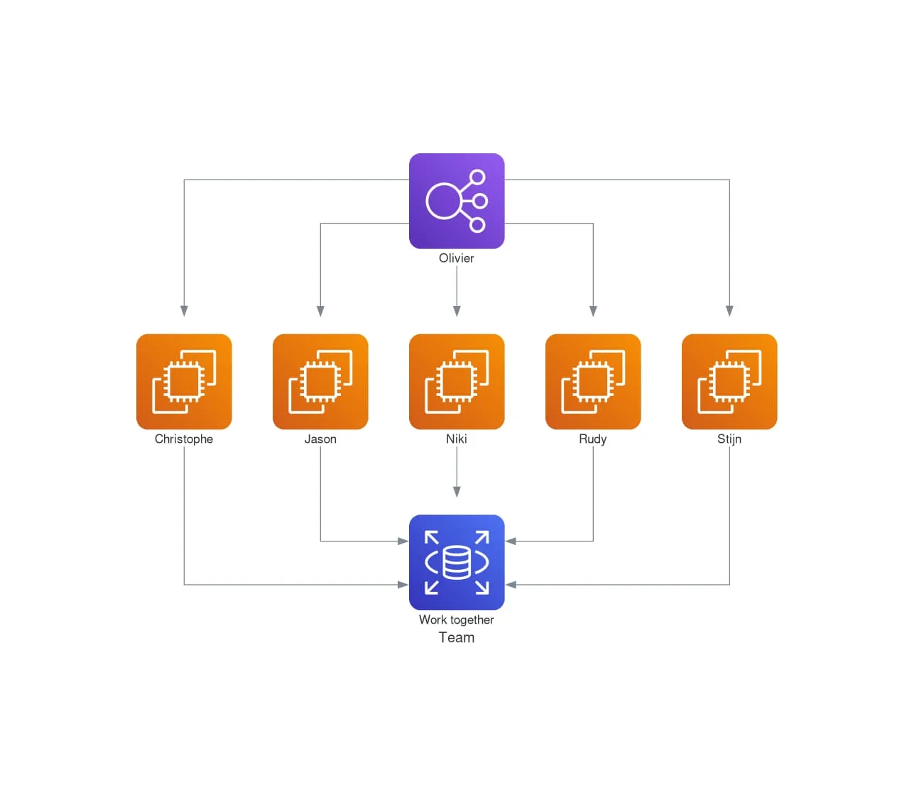
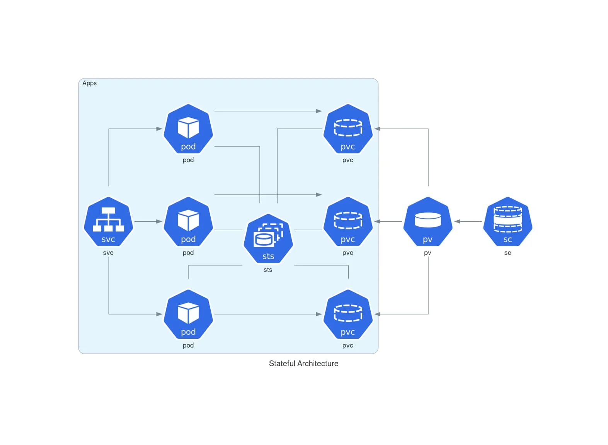

But what a joy it is to be able to draw diagrams by just writing text. Some tools are better known than others, e.g. [Mermaid](https://mermaid-js.github.io/mermaid/).

Did you know [https://diagrams.mingrammer.com/](https://diagrams.mingrammer.com/)? Let's explore it using, of course, a Docker ready-to-use image.

<!-- truncate -->

Take a look at the different examples you can find at [https://github.com/mingrammer/diagrams](https://github.com/mingrammer/diagrams).

As always, for the demo, please start a Linux shell and run `mkdir -p /tmp/docker-diagrams && cd $_` to create a folder called `docker-diagrams` in your Linux temporary folder and jump in it.

Please create a new file called `team.py` with this content:

<Snippet filename="team.py" source="./files/team.py" />

To run the conversion, go back to your console and run the following command:

<Terminal>
$ cat team.py | docker run -i --rm -v $(pwd):/out -u 1000:1000 gtramontina/diagrams:0.23.3
</Terminal>

<AlertBox variant="note" title="Windows notation">
If you're working on Windows, replace `$(pwd)` with `%CD%`. And replace `cat` by `type`.

</AlertBox>

And bingo, the script is converted to the image below:

*0.23.3 is the latest version available when writing this document. See [https://hub.docker.com/r/gtramontina/diagrams/tags](https://hub.docker.com/r/gtramontina/diagrams/tags) to retrieve the latest one.*

Easy, right?

Another example:

<Snippet filename="app/Providers/EventServiceProvider.php" source="./files/EventServiceProvider.php" />

And the resulting image:

Crazy, right? And all of this without installing anything!

<AlertBox variant="info" title="More example">
Retrieve more samples at [https://diagrams.mingrammer.com/docs/getting-started/examples](https://diagrams.mingrammer.com/docs/getting-started/examples)

</AlertBox>

The Docker image code base is here: [https://github.com/gtramontina/docker-diagrams](https://github.com/gtramontina/docker-diagrams).

## Icons (called Nodes)

A tremendous list of icons/nodes is available on multiple pages at [https://diagrams.mingrammer.com/docs/nodes/onprem](https://diagrams.mingrammer.com/docs/nodes/onprem). See [OnPrem](https://diagrams.mingrammer.com/docs/nodes/onprem), [AWS](https://diagrams.mingrammer.com/docs/nodes/aws), [Azure](https://diagrams.mingrammer.com/docs/nodes/azure), [GCP](https://diagrams.mingrammer.com/docs/nodes/gcp), [IBM](https://diagrams.mingrammer.com/docs/nodes/ibm), [K8S](https://diagrams.mingrammer.com/docs/nodes/k8s) and also how to create our own (using local `.png` images): [Custom](https://diagrams.mingrammer.com/docs/nodes/custom).

## Other tools

* [DB Diagram](https://dbdiagram.io/home)
* [DBML-renderer](https://github.com/softwaretechnik-berlin/dbml-renderer), dbml-renderer renders DBML files to SVG images
* [Graphviz](https://www.graphviz.org/), Graphviz is open source graph visualization software
* [JSON Crack](https://jsoncrack.com/), seamlessly visualize your JSON data instantly into graphs
* [Kroki](https://kroki.io/), creates diagrams from textual descriptions
* [Mermaid](https://mermaid-js.github.io/mermaid/), his [live editor](https://mermaid.live/), the [preview addon for vscode](https://marketplace.visualstudio.com/items?itemName=vstirbu.vscode-mermaid-preview) and the [convert tool as a CLI tool](https://github.com/mermaid-js/mermaid-cli)
* [Nomnoml](https://www.nomnoml.com/), tool for drawing UML diagrams based on a simple syntax
* [Pikchr](https://pikchr.org/), Pikchr (pronounced "picture") is a PIC-like markup language for diagrams in technical documentation
* [Plantuml](https://github.com/plantuml/plantuml), generate diagrams from textual description
* [Sequence diagram](https://sequencediagram.org/) *(seems based on Mermaid)*
* [Structurizr](https://github.com/structurizr/dsl), a way to create Structurizr software architecture models based upon the C4 model using a textual domain specific language
* [svgbob](https://github.com/ivanceras/svgbob), convert your ascii diagram scribbles into happy little SVG
* [Vega](https://vega.github.io/vega/), A Visualization Grammar
* [yEd Graph Editor](https://www.yworks.com/products/yed), Graphical interface, you will need to drag & drop objects, resize. It does not support text files like the other tools already mentioned here.
