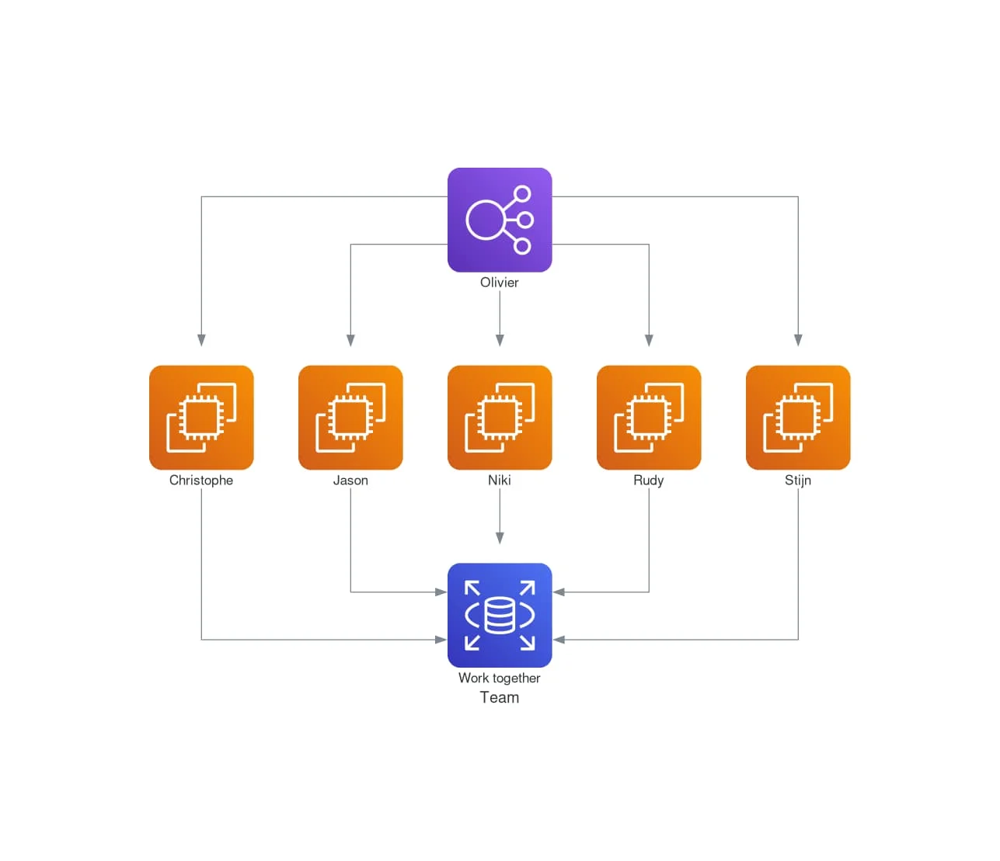
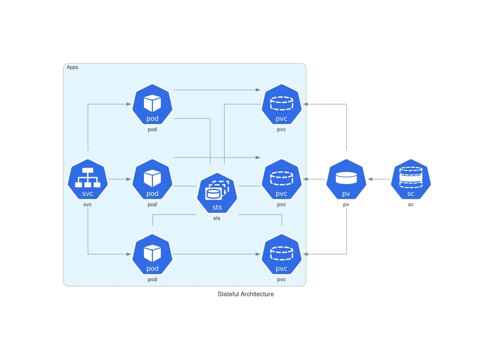

<TLDR>
This article shows how to render diagrams-as-code with the Python `diagrams` library via a ready-to-use Docker image (`gtramontina/diagrams`), piping a `.py` file into `docker run` to produce architecture diagrams (e.g. AWS/Azure/GCP icons) with zero local install. It closes with a broad roundup of other diagram-as-code tools: Mermaid, PlantUML, Graphviz, Kroki, DBML-renderer, Structurizr, and more.
</TLDR>

But what a joy it is to be able to draw diagrams by just writing text. Some tools are better known than others, e.g. [Mermaid](https://mermaid-js.github.io/mermaid/) — which I've since automated in <Link to="/blog/docker-python-mermaid">Documentation as Code - Transform Your Infrastructure into Beautiful Diagrams with Python and Mermaid</Link>, and whose Graphviz cousin is covered in <Link to="/blog/python-pydot">Python - Generate flows using pydot</Link>.

Did you know [https://diagrams.mingrammer.com/](https://diagrams.mingrammer.com/)? Let's explore it using, of course, a Docker ready-to-use image.

<!-- truncate -->

## What comes out

Here is a diagram produced by this article, and nothing but text went in:

The command that produced it is a single line; the `.py` file is piped into a container and the `.png` lands in your current folder:

<Terminal typewriter>
$ cat team.py | docker run -i --rm -v $(pwd):/out -u 1000:1000 gtramontina/diagrams:0.23.3
</Terminal>

## Why it works

- The `.py` file is not executed on your machine: it's piped into the container, which contains Python, the `diagrams` library, Graphviz and the whole AWS/Azure/GCP/K8S icon sets.
- `-v $(pwd):/out` is what makes the generated image come back to your folder instead of dying with the container.
- `-u 1000:1000` runs the container as you, so the produced file belongs to your user and not to `root`.

<AlertBox variant="note" title="Windows notation">
If you're working on Windows, replace `$(pwd)` with `%CD%`. And replace `cat` by `type`.

</AlertBox>

## The source

As always, for the demo, please start a Linux shell and run `mkdir -p /tmp/docker-diagrams && cd $_` to create a folder called `docker-diagrams` in your Linux temporary folder and jump in it.

Please create a new file called `team.py` with the content that produced the diagram above:

<Snippet filename="team.py" source="./files/team.py" />

Then run the conversion command shown here above.

*0.23.3 is the latest version available when writing this document. See [https://hub.docker.com/r/gtramontina/diagrams/tags](https://hub.docker.com/r/gtramontina/diagrams/tags) to retrieve the latest one.*

Easy, right?

## A real architecture

Twenty lines of Python for a team chart is nice; here is the same exercise on an actual infrastructure:

<Snippet filename="stateful.py" source="./files/stateful.py" />

And the resulting image:

Crazy, right? And all of this without installing anything!

<AlertBox variant="info" title="More example">
Retrieve more samples at [https://diagrams.mingrammer.com/docs/getting-started/examples](https://diagrams.mingrammer.com/docs/getting-started/examples)

</AlertBox>

The Docker image code base is here: [https://github.com/gtramontina/docker-diagrams](https://github.com/gtramontina/docker-diagrams), and you'll find plenty of other examples at [https://github.com/mingrammer/diagrams](https://github.com/mingrammer/diagrams).

## Icons and other tools (reference, skip this for now)

A tremendous list of icons/nodes is available on multiple pages at [https://diagrams.mingrammer.com/docs/nodes/onprem](https://diagrams.mingrammer.com/docs/nodes/onprem). See [OnPrem](https://diagrams.mingrammer.com/docs/nodes/onprem), [AWS](https://diagrams.mingrammer.com/docs/nodes/aws), [Azure](https://diagrams.mingrammer.com/docs/nodes/azure), [GCP](https://diagrams.mingrammer.com/docs/nodes/gcp), [IBM](https://diagrams.mingrammer.com/docs/nodes/ibm), [K8S](https://diagrams.mingrammer.com/docs/nodes/k8s) and also how to create our own (using local `.png` images): [Custom](https://diagrams.mingrammer.com/docs/nodes/custom).

And, since `diagrams` is far from being the only text-to-picture tool around, here is the list I keep coming back to:

- [DB Diagram](https://dbdiagram.io/home) *(see also <Link to="/blog/drawdb-app">Drawdb-app - Render your database model as png, markdown, mermaid, ...</Link>)*
- [DBML-renderer](https://github.com/softwaretechnik-berlin/dbml-renderer), dbml-renderer renders DBML files to SVG images
- [Graphviz](https://www.graphviz.org/), Graphviz is open source graph visualization software
- [JSON Crack](https://jsoncrack.com/), seamlessly visualize your JSON data instantly into graphs *(I've dedicated an article to it: <Link to="/blog/json-crack">Rendering a JSON file as a mind map</Link>)*
- [Kroki](https://kroki.io/), creates diagrams from textual descriptions
- [Mermaid](https://mermaid-js.github.io/mermaid/), its [live editor](https://mermaid.live/), the [preview addon for vscode](https://marketplace.visualstudio.com/items?itemName=vstirbu.vscode-mermaid-preview) and the [convert tool as a CLI tool](https://github.com/mermaid-js/mermaid-cli)
- [Nomnoml](https://www.nomnoml.com/), tool for drawing UML diagrams based on a simple syntax
- [Pikchr](https://pikchr.org/), Pikchr (pronounced "picture") is a PIC-like markup language for diagrams in technical documentation
- [Plantuml](https://github.com/plantuml/plantuml), generate diagrams from textual description
- [Sequence diagram](https://sequencediagram.org/) *(seems based on Mermaid)*
- [Structurizr](https://github.com/structurizr/dsl), a way to create Structurizr software architecture models based upon the C4 model using a textual domain specific language
- [svgbob](https://github.com/ivanceras/svgbob), convert your ascii diagram scribbles into happy little SVG
- [Vega](https://vega.github.io/vega/), A Visualization Grammar
- [yEd Graph Editor](https://www.yworks.com/products/yed), a graphical interface: you will need to drag & drop objects and resize them. It does not support text files like the other tools already mentioned here.

## Conclusion

Architecture diagrams that live in your repository, that you can diff and review like any other file, and that never require Python or Graphviz on your machine. The next time the infrastructure changes, you edit a line of text instead of dragging a box.

If you'd rather stay with a syntax you already know, <Link to="/blog/docker-python-mermaid">Documentation as Code - Transform Your Infrastructure into Beautiful Diagrams with Python and Mermaid</Link> does the same trick with Mermaid.
