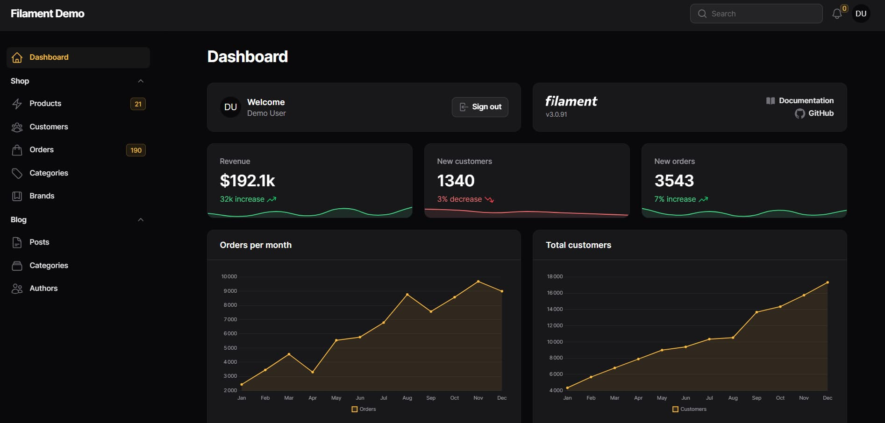

<!-- cspell:ignore ailwind,lpine,aravel,ivewire -->

Filament is a *collection of beautiful full-stack components. The perfect starting point for your next app.* i.e. a set of **free-to-use** components and promises that we'll be able to quickly build nice administration interfaces.

The competitor of Filament is the official [Laravel Nova](https://nova.laravel.com/) which is a paid software.

Filament is built using the latest technologies: the **TALL** stack. This acronym sums up the technologies used: **T**ailwind, **A**lpine, **L**aravel and **L**ivewire.

<!-- truncate -->

There is an [online demo](https://demo.filamentphp.com/) to quickly see the benefits of Filament if you need to develop a management interface with Laravel.

Read more: [https://filamentphp.com/](https://filamentphp.com/) and [https://github.com/filamentphp/filament](https://github.com/filamentphp/filament)
