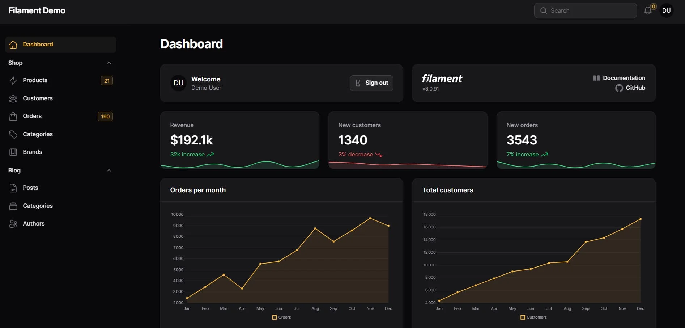

<!-- cspell:ignore ailwind,lpine,aravel,ivewire -->

<TLDR>
This article introduces Laravel Filament, a free, TALL-stack (Tailwind, Alpine, Laravel, Livewire) set of full-stack components for quickly building admin interfaces — a free alternative to the paid Laravel Nova — and explains why it is worth reaching for in a real project: CRUD screens generated from a single PHP class, no separate API/frontend to maintain, and authorization that reuses your existing Laravel policies.
</TLDR>

Filament is a *collection of beautiful full-stack components. The perfect starting point for your next app.* It is a set of **free-to-use** components and promises that we'll be able to quickly build nice administration interfaces.

The competitor to Filament is the official [Laravel Nova](https://nova.laravel.com/) which is a paid software.

Filament is built using the latest technologies: the **TALL** stack. This acronym sums up the technologies used: **T**ailwind, **A**lpine, **L**aravel and **L**ivewire.

<!-- truncate -->

There is also an [online demo](https://demo.filamentphp.com/) to quickly see the benefits of Filament if you need to develop a management interface with Laravel.

<BrowserWindow url="http://localhost/">
  
</BrowserWindow>

## Why Bother With Filament in a Real Project

Every Laravel project ends up needing *some* back-office: a screen to manage users, edit products,
review orders, moderate content. Building that by hand — routes, controllers, Blade views, form
validation, pagination, search — is the same boilerplate every single time. That's exactly the
itch Filament scratches:

- **CRUD from a single class.** A Filament "Resource" is one PHP class describing an Eloquent
  model's form fields and table columns; list, create, edit and delete screens are generated from
  it — no hand-written Blade views for the common case.
- **No separate frontend or API to maintain.** Because it's built on Livewire, the admin panel is
  server-rendered PHP that reacts like a SPA. There's no React/Vue app, no REST or GraphQL layer
  to expose and secure just so an internal panel can talk to your data.
- **Authorization you already wrote.** Filament reads Laravel's own [policies](https://laravel.com/docs/authorization)
  to decide who can view, create, update or delete a resource — no parallel permission system to
  keep in sync with the rest of the app.
- **Relations, not just fields.** Belongs-to, has-many and many-to-many relationships get
  dedicated widgets (select, repeater, pivot tables) out of the box, which is usually the part
  that takes the longest to hand-roll.
- **A plugin ecosystem for the rest.** Import/export, impersonation, spatie permissions,
  activity logs, multi-tenancy — most of what a back-office needs beyond plain CRUD already
  exists as a [community plugin](https://filamentphp.com/plugins), so you're rarely starting from
  a blank page.
- **Free**, unlike Laravel Nova, and actively maintained — which matters for something you'll
  likely keep for years.

In short: if the alternative is spending a sprint building an internal admin panel from scratch,
Filament usually gets you there in an afternoon, and gives back that time for the parts of the
project that actually differentiate it.

Read more: [https://filamentphp.com/](https://filamentphp.com/) and [https://github.com/filamentphp/filament](https://github.com/filamentphp/filament)

## Conclusion

Filament won't replace a carefully designed customer-facing UI, but for the internal tooling
every Laravel app eventually needs, it removes most of the repetitive work: no hand-written CRUD,
no separate API just to feed an admin panel, and authorization that reuses the policies you
already have. Combined with the [online demo](https://demo.filamentphp.com/), it's worth a spin
the next time a project needs "just a quick back-office" — it tends to stay far past "quick".

*Two other Laravel articles on this blog: <Link to="/blog/laravel_events">Working with Laravel events</Link> and <Link to="/blog/laravel-telescope">Laravel Telescope</Link>, which is invaluable for seeing what a generated admin panel really does to your database.*
