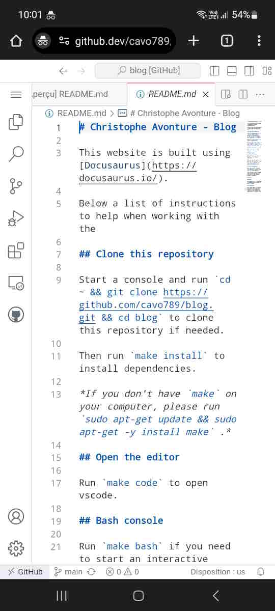

It's not something new, but it's probably not known well enough: by surfing on **any** Github repository like f.i. [https://github.com/cavo789/blog](https://github.com/cavo789/blog), you can just press <kbd>.</kbd> (the dot key) on your keyboard to start vscode online i.e. see the current repository in vscode.dev.

<!-- truncate -->

Here is the blog in vscode.dev: [https://github.dev/cavo789/blog](https://github.dev/cavo789/blog).

:::info Change the domain extension to github.dev
You can achieve the same result by updating the URL and modify the `.com` extension to `.dev`
:::

## But what's the point? Why would I need it

Imagine you're not at home, on your own computer, and you want to change your repo?

But also that you're on a bus/train/plane and want to correct a typeface you've just seen.

You can still want to make a very small update like changing your readme.md file. It's really faster to do online than having to clone/update the project on your computer, make the change, add/commit/push it.

Just surf on your repo using your smartphone, nothing more than using a basic web browser, change the extension to `.dev` and bingo, you can start to edit your repo (or the one of someone else if you want to suggest a Pull request (aka a `PR`)).

Read more on [https://github.com/github/dev](https://github.com/github/dev) or [https://docs.github.com/en/codespaces/the-githubdev-web-based-editor](https://docs.github.com/en/codespaces/the-githubdev-web-based-editor).
