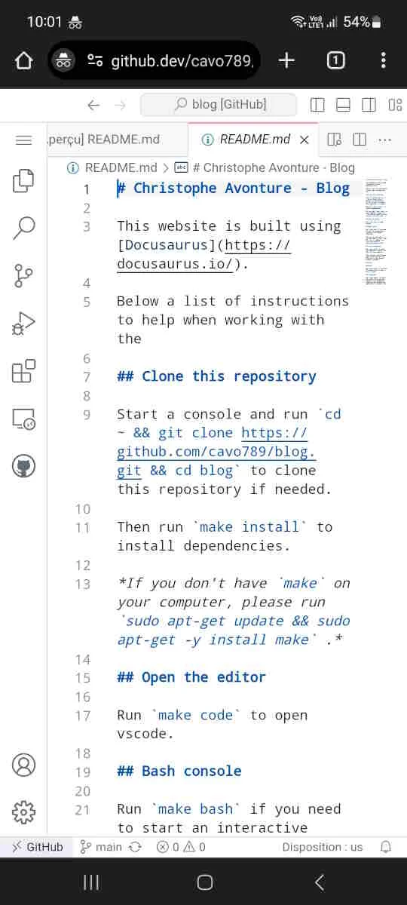

<TLDR>
This article shares a quick trick: pressing the <kbd>.</kbd> key on any GitHub repository page (or swapping `.com` for `.dev` in the URL) opens that repository in VSCode online (vscode.dev/github.dev) — handy for making a quick edit or fixing a typo from a phone or a machine without a local clone.
</TLDR>

It's not something new, but it's probably not known well enough: by browsing **any** GitHub repository like e.g. [https://github.com/cavo789/blog](https://github.com/cavo789/blog), you can just press <kbd>.</kbd> (the dot key) on your keyboard to start VS Code online to see the current repository in vscode.dev.

<!-- truncate -->

Here is the blog in vscode.dev: [https://github.dev/cavo789/blog](https://github.dev/cavo789/blog).

*This is the lightest of three ways to code without a local VSCode. The two others: <Link to="/blog/vscode-code-server">a full VSCode in your browser via Docker</Link> and <Link to="/blog/vscode-remote-ssh">SSH Remote development with VSCode</Link>.*

<AlertBox variant="info" title="Change the domain extension to github.dev">
You can achieve the same result by updating the URL and changing the `.com` extension to `.dev`

</AlertBox>

## But what's the point? Why would I need it

Imagine you are not at home, on your own computer, and you want to change your repository?

But also that you are on a bus/train/plane and want to correct a typo you've just seen.

You may also want to make a very small update like changing your readme.md file. It is really faster to do it online than having to clone/update the project on your computer, make the change, add/commit/push it.

This trick is limited to GitHub repositories though. If you need a real, full editor on a machine where VSCode isn't installed, run it as a container instead: <Link to="/blog/vscode-code-server">Do I need VSCode on my machine to use it?</Link>.

Just browse to your repository using your smartphone, nothing more than using a basic web browser, change the extension to `.dev` and bingo, you can start editing your repository (or the one of someone else if you want to suggest a Pull request (aka a `PR`)).

Read more on [https://github.com/github/dev](https://github.com/github/dev) or [https://docs.github.com/en/codespaces/the-githubdev-web-based-editor](https://docs.github.com/en/codespaces/the-githubdev-web-based-editor).
