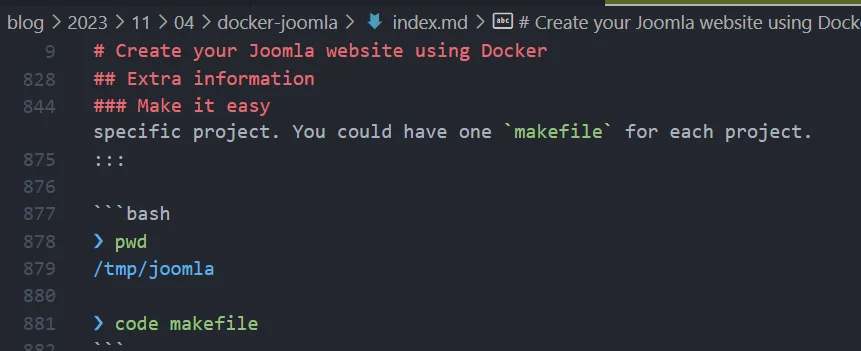

> [https://dev.to/amrsamy/vs-code-sticky-scroll-2jcd](https://dev.to/amrsamy/vs-code-sticky-scroll-2jcd)

VS Code has recently added a really useful new feature: sticky scroll.

This function allows you to scroll through a document such as a Markdown file, a source code written in PHP or JavaScript or any other supported language and, as you scroll, pin contextual information such as the name of the class, the name of the function, the start of the loop, etc. in the upper part of the editor.

<!-- truncate -->

This is really very practical. See the illustration below (*image coming from [https://dev.to/amrsamy/vs-code-sticky-scroll-2jcd](https://dev.to/amrsamy/vs-code-sticky-scroll-2jcd)*)

Below is an example taken from this blog:

As you can see, I have opened a markdown file and I am showing part of the article around line 878. Pay attention to the first 'stuck' lines in the window: VS Code is showing me my heading 1, my heading 2 and my heading 3 so I know the context. The displayed lines are located in the chapter `Make it easy`. That's pretty cool!

To enable the feature, edit your `settings.json` file and add this entry:

<Snippet filename="settings.json" source="./files/settings.json" />
