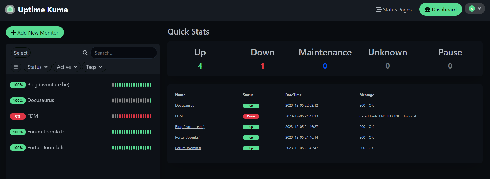
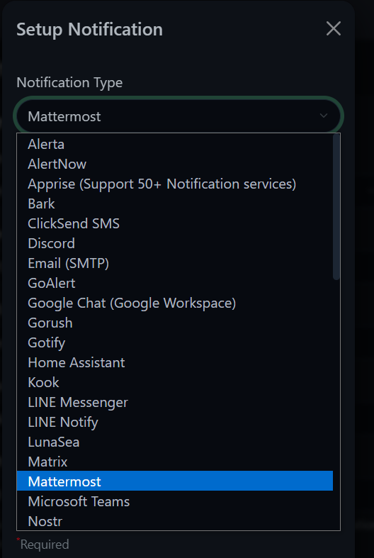

<!-- cspell:ignore kuma,louislam -->

Imagine you're a web developer or you work in a web agency and you'd like to keep an eye on the sites you've developed for your clients, free of charge.  Are these sites online now, or are they down?

This work is carried out by site monitoring platforms. Could you install one on your computer? Of course!

<!-- truncate -->

There are tons of *self-hosted monitoring tools*; one of them is [Uptime Kuma](https://github.com/louislam/uptime-kuma). You can play with the demo website here: [https://demo.uptime.kuma.pet:27000/](https://demo.uptime.kuma.pet:27000/). Just create an admin account (for free) and you're ready to add your first websites.

As read in the [official documentation](https://github.com/louislam/uptime-kuma#-docker), you can easily start it using the command below.

<Terminal>
$ {`docker run -d --restart=always -p 3001:3001 -v \${PWD}:/app/data --name uptime-kuma louislam/uptime-kuma:1`}
</Terminal>

<AlertBox variant="info" title="Think to add a volume">
The `-v ${PWD}:/app/data` flag is important if you want to keep track of the sites you'll add to the dashboard (i.e. if you restart the tool). If you wish, only, play once with the interface first, you can omit it so nothing will be written on the disk.

</AlertBox>

In the setting page, site by site, you can define a lot of actions like what the monitoring tool should do when the site is down. For instance, send you a notification on *Mattermost* or an email or ...

<AlertBox variant="info" title="There are so many settings to configure">
On top of configuration items site by site, you'll also find in the *Profile -> Settings* page, a large number of global settings like the choice of the language's interface (French is available).

</AlertBox>
