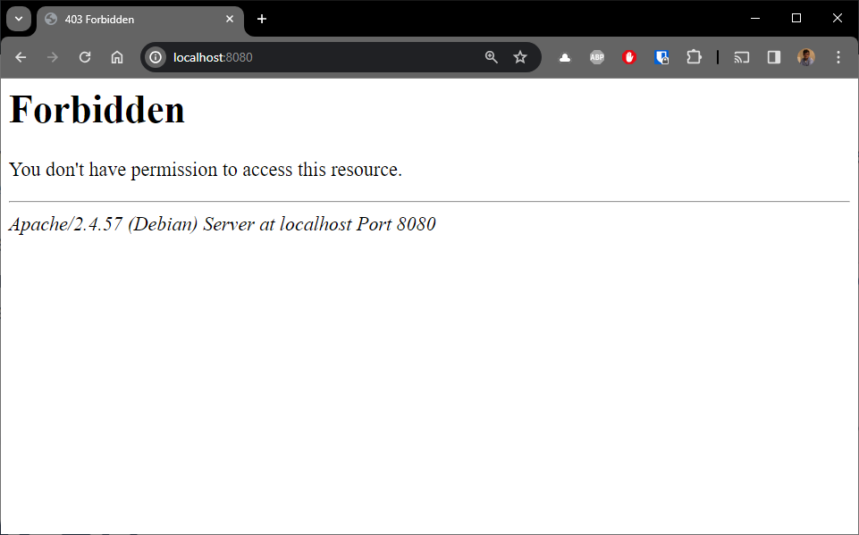
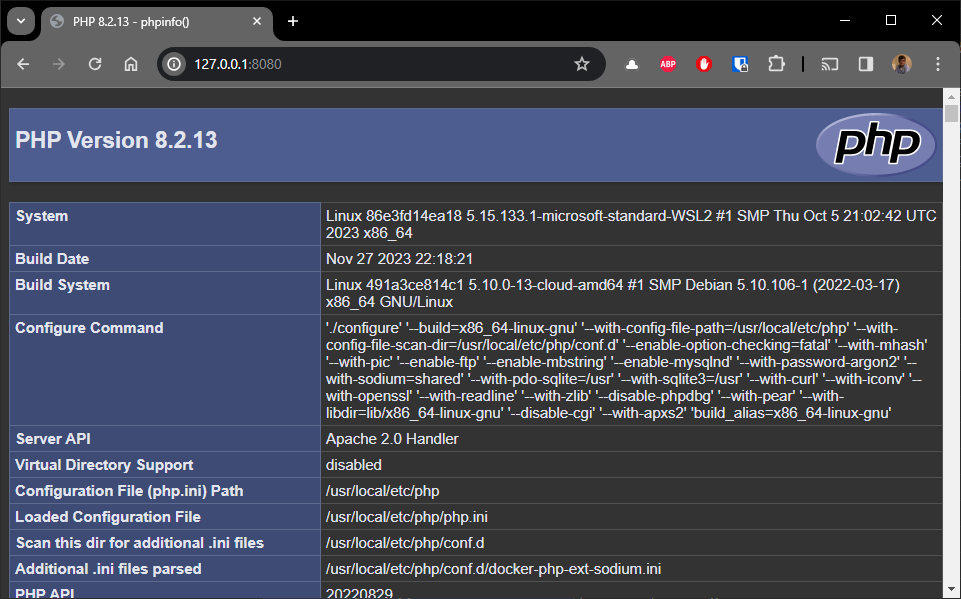

<!-- cspell:ignore dbmdl -->

But what a happy and strange coincidence. In its new version (4.26) released yesterday *(on my birthday)*, Docker adds support for **PHP with Apache** to its `docker init` instruction. Let's see how this translates into a practical case.

<!-- truncate -->

> The official blog post: [https://www.docker.com/blog/docker-desktop-4-26/]

<AlertBox variant="caution" title="">
We'll give it a try but spoiler, it's still in a very early stage.

</AlertBox>

Please start a Linux shell and run `mkdir -p /tmp/docker-init && cd $_` to create a folder called `docker-init` in your Linux temporary folder and jump in it.

Now, in your console, just run `docker init` and follow the wizard.

<Terminal>
$ docker init

Welcome to the Docker Init CLI!

This utility will walk you through creating the following files with sensible defaults for your project:
  \- .dockerignore
  \- Dockerfile
  \- compose.yaml
  \- README.Docker.md

Let's get started!

? What application platform does your project use?  [Use arrows to move, type to filter]
  Go - suitable for a Go server application
  Python - suitable for a Python server application
  Node - suitable for a Node server application
  Rust - suitable for a Rust server application
  ASP.NET Core - suitable for an ASP.NET Core application
\> PHP with Apache - suitable for a PHP web application
  Other - general purpose starting point for containerizing your application
  Don't see something you need? Let us know!
  Quit
</Terminal>

Make sure to select `PHP with Apache - suitable for a PHP web application`.

For the next questions:

* `What version of PHP do you want to use?`, please enter f.i. `8.2`,
* `What's the relative directory for your app?`, just press enter to select the current directory,
* `What local port do you want to us to access your server?`, just press enter to use the proposed port number or f.i. enter `8080`.

<Terminal>
? What application platform does your project use? PHP with Apache
? What version of PHP do you want to use? 8.2
? What's the relative directory (with a leading .) for your app?
? What local port do you want to use to access your server? 8080

CREATED: .dockerignore
CREATED: Dockerfile
CREATED: compose.yaml
CREATED: README.Docker.md

✔ Your Docker files are ready!

Take a moment to review them and tailor them to your application.

If your application requires specific PHP extensions, you can follow the instructions in the Dockerfile to add them.

When you're ready, start your application by running: docker compose up --build

Your application will be available at http://localhost:8080

Consult README.Docker.md for more information about using the generated files.
</Terminal>

The wizard is quite straight-forward but, then, we got four files.

Two are really important right now: `compose.yaml` and `Dockerfile`.

## compose.yaml

By opening `compose.yaml` with Visual Studio Code, you'll see a lot of comments.

By default, everything is commented except:

<Snippet filename="compose.yaml" source="./files/compose.yaml" />

Ok, that just means that we'll not use a standard, pre-existing, Docker image but we'll build yours and the definition of that image is located in the current folder (`context: .`). The definition of your Docker image has to be written in the, standard, `Dockerfile`.

The second thing we see here is the port number we've chosen. The Docker container will be published on the port `8080`.

## Dockerfile

Here too, `docker init` has created a file with a lot of comments. If we remove them, here is the non-commented lines:

<Snippet filename="Dockerfile" source="./files/Dockerfile" />

<AlertBox variant="danger" title="Bug in Docker 4.26 - Docker init - PHP + Apache">
There is a bug in the release `4.26`, the `COPY` statement has to be `COPY . /var/www/html` (i.e. we need to specify the source folder `.`). I've created an issue on the Docker repository ([https://github.com/docker/cli/issues/4702](https://github.com/docker/cli/issues/4702))

Please update the file `Dockerfile` and change the line `COPY /var/www/html` to `COPY . /var/www/html`

</AlertBox>

So, we can see we'll use the `php:8.2-apache` image (since we've asked for PHP `8.2`), we'll copy the content of your current folder (`.`) to the `/var/www/html` folder inside the Docker image, we'll also use the `php.ini` file for production and will switch the current Linux user used inside the container to `www-data`.

## Run the container

Ok, nothing really difficult until now. We'll create the image by running `docker compose up --build`.

Once built, we can surf to `http://localhost:8080` and ... ouch.

**And this is totally normal.** Remember, your current folder only contains actually the four files created by `docker init`.

Please create the `index.php` file with this content:

<Snippet filename="index.php" source="./files/index.php" />

Go back to your console, press <kbd>CTRL</kbd>-<kbd>C</kbd> to stop the first container and run `docker compose up --detach --build` this time (so the console won't be blocked and the container stay running in background).

## Enter in the container

We'll start an interactive shell in the container. We just need to know how the container is named.

Back to the `compose.yaml` file, we can retrieve the name of the container; it's ne name of the service: `server` in this case.

<Snippet filename="compose.yaml" source="./files/compose.part2.yaml" />

To run an interactive shell, please run the following command:

<Terminal>
$ docker compose exec server /bin/bash
www-data@86e3fd14ea18:~/html$
</Terminal>

As expected, you're now inside the container. You can display the list of files by running `ls -alh`

<Terminal>
$ www-data@86e3fd14ea18:~/html$ ls -alh
total 20K
drwxrwxrwt 1 www-data www-data 4.0K Dec  7 17:52 .
drwxr-xr-x 1 root     root     4.0K Nov 21 17:46 ..
-rw-r--r-- 1 root     root      742 Dec  7 17:34 README.Docker.md
-rw-r--r-- 1 root     root       17 Dec  7 17:49 index.php
</Terminal>

So, even if your current folder, on your machine, contains now five files, only `README.Docker.md` and `index.php` are present. Why not the other files?

## .dockerignore

On your machine, we've thus five files:

<Terminal>
$ ls -alh
total 36K
drwxr-xr-x  2 christophe christophe 4.0K Dec  7 17:59 .
drwxrwxrwt 32 root       root        12K Dec  7 17:59 ..
-rw-r--r--  1 christophe christophe  646 Dec  7 17:34 .dockerignore
-rw-r--r--  1 christophe christophe 2.3K Dec  7 17:03 Dockerfile
-rw-r--r--  1 christophe christophe  742 Dec  7 17:34 README.Docker.md
-rw-r--r--  1 christophe christophe 1.7K Dec  7 17:34 compose.yaml
-rw-r--r--  1 christophe christophe   17 Dec  7 17:49 index.php
</Terminal>

And only `README.Docker.md` and `index.php` have been copied into the container.

The reason is: the other files have been ignored because they have been mentioned in the `.dockerignore` file.

<Snippet filename=".dockerignore" source="./files/.dockerignore" />

We have reached the end of this article. We've used the `docker init` instruction to create the bare essentials needed to run a PHP script in an Apache container.

In the next months, I'll keep an eye on how `docker init` will evolve concerning PHP.
