In this post, we'll learn how to create a ribbon (i.e. a toolbar) in Microsoft Excel.

We'll create our custom ribbon for an Excel file, save the ribbon in the file so our users will have a nice and intuitive interface to work with our worksheet.

<!-- truncate -->

## Download the editor for free

To be able to "easily" *(in a not WYSIWYG interface)* create a ribbon in MS Office, I'm using a very old tool called `CustomOfficeUIEditor`. *Until now, I've not found any other free tool for doing this.*

The tool can be downloaded from [https://bettersolutions.com/vba/ribbon/custom-ui-editor-download.htm](https://bettersolutions.com/vba/ribbon/custom-ui-editor-download.htm).

`CustomOfficeUIEditor` is an external tool (outside MS Office) who can open an Office file and add the needed files to create a ribbon. It's possible to do this without an editor, for instance by using a software like 7-Zip since a `.xlsx` / `.xlsm` file is an archive with files and folders.

For this exercise; please extract all files and folders to your `C:\tmp\ribbon` folder (create it).

## Create an empty file

As a support for this blog post, please create a new, empty, file in Excel called `Ribbon.xslm`  in your `C:\tmp\ribbon` folder (or elsewhere).

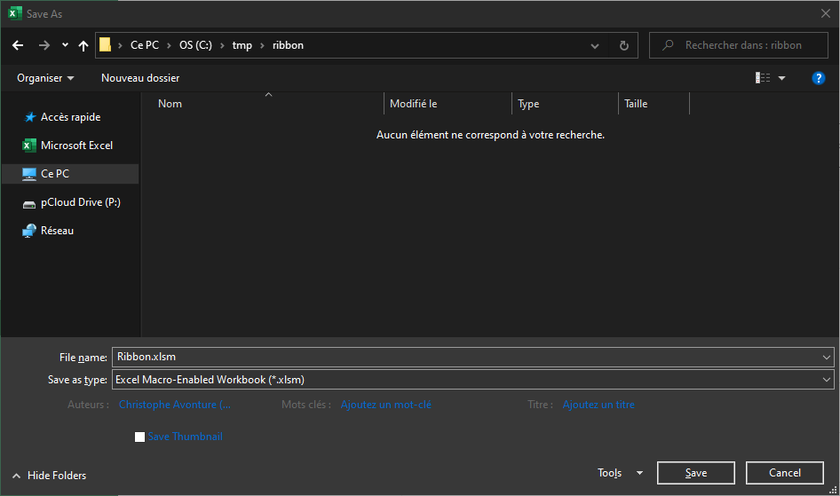

<AlertBox variant="info" title="Just creates an empty file">
Right now, we don't need to do something else than Create New - File Save as - FileType - Excel Macro-Enabled Workbook..

</AlertBox>

## Add a ribbon in MS Office

The `CustomOfficeUIEditor` tool isn't a user-friendly tool: you'll need to type yourself the XML of the ribbon. That XML is also called *the manifest file*.

By default, a standard MS Office document doesn't contain any ribbon so, when you open such files with the `CustomOfficeUIEditor` tool, you'll get an empty document.

Please start `CustomOfficeUIEditor` and open your `Ribbon.xlsm` file:

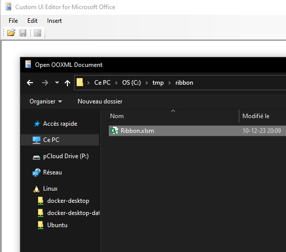

<AlertBox variant="caution" title="Make sure to close it first if still open in Excel">
When using the editor, the file itself can't be opened in Excel! Imagine the following situation: the workbook is open both in the editor and in Excel. You make a lot of changes in Excel, switch to the editor and change the manifest. By saving the file in the editor, you'll lose every change made in Excel so... be careful.

</AlertBox>

The first time, you'll need to add a new ribbon: click on the `Insert` menu and select `Office 2010 Custom UI Part`.

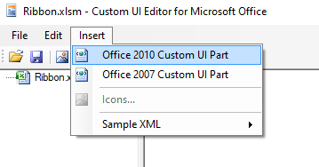

You'll then obtain a screen like this:

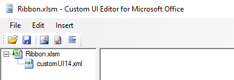

When `customUI14.xml` is selected (like illustrated above), click somewhere in the right pane and start to code your XML content.

Now, in the right pane, just copy/paste the XML source below:

<Snippet filename="customUI14.xml" source="./files/customUI14.xml" />

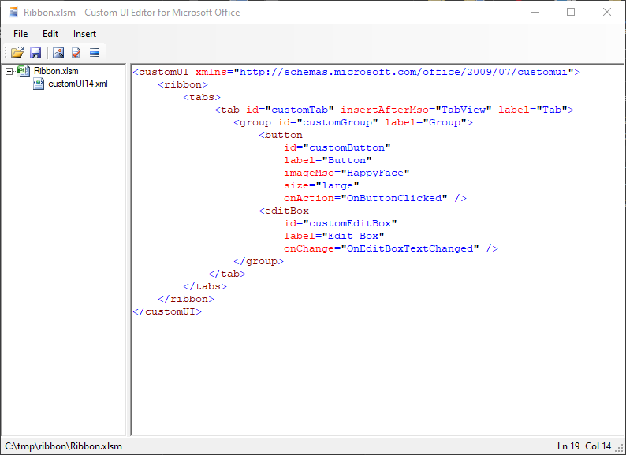

Before saving your file, be sure to click on the `Validate` button so a check is made to verify the quality of the content.

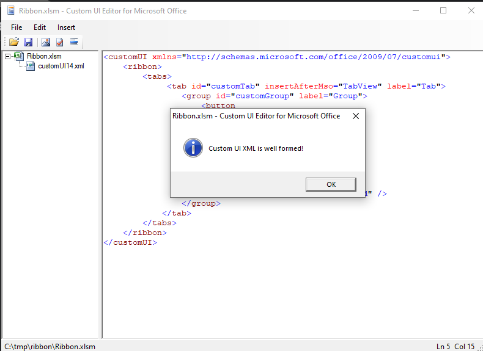

Since the ribbon is correct, save the file and open it in Excel. If everything goes fine, you'll obtain this:

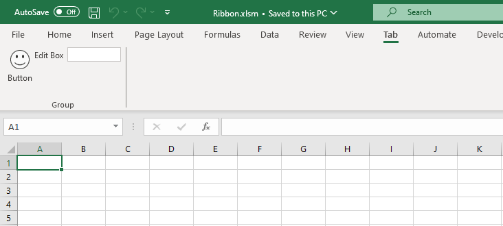

<AlertBox variant="info" title="Your ribbon has been created">
Congratulations, you've added a ribbon to your workbook. It was not too hard I think.

</AlertBox>

### Manifest analysis

Time to understand what has happened...

#### The root customUI node and the namespace

<Snippet filename="customUI14.xml" source="./files/customUI14.part2.xml" />

The manifest is a XML content and should be valid. You'll need to define your content into a `<customUI>` node (mandatory) and you'll need to specify the `xmlns` (for `namespace`) attribute (mandatory).

The `namespace` file will define what attributes exists, are mandatory or not, for each node type. The referred URL is the `Document Type Definition` (aka *DTD*).

For instance, when the user will click on the button of your ribbon, you'll wish to be able to capture the click and start a subroutine that you've code in VBA. The "on click event" should be defined in the `onAction` attribute as defined in the DTD. *Microsoft maintains the documentation here: [https://msdn.microsoft.com/en-us/library/dd909370(v=office.12).aspx](https://msdn.microsoft.com/en-us/library/dd909370(v=office.12).aspx).*

So, if you know that the attribute is `onAction` you can then add your own subroutine by typing something like `onAction="OnButtonClicked"`.

The job of the DTD is to make sure that the syntax of your manifest is correct; therefore, the attribute `xmlns="http://schemas.microsoft.com/office/2009/07/customui"` is well mandatory.

##### Define the ribbon

The ribbon should define inside the `<ribbon>` node but not immediately since a ribbon is, in fact, always defined in a tab.

Below we can see the standard ribbon of Excel and you can see a lot of tabs: `File`, `Insert`, `Page layout`, `Formulas`, `Data`, `Review`, `View`, ...

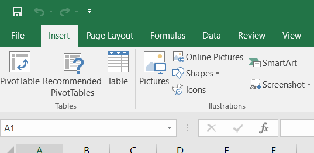

Each tab comes with features (buttons, checkboxes, ...). For the `Insert` tab, we've first a group of three buttons into a group called `Tables`:

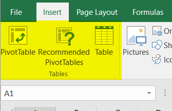

So, a ribbon should be:

1. Defined in a tab (his own tab or an existing one)
2. Add features in one or more groups (own groups or existing ones)

Below, our manifest now, with the definition of the ribbon.

<Snippet filename="customUI14.xml" source="./files/customUI14.part3.xml" />

#### Define the tab

You'll need to give an identifier to the tab (in the attribute called `id`): your own code for a new tab or the id of an existing tab.

The standard names are:

* `TabHome`
* `TabInsert`
* `TabPageLayoutExcel`
* `TabFormulas`
* `TabData`
* `TabReview`
* `TabView`
* `TabDeveloper`

So, if you want to add a button to the Home tab, just use `TabHome` as value for the `id`, f.i.,

<Snippet filename="customUI14.xml" source="./files/customUI14.part4.xml" />

The XML below will, in one line,

1. Create a new tab since the id `customTab` is not an existing id,
2. Put the new tab after the existing `View` tab (use `insertBeforeMso` to add the tab before),
3. And give him `Tab` as caption.

<Snippet filename="customUI14.xml" source="./files/customUI14.part5.xml" />

Here is our added tab:

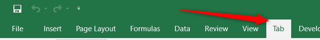

##### Implement our ribbon

Inside the `<tab>` declaration, you need to define at least one `<group>`. And here too, you'll to define the identifier: an existing one for, f.i., adding a button in an existing group or a new one to create a new group.

The XML below will:

1. Create a new group since the id is a new one (`customGroup`),
2. And give him `Group` as name.

<Snippet filename="customUI14.xml" source="./files/customUI14.part6.xml" />

Our tab with his group:

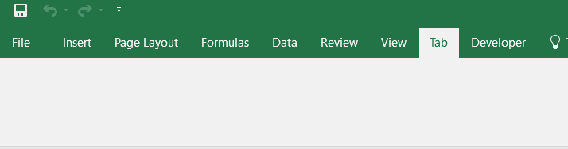

As you can see here above, just adding a group isn't enough, you'll need to define which features (buttons, checkboxes, ...) should be added in the group.

#### Add features

The XML here below will add to things: a button and an edit box.

<Snippet filename="customUI14.xml" source="./files/customUI14.part7.xml" />

The XML below will create a button

1. With an `id` initialized to `customButton`,
2. His label (the text that is displayed under the button) set to `Button`,
3. Use the `HappyFace` standard image (`imageMso` is, indeed, the way to reuse a standard image while `image` allows you to define yours owns),
4. The size of the button will be `large` (a big button),
5. The action assigned will be the VBA function called `OnButtonClicked`.

<Snippet filename="customUI14.xml" source="./files/customUI14.part8.xml" />

This will result into this:

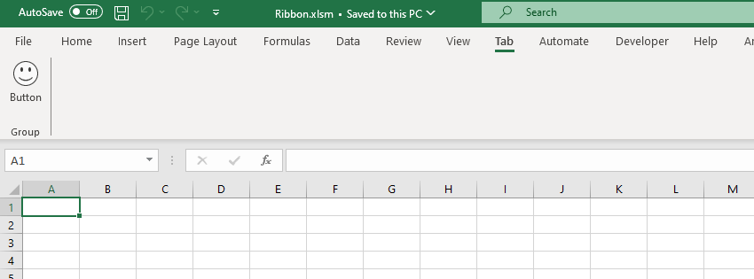

`OnButtonClicked` is the VBA callback: to make it work, add a module in your Excel file, create a subroutine like this:

```vbnet
Public Sub OnButtonClicked(control As IRibbonControl)
    Msgbox "You've clicked on the button", vbInformation
End Sub
```

To do this, in MS Excel, please press <kbd>ALT</kbd>-<kbd>F11</kbd>, in the **Project explorer**, right-click on the **VBAProject (Ribbon.xslm)** entry (1), then select **Insert** (2) and **Module** (3).

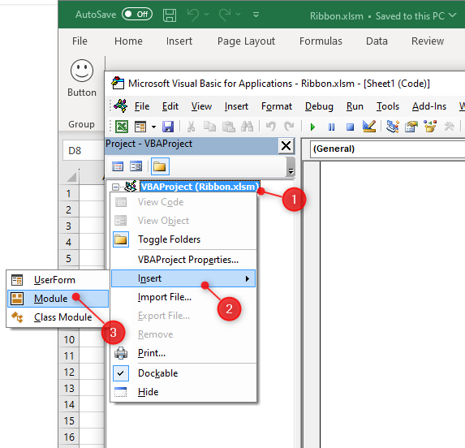

A `Module1` will be added and, in the right pane, please copy/paste the code given here above and save the file.

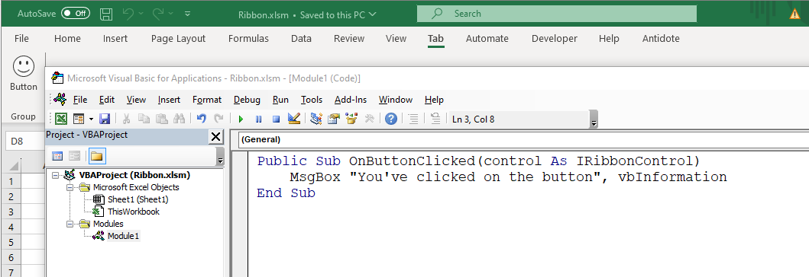

Now, you can close the *Microsoft Visual Basic for Application* window, go back to the well-known Excel window and, now, you click on the smiley button:

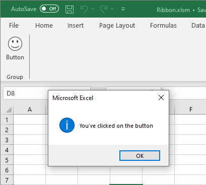

And we can add other features, like an edit box:

<Snippet filename="customUI14.xml" source="./files/customUI14.part9.xml" />

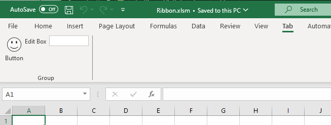

As you can see here above, the list of properties depends on the type: for a button, we've a `onAction` attribute while it's an `onChange` for an editBox.

## List of objects

As exhaustively defined in the `ribbon's namespace`, here is the list of valid objects:

* `box`,
* `button`,
* `buttonGroup`,
* `checkBox`,
* `control`,
* `comboBox`,
* `dropDown`,
* `dynamicMenu`,
* `editBox`,
* `gallery`,
* `labelControl`,
* `menu`,
* `splitButton` and
* `toggleButton`

**Be careful**: XML is case sensitive, `editBox` is the only valid syntax, `editbox` or `EditBox` aren't.

Each object comes with his own attributes, some are mandatory while the others are optional.

## Find images

By adding a button f.i., you'll assign an image to it.

You'll most probably use an existing, standard, image. This can be done by using the `imageMso` attribute and telling Office which image to use; f.i.  `AddFolderToFavorites`:

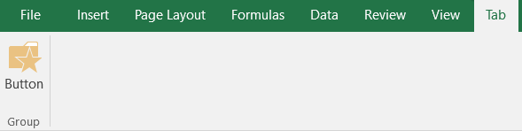

The manifest is this one:

<Snippet filename="customUI14.xml" source="./files/customUI14.part10.xml" />

But ... **how to retrieve the list of images?**

Microsoft maintains Excel files with the list of existing IDs that can be used as icons in our ribbon. The "Office 2010 Help Files: Office Fluent User Interface Control Identifiers" can be downloaded [here](https://www.microsoft.com/en-us/download/confirmation.aspx?id=6627). You'll get a lot of Excel files, on file by application (Access, Excel, Outlook, ...).

This will give the list of existing IDs in plain text but you'll not see the associated images.

You can download all images (as PNG) for MS Office 2010 or 2013 [here](http://hintdesk.com/2011/07/22/c-print-all-ms-office-imagemso-to-files) (see links in Chapter 2 Download).

## Assign callbacks

This term means: which code (VBA in this case) should be fired when an event is raised.

When the user clicks on a button of the ribbon which subroutine should be called?

The XML code below assign the `OnButtonClicked` subroutine to the `onAction` event of the button.

<Snippet filename="customUI14.xml" source="./files/customUI14.part11.xml" />

So, if we wish to catch that event, we'll need to add a public subroutine in our Excel file, that subroutine can be placed in any module, should be public and should have `OnButtonClicked` as name.

But... depending on the callbacks (click, change, toggle state, change, ...), the definition of the subroutine is not the same.

For a button, the VBA should be something like:

```vbnet
Public Sub OnButtonClicked(control As IRibbonControl)
    ' YOUR CODE
End Sub
```

For an edit box and the `onChange` event, the callback is different:

<Snippet filename="customUI14.xml" source="./files/customUI14.part12.xml" />

```vbnet
Public Sub OnEditBoxTextChanged(control As IRibbonControl, sText As String)
    ' YOUR CODE
End Sub
```

The declaration of callbacks can be found on the official site :
[How can I determine the correct signatures for each callback procedure?](
https://docs.microsoft.com/en-us/previous-versions/office/developer/office-2007/aa722523(v=office.12)#how-can-i-determine-the-correct-signatures-for-each-callback-procedure). Pay attention to the `Signatures` columns; you need to look for `VBA`.
