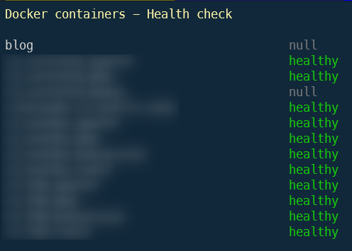

When you've a few runnings containers on your machine, you can quickly retrieve the health information using `docker ps` and his `State.Health` response.

In this article, we'll look at how to create a bash script that can be used as a basis for other needs.

<!-- truncate -->

Please create somewhere on your disk, in a Linux console, a script f.i. called `health.sh` with this content:

```bash
#!/usr/bin/env bash

GRAY=30
GREEN=32
RED=31

clear

printf "\e[1;33m%s\e[0m\n\n" "Docker containers - Health check"

docker container list --all --format "{{.Names}}" | while read -r name; do
    healthcheckStatus=$(docker inspect --format='{{json .State.Health}}' $name | jq -r '.Status')

    # Default color
    COLOR=${GRAY}

    if [[ "$healthcheckStatus" == "healthy" ]]; then
        COLOR=${GREEN}
        healthcheckStatus="${healthcheckStatus}"
    elif [[ ! "$healthcheckStatus" == "null" ]]; then
        COLOR=${RED}
    fi

    printf "%-40s\e[1;${COLOR}m%s\e[0m\n" "$name" "$healthcheckStatus"
done
```

:::tip Get the list of all containers
`docker container list --all --format "{{.Names}}"` return the list of all containers and only echo the column `Name` on the console.
:::

Make sure to make the script executable: `chown +x health.sh`.

Here is the output of the script when launched:



I've a few containers running on my machine, a lot are `healthy` meaning that they're running and without any issue, I've two containers in a `null` state i.e. they are sleeping and none are stopped due to an error.

Don't hesitate to fine-tune the script to fit your needs.
